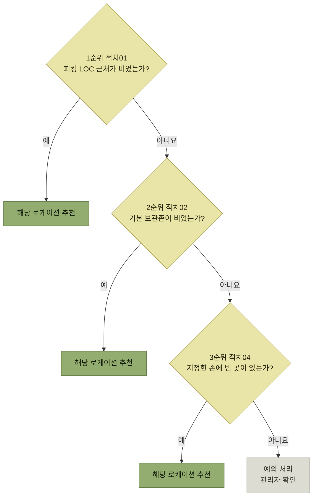

# 적치지시

> [입고 프로세스](./README.md)

## 빠른 복습

- 적치지시는 입고존에 임시 보관된 재고를 **어느 로케이션에 놓을지 시스템이 정해 알려주는** 단계다.
- 판단 근거는 **제품의 종류, 크기, 중량, 출고 추이, 이미 입고된 재고들의 로케이션**이다.
- 목적은 지금이 아니라 **나중**이다. 향후 피킹 작업과 재고관리에서 **작업자 동선과 효율적인 배치**가 결정된다.
- 구현 방법은 세 가지다. **개발자 코딩 / 적치룰 선택 / 빅데이터·AI 활용.** 각각 WMS 자체구축·상용 솔루션·초대규모 기업에 대응한다.
- 적치방법은 여러 개를 **우선순위로 조합**할 수 있다. 앞의 방법이 안 되면 다음 방법으로 넘어간다.

## 무엇을 보고 정하는가

WMS는 입고 확정되어 입고존에 임시 보관된 재고에 대해 다음을 고려하여 최적의 로케이션에 보관될 수 있도록 다양한 적치 방법을 제공한다.

- 제품의 **종류**
- **크기**
- **중량**
- **출고 추이**
- 이미 입고된 재고들의 **로케이션**

## 왜 중요한가 — 지금이 아니라 나중을 위한 결정

적치 작업은 창고의 보관과 입출고 등 **전체적인 효율화를 위해 필요한 과정**이다.

여기서 결정된 위치가 **향후 출고를 위한 피킹 작업이나 재고관리 업무를 수행할 때 작업자의 동선이나 효율적인 배치**를 좌우한다. 지금 아무 데나 놓으면 앞으로 계속 비용을 낸다.

## 어떻게 구현하는가

대부분의 WMS는 적치 지시를 위해 다음 기법을 이용한다.

<table>
<thead>
<tr>
<th style="text-align:center; white-space:nowrap">적치 개발 방식</th>
<th style="text-align:center; white-space:nowrap">내용</th>
<th style="text-align:center; white-space:nowrap">장점</th>
<th style="text-align:center; white-space:nowrap">단점</th>
<th style="text-align:center; white-space:nowrap">비고</th>
</tr>
</thead>
<tbody>
<tr>
<td style="text-align:center; white-space:nowrap"><b>개발자 코딩</b></td>
<td style="text-align:left">개발자가 사전에 창고에서 요구하는 적치 로직을 프로그래밍</td>
<td style="text-align:left; white-space:nowrap">시스템 복잡도가 낮고 비용이 저렴</td>
<td style="text-align:left; white-space:nowrap">새로운 적치 로직 개발 시 <b>개발자 의존</b></td>
<td style="text-align:left; white-space:nowrap">WMS 자체구축 시 용이</td>
</tr>
<tr>
<td style="text-align:center; white-space:nowrap"><b>적치룰 선택</b></td>
<td style="text-align:left">여러 유형의 적치방법을 사전에 정의한다. 사용자가 복수의 적치방법을 선택하고 조합하여 운영한다.</td>
<td style="text-align:left"><b>사용자가 직접</b> 적치 방법을 설정·구현할 수 있다.</td>
<td style="text-align:left; white-space:nowrap">개발자 코딩 방식보다 복잡도가 높다.</td>
<td style="text-align:left; white-space:nowrap">WMS 상용 솔루션</td>
</tr>
<tr>
<td style="text-align:center; white-space:nowrap"><b>빅데이터 및 AI 활용</b></td>
<td style="text-align:left">과거 입출고 추이 등을 빅데이터·AI로 분석하여 적치 진행</td>
<td style="text-align:left; white-space:nowrap"><b>현실감 있는</b> 적치 구현</td>
<td style="text-align:left; white-space:nowrap">개발·유지보수·시행착오 등의 비용이 높다.</td>
<td style="text-align:left; white-space:nowrap">초대규모 기업 활용</td>
</tr>
</tbody>
</table>

세 방식은 우열이 아니라 **누가 적치 로직을 바꾸느냐**로 갈린다. 개발자 코딩은 개발자가, 적치룰 선택은 사용자가, 빅데이터·AI는 데이터가 정한다. 그래서 자체구축·상용 솔루션·초대규모 기업이라는 서로 다른 자리에 놓인다.

## 적치방법 여섯 가지

<table>
<thead>
<tr>
<th style="text-align:center; white-space:nowrap">적치방법</th>
<th style="text-align:center; white-space:nowrap">내용</th>
<th style="text-align:center; white-space:nowrap">예시</th>
</tr>
</thead>
<tbody>
<tr>
<td style="text-align:center; white-space:nowrap"><b>적치01</b></td>
<td style="text-align:left">해당 제품의 <b>피킹 로케이션에 가장 가까운</b> 로케이션 추천</td>
<td style="text-align:left">A제품의 피킹 LOC가 L01이면 L01 근처의 비어 있는 로케이션 추천</td>
</tr>
<tr>
<td style="text-align:center; white-space:nowrap"><b>적치02</b></td>
<td style="text-align:left">해당 <b>제품그룹에 설정된 기본 보관존</b>의 적절한 로케이션 추천</td>
<td style="text-align:left">제품그룹 A 기준정보에 등록된 기본 보관존 AREA1의 비어 있는 로케이션 추천</td>
</tr>
<tr>
<td style="text-align:center; white-space:nowrap"><b>적치03</b></td>
<td style="text-align:left">해당 제품이 <b>가장 많이 보관된 존</b>의 로케이션 추천</td>
<td style="text-align:left">제품 A가 AREA1에 가장 많이 보관되어 있으면 AREA1의 빈 로케이션 추천</td>
</tr>
<tr>
<td style="text-align:center; white-space:nowrap"><b>적치04</b></td>
<td style="text-align:left; white-space:nowrap"><b>지정한 존</b>의 적절한 빈 로케이션 추천</td>
<td style="text-align:left">AREA1의 빈 로케이션 추천(적치룰 등록 시 AREA1 입력)</td>
</tr>
<tr>
<td style="text-align:center; white-space:nowrap"><b>적치05</b></td>
<td style="text-align:left; white-space:nowrap"><b>지정한 로케이션</b>에 적치</td>
<td style="text-align:left">L01이 비어 있으면 해당 로케이션 추천(적치룰 등록 시 L01 입력)</td>
</tr>
<tr>
<td style="text-align:center; white-space:nowrap"><b>적치06</b></td>
<td style="text-align:left"><b>최근 출고수량이 기준 이상</b>이면 지정한 존의 적절한 로케이션 추천</td>
<td style="text-align:left">A제품의 최근 30일 출고수량이 10,000개 이상이면 AREA1의 빈 로케이션 추천</td>
</tr>
</tbody>
</table>

여섯 가지를 관통하는 축이 있다. **무엇을 기준으로 자리를 고르는가**다. 적치01은 피킹 동선, 적치02·03은 같은 제품끼리 모으기, 적치04·05는 사람이 직접 지정, 적치06은 출고 실적이다.

### 우선순위로 조합한다

여러 적치방법에 **우선순위를 지정**하여, 해당 방법을 적용할 수 없을 때 다음 순위로 넘어갈 수 있다.

## 이 단계의 장비와 출력물

<table>
<thead>
<tr>
<th style="text-align:center; white-space:nowrap">모바일 장비</th>
<th style="text-align:center; white-space:nowrap">바코드(RFID)</th>
<th style="text-align:center; white-space:nowrap">주요 출력물</th>
</tr>
</thead>
<tbody>
<tr>
<td style="text-align:center; white-space:nowrap">O</td>
<td style="text-align:center; white-space:nowrap"></td>
<td style="text-align:center; white-space:nowrap">적치지시서</td>
</tr>
</tbody>
</table>

## 함께 읽기

- 지시받은 작업자가 실제로 옮기는 단계는 [적치확정](./5-적치확정.md)이다.
- 적치의 개관과 빅데이터·AI 언급은 [2장의 입고와 적치](../2-wms-주요-프로세스/2-입고와-적치.md)에도 있다.
