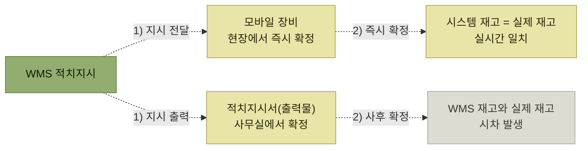

# 적치확정

> [입고 프로세스](./README.md)

## 빠른 복습

- 작업자는 **적치지시서를 출력**해 받거나 **모바일 장비**로 받아, 입고존에서 보관존으로 실제 물량을 옮긴다.
- 지시된 로케이션에 **현실적으로 적치가 불가능하면 작업자가 다른 보관 로케이션으로 변경**할 수 있다.
- 어떤 수단으로 지시를 받았는지가 **재고 정확도를 갈라놓는다.** 모바일은 실시간 일치, 출력물은 시차 발생.
- **적치가 완료되어야 출고 가능한 가용재고에 포함**된다. 입고 프로세스는 여기서 끝난다.

## 어떻게 확정하는가

작업자는 적치지시서를 출력하여 전달받거나 모바일 장비를 통해 전달받아, **입고존에서 보관존으로 실제 물량을 이동 처리**한다.

지시가 늘 그대로 실행되는 것은 아니다. 적치 로케이션에 현실적으로 적치가 불가능한 경우 **작업자가 다른 보관 로케이션으로 변경할 수 있다.** 이때 변경한 실제 위치를 WMS에 정확히 확정해야 한다.

## 모바일이냐 출력물이냐 — 시차가 갈린다

아래 점선은 적치 지시와 확정 정보의 흐름을 뜻한다.

*지시를 받는 수단이 재고 정확도를 결정한다.*

- **모바일 장비로 전달받은 경우** — 현장에서 바로 적치확정 처리할 수 있어, **WMS 시스템상 재고와 실제 재고가 실시간으로 일치된 환경**을 구현할 수 있다.
- **적치지시서(출력물)에 의해 작업한 경우** — 별도 사무실에서 적치확정을 수행해야 하므로 **WMS 재고와 실제 재고 사이에 시차가 발생**할 수 있다.

## 여기서 비로소 팔 수 있게 된다

적치가 되기 전의 재고는 일반적으로 **입고존의 임시영역**에 있기 때문에 출고할 수 있는 가용재고에 포함되지 않는다.

**적치가 완료되어야 출고 가능한 가용재고에 포함된다.**

이것이 입고 프로세스의 마지막 단계인 이유다. 물건이 창고에 들어온 것으로는 입고가 끝나지 않는다.

## 이 단계의 장비와 출력물

<table>
<thead>
<tr>
<th style="text-align:center; white-space:nowrap">모바일 장비</th>
<th style="text-align:center; white-space:nowrap">바코드(RFID)</th>
<th style="text-align:center; white-space:nowrap">주요 출력물</th>
</tr>
</thead>
<tbody>
<tr>
<td style="text-align:center; white-space:nowrap">O</td>
<td style="text-align:center; white-space:nowrap"></td>
<td style="text-align:center; white-space:nowrap"></td>
</tr>
</tbody>
</table>

**출력물이 없는 유일한 단계**다. 앞 단계에서 받은 적치지시서로 작업하고 결과만 입력하기 때문이다.

## 함께 읽기

- 어느 로케이션으로 옮기라는 지시는 [적치지시](./4-적치지시.md)에서 만들어진다.
- 가용재고가 된 재고를 꺼내는 출고 쪽 흐름은 [할당과 피킹, 출고](../2-wms-주요-프로세스/4-할당과-피킹-출고.md)에서 개관한다.
