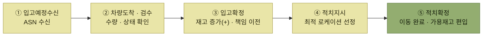
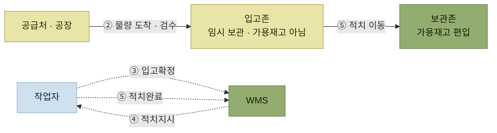

# 입고 프로세스

> [WMS 원리와 이해](../README.md)

## 입고는 어디서 시작해서 어디서 끝나는가

**입고(Inbound, Receive)** 는 좁게 보면 창고에 물건을 넣는 행위다. 하지만 프로세스로서의 입고는 범위가 더 넓다.

> 공급처(공장)에서 **입고예정정보(ASN, Advanced Shipping Notice)를 수신받은 순간부터**, 입고된 재고가 **입고존을 거쳐 보관존으로 이동(적치)되는 전체 과정**

즉 물건이 도착하기 전, 정보가 먼저 도착하는 시점부터가 입고다. 그리고 물건이 창고에 들어온 것으로 끝나지 않고 **적치가 끝나야 입고가 끝난다.**

*입고 프로세스 5단계 — ⑤ 적치확정까지 끝나야 입고가 완료된다.*

## 재고는 언제 팔 수 있게 되는가

이 장에서 가장 중요한 지점이다. 입고확정으로 재고는 늘어나지만, 그 재고는 **아직 출고할 수 없다.** 아래 도식에서 실선은 재고의 물리적 이동, 점선은 WMS와 작업자 사이의 정보 흐름을 뜻한다.

*적치가 완료되어야 출고 가능한 가용재고에 포함된다.*

적치가 되기 전의 재고는 입고존의 임시영역에 있으므로 **출고할당이 될 수 없도록 가용재고에서 제외하는 것이 일반적**이다.

## 주요 입고 프로세스

원서가 정리한 5단계다. 어느 단계에서 모바일 장비와 바코드를 쓰는지, 어떤 출력물이 나오는지가 함께 정리되어 있다.

<table>
<thead>
<tr>
<th style="text-align:center; white-space:nowrap">단계</th>
<th style="text-align:center; white-space:nowrap">프로세스</th>
<th style="text-align:center; white-space:nowrap">내용</th>
<th style="text-align:center; white-space:nowrap">모바일 장비</th>
<th style="text-align:center; white-space:nowrap">바코드(RFID)</th>
<th style="text-align:center; white-space:nowrap">주요 출력물</th>
</tr>
</thead>
<tbody>
<tr>
<td style="text-align:center; white-space:nowrap">1</td>
<td style="text-align:center; white-space:nowrap">입고예정수신</td>
<td style="text-align:left">공급처(공장)에서 입고예정 내역 데이터 수신 또는 수기 등록</td>
<td style="text-align:center; white-space:nowrap"></td>
<td style="text-align:center; white-space:nowrap">O</td>
<td style="text-align:left; white-space:nowrap">입고라벨, 입고예정 LIST</td>
</tr>
<tr>
<td style="text-align:center; white-space:nowrap">2</td>
<td style="text-align:center; white-space:nowrap">차량도착과 검수</td>
<td style="text-align:left; white-space:nowrap">입고차량 도착 및 수량·상태 검수</td>
<td style="text-align:center; white-space:nowrap">O</td>
<td style="text-align:center; white-space:nowrap">O</td>
<td style="text-align:left; white-space:nowrap">검수 LIST, 입고라벨</td>
</tr>
<tr>
<td style="text-align:center; white-space:nowrap">3</td>
<td style="text-align:center; white-space:nowrap">입고확정</td>
<td style="text-align:left; white-space:nowrap">검수된 재고 최종 확정, 재고 증가(+)</td>
<td style="text-align:center; white-space:nowrap">O</td>
<td style="text-align:center; white-space:nowrap"></td>
<td style="text-align:left; white-space:nowrap">입고확정전표</td>
</tr>
<tr>
<td style="text-align:center; white-space:nowrap">4</td>
<td style="text-align:center; white-space:nowrap">적치지시</td>
<td style="text-align:left; white-space:nowrap">최적의 보관 로케이션으로 재고 이동 지시</td>
<td style="text-align:center; white-space:nowrap">O</td>
<td style="text-align:center; white-space:nowrap"></td>
<td style="text-align:left; white-space:nowrap">적치지시서</td>
</tr>
<tr>
<td style="text-align:center; white-space:nowrap">5</td>
<td style="text-align:center; white-space:nowrap">적치확정</td>
<td style="text-align:left; white-space:nowrap">보관 로케이션 이동 후 완료 처리</td>
<td style="text-align:center; white-space:nowrap">O</td>
<td style="text-align:center; white-space:nowrap"></td>
<td style="text-align:left; white-space:nowrap"></td>
</tr>
</tbody>
</table>

표를 읽는 법을 하나 짚어둔다. **모바일 장비는 ②부터 쓰인다.** ①은 시스템 간 데이터 수신이라 현장 장비가 필요 없다. 반대로 **바코드는 ①②에서만** 쓰인다. ①에서 입고라벨을 만들고 ②에서 그 라벨로 검수하기 때문이다.

## 목차

1. [입고예정수신 (ASN)](./1-입고예정수신.md)
2. [차량도착과 검수](./2-차량도착과-검수.md)
3. [입고확정](./3-입고확정.md)
4. [적치지시](./4-적치지시.md)
5. [적치확정](./5-적치확정.md)
6. [입고 체크리스트와 KPI](./6-입고-체크리스트와-KPI.md)

## 함께 읽기

- 이 장은 [2장의 입고와 적치](../2-wms-주요-프로세스/2-입고와-적치.md)를 상세히 펼친 것이다. 2장은 전체 프로세스 안에서의 위치를, 4장은 각 단계의 실제 동작을 다룬다.
- 입고존·보관존의 정의는 [주요 존의 종류](../2-wms-주요-프로세스/1-로케이션과-존.md#주요-존의-종류)에 있다.
