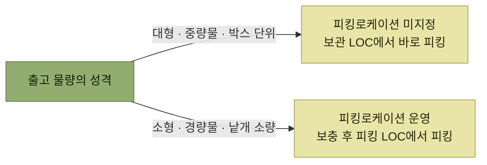

# 피킹로케이션 운영 방식

> [출고 프로세스](./README.md)

## 빠른 복습

- 창고의 형태, 취급 제품, 입출고 추이에 따라 **보관 로케이션 외에 별도의 피킹 로케이션을 운영**하기도 한다.
- **운영 여부에 따라 프로세스와 내부 절차가 달라진다.** 이 선택이 출고 방식을 갈라놓는다.
- **피킹로케이션 운영** — 소형·경량물, 낱개 소량 출고, 인력 위주. 재고보충이 필요하다.
- **피킹로케이션 미지정** — 대형·중량물, 박스 등 보관단위 출고, 지게차 등 전용장비. 재고보충이 없다.
- 미지정 방식을 응용한 것이 **랜덤 스토우(Random stow)** 이고, 아마존·쿠팡 같은 대규모 B2C 창고에서 효과를 낸다.
- 두 방식은 우열이 아니라 **혼용**한다. 박스·팔레트 단위는 미지정으로, 소량은 피킹로케이션으로.

## 두 방식의 비교

<table>
<thead>
<tr>
<th style="text-align:center; white-space:nowrap">구분</th>
<th style="text-align:center; white-space:nowrap">피킹로케이션 미지정 (보관로케이션에서 바로 피킹)</th>
<th style="text-align:center; white-space:nowrap">피킹로케이션 운영 (보관 → 피킹로케이션 보충 후 피킹)</th>
</tr>
</thead>
<tbody>
<tr>
<td style="text-align:center; white-space:nowrap"><b>화물유형</b></td>
<td style="text-align:left; white-space:nowrap">대형, 중량물</td>
<td style="text-align:left; white-space:nowrap">소형, 경량물</td>
</tr>
<tr>
<td style="text-align:center; white-space:nowrap"><b>피킹단위</b></td>
<td style="text-align:left; white-space:nowrap">박스 등 보관단위 출고</td>
<td style="text-align:left; white-space:nowrap">낱개 등 소량 위주 출고</td>
</tr>
<tr>
<td style="text-align:center; white-space:nowrap"><b>장비활용</b></td>
<td style="text-align:left; white-space:nowrap">지게차 등 전용장비 필요</td>
<td style="text-align:left; white-space:nowrap">인력 위주 운영</td>
</tr>
<tr>
<td style="text-align:center; white-space:nowrap"><b>재고보충여부</b></td>
<td style="text-align:left; white-space:nowrap">X</td>
<td style="text-align:left; white-space:nowrap">O</td>
</tr>
<tr>
<td style="text-align:center; white-space:nowrap"><b>특징</b></td>
<td style="text-align:left; white-space:nowrap">창고 운영 단순 랜덤 스토우 적용 가능 (혼잡 발생 예방)</td>
<td style="text-align:left; white-space:nowrap">작업자 생산성 및 이동거리 단축 재고관리 용이 (피킹로케이션 재고조사) 특정 피킹로케이션 작업 집중 (혼잡 발생)</td>
</tr>
</tbody>
</table>

**혼잡이 양쪽에 정반대로 등장하는 것**이 이 표의 핵심이다. 피킹로케이션 운영은 특정 로케이션에 작업이 몰려 혼잡을 만들고, 미지정 방식은 랜덤 스토우로 혼잡을 예방한다.

*무엇을 출고하느냐가 방식을 정한다*

## 피킹로케이션 운영

### 왜 필요한가

창고에서 일반적으로 박스 단위로 보관할 때는 **팔레트 랙**에 보관한다. 그런데 팔레트랙의 **높은 단(층)에 있는 재고를 피킹해야 할 경우 지게차 등의 장비 없이는 접근이 어렵다.**

피킹 로케이션 운영 방식은 이 문제를 해결하기 위해 작업자가 손이 바로 닿을 수 있는 **주로 1단(층)에 제품별 전용 피킹 로케이션을 지정**해 운영한다.

### 장점과 대가

주로 **다품종 소량의 다빈도 출고**에서 많이 적용된다.

- 장비가 별도로 필요하지 않아 **인력을 유동적으로 투입**할 수 있다.
- 피킹 로케이션에만 피킹(출고)이 이루어지기 때문에 **재고 조사 등의 관리가 용이**하다.

그러나 대가가 있다. 동시에 **특정 제품의 수량이나 작업 지시가 몰리게 되면서 혼잡 등 병목 현상이 발생**해 작업 효율성이 떨어질 수 있다.

### 재고보충 두 가지

<table>
<thead>
<tr>
<th style="text-align:center; white-space:nowrap">방식</th>
<th style="text-align:center; white-space:nowrap">언제</th>
<th style="text-align:center; white-space:nowrap">내용</th>
</tr>
</thead>
<tbody>
<tr>
<td style="text-align:center; white-space:nowrap"><b>사전 보충</b></td>
<td style="text-align:center; white-space:nowrap">미리</td>
<td style="text-align:left">최근 출고량으로 미리 예측하여 보관 로케이션 → 피킹 로케이션 이동 지시</td>
</tr>
<tr>
<td style="text-align:center; white-space:nowrap"><b>할당 보충</b></td>
<td style="text-align:center; white-space:nowrap">부족할 때</td>
<td style="text-align:left">사전 보충을 했음에도 출고해야 할 물량이 부족할 경우, 할당(출고지시) 작업 시 보관 로케이션 → 피킹 로케이션 이동 지시</td>
</tr>
</tbody>
</table>

### 재고보충 예시

원서의 예시로 보면 계산이 분명해진다.

**보관존**

<table>
<thead>
<tr>
<th style="text-align:center; white-space:nowrap">A301</th>
<th style="text-align:center; white-space:nowrap">A302</th>
<th style="text-align:center; white-space:nowrap">A303</th>
<th style="text-align:center; white-space:nowrap">A304</th>
</tr>
</thead>
<tbody>
<tr>
<td style="text-align:left; white-space:nowrap">사과 60개 → 이 중 60개 이동</td>
<td style="text-align:center; white-space:nowrap">사과 60개</td>
<td style="text-align:center; white-space:nowrap"></td>
<td style="text-align:center; white-space:nowrap">포도 30개</td>
</tr>
</tbody>
</table>

<table>
<thead>
<tr>
<th style="text-align:center; white-space:nowrap">A201</th>
<th style="text-align:center; white-space:nowrap">A202</th>
<th style="text-align:center; white-space:nowrap">A203</th>
<th style="text-align:center; white-space:nowrap">A204</th>
</tr>
</thead>
<tbody>
<tr>
<td style="text-align:center; white-space:nowrap"></td>
<td style="text-align:center; white-space:nowrap">포도 30개</td>
<td style="text-align:center; white-space:nowrap">포도 30개</td>
<td style="text-align:center; white-space:nowrap"></td>
</tr>
</tbody>
</table>

**피킹존**

<table>
<thead>
<tr>
<th style="text-align:center; white-space:nowrap">A101</th>
<th style="text-align:center; white-space:nowrap">A102</th>
<th style="text-align:center; white-space:nowrap">A103</th>
<th style="text-align:center; white-space:nowrap">A104</th>
</tr>
</thead>
<tbody>
<tr>
<td style="text-align:left; white-space:nowrap">사과 30개 + 60개 = <b>90개</b></td>
<td style="text-align:center; white-space:nowrap">포도 10개</td>
<td style="text-align:center; white-space:nowrap"></td>
<td style="text-align:center; white-space:nowrap"></td>
</tr>
</tbody>
</table>

*원서 [그림 5-10] 피킹로케이션 재고보충 예시*

**재고보충 이전 상황**

- "사과" 피킹로케이션: **A101** (재고가 30개 보관)
- "포도" 피킹로케이션: **A102** (재고 10개 보관)
- "사과" **90개 출고 주문 접수** (60개 부족)

**재고보충 작업**

- "사과" 90개를 출고하기에 피킹로케이션 재고 **60개 부족**
- 재고보충지시: **A301 → A101로 "사과" 60개 이동**
- ※ 재고보충지시 후 피킹 작업 가능

즉 피킹로케이션 운영 방식에서는 **주문이 들어와도 바로 피킹할 수 없는 경우가 있다.** 보충이 선행되어야 한다.

## 피킹로케이션 미지정

### 어떤 방식인가

로케이션에 보관되어 있는 재고를 **바로 출고 처리**하는 방식이다. 별도의 "재고 보충" 작업이 필요 없고, 빠르게 할당(출고지시) 작업을 수행하면 **바로 작업자가 피킹 업무를 수행할 수 있어 쉽고 빠르다.**

일반적으로 다음 경우에 많이 채택된다.

- 제품의 크기가 비교적 큰 **중량물**
- 한 번에 **대량의 물량**이 출고되는 경우
- **출고 빈도가 비교적 작은** 경우

### 랜덤 스토우 (Random stow)

아마존, 쿠팡 등에서 이 방식을 응용하여 **랜덤 스토우** 방식으로 다빈도 소량의 B2C 위주 대규모 창고에서 큰 효과를 발휘하고 있다. (stow: 제품을 보관하다)

> **랜덤 스토우의 예** — 동일 제품을 보관 존에 적치할 때부터 특정 구역에 집중해서 보관하지 않고, **소량씩 잘게 쪼개어 여러 곳에 분산하여 보관**한다.

동일 제품이 여러 로케이션에 분산되어 보관되어 있어 **무질서하고 비효율적으로 보일 수도 있다.** 그런데 그게 요점이다.

- 작업자들을 **동일한 지역에 집중되지 않도록 분산**한다.
- 제품별로 출고되는 패턴을 고려하여 **인근에 배치**하는 등 다양한 알고리즘을 적용한다.

그 결과 대규모 창고에서 수많은 작업자를 투입하더라도 운영할 수 있어 **작업 생산성과 보관 효율을 극대화**할 수 있다.

## 두 방식은 혼용한다

제품별 피킹 로케이션 운영 방식과 미지정 운영 방식은 각기 특징과 장단점이 있기 때문에, 랜덤 스토우처럼 **응용하거나 두 가지 방식을 혼용하는 경우가 많다.**

원서가 든 예시는 이렇다.

- **박스나 팔레트 단위**의 출고 작업이 필요한 경우 → 피킹 로케이션 **미지정** 방식으로 처리
- **소량의 출고 작업**이 필요한 경우 → 피킹 로케이션 **운영** 방식으로 처리

## 함께 읽기

- 프리로케이션 개념과의 관계는 [프리로케이션 재고 방식](../2-wms-주요-프로세스/4-할당과-피킹-출고.md#먼저--프리로케이션-재고-방식이란)을 참고한다.
- 재고보충의 개관은 [재고보충](../2-wms-주요-프로세스/3-재고이동과-재고보충.md#④-재고보충-replenishment)에 있다.
- 이 방식 선택이 할당 작업에 어떻게 반영되는지는 [할당(출고지시)](./4-할당-출고지시.md)에서 이어진다.
