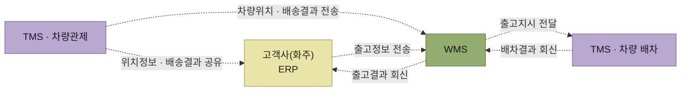

# 차량배차

> [출고 프로세스](./README.md)

## 빠른 복습

- WMS는 **창고와 재고를 관리하는 솔루션**이므로 차량배차 기능은 대부분 **최소한만** 제공한다.
- WMS에서 하는 일은 보통 **차량을 수동 등록하고 상차할 출고장 로케이션을 지정하는 정도**에서 그친다.
- 전문 배차시스템(**TMS**)은 교통량·물동량·요청시간·출입 가능 차량·출고 수량·부피·체적 등을 **빅데이터로 최적화해 배차를 자동화**한다.
- TMS는 배송 중에도 **차량 위치와 배송 상태를 실시간 모니터링**하고 고객사·출고처와 공유한다.
- 영역이 넓고 복잡해서 **별도 전문 솔루션을 도입해 WMS와 연계(인터페이스)해 운영하는 것이 일반적**이다.

## WMS가 하는 만큼

WMS 시스템은 창고와 재고를 효율적으로 관리하기 위한 솔루션이다. 그래서 상대적으로 차량배차 기능은 대부분 최소한의 기능만을 제공한다.

보통 WMS에서는 다음 수준에서 그치는 경우가 많다.

- 할당된 결과를 바탕으로 **차량을 수동으로 등록**한다.
- 그 차량이 **상차될 출고장 관련 로케이션을 지정**한다.

원서 프로세스 표에서 차량배차 단계에 **모바일 장비가 쓰이지 않는 것**도 이 때문이다. 현장 작업이 아니라 관리자의 등록 작업이다.

## TMS가 하는 만큼

전문적인 배차시스템(TMS, Transportation Management System)은 각 출고처(배송처)의 위치를 기반으로 다음을 **대용량 빅데이터를 기반으로 최적화**하여, 그 결과를 기반으로 배차 작업을 자동화할 수 있다.

- 교통량
- 물동량
- 요청시간
- 출입 가능 차량
- 출고 수량, 부피, 체적

배송이 시작된 뒤도 다르다. **배송 중에도 차량이 실시간으로 어디에 있고 배송진행 상태가 어떤지 바로 모니터링**할 수 있으며, 고객사나 출고처와 그 정보들을 실시간으로 공유할 수 있다.

차량 배차와 관련된 기능과 영역이 상당히 넓고 복잡하기 때문에, **별도 전문 솔루션을 도입하고 이를 WMS와 연계(인터페이스)하여 운영하는 것이 일반적**이다.

## WMS와 TMS는 어떻게 붙는가

*[그림 5-15] WMS와 TMS 연계 구성도*

세 갈래를 구분해서 읽으면 된다.

- **WMS ↔ 화주 ERP** — 입고예정·출고정보를 받고, 입고결과·출고결과를 돌려준다.
- **WMS → TMS 배차** — 할당(출고지시) 결과를 넘기고 배차결과를 받는다.
- **TMS 관제 → WMS와 화주 ERP 양쪽** — 차량위치와 배송결과를 보낸다. 특히 **위치정보는 화주 ERP로 직접 가기도 한다.**

이 도식은 모두 점선이다. 차량과 재고가 아니라 **정보만 오가는 연계 구성도**이기 때문이다.

원서는 `차량 배차`와 `차량관제`를 하나의 TMS 박스로 묶어 그렸다. 이 요약에서는 묶음 박스를 쓰면 경로가 박스를 돌아 나가면서 라벨이 서로 겹쳐 읽을 수 없었기 때문에, 묶음 대신 **노드 이름과 색(보라)으로 TMS 소속을 표시**했다.

## 함께 읽기

- 배차의 입력이 되는 할당 결과는 [할당(출고지시)](./4-할당-출고지시.md)에서 만들어진다.
- TMS의 기본 정의는 [ERP와 물류시스템](../1-wms-개요/1-ERP와-물류시스템.md#물류시스템이-따로-필요해진-이유)에 있다. 1장은 TMS를 "고객에게 안전하게 전달"로만 소개했는데, 이 장에서 그 실제 범위가 드러난다.
