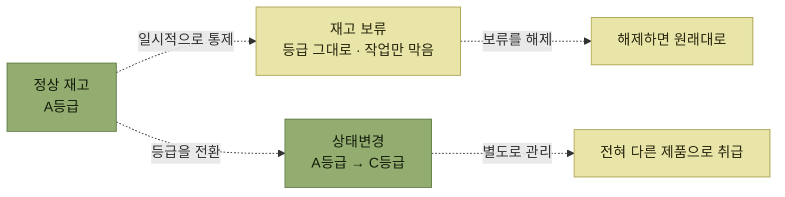

# 재고 상태변경

> [재고관리](./README.md)

## 빠른 복습

- 유통기한이 완전히 경과했거나 파손 등으로 **정상적인 판매가 불가능한** 재고는 정상 재고와 **구분해 관리**해야 한다.
- 상태변경은 **재고의 등급을 완전히 바꾸는** 작업이다. A등급 일부를 B·C등급으로 전환한다.
- [재고보류](./3-재고-보류.md)와의 차이가 핵심이다. **보류는 상태를 그대로 두고 일시적으로 막는 것**, **상태변경은 등급을 바꿔 전혀 다른 제품으로 취급하는 것**이다.
- 일부 WMS는 등급을 부여하지 않고 **존을 나눠 재고를 구분 보관**하는 방법을 쓰기도 한다.

## 왜 필요한가

창고에 보관된 재고가 **유통기한이 완전히 경과**되거나 **제품의 파손 등이 발생**되어 정상적인 판매가 불가능한 경우에는, 정상적인 재고와 **구분하여 관리가 필요**하다.

원서의 예시가 상황을 잘 보여준다.

> A등급의 의류를 입고하여 보관하고 있었지만, 입출고 등을 수행하면서 일부 의류는 **수선이 필요하거나 아예 복구가 불가능해 폐기를 해야 하는 제품**이 발견될 수 있다. 이러한 상황에서 A등급의 재고를 **B등급이나 C등급으로 재고의 일부를 전환**하는 작업이 재고 상태변경에 해당한다.

**"재고의 일부"** 라는 점이 중요하다. 같은 로케이션의 같은 제품이라도 일부만 등급이 갈릴 수 있다.

## 보류와 무엇이 다른가

*보류는 잠그는 것, 상태변경은 바꾸는 것*

**재고보류는 재고의 상태는 변경하지 않고 일시적으로 할당이나 이동을 하지 못하도록** 하지만, **상태 변경은 재고의 등급을 완전히 바꾼다.** 전혀 다른 제품으로 취급한다.

일부 WMS에서는 **등급을 부여하지 않고 존을 나눠서 재고를 구분하여 보관하는 방법**을 사용하기도 한다.

## 상태변경 예시

원서 예시를 표로 옮기면 이렇다. **등급 전환과 로케이션 이동이 함께** 일어난다.

**변경 지시 시점**

<table>
<thead>
<tr>
<th style="text-align:center; white-space:nowrap">로케이션</th>
<th style="text-align:center; white-space:nowrap">제품</th>
<th style="text-align:center; white-space:nowrap">등급</th>
<th style="text-align:center; white-space:nowrap">수량</th>
<th style="text-align:center; white-space:nowrap">할당</th>
</tr>
</thead>
<tbody>
<tr><td style="text-align:center; white-space:nowrap">A301</td><td style="text-align:center; white-space:nowrap">사과</td><td style="text-align:center; white-space:nowrap">A등급</td><td style="text-align:center; white-space:nowrap">50개</td><td style="text-align:center; white-space:nowrap"><b>20개</b></td></tr>
<tr><td style="text-align:center; white-space:nowrap">A302</td><td style="text-align:center; white-space:nowrap">사과</td><td style="text-align:center; white-space:nowrap">A등급</td><td style="text-align:center; white-space:nowrap">60개</td><td style="text-align:center; white-space:nowrap"></td></tr>
<tr><td style="text-align:center; white-space:nowrap">A101</td><td style="text-align:center; white-space:nowrap">사과</td><td style="text-align:center; white-space:nowrap">A등급</td><td style="text-align:center; white-space:nowrap">30개</td><td style="text-align:center; white-space:nowrap"></td></tr>
<tr><td style="text-align:center; white-space:nowrap">A104</td><td style="text-align:center; white-space:nowrap">사과</td><td style="text-align:center; white-space:nowrap">A등급</td><td style="text-align:center; white-space:nowrap">10개</td><td style="text-align:center; white-space:nowrap"></td></tr>
</tbody>
</table>

> **상태(등급) 변경 지시**
> [A301]LOC "사과" A등급 20개 → **"C"등급 전환 후 [A104] 이동지시** (사유: 파손)
> (다른 작업이 20개를 사용할 수 없도록 할당 처리)

**변경 확정 이후**

<table>
<thead>
<tr>
<th style="text-align:center; white-space:nowrap">로케이션</th>
<th style="text-align:center; white-space:nowrap">제품</th>
<th style="text-align:center; white-space:nowrap">등급</th>
<th style="text-align:center; white-space:nowrap">수량</th>
<th style="text-align:center; white-space:nowrap">할당</th>
</tr>
</thead>
<tbody>
<tr><td style="text-align:center; white-space:nowrap">A301</td><td style="text-align:center; white-space:nowrap">사과</td><td style="text-align:center; white-space:nowrap">A등급</td><td style="text-align:center; white-space:nowrap">50개 → <b>30개</b></td><td style="text-align:center; white-space:nowrap">20개 → <b>0개</b></td></tr>
<tr><td style="text-align:center; white-space:nowrap">A104</td><td style="text-align:center; white-space:nowrap">사과</td><td style="text-align:center; white-space:nowrap">A등급</td><td style="text-align:center; white-space:nowrap">10개</td><td style="text-align:center; white-space:nowrap"></td></tr>
<tr><td style="text-align:center; white-space:nowrap">A104</td><td style="text-align:center; white-space:nowrap">사과</td><td style="text-align:center; white-space:nowrap"><b>C등급</b></td><td style="text-align:center; white-space:nowrap"><b>20개</b></td><td style="text-align:center; white-space:nowrap"></td></tr>
</tbody>
</table>

> **상태(등급) 변경 확정**
> [A301] LOC "사과" A등급 20개 → "C"등급 전환 확정 후 [A104] LOC 이동처리
> (작업자: 홍길동, 작업시간 14:05 ~ 14:10)

*원서 [그림 6-15] 재고상태 변경 예시*

읽을 지점이 셋이다.

- **A104에 A등급 10개와 C등급 20개가 함께 있다.** 같은 로케이션에 다른 등급이 공존한다. 등급이 재고를 가르는 기준이기 때문이다.
- **할당 20개가 걸렸다가 확정과 함께 0개로 풀린다.** [재고이동](./2-재고이동.md#할당수량이-지시와-확정을-잇는다)과 같은 잠금 구조다.
- **작업자와 작업시간이 남는다.** 등급을 바꾼 책임이 기록된다.

## 함께 읽기

- 등급이 아니라 존으로 구분하는 방식은 [보류한 재고는 어디에 두는가](../2-wms-주요-프로세스/5-재고관리.md#보류한-재고는-어디에-두는가)의 논의와 이어진다.
- 상태변경이 필요한 상황(파손·유통기한·리콜)의 전체 목록은 [2장 재고관리](../2-wms-주요-프로세스/5-재고관리.md#언제-필요한가)에 있다.
