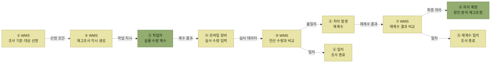

# 재고조사

> [재고관리](./README.md)

## 빠른 복습

- 입출고 작업 중 **오류·착오·분실**로 WMS 재고수량과 실제 재고수량이 어긋날 수 있다.
- 특히 **출고 시 불일치는 작업 혼선**으로 이어지므로, 효율적인 재고조사로 일치시켜야 한다.
- **전수재고조사**는 전체 로케이션을 일시에 조사한다. **모든 입출고를 중지**해야 한다.
- **수시재고조사**는 기준을 정해 일부만 조사한다. **입출고 중단 없이** 수행할 수 있다.
- 실무는 보통 **재무 목적으로 연 1~2회 전수**, 나머지는 부담이 적은 **수시**로 돌린다.
- 차이가 나면 **한 번 더 실재고를 확인**하고, 원인과 대책을 세운 뒤 재고조정·등급변경으로 일치시킨다.

## 왜 필요한가

창고 내 재고는 입출고 작업을 하면서 **오류나 착오, 분실 등으로 인해 WMS상의 재고수량과 실제 재고수량이 일치하지 않는 경우**가 있다.

이런 상황에서는 특히 **출고 시에 재고의 불일치로 인해 작업 혼선이 발생**될 수 있기 때문에, 효율적인 재고조사를 통해 재고를 일치화시키는 노력이 필요하다.

## 두 가지 방식

<table>
<thead>
<tr>
<th style="text-align:center; white-space:nowrap">구분</th>
<th style="text-align:center; white-space:nowrap">내용</th>
<th style="text-align:center; white-space:nowrap">비고사항</th>
</tr>
</thead>
<tbody>
<tr>
<td style="text-align:center; white-space:nowrap"><b>전수재고조사</b></td>
<td style="text-align:left; white-space:nowrap">창고 전체의 전체 로케이션을 일시에 재고조사</td>
<td style="text-align:center; white-space:nowrap">모든 입출고 중지</td>
</tr>
<tr>
<td style="text-align:center; white-space:nowrap"><b>수시재고조사</b></td>
<td style="text-align:left">최근 입출고된 로케이션만 재고조사 가격이 비싼 품목을 우선으로 재고조사 로케이션 중 일부 수량만 이동된 로케이션만 재고조사 로케이션별로 주기적으로 재고조사 제품별로 주기적으로 재고조사 랜덤하게 선정된 로케이션만 재고조사 피킹을 하면서 남은 잔량이 정확한지 재고조사 등</td>
<td style="text-align:center; white-space:nowrap">입출고 중단없이 수행 가능</td>
</tr>
</tbody>
</table>

*원서 [그림 6-16] 재고조사 주요방법*

수시재고조사의 일곱 가지 기준은 **무엇을 근거로 대상을 고르느냐**로 갈린다.

<table>
<thead>
<tr>
<th style="text-align:center; white-space:nowrap">근거</th>
<th style="text-align:center; white-space:nowrap">기준</th>
</tr>
</thead>
<tbody>
<tr>
<td style="text-align:center; white-space:nowrap"><b>최근에 손댄 것</b></td>
<td style="text-align:left">최근 입출고된 로케이션 / 일부 수량만 이동된 로케이션</td>
</tr>
<tr>
<td style="text-align:center; white-space:nowrap"><b>중요한 것</b></td>
<td style="text-align:left; white-space:nowrap">가격이 비싼 품목</td>
</tr>
<tr>
<td style="text-align:center; white-space:nowrap"><b>주기적으로</b></td>
<td style="text-align:left; white-space:nowrap">로케이션별 / 제품별</td>
</tr>
<tr>
<td style="text-align:center; white-space:nowrap"><b>무작위</b></td>
<td style="text-align:left; white-space:nowrap">랜덤하게 선정된 로케이션</td>
</tr>
<tr>
<td style="text-align:center; white-space:nowrap"><b>작업 중에</b></td>
<td style="text-align:left; white-space:nowrap">피킹하면서 남은 잔량 확인</td>
</tr>
</tbody>
</table>

마지막 항목이 특히 실용적이다. **피킹하러 간 김에 남은 수량이 맞는지 보는 것**이라 별도 작업 비용이 거의 들지 않는다.

## 실무에서는 어떻게 섞는가

보통 **재무적인 목적으로 연 1~2회 정도 전수재고조사를 실시**하고, 나머지는 부담이 적은 **수시재고조사를 정기 또는 비정기적으로 시행**하는 것이 일반적이다.

수시재고조사는 최근 입출고된 로케이션이나 제품의 가격 등 **중요도가 높은 재고 등 다양한 재고조사 기준 및 방법을 시스템에 입력하면, 이를 기준으로 자동으로 재고조사 작업지시 데이터를 생성**할 수 있다.

작업자는 지시된 재고조사 지시데이터를 기반으로 **로케이션의 실재고 수량을 모바일 장비를 통해 입력 처리**한다. 최종적으로 **실제 수량과 WMS 재고수량을 비교**하면 재고조사 절차는 마무리된다.

## 재고실사 프로세스

<table>
<thead>
<tr>
<th style="text-align:center; white-space:nowrap">구분</th>
<th style="text-align:center; white-space:nowrap">프로세스</th>
<th style="text-align:center; white-space:nowrap">내용</th>
<th style="text-align:center; white-space:nowrap">모바일 장비활용</th>
<th style="text-align:center; white-space:nowrap">출력물</th>
</tr>
</thead>
<tbody>
<tr>
<td style="text-align:center; white-space:nowrap">1</td>
<td style="text-align:center; white-space:nowrap">재고조사 지시 생성</td>
<td style="text-align:left; white-space:nowrap">재고실사 기준에 의한 제품, 로케이션 선정</td>
<td style="text-align:center; white-space:nowrap"></td>
<td style="text-align:center; white-space:nowrap"></td>
</tr>
<tr>
<td style="text-align:center; white-space:nowrap">2</td>
<td style="text-align:center; white-space:nowrap">재고실사 수행</td>
<td style="text-align:left; white-space:nowrap">작업자가 실제 재고 수량 확인 / 입력</td>
<td style="text-align:center; white-space:nowrap">O</td>
<td style="text-align:center; white-space:nowrap">재고실사 지시서</td>
</tr>
<tr>
<td style="text-align:center; white-space:nowrap">3</td>
<td style="text-align:center; white-space:nowrap">재고실사 결과 분석</td>
<td style="text-align:left">실재고수량과 WMS 수량 차이 원인 분석 및 대책 수립 ※ 재고차이분 재고실사 재확인 필요 ※ 최종 재고차이분 재고조정 처리</td>
<td style="text-align:center; white-space:nowrap"></td>
<td style="text-align:center; white-space:nowrap">재고실사 결과서</td>
</tr>
</tbody>
</table>

*원서 [그림 6-17] 재고실사 프로세스*

> 이 그림의 화살표는 **지시와 조사 결과의 정보 흐름**이다. 재고조사는 실물을 세는 작업이며 재고를 이동시키지 않으므로 모두 점선으로 표시했다.

## 차이가 났을 때

재고 실사 후 실재고와 차이가 발생된 경우에는 이렇게 처리한다.

1. **다시 한 번 실재고 수량을 확인**한다.
2. **차이 원인과 대책을 수립**하여 추후 재발을 최소화한다.
3. 최종 차이가 발생된 수량은 **재고조정, 등급 변경** 등의 재고 관리 프로세스를 통해 재고를 일치시킨다.

**바로 수량을 고치지 않고 한 번 더 세어 보는 것**이 절차에 들어 있다는 점이 중요하다. 조사 자체의 오류일 수 있기 때문이다.

## 함께 읽기

- 차이를 실제로 메우는 단계는 [재고조정](./6-재고조정.md)이다.
- 2장의 개관(전수 vs 사이클카운팅)은 [재고조사](../2-wms-주요-프로세스/7-재고조사.md)에 있다. 6장의 "수시재고조사"가 2장의 "사이클카운팅"에 해당한다.
