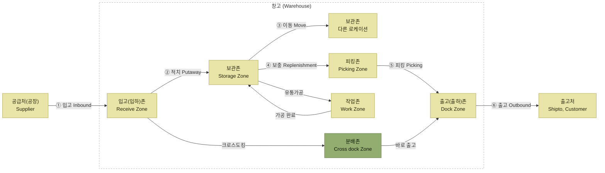
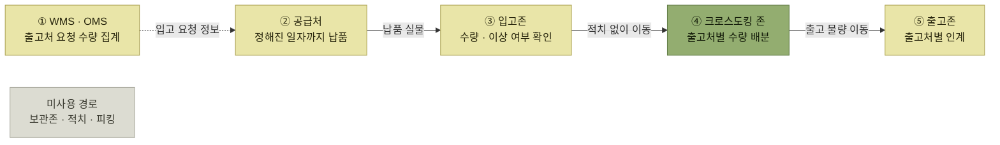
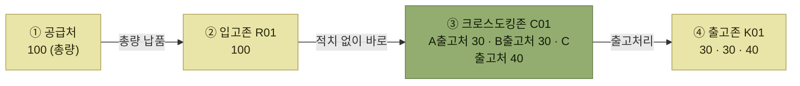

# 크로스도킹

## 왜 재고를 줄이려 하는가

창고에서 재고는 출고작업을 위해 꼭 필요하다. 그런데 지나치게 보유하면 문제가 생긴다.

> 재고자산이 창고 내에 **정체**되고 → **현금 흐름이 떨어지면서** → **이익창출에도 악영향**

그리고 비용은 재고금액에서 끝나지 않는다. 원서는 이렇게 덧붙인다.

> **재고금액뿐만 아니라** 재고관리를 위한 **창고 공간, 인력, 차량, 물류장비 등 부가적인 비용까지 수반**되기 때문에

따라서 재고 수준을 최대한 줄이는 것이 매우 중요한 이슈로 부각되고 있다.

**크로스도킹**은 그 답 중 하나다.

> 창고 내에 재고를 **최소한으로 보유하거나 아예 보유하지 않고**, 공급처에서 **필요한 수량만큼을 입고 받아 당일 바로 출고 처리**할 수 있는 방식

크로스도킹은 재고비용과 입출고 비용을 낮출 수 있는 좋은 방안 중의 하나이지만, **긴급 대응이 어려운 문제**도 있어 사전에 충분한 검토가 필요하다.

## 크로스도킹은 창고의 어느 구간을 건너뛰는가

*원서 [그림 7-1] 크로스도킹 프로세스 범위 — 크로스도킹은 ②적치~⑤피킹 구간을 건너뛴다*

정규 경로는 `①입고 → ②적치 → (③이동 · ④보충) → ⑤피킹 → ⑥출고`이다. 크로스도킹은 **입고존에서 분배존으로 바로 넘어가 출고존으로 나간다.** 보관존·피킹존을 거치지 않으므로 적치·재고이동·보충·피킹이 모두 빠진다.

원서는 이 번호들을 프로세스 묶음으로 정리해 두었다.

<table>
<thead>
<tr>
<th style="text-align:center; white-space:nowrap">입고</th>
<th style="text-align:center; white-space:nowrap">출고</th>
<th style="text-align:center; white-space:nowrap">재고</th>
<th style="text-align:center; white-space:nowrap">Advanced</th>
</tr>
</thead>
<tbody>
<tr>
<td style="text-align:center; white-space:nowrap">ASN → 입고 → 적치 (1, 2)</td>
<td style="text-align:center; white-space:nowrap">할당 → 피킹 → 출고 (4, 5, 6)</td>
<td style="text-align:center; white-space:nowrap">재고이동(3), 보류, 재고실사</td>
<td style="text-align:center; white-space:nowrap">VAS, C/D, 적정재고, 창고 최적화</td>
</tr>
</tbody>
</table>

크로스도킹은 기본 입출고 프로세스가 아니라 **Advanced 영역의 `C/D`** 로 분류된다. 기본 흐름을 다 갖춘 위에서 선택하는 고급 운영 방식이라는 뜻이다.

## 크로스도킹과 재고보관 비교

<table>
<thead>
<tr>
<th style="text-align:center; white-space:nowrap">구분</th>
<th style="text-align:center; white-space:nowrap">크로스도킹</th>
<th style="text-align:center; white-space:nowrap">재고보관</th>
</tr>
</thead>
<tbody>
<tr>
<td style="text-align:center; white-space:nowrap">재고보관</td>
<td style="text-align:center; white-space:nowrap">X</td>
<td style="text-align:center; white-space:nowrap">O</td>
</tr>
<tr>
<td style="text-align:center; white-space:nowrap">긴급대응</td>
<td style="text-align:center; white-space:nowrap">어려움</td>
<td style="text-align:center; white-space:nowrap">가능</td>
</tr>
<tr>
<td style="text-align:center; white-space:nowrap">보관장소</td>
<td style="text-align:center; white-space:nowrap">소규모 분배장</td>
<td style="text-align:center; white-space:nowrap">보관로케이션</td>
</tr>
<tr>
<td style="text-align:center; white-space:nowrap">구매비용</td>
<td style="text-align:center; white-space:nowrap">비교적 높음 (필요한 만큼 다품종 소량)</td>
<td style="text-align:center; white-space:nowrap">비교적 낮음 (향후 출고감안 대량 구매)</td>
</tr>
<tr>
<td style="text-align:center; white-space:nowrap">재고비용</td>
<td style="text-align:center; white-space:nowrap">낮음</td>
<td style="text-align:center; white-space:nowrap">높음</td>
</tr>
<tr>
<td style="text-align:center; white-space:nowrap">관리비용</td>
<td style="text-align:center; white-space:nowrap">낮음</td>
<td style="text-align:center; white-space:nowrap">높음</td>
</tr>
<tr>
<td style="text-align:center; white-space:nowrap">재고회전율</td>
<td style="text-align:center; white-space:nowrap">높음</td>
<td style="text-align:center; white-space:nowrap">낮음</td>
</tr>
<tr>
<td style="text-align:center; white-space:nowrap">기타사항</td>
<td style="text-align:center; white-space:nowrap">다품종 소량에 유리</td>
<td style="text-align:center; white-space:nowrap">소품종 대량에 유리</td>
</tr>
</tbody>
</table>

### 이 표는 공짜가 아니라는 것을 보여준다

크로스도킹이 재고비용·관리비용을 낮추고 회전율을 높이는 것은 분명하다. 하지만 **두 가지를 대가로 낸다.**

- **긴급대응이 어렵다** — 창고에 재고가 없으니 갑작스러운 주문에 꺼내 줄 것이 없다.
- **구매비용이 비교적 높다** — 필요한 만큼 다품종 소량으로 사기 때문에 대량 구매 단가를 못 누린다.

그래서 **다품종 소량은 크로스도킹, 소품종 대량은 재고보관**으로 갈린다. 재고를 줄이는 것이 언제나 이득이 아니라, **무엇을 취급하느냐**에 달려 있다.

## 어떻게 돌아가는가

> 선 의미: **실선은 재고 실물 이동**, **점선은 요청 정보 전달**을 나타낸다. 보관존은 사용하지 않는 경로임을 회색 노드로만 표시했다.

*출고처의 요청이 먼저, 공급처의 납품이 나중 — 순서가 재고보관과 반대다*

순서를 따라가면 이렇다.

1. 크로스도킹은 **출고처에서 요청한 수량을 집계**하여 공급처에 **정해진 일자까지 입고를 요청**한다.
2. 공급처는 요청한 일정에 맞추어 **정확히 납품**해야 한다.
3. 입고된 물량은 **적치작업을 거치지 않고 바로 크로스도킹 존으로 이동**되어 출고처별로 수량을 배분한다.
4. 입고된 물량이 부족한 경우에는 **우선순위에 의해 출고처별로 출고량을 조정**해야 한다.

여기서 **공급처의 납품 정확도가 곧 창고의 출고 정확도**가 된다. 재고 완충이 없으니 공급처가 늦거나 덜 보내면 그대로 출고처에 전가된다. 4번의 우선순위 조정이 필요한 이유다.

> 부족할 때의 우선순위 배분은 [출고가능 체크](../5-출고-프로세스/2-출고가능-체크.md)와 같은 문제다. 출고처 우선순위별·요청수량 배율배분 등의 정책이 여기서도 쓰인다.

## 운영 예시로 보는 기본 흐름

원서는 **같은 상황을 세 방식에 똑같이 적용해** 차이를 보여준다. 상황은 이렇다.

> **현상**
> A~C출고처에 **100개의 출고 요청** (크로스도킹)
> 공급처에 **100개 입고요청처리**

기본 방식(총량입고)의 결과다.

> **결과**
> 공급처에서 100개를 납품 (입고존에 100개)
> 크로스도킹존에서 거래처별로 **배분작업 실시**
> 배분된 수량을 출고존으로 이동 (출고처리)

*원서 [그림 7-3] 크로스도킹 운영예시*

**이 숫자(100 = 30 + 30 + 40)가 세 방식의 예시에서 계속 반복된다.** 무엇이 달라지는지만 보면 세 방식의 차이가 그대로 드러난다.

<table>
<thead>
<tr>
<th style="text-align:center; white-space:nowrap">방식</th>
<th style="text-align:center; white-space:nowrap">입고존에 도착한 형태</th>
<th style="text-align:center; white-space:nowrap">크로스도킹존</th>
<th style="text-align:center; white-space:nowrap">보관존</th>
</tr>
</thead>
<tbody>
<tr>
<td style="text-align:center; white-space:nowrap">사전분류입고</td>
<td style="text-align:center; white-space:nowrap"><b>A 30 · B 30 · C 40</b>으로 이미 나뉘어</td>
<td style="text-align:center; white-space:nowrap"><b>거치지 않음</b></td>
<td style="text-align:center; white-space:nowrap">쓰지 않음</td>
</tr>
<tr>
<td style="text-align:center; white-space:nowrap">총량입고 / 분류</td>
<td style="text-align:center; white-space:nowrap">총량 <b>100</b></td>
<td style="text-align:center; white-space:nowrap">여기서 배분</td>
<td style="text-align:center; white-space:nowrap">쓰지 않음</td>
</tr>
<tr>
<td style="text-align:center; white-space:nowrap">부족분 재고배분</td>
<td style="text-align:center; white-space:nowrap">납품 <b>60</b> + 보관 <b>40</b></td>
<td style="text-align:center; white-space:nowrap">여기서 배분</td>
<td style="text-align:center; white-space:nowrap"><b>[102] 40 → 0</b></td>
</tr>
</tbody>
</table>

## 세 가지 방식

크로스도킹을 이용하면 다음 방식들이 있으며, 이를 응용하여 수행한다.

<table>
<thead>
<tr>
<th style="text-align:center; white-space:nowrap">방식</th>
<th style="text-align:center; white-space:nowrap">영문명</th>
<th style="text-align:center; white-space:nowrap">내용</th>
</tr>
</thead>
<tbody>
<tr>
<td style="text-align:center; white-space:nowrap"><b>사전분류입고</b></td>
<td style="text-align:center; white-space:nowrap">Trans shipment</td>
<td style="text-align:left; white-space:nowrap">사전에 출고처별로 분류되어 입고되어 분류 작업 없이 바로 출고 처리</td>
</tr>
<tr>
<td style="text-align:center; white-space:nowrap"><b>총량입고 / 분류</b></td>
<td style="text-align:center; white-space:nowrap">Flow-thru</td>
<td style="text-align:left; white-space:nowrap">총량으로 입고되어 별도 분류장에서 출고처별 분류 후 출고 처리</td>
</tr>
<tr>
<td style="text-align:center; white-space:nowrap"><b>부족분 재고배분</b></td>
<td style="text-align:center; white-space:nowrap">Merge-in-transit (원서 표기)</td>
<td style="text-align:left; white-space:nowrap">창고에 일정 수준의 재고를 보유해 놓고 부족분만 입고 후 출고 처리</td>
</tr>
</tbody>
</table>

### 세 방식은 분류와 보완을 어디서 하는가로 갈린다

1. **사전분류입고** — 공급처가 출고처별 분류를 맡는다.
2. **총량입고 / 분류** — 창고가 크로스도킹존에서 분류한다.
3. **부족분 재고배분** — 창고가 분류하고 부족량은 가용 보관재고로 보완한다.

> 용어 주의: 이 장은 원서의 분류에 따라 부족분 재고배분을 `Merge-in-transit`으로 표기한다. 일반적인 물류 용례에서는 [2장의 설명](../2-wms-주요-프로세스/8-크로스도킹.md)처럼 **여러 공급처의 구성품을 운송 중 합류 지점에서 주문 단위로 병합하는 방식**을 뜻한다. 두 개념을 혼동하지 않도록 이 장에서는 본문 명칭인 **부족분 재고배분**을 사용한다.

<table>
<thead>
<tr>
<th style="text-align:center; white-space:nowrap">방식</th>
<th style="text-align:center; white-space:nowrap">분류 주체</th>
<th style="text-align:center; white-space:nowrap">창고가 하는 일</th>
<th style="text-align:center; white-space:nowrap">보관재고 사용</th>
<th style="text-align:center; white-space:nowrap">긴급대응</th>
</tr>
</thead>
<tbody>
<tr>
<td style="text-align:center; white-space:nowrap">사전분류입고</td>
<td style="text-align:center; white-space:nowrap">공급처</td>
<td style="text-align:center; white-space:nowrap">이상여부만 확인</td>
<td style="text-align:center; white-space:nowrap">X</td>
<td style="text-align:center; white-space:nowrap">어려움</td>
</tr>
<tr>
<td style="text-align:center; white-space:nowrap">총량입고 / 분류</td>
<td style="text-align:center; white-space:nowrap">창고</td>
<td style="text-align:center; white-space:nowrap">출고처별 배분</td>
<td style="text-align:center; white-space:nowrap">X</td>
<td style="text-align:center; white-space:nowrap">어려움</td>
</tr>
<tr>
<td style="text-align:center; white-space:nowrap">부족분 재고배분</td>
<td style="text-align:center; white-space:nowrap">창고</td>
<td style="text-align:center; white-space:nowrap">출고처별 배분</td>
<td style="text-align:center; white-space:nowrap">O</td>
<td style="text-align:center; white-space:nowrap"><b>용이</b></td>
</tr>
</tbody>
</table>

**긴급대응 열이 세 방식의 실질적 차이**다. 앞의 두 방식은 창고에 재고가 없어 긴급 요청에 대응할 수 없지만, 부족분 재고배분은 보관재고를 쓰기 때문에 가능하다.

## 목차

- [사전분류입고 (Trans shipment)](./1-사전분류입고.md)
- [총량입고 / 분류 (Flow-thru)](./2-총량입고-분류.md)
- [부족분 재고배분 (Merge-in-transit)](./3-부족분-재고배분.md)

## 함께 읽기

- 2장의 개관은 [크로스도킹](../2-wms-주요-프로세스/8-크로스도킹.md)에 있다. 7장은 그것을 상세히 펼친 것이다.
- 크로스도킹 물동량이 대기·작업하는 공간은 [분배존](../2-wms-주요-프로세스/1-로케이션과-존.md#주요-존의-종류)이다.
- 재고를 쥐고 있을 때의 비용 지표는 [재고회전율·재고보유일수](../6-재고관리/8-재고관리-체크리스트와-KPI.md#나-재고관리-kpi-예시)로 잰다.
