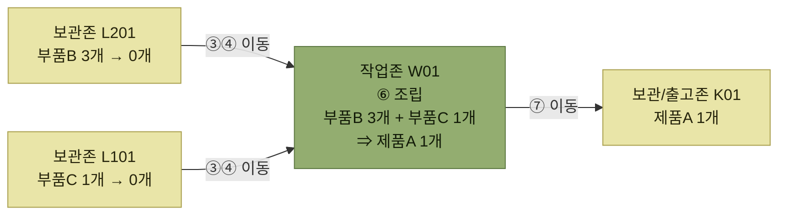

# 조립 (Kitting, Assemble)

> [부가서비스](./README.md)

## 빠른 복습
- 조립은 **제품을 구성하는 여러 개의 부품을 조합하여 완성품으로 만드는 작업**이다.
- 효율적으로 수행하려면 **사전에 세트조립 계획을 수립하고 관리**해야 한다. 부품의 **종류·수량·위치·수급현황**과 **장비·인력**을 함께 검토한다.
- 프로세스는 **BOM 등록 → 조립작업지시 → 부분품 이동지시 → 이동작업/완료 → 조립작업지시 → 조립작업/완료 → 조립물 이동** 7단계다.
- **③부터 무선 RF 장비를 쓴다.** ①②는 시스템에서 지시를 만드는 단계다.
- 재고는 **완성품이 생성(+)되고 투입된 부분품이 감소(−)** 한다. 전표도 **조립출고(−)와 조립입고(+)** 두 종류로 남는다.
- **여러 종류의 부품이 투입되는 만큼 부품을 투입하기 전에 품질 등 이상 여부를 점검하는 과정도 중요**하다.

## 계획이 먼저다

조립은 **제품을 구성하는 여러 개의 부품을 조합하여 완성품으로 만드는 작업**이다. 그리고 작업 전에 준비가 필요하다.

> **세트 조립의 작업을 효율적으로 수행하기 위해 사전에 세트조립 계획을 수립하고 관리하는 것이 중요**하다.

- **세트조립에 필요한 제품의 정보**를 파악한다.
- 세트 조립에 필요한 **부품의 종류, 수량, 위치, 수급현황** 등을 확인한다.
- 관련된 **장비, 인력**을 검토한다.

**부품의 위치와 수급현황**이 계획 항목에 들어 있다는 점을 눈여겨본다. 조립은 [BOM](./1-부가서비스와-BOM.md#bom--부품목록)만 있으면 되는 일이 아니라, **그 부품이 지금 창고 어디에 몇 개 있는지**가 맞아야 시작할 수 있는 일이다.

## 조립작업 주요 프로세스

<table>
<thead>
<tr>
<th style="text-align:center; white-space:nowrap">순서</th>
<th style="text-align:center; white-space:nowrap">프로세스</th>
<th style="text-align:center; white-space:nowrap">세부 설명</th>
<th style="text-align:center; white-space:nowrap">무선RF 장비활용</th>
<th style="text-align:center; white-space:nowrap">출력물</th>
</tr>
</thead>
<tbody>
<tr>
<td style="text-align:center; white-space:nowrap">1</td>
<td style="text-align:center; white-space:nowrap">BOM 등록</td>
<td style="text-align:left; white-space:nowrap">제품구성정보(BOM) 등록</td>
<td style="text-align:center; white-space:nowrap"></td>
<td style="text-align:left; white-space:nowrap">BOM 등록 요청서</td>
</tr>
<tr>
<td style="text-align:center; white-space:nowrap">2</td>
<td style="text-align:center; white-space:nowrap">조립작업지시</td>
<td style="text-align:left; white-space:nowrap">조립작업 지시 (수량 및 작업장 지시)</td>
<td style="text-align:center; white-space:nowrap"></td>
<td style="text-align:left; white-space:nowrap">조립 지시서</td>
</tr>
<tr>
<td style="text-align:center; white-space:nowrap">3</td>
<td style="text-align:center; white-space:nowrap">부분품 이동지시 (Move)</td>
<td style="text-align:left; white-space:nowrap">부품을 조립작업장으로 이동지시</td>
<td style="text-align:center; white-space:nowrap">O</td>
<td style="text-align:left; white-space:nowrap">이동지시서</td>
</tr>
<tr>
<td style="text-align:center; white-space:nowrap">4</td>
<td style="text-align:center; white-space:nowrap">부분품 이동작업 / 완료</td>
<td style="text-align:left; white-space:nowrap">이동 작업 수행 / 완료</td>
<td style="text-align:center; white-space:nowrap">O</td>
<td style="text-align:left; white-space:nowrap"></td>
</tr>
<tr>
<td style="text-align:center; white-space:nowrap">5</td>
<td style="text-align:center; white-space:nowrap">조립작업 지시</td>
<td style="text-align:left; white-space:nowrap">조립작업 지시</td>
<td style="text-align:center; white-space:nowrap">O</td>
<td style="text-align:left; white-space:nowrap">조립지시서</td>
</tr>
<tr>
<td style="text-align:center; white-space:nowrap">6</td>
<td style="text-align:center; white-space:nowrap">조립작업 / 완료</td>
<td style="text-align:left; white-space:nowrap">조립작업 완료 (완성품 생성, 부품(−))</td>
<td style="text-align:center; white-space:nowrap">O</td>
<td style="text-align:left; white-space:nowrap"></td>
</tr>
<tr>
<td style="text-align:center; white-space:nowrap">7</td>
<td style="text-align:center; white-space:nowrap">조립물 이동 (Move)</td>
<td style="text-align:left; white-space:nowrap">보관 / 출고존으로 이동</td>
<td style="text-align:center; white-space:nowrap">O</td>
<td style="text-align:left; white-space:nowrap">이동지시서</td>
</tr>
</tbody>
</table>

*원서 조립작업 주요 프로세스*

표를 읽는 법. 두 가지가 눈에 걸린다.

- **작업지시가 두 번 나온다.** ②는 **수량과 작업장을 정하는 지시**이고 ⑤는 **작업장에서 실제 조립을 시키는 지시**다. 그 사이에 **③④의 재고 이동**이 끼어 있다. 부품이 작업존에 와 있지 않으면 조립을 시킬 수 없기 때문이다.
- **무선 RF는 ③부터 쓴다.** ①②는 시스템에 데이터를 넣는 일이라 현장 장비가 필요 없다. [입고 프로세스에서 ①이 RF 없이 진행되던 것](../4-입고-프로세스/README.md#주요-입고-프로세스)과 같은 패턴이다.

*7단계를 재고가 움직이는 자리로 묶으면 다섯 덩어리다. 재고가 실제로 변하는 것은 ⑥ 한 곳이다*

## 재고는 어떻게 움직이는가

> **조립작업은 BOM을 기준으로 조립해야 할 작업일시, 작업자, 대상제품, 수량 등을 입력하여 작업 지시를 생성하는 것에서부터 시작**한다.

> **부분품이 보관되어 있는 로케이션에서 지시된 작업장으로 재고가 이동되고, 실제 조립 작업을 거쳐 새로운 완성품 재고가 생성(+)되며 완성품에 투입된 부분품의 재고는 감소(−)** 된다. **여러 종류의 부품이 투입되는 만큼 부품을 투입하기 전에 품질 등 이상여부 등을 점검하는 과정도 중요**하다.

*[그림 8-6] 조립작업 운영 예시 — BOM(제품A 1개 = 부품B 3개 + 부품C 1개)대로 부품이 작업존으로 모이고 완성품이 나간다*

전표는 이렇게 남는다.

<table>
<thead>
<tr>
<th style="text-align:center; white-space:nowrap">구분</th>
<th style="text-align:center; white-space:nowrap">전표번호</th>
<th style="text-align:center; white-space:nowrap">제품</th>
<th style="text-align:center; white-space:nowrap">수량</th>
<th style="text-align:center; white-space:nowrap">로케이션</th>
<th style="text-align:center; white-space:nowrap">비고사항</th>
</tr>
</thead>
<tbody>
<tr>
<td style="text-align:center; white-space:nowrap">조립출고</td>
<td style="text-align:center; white-space:nowrap">001-1</td>
<td style="text-align:center; white-space:nowrap">부품B</td>
<td style="text-align:center; white-space:nowrap">3</td>
<td style="text-align:center; white-space:nowrap">W01</td>
<td style="text-align:center; white-space:nowrap" rowspan="2"><b>재고감소(−)</b></td>
</tr>
<tr>
<td style="text-align:center; white-space:nowrap">조립출고</td>
<td style="text-align:center; white-space:nowrap">001-1</td>
<td style="text-align:center; white-space:nowrap">부품C</td>
<td style="text-align:center; white-space:nowrap">1</td>
<td style="text-align:center; white-space:nowrap">W01</td>
</tr>
<tr>
<td style="text-align:center; white-space:nowrap">조립입고</td>
<td style="text-align:center; white-space:nowrap">001-1</td>
<td style="text-align:center; white-space:nowrap">제품A</td>
<td style="text-align:center; white-space:nowrap">1</td>
<td style="text-align:center; white-space:nowrap">K01</td>
<td style="text-align:center; white-space:nowrap"><b>재고증가(+)</b></td>
</tr>
</tbody>
</table>

*원서 [그림 8-6]의 입출고전표*

표를 읽는 법. 세 줄의 **전표번호가 모두 `001-1`로 같다.** 부품 두 건의 감소와 완성품 한 건의 증가가 **하나의 조립 작업으로 묶여 있다**는 뜻이다. 그래서 나중에 **"이 제품A는 어느 부품에서 나왔는가"** 를 전표번호로 거슬러 찾을 수 있다.

또 **조립출고의 로케이션이 부품이 원래 있던 L201·L101이 아니라 작업존 W01** 이라는 점을 눈여겨본다. **부품은 먼저 ③④에서 작업존으로 이동한 뒤**, 조립 시점에는 이미 W01에 있기 때문이다. **재고 이동과 재고 소멸이 별개의 단계**라는 것이 전표에 그대로 드러난다.

## 함께 읽기

- [해체 — 이 전표의 부호가 뒤집힌 작업](./3-해체.md)
- [BOM — ①단계에서 등록하는 그 기준정보](./1-부가서비스와-BOM.md)
- [재고이동 — ③④와 ⑦이 쓰는 그 기능](../2-wms-주요-프로세스/3-재고이동과-재고보충.md)
