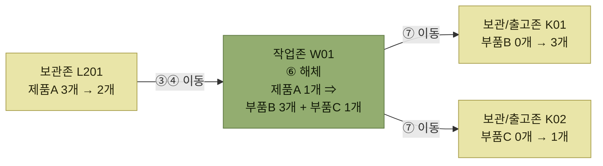

# 해체 (Unkitting, Disassemble)

> [부가서비스](./README.md)

## 빠른 복습
- **해체작업은 조립의 반대되는 개념으로 완성품을 다시 여러 개의 부품으로 해체하는 것**이다.
- **해체작업 역시 세트조립과 같은 개념으로 사전에 계획을 수립**하고 **소요현황, 장비, 인력 등을 종합적으로 검토하고 관리**해야 한다.
- 프로세스도 조립과 같은 모양이다 — **BOM 등록 → 해체작업지시 → 완성품 이동 → 해체작업 → 부분품 이동**.
- 재고는 **부분품이 생성(+)되고 완성품이 감소(−)** 한다. 전표는 **해체입고(+)와 해체출고(−)** 로 남는다.
- **같은 BOM을 거꾸로 읽는 작업**이라는 점이 핵심이다.

## 조립을 뒤집는다

> **해체작업은 조립의 반대되는 개념으로 완성품을 다시 여러 개의 부품으로 해체하는 것**을 말한다.

> **해체작업 역시 세트조립과 같은 개념으로 사전에 계획을 수립하고 이와 관련된 소요현황, 장비, 인력 등을 종합적으로 검토하고 관리**해야 한다.

## 해체작업 주요 프로세스

<table>
<thead>
<tr>
<th style="text-align:center; white-space:nowrap">순서</th>
<th style="text-align:center; white-space:nowrap">프로세스</th>
<th style="text-align:center; white-space:nowrap">세부 설명</th>
<th style="text-align:center; white-space:nowrap">무선RF 장비활용</th>
<th style="text-align:center; white-space:nowrap">출력물</th>
</tr>
</thead>
<tbody>
<tr>
<td style="text-align:center; white-space:nowrap">1</td>
<td style="text-align:center; white-space:nowrap">BOM 등록</td>
<td style="text-align:left; white-space:nowrap">제품구성정보(BOM) 등록</td>
<td style="text-align:center; white-space:nowrap"></td>
<td style="text-align:left; white-space:nowrap">BOM 등록 요청서</td>
</tr>
<tr>
<td style="text-align:center; white-space:nowrap">2</td>
<td style="text-align:center; white-space:nowrap">해체작업지시</td>
<td style="text-align:left; white-space:nowrap">해체작업 지시 (수량 및 작업장 지시)</td>
<td style="text-align:center; white-space:nowrap"></td>
<td style="text-align:left; white-space:nowrap">지시서</td>
</tr>
<tr>
<td style="text-align:center; white-space:nowrap">3</td>
<td style="text-align:center; white-space:nowrap">완성품 이동지시 (Move)</td>
<td style="text-align:left; white-space:nowrap">완성품을 작업장으로 이동지시</td>
<td style="text-align:center; white-space:nowrap">O</td>
<td style="text-align:left; white-space:nowrap">이동지시서</td>
</tr>
<tr>
<td style="text-align:center; white-space:nowrap">4</td>
<td style="text-align:center; white-space:nowrap">완성품 이동작업 / 완료</td>
<td style="text-align:left; white-space:nowrap">이동작업 수행 / 완료</td>
<td style="text-align:center; white-space:nowrap">O</td>
<td style="text-align:left; white-space:nowrap"></td>
</tr>
<tr>
<td style="text-align:center; white-space:nowrap">5</td>
<td style="text-align:center; white-space:nowrap">해체작업 지시</td>
<td style="text-align:left; white-space:nowrap">해체작업 지시</td>
<td style="text-align:center; white-space:nowrap">O</td>
<td style="text-align:left; white-space:nowrap">지시서</td>
</tr>
<tr>
<td style="text-align:center; white-space:nowrap">6</td>
<td style="text-align:center; white-space:nowrap">해체작업 / 완료</td>
<td style="text-align:left; white-space:nowrap">해체작업 완료 (부분품 생성, 완성품(−))</td>
<td style="text-align:center; white-space:nowrap">O</td>
<td style="text-align:left; white-space:nowrap"></td>
</tr>
<tr>
<td style="text-align:center; white-space:nowrap">7</td>
<td style="text-align:center; white-space:nowrap">부분품 이동 (Move)</td>
<td style="text-align:left; white-space:nowrap">보관 / 출고존으로 이동</td>
<td style="text-align:center; white-space:nowrap">O</td>
<td style="text-align:left; white-space:nowrap">이동지시서</td>
</tr>
</tbody>
</table>

*원서 [그림 8-7] 해체작업 주요 프로세스*

**원서 표에서 두 가지를 손봤다.** 첫째, **순서 열에 `6`이 빠지고 `7`·`8`이 붙어 있어** 여기서는 **1~7로 다시 매겼다.** 둘째, ②와 ⑤의 출력물이 원서에는 **"조립 지시서"·"조립지시서"** 로 적혀 있는데, **해체작업 표이므로 조립 표에서 옮겨온 흔적으로 보인다.** 원문을 그대로 두면 오해를 부르므로 **"지시서"** 로 적었다. ⑦의 프로세스명도 원서는 **"완성품 이동"** 이지만 **세부 설명(보관/출고존으로 이동)과 해체의 결과물**을 보면 **이동 대상은 부분품**이므로 그렇게 적었다.

표를 읽는 법. 조립 표와 나란히 놓으면 **③④에서 옮기는 것이 부품에서 완성품으로 바뀌고, ⑦에서 옮기는 것이 완성품에서 부품으로 바뀐 것**만 다르다. **단계 수와 RF 사용 지점(③부터)은 똑같다.**

## 재고는 어떻게 움직이는가

> **해체작업 역시 BOM을 기준으로** 조립해야 할 **작업일시, 작업자, 대상제품, 수량 등을 입력하여 작업 지시를 생성하는 것에서부터 시작**한다.

> **해체를 해야 할 완성품이 보관되어 있는 로케이션에서 지시된 작업장으로 재고가 이동되고, 실제 해체 작업을 거쳐 새로운 부분품 재고가 생성(+)되며 완성품의 재고는 감소(−)** 된다.

*[그림 8-8] 해체작업 운영 예시 — 보관존의 제품A 3개 중 1개가 해체되어 2개로 줄고, 부품 두 종류가 새로 생긴다*

전표의 부호가 조립과 정확히 반대다.

<table>
<thead>
<tr>
<th style="text-align:center; white-space:nowrap">구분</th>
<th style="text-align:center; white-space:nowrap">전표번호</th>
<th style="text-align:center; white-space:nowrap">제품</th>
<th style="text-align:center; white-space:nowrap">수량</th>
<th style="text-align:center; white-space:nowrap">로케이션</th>
<th style="text-align:center; white-space:nowrap">비고사항</th>
</tr>
</thead>
<tbody>
<tr>
<td style="text-align:center; white-space:nowrap">해체입고</td>
<td style="text-align:center; white-space:nowrap">001-1</td>
<td style="text-align:center; white-space:nowrap">부품B</td>
<td style="text-align:center; white-space:nowrap">3</td>
<td style="text-align:center; white-space:nowrap">W01</td>
<td style="text-align:center; white-space:nowrap" rowspan="2"><b>재고증가(+)</b></td>
</tr>
<tr>
<td style="text-align:center; white-space:nowrap">해체입고</td>
<td style="text-align:center; white-space:nowrap">001-1</td>
<td style="text-align:center; white-space:nowrap">부품C</td>
<td style="text-align:center; white-space:nowrap">1</td>
<td style="text-align:center; white-space:nowrap">W01</td>
</tr>
<tr>
<td style="text-align:center; white-space:nowrap">해체출고</td>
<td style="text-align:center; white-space:nowrap">001-1</td>
<td style="text-align:center; white-space:nowrap">제품A</td>
<td style="text-align:center; white-space:nowrap">1</td>
<td style="text-align:center; white-space:nowrap">W01</td>
<td style="text-align:center; white-space:nowrap"><b>재고감소(−)</b></td>
</tr>
</tbody>
</table>

*원서 [그림 8-8]의 입출고전표*

표를 읽는 법. 조립 전표와 **행 구성이 완전히 같고 구분과 부호만 뒤집혀 있다.** 조립은 `조립출고(−) 부품 2건 + 조립입고(+) 완성품 1건`, 해체는 `해체입고(+) 부품 2건 + 해체출고(−) 완성품 1건`이다.

| | 조립 | 해체 |
| --- | --- | --- |
| **작업존으로 옮기는 것** | 부품 (③④) | 완성품 (③④) |
| **생성(+)** | 완성품 1건 — **조립입고** | 부품 2건 — **해체입고** |
| **감소(−)** | 부품 2건 — **조립출고** | 완성품 1건 — **해체출고** |
| **작업존에서 나가는 것** | 완성품 (⑦) | 부품 (⑦) |

표를 읽는 법. 네 줄이 **위아래로 대칭**이다. 그래서 **같은 BOM 하나로 두 작업을 모두 지시할 수 있다.** [BOM이 조립과 해체의 공통 기준정보](./1-부가서비스와-BOM.md#bom--부품목록)인 이유가 이 대칭이다.

## 함께 읽기

- [조립 — 이 작업의 거울상](./2-조립.md)
- [부가서비스와 BOM — 두 작업이 공유하는 기준정보](./1-부가서비스와-BOM.md)
- [재고관리 — 조립·해체로 생기고 사라지는 재고를 다루는 장](../6-재고관리/README.md)
