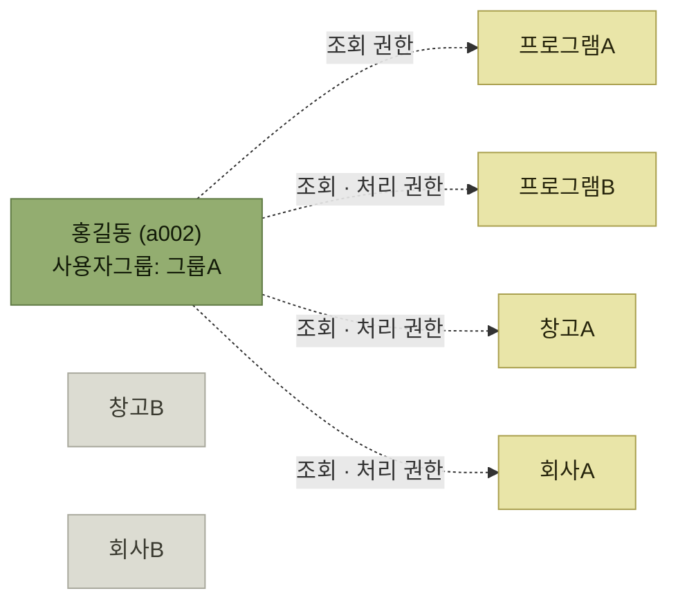
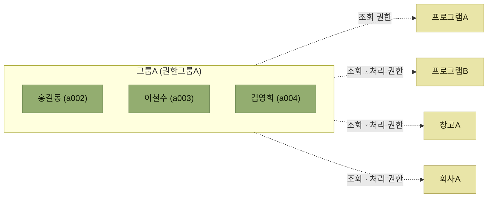

# 사용자 및 그룹관리

> [권한보안관리](./README.md)

## 빠른 복습
- **WMS 시스템을 사용하기 위해서는 반드시 사용자 아이디가 필요**하다. 사용자는 크게 **작업자 · 관리자 · 외부 접속자**(고객사, 화주, 출고처, 배송처 담당자 등)로 그룹화할 수 있다.
- 사용자 기준정보에는 **아이디, 안전하게 해시된 비밀번호, 이름, 소속, 사용자 유형, 등록일, 종료일** 등의 기본 정보와 함께 **복수 개의 창고 · 프로그램 · 고객사(화주) · 제품 권한**을 부여받을 수 있다.
- **비밀번호는 시스템 관리자도 원문을 알 수 없도록 단방향 해시로 저장**하고, 위험 기반 정책과 추가 인증을 함께 적용한다.
- 사용자 한 사람씩 권한을 부여하면 **입력해야 할 항목이나 내용이 많아 불편**하므로, **아이디의 상위 개념인 사용자그룹**을 관리하는 경우가 많다.
- 사용자그룹에 권한을 부여해두면 **사용자 등록 시 어느 그룹인지만 등록해주면** 되므로 편리하다.

## 가. 사용자

> **WMS 시스템을 사용하기 위해서는 반드시 사용자 아이디가 필요**하다. 사용자는 크게 **작업자, 관리자, 외부 접속자(고객사, 화주, 출고처, 배송처 담당자 등)로 그룹화**할 수 있다.

> **사용자 기준정보에는 사용자 아이디, 암호화된 비밀번호, 이름, 소속, 사용자 유형, 등록일, 종료일 등의 기본적인 정보 외에 사용 가능한 복수 개의 창고, 프로그램, 고객사(화주), 제품 등에 대한 권한을 부여**받을 수 있다.

*[그림 9-3] 사용자권한 설정 예시 — 회색인 창고B와 회사B에는 권한이 없다. 홍길동은 그 존재조차 볼 수 없다*

원서 [그림 9-3]의 예시는 사용자 · 창고권한 · 회사권한 · 프로그램권한 네 표를 보여준다. **사용자 한 건에 창고권한 · 회사권한 · 프로그램권한이 각각 여러 건 붙는 구조**다. 앞에서 언급한 제품 단위 권한까지 운영한다면 **제품권한도 같은 1:N 구조의 별도 권한 목록으로 추가**해야 한다. 따라서 아래 표는 전체 권한 모델을 제한하는 스키마가 아니라 그림에 나온 항목을 옮긴 예시다.

<table>
<thead>
<tr>
<th style="text-align:center; white-space:nowrap">구분</th>
<th style="text-align:center; white-space:nowrap">아이디</th>
<th style="text-align:center; white-space:nowrap">대상</th>
<th style="text-align:center; white-space:nowrap">권한</th>
<th style="text-align:center; white-space:nowrap">사용여부</th>
<th style="text-align:center; white-space:nowrap">등록일시</th>
<th style="text-align:center; white-space:nowrap">수정일시</th>
</tr>
</thead>
<tbody>
<tr>
<td style="text-align:center; white-space:nowrap"><b>사용자</b></td>
<td style="text-align:center; white-space:nowrap">a002</td>
<td style="text-align:center; white-space:nowrap">홍길동 · 그룹A</td>
<td style="text-align:center; white-space:nowrap">비밀번호 해시</td>
<td style="text-align:center; white-space:nowrap">Y</td>
<td style="text-align:center; white-space:nowrap">2023-10-21</td>
<td style="text-align:center; white-space:nowrap">2023-10-25</td>
</tr>
<tr>
<td style="text-align:center; white-space:nowrap"><b>창고권한</b></td>
<td style="text-align:center; white-space:nowrap">a002</td>
<td style="text-align:center; white-space:nowrap">창고A</td>
<td style="text-align:center; white-space:nowrap">조회, 처리</td>
<td style="text-align:center; white-space:nowrap">Y</td>
<td style="text-align:center; white-space:nowrap">2023-10-21</td>
<td style="text-align:center; white-space:nowrap">2023-10-25</td>
</tr>
<tr>
<td style="text-align:center; white-space:nowrap"><b>회사권한</b></td>
<td style="text-align:center; white-space:nowrap">a002</td>
<td style="text-align:center; white-space:nowrap">회사A</td>
<td style="text-align:center; white-space:nowrap">조회, 처리</td>
<td style="text-align:center; white-space:nowrap">Y</td>
<td style="text-align:center; white-space:nowrap">2023-10-21</td>
<td style="text-align:center; white-space:nowrap">2023-10-25</td>
</tr>
<tr>
<td style="text-align:center; white-space:nowrap"><b>프로그램권한</b></td>
<td style="text-align:center; white-space:nowrap">a002</td>
<td style="text-align:center; white-space:nowrap">프로그램A</td>
<td style="text-align:center; white-space:nowrap">조회</td>
<td style="text-align:center; white-space:nowrap">Y</td>
<td style="text-align:center; white-space:nowrap">2023-10-21</td>
<td style="text-align:center; white-space:nowrap">2023-10-25</td>
</tr>
<tr>
<td style="text-align:center; white-space:nowrap"><b>프로그램권한</b></td>
<td style="text-align:center; white-space:nowrap">a002</td>
<td style="text-align:center; white-space:nowrap">프로그램B</td>
<td style="text-align:center; white-space:nowrap">조회, 처리</td>
<td style="text-align:center; white-space:nowrap">Y</td>
<td style="text-align:center; white-space:nowrap">2023-10-21</td>
<td style="text-align:center; white-space:nowrap">2023-10-25</td>
</tr>
</tbody>
</table>

*원서 [그림 9-3]의 네 개 표를 하나로 합쳐 옮겼다. 원서는 사용자 · 창고권한 · 회사권한 · 프로그램권한을 각각 별도 표로 보여준다*

표를 읽는 법. **같은 아이디 `a002`가 다섯 줄에 반복**된다. 권한이 **사용자 한 건의 칸이 아니라 별도의 여러 건**으로 관리된다는 뜻이며, 그래서 **창고 하나 · 프로그램 하나를 추가할 때마다 줄이 늘어난다.** 이 불편함이 다음 절의 사용자그룹으로 이어진다.

### 비밀번호

> 사용자의 비밀번호는 **시스템의 관리자도 알 수 없도록 암호화를 수행**하고 **주기적으로 비밀번호를 변경하도록 강제하거나 권고**하는 것이 좋다.

> 비밀번호는 **외부에 노출되면 보안 사고로 이어질 경우가 많기 때문에**, 인터넷뱅킹 시스템에서와 같이 **별도 인증시스템을 도입하거나 OTP(One Time Password)나 이메일을 통한 추가 인증** 등 다양한 방식으로 보안을 강화할 수 있다.

**관리자도 원문을 알 수 없도록**이라는 조건을 눈여겨본다. 원서는 이를 "암호화"라고 표현하지만, 실제 비밀번호 저장에는 복호화 가능한 암호화가 아니라 **사용자별 솔트와 함께 단방향 비밀번호 해시**를 사용해야 한다. OWASP는 새 시스템에 Argon2id를 우선 권고하며, 환경에 따라 scrypt·bcrypt·PBKDF2 같은 비밀번호 전용 알고리즘을 사용하도록 안내한다. 자세한 기준은 [OWASP Password Storage Cheat Sheet](https://cheatsheetseries.owasp.org/cheatsheets/Password_Storage_Cheat_Sheet.html)를 참고한다.

원서의 **주기적 비밀번호 변경** 권고도 현재 기준과는 구분해서 읽는다. NIST SP 800-63B는 정기 변경을 일률적으로 강제하지 않고, 비밀번호가 유출되었거나 침해 증거가 있을 때 변경하도록 요구한다. 조직의 별도 규정이 있다면 그 정책을 함께 적용한다. 자세한 내용은 [NIST SP 800-63B 비밀번호 요구사항](https://pages.nist.gov/800-63-4/sp800-63b.html)을 참고한다.

## 나. 사용자그룹

> **프로그램, 창고, 고객사(화주) 등에 관련된 권한을 사용자별로 한 사람 한 사람에게 각각 권한을 부여할 경우 입력해야 할 항목이나 내용이 많아 불편**하기 때문에, **사용자 아이디의 상위 개념인 사용자그룹을 관리하는 경우가 많다.**

> **사용자그룹을 등록하고 프로그램, 창고, 고객사(화주) 등의 권한을 사용자그룹에 부여하는 방법**이다. **사용자 등록 시에는 사용자그룹이 어디인지를 등록해 주면 일일이 프로그램, 창고, 고객사(화주)에 대한 권한을 부여할 필요가 없기 때문에 편리**하다.

*[그림 9-4] 사용자그룹 권한관리 예시 — 권한이 그룹에 한 번 붙고, 세 사람은 그룹에 속하기만 한다*

<table>
<thead>
<tr>
<th style="text-align:center; white-space:nowrap">구분</th>
<th style="text-align:center; white-space:nowrap">그룹ID</th>
<th style="text-align:center; white-space:nowrap">대상</th>
<th style="text-align:center; white-space:nowrap">권한</th>
<th style="text-align:center; white-space:nowrap">사용여부</th>
<th style="text-align:center; white-space:nowrap">등록일시</th>
<th style="text-align:center; white-space:nowrap">수정일시</th>
</tr>
</thead>
<tbody>
<tr>
<td style="text-align:center; white-space:nowrap"><b>그룹</b></td>
<td style="text-align:center; white-space:nowrap">그룹A</td>
<td style="text-align:center; white-space:nowrap">권한그룹A</td>
<td style="text-align:center; white-space:nowrap">—</td>
<td style="text-align:center; white-space:nowrap">—</td>
<td style="text-align:center; white-space:nowrap">—</td>
<td style="text-align:center; white-space:nowrap">—</td>
</tr>
<tr>
<td style="text-align:center; white-space:nowrap"><b>그룹 창고권한</b></td>
<td style="text-align:center; white-space:nowrap">그룹A</td>
<td style="text-align:center; white-space:nowrap">창고A</td>
<td style="text-align:center; white-space:nowrap">조회, 처리</td>
<td style="text-align:center; white-space:nowrap">Y</td>
<td style="text-align:center; white-space:nowrap">2023-10-21</td>
<td style="text-align:center; white-space:nowrap">2023-10-25</td>
</tr>
<tr>
<td style="text-align:center; white-space:nowrap"><b>그룹 회사권한</b></td>
<td style="text-align:center; white-space:nowrap">그룹A</td>
<td style="text-align:center; white-space:nowrap">회사A</td>
<td style="text-align:center; white-space:nowrap">조회, 처리</td>
<td style="text-align:center; white-space:nowrap">Y</td>
<td style="text-align:center; white-space:nowrap">2023-10-21</td>
<td style="text-align:center; white-space:nowrap">2023-10-25</td>
</tr>
<tr>
<td style="text-align:center; white-space:nowrap"><b>그룹 프로그램권한</b></td>
<td style="text-align:center; white-space:nowrap">그룹A</td>
<td style="text-align:center; white-space:nowrap">프로그램A</td>
<td style="text-align:center; white-space:nowrap">조회</td>
<td style="text-align:center; white-space:nowrap">Y</td>
<td style="text-align:center; white-space:nowrap">2023-10-21</td>
<td style="text-align:center; white-space:nowrap">2023-10-25</td>
</tr>
<tr>
<td style="text-align:center; white-space:nowrap"><b>그룹 프로그램권한</b></td>
<td style="text-align:center; white-space:nowrap">그룹A</td>
<td style="text-align:center; white-space:nowrap">프로그램B</td>
<td style="text-align:center; white-space:nowrap">조회, 처리</td>
<td style="text-align:center; white-space:nowrap">Y</td>
<td style="text-align:center; white-space:nowrap">2023-10-21</td>
<td style="text-align:center; white-space:nowrap">2023-10-25</td>
</tr>
</tbody>
</table>

*원서 [그림 9-4]의 그룹 관련 표들을 하나로 합쳐 옮겼다. 사용자 표에는 홍길동 · 이철수 · 김영희가 모두 사용자그룹 `그룹A`로 등록된다*

표를 읽는 법. 앞 절의 사용자 권한 표와 **행 구조가 똑같고 키만 아이디에서 그룹ID로 바뀌었다.** 그래서 **사람이 열 명이든 백 명이든 권한 줄 수는 그대로**다. 사용자 표에는 **사용자그룹 칸 하나만** 채운다.

사용자그룹은 역할 기반 접근 제어(RBAC)의 역할과 비슷하지만, 편의만 보고 넓은 권한을 묶으면 과도한 권한이 빠르게 확산된다. 직무 변경·휴직·퇴사 시 그룹 소속을 즉시 조정하고, 예외적으로 사용자에게 직접 부여한 권한도 함께 정기 점검해야 한다.

**원서 표에서 눈에 걸리는 점 하나.** 사용자 표의 세 사람 중 **홍길동과 김영희의 사용자ID가 모두 `a002`** 로 적혀 있다. 아이디는 유일해야 하므로 원서의 오기로 보고, 위 그림에서는 김영희의 ID를 **`a004`로 교정**했다.

## 함께 읽기

- [권한관리 개요 — 권한 부여 대상과 범위](./1-권한관리-개요.md)
- [보안감사 — 이 권한을 벗어난 접근을 어떻게 찾아내는지](./3-보안감사.md)
- [고객사 기준정보 — 회사권한의 대상이 되는 그 고객사코드](../3-기준정보/3-거래처관련-기준정보.md#가-고객사)
