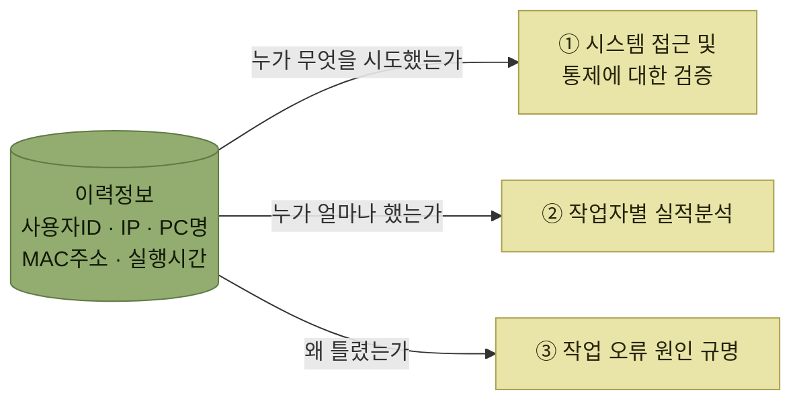

# 보안감사

> [권한보안관리](./README.md)

## 빠른 복습
- WMS는 **어떤 사용자가 접속하여 어떠한 작업을 수행하거나 조회를 했는지에 대해 이력을 관리**한다.
- 이력은 **접속이력 · 실행이력 · 출력이력 · 시스템이력** 네 가지로 구분된다.
- 이력정보에는 **누가 어디서 언제 무엇을 했는지** — **사용자ID, 공인IP주소, 사설IP주소, PC명, MAC주소, 실행시간** 등이 필수로 포함된다.
- 용도는 셋이다 — **① 시스템 접근 및 통제에 대한 검증 · ② 작업자별 실적분석 · ③ 작업 오류 원인 규명**.
- 접근 검증에서는 **퇴사자·장기 미접속자의 로그인 시도, 비밀번호 오류 반복, 허용되지 않은 창고·고객사 접근 시도, 허용되지 않은 IP·PC(특히 해외 IP), 평균 초과 실행·출력, 새벽·야간 접속**을 중점적으로 본다.
- 과거에는 **종이 출력물에 의존해 작업 이력을 남길 수 없어** 원인 파악이 어려웠지만, **무선 네트워크와 모바일 장비 보급으로 실시간 이력이 쌓여 과거 시점의 상황 재연이 가능**해졌다.

## 무엇이 이력으로 남는가

> WMS 시스템에서는 **어떤 사용자가 시스템에 접속하여 어떠한 작업을 수행하거나 조회를 했는지에 대해 이력을 관리**한다.

| 구분 | 내용 |
| --- | --- |
| **접속이력** | 사용자의 접속관련 **성공, 실패 내용** 등을 기록 |
| **실행이력** | 작업자가 실행한 **조회, 입력, 처리** 등의 처리 내용을 기록 |
| **출력이력** | 사용자가 **출력한 양식, 출력일시** 등을 기록함 |
| **시스템이력** | 시스템이 관리하는 **작업내역, 오류내역** 등을 관리 기록함 |

*원서 [그림 9-5] 주요 작업이력 유형*

표를 읽는 법. 네 가지가 **주체와 대상으로 갈린다.** 앞의 셋은 **사람이 한 일**(접속·처리·출력)이고, 마지막 하나는 **시스템이 한 일과 시스템에서 난 오류**다. [허용되지 않은 접근이 오류 이력으로 남는다](./1-권한관리-개요.md#모든-작업은-이력으로-남는다)고 했던 것이 이 마지막 칸이다.

**출력이력이 따로 있다는 점**이 [권한 범위에 출력과 엑셀다운로드가 따로 있던 것](./1-권한관리-개요.md#권한부여-대상-및-범위)과 짝을 이룬다. **데이터를 밖으로 빼내는 행위는 권한도 따로 주고 이력도 따로 남긴다.**

> 이러한 이력정보에는 보통 **누가 어디서 언제 무엇을 했는지 사용자ID, 공인IP주소, 사설IP주소, PC명, MAC주소, 실행시간 등의 정보가 필수적으로 포함**된다. 이력정보는 보통 **검증작업, 작업실적분석, 오류의 원인규명** 등을 위해 활용되고 있다.

*한 벌의 이력이 세 가지 용도로 쓰인다. 화살표 위의 질문이 각 용도가 이력에 던지는 물음이다*

## 가. 시스템 접근 및 통제에 대한 검증

> **비인가된 사용자가 접속을 시도하거나 인증되지 않은 정보에 대해 접근을 시도하는 경우가 있는지 파악하기 위해 "접속이력", "실행이력" 등 데이터를 분석**할 수 있다. 특히 다음과 같은 문제가 있는지 **중점적으로 확인하는 것이 중요**하다.

- **퇴사자나 장기 미접속자의 로그인 시도 이력**이 있는지 확인
- **비밀번호 오류가 자주 발생된 아이디** 확인
- **접근이 허용되지 않은 창고, 고객사(화주)의 데이터 접근을 시도**하였는지 확인
- **허용되지 않은 IP주소, PC로 접속이 되었는지** 확인 (특히 **해외 IP**)
- **과거 평균 사용량을 초과한 실행 또는 출력**이 발생한 경우
- **근무하지 않는 시간대인 새벽, 야간시간대에 접속한 이력** 등

여섯 항목이 **세 갈래의 신호**로 읽힌다.

| 신호 | 해당 항목 |
| --- | --- |
| **있어서는 안 되는 사람** | 퇴사자·장기 미접속자의 로그인 시도 · 비밀번호 오류 반복 |
| **있어서는 안 되는 곳** | 허용되지 않은 창고·고객사 접근 시도 · 허용되지 않은 IP·PC(특히 해외 IP) |
| **있어서는 안 되는 양과 시간** | 평균을 초과한 실행·출력 · 새벽·야간 접속 |

표를 읽는 법. 세 갈래 모두 **권한 설정만으로는 잡히지 않는 것들**이다. 권한은 **"허용된 것만 통과"** 시키지만, 감사는 **"허용된 범위 안에서 벌어지는 비정상"**(평균을 넘는 출력, 새벽 접속)까지 본다. 그래서 **권한관리와 보안감사는 서로를 대체하지 못한다.**

## 나. 작업자별 실적분석

> **입고, 적치, 피킹, 출고, 재고관리 등의 모든 작업자들의 작업들은 누가 언제 작업을 수행했는지의 이력이 시스템에 실시간으로 저장**된다.

> **작업이력(실행이력) 데이터를 기반으로 작업자들의 작업 실적을 분석하면 작업자별로 작업시간, 투입작업내역, 생산성이나 작업오류율 등의 다양한 분석 정보를 생성**할 수 있다. 이를 기반으로 **성과 보상이나 프로세스 개선** 등에 활용할 수 있다.

같은 이력이 **보안의 자료이면서 인사·개선의 자료**가 된다는 점이 이 절의 요점이다. [입고 KPI](../4-입고-프로세스/6-입고-체크리스트와-KPI.md)처럼 지표를 뽑을 수 있는 근거도 결국 이 이력이다.

## 다. 작업 오류 원인 규명

> **과거 종이 출력물에 의존하여 작업한 경우가 많았기 때문에 작업 이력을 제대로 남길 수 없어 문제가 발생해도 그 문제가 왜 발생되었는지 확인하기 어려웠지만**, **무선네트워크가 발전하고 모바일 장비가 적극 보급되면서 실시간으로 각종 이력정보와 작업 결과를 시스템에 실시간 반영이 가능**하다.

> 이를 기반으로 오류가 발생되면 **어떠한 상황에서 어떠한 문제 때문에 오류가 발생되었는지 과거 시점의 상황 재연이 가능**해졌고, 이를 기반으로 **예방 대책을 수립하고 이를 반영하여 프로세스를 개선하는 데 적극적으로 활용**되고 있다.

**"과거 시점의 상황 재연"** 이라는 표현이 핵심이다. 이력은 **기록을 남기는 일**로 끝나지 않고, **그 시점으로 되돌아가 원인을 찾는 도구**가 된다. 그래서 무선 RF 장비가 [입고](../4-입고-프로세스/README.md#주요-입고-프로세스)·[출고](../5-출고-프로세스/README.md) 각 단계에서 쓰이는 것이 **작업 편의만의 문제가 아니었다.** 장비가 없으면 이력이 없고, 이력이 없으면 원인도 없다.

## 핵심 정리

- 이력은 **접속 · 실행 · 출력 · 시스템** 네 가지로 나뉘고, **누가 어디서 언제 무엇을** 했는지가 필수 항목이다.
- 용도는 **접근 검증 · 실적분석 · 오류 원인 규명** 셋이며, **같은 이력 한 벌**이 세 곳에 쓰인다.
- 접근 검증은 **사람 · 장소 · 양과 시간** 세 갈래의 이상 신호를 본다. **권한관리가 못 잡는 것을 감사가 잡는다.**
- 모바일 장비 보급이 만든 실질적 변화는 **과거 시점의 상황 재연**이며, 그것이 예방 대책과 프로세스 개선으로 이어진다.

## 함께 읽기

- [권한관리 개요 — 막는 쪽의 이야기](./1-권한관리-개요.md)
- [사용자 및 그룹관리 — 감사가 검증하는 그 권한 설정](./2-사용자-및-그룹관리.md)
- **11장 가시성(Visibility, 정리 예정)** — 쌓인 이력과 실적을 보여주는 쪽의 이야기다.
