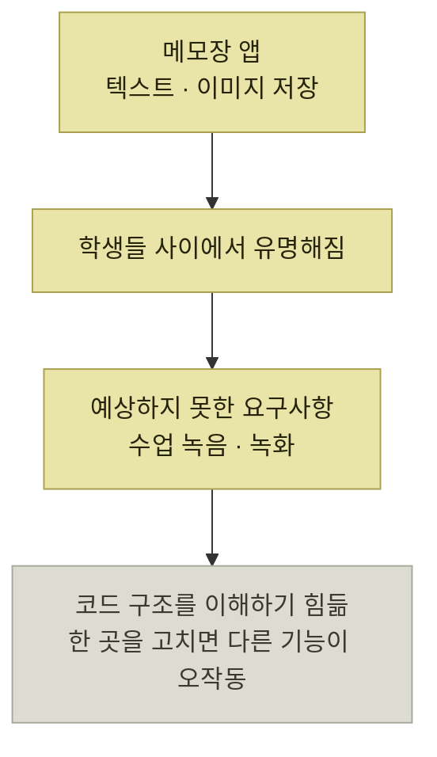
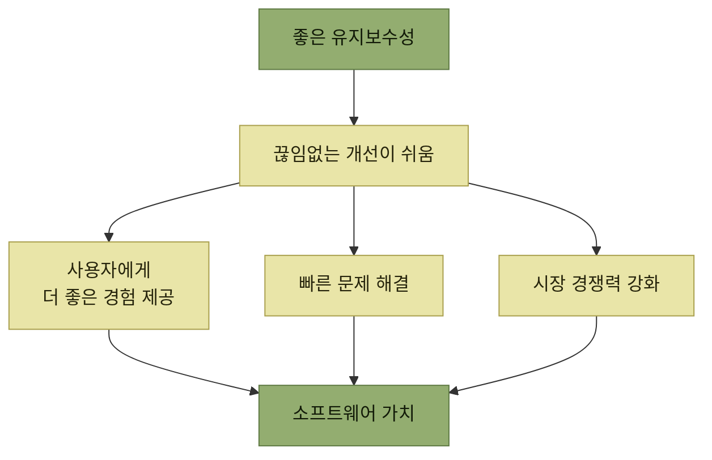

# 변화에 대응하는 소프트웨어

> [왜 좋은 코드를 작성해야 할까?](./README.md)

## 빠른 복습
- **개발자가 예상하지 못한 요구사항이 갑작스럽게 생기는 일은 비일비재**하다. 신규 기능, 기존 기능 개선, 법률·환경 변경 등 사유는 다양하다.
- **모든 요구사항을 미리 파악하는 것은 사실상 불가능**하고, **처음부터 많은 기능을 담으려 하면 개발 비용이 늘고 복잡해서 쓰기 어려운 서비스**가 된다.
- 그래서 목표는 **배포 이후에도 변경 요청을 반영할 수 있는 소프트웨어**를 만드는 것이다.
- **소프트웨어는 따라 하기 쉽다.** 모방이 일어난다는 사실을 전제로 **더 빠르게, 더 좋은 제품을 지속적으로** 만들어야 살아남는다.
- 그러나 **모든 소프트웨어를 언제나 간단히 변경할 수 있는 것은 아니다.** 그래서 **유지보수성이 좋은 소프트웨어**를 만들어야 한다. 문제가 생겼을 때 **원인을 찾는 데에도** 도움이 된다.
- **이 책은 유지보수성이 뛰어난 코드를 '좋은 코드'라 정의**한다.

## 메모장 앱에 녹음 기능을 붙이려 했더니

원서가 든 시나리오다.

- 어떤 개발자가 **스마트폰용 메모장 앱**을 만들었다. **텍스트와 이미지를 저장**할 수 있는 앱이었고, **학생들 사이에서 유명해졌다.**
- 그러자 **수업 자체를 녹음·녹화하고 싶다는 요구사항**이 생겼다.
- 개발자는 이를 반영하려 했지만 **코드 구조를 이해하기 힘들었고**, **한 부분을 수정하면 관련 없던 다른 기능이 오작동**했다.

*성공이 곧 변경 요청을 불러온다. 이 장의 문제는 여기서 시작한다*

**앱이 잘 됐기 때문에 요구사항이 생겼다**는 점을 눈여겨본다. **변경 요청은 실패의 신호가 아니라 성공의 신호**이며, 그래서 피할 수 있는 일이 아니다.

## 요구사항은 미리 다 알 수 없다

> **이런 시나리오처럼 개발자가 예상하지 못했던 요구사항들이 갑작스럽게 생기는 것은 비일비재**하다. **신규 기능 요청, 기존 기능 개선, 법률·환경 변경** 등 사유는 다양하다.

여기서 두 갈래의 함정이 있다.

| 접근 | 무엇이 문제인가 |
| --- | --- |
| **모든 요구사항을 미리 파악하려 한다** | **사실상 불가능**하다 |
| **처음부터 많은 기능을 담는다** | **개발 비용이 증가**하고, **복잡하고 사용하기 어려운 서비스**가 될 수 있다 |

표를 읽는 법. 두 줄이 모두 **"미리 다 해두자"는 시도**이며 둘 다 실패한다. 남는 결론은 하나다 — **배포 이후에도 변경 요청을 반영할 수 있는 소프트웨어를 만들어야 한다.**

이 판단은 [『아키텍트 첫걸음』 1.2 어질리티](../../아키텍트-첫걸음/1-아키텍트가-하는-일/2-어질리티-변화에-대한-적응-능력.md)가 말한 것과 같다. 그 책은 **"변화에 대한 적응 능력"** 을 아키텍처의 문제로 놓았고, 이 책은 같은 문제를 **코드의 문제**로 놓는다. 또 [같은 책 3.1](../../아키텍트-첫걸음/3-아키텍처-설계/1-아키텍처-설계의-주요-개념.md#아키텍처는-발전의-원칙까지-포함한다)이 42010의 정의에서 **"설계와 발전의 원칙"** 을 강조했던 것도 여기에 대응한다 — **지금의 모양만이 아니라 앞으로 어떻게 바꿀지까지가 설계**다.

## 모방을 전제로 한 경쟁

> **세상은 계속해서 변하고, 그 변화에 대응할 수 있는 기업이나 서비스만이 살아남는다.** 게다가 **소프트웨어는 따라 하기 쉽기에 모방이 일어난다는 사실을 전제로, 더 빠르게 더 좋은 제품을 지속적으로 만들어야 살아남는다.**

> **소프트웨어를 개발해서 배포하는 것 말고도, 지속적으로 제품을 개선하고 개선이 가능한 상태로 유지하는 것이 중요**하다.

**"개선이 가능한 상태로 유지"** 라는 표현이 이 절의 핵심이다. 개선을 하는 것과 **개선할 수 있는 상태를 유지하는 것**은 별개의 일이며, 뒤쪽이 이 책이 말하는 유지보수성이다.

## 그래서 좋은 코드란

> **모든 소프트웨어를 언제나 간단히 변경할 수 있는 것은 아니기 때문에 유지보수성이 좋은 소프트웨어를 만들어야 한다.** **문제 발생 시 원인을 찾는 데에도 도움이 된다.** 그렇게 **치열한 경쟁 속에서 살아남으며 미래 가치가 높은 소프트웨어**를 만들어야 한다.

*[그림 1-1] 유지보수성과 소프트웨어 가치 — 유지보수성이 세 갈래를 거쳐 소프트웨어 가치로 이어진다*

> **유지보수성이 좋다면 끊임없이 개선을 이어가며 사용자에게 더 좋은 경험을 제공할 수 있다.** 그 결과 **치열한 경쟁 속에서도 살아남을 수 있고, 이는 곧 소프트웨어의 미래 가치가 높다는 의미로 이어진다.**

> 이 책에서는 **유지보수성이 뛰어난 코드를 '좋은 코드'라 정의**하고 이를 작성하는 방법을 소개한다.

도식의 요점은 **유지보수성이 직접 가치가 되지 않는다**는 것이다. 가운데에 **"끊임없는 개선이 쉬움"** 이 놓여 있고, 그 개선을 거쳐서야 사용자 경험·문제 해결·경쟁력이 나온다. **유지보수성은 결과가 아니라 개선을 계속할 수 있게 하는 조건**이다.

## 함께 읽기
- [다음 절 — 그런데도 유지보수성이 자주 희생되는 이유](./2-유지보수성은-왜-희생되는가.md)
- [『아키텍트 첫걸음』 1.2 어질리티](../../아키텍트-첫걸음/1-아키텍트가-하는-일/2-어질리티-변화에-대한-적응-능력.md) · [3.1 아키텍처 설계의 주요 개념](../../아키텍트-첫걸음/3-아키텍처-설계/1-아키텍처-설계의-주요-개념.md) · [3.2 유지 가능성](../../아키텍트-첫걸음/3-아키텍처-설계/2-아키텍처-드라이버의-핵심-사항.md#유지-가능성--고치기-쉬운가)
