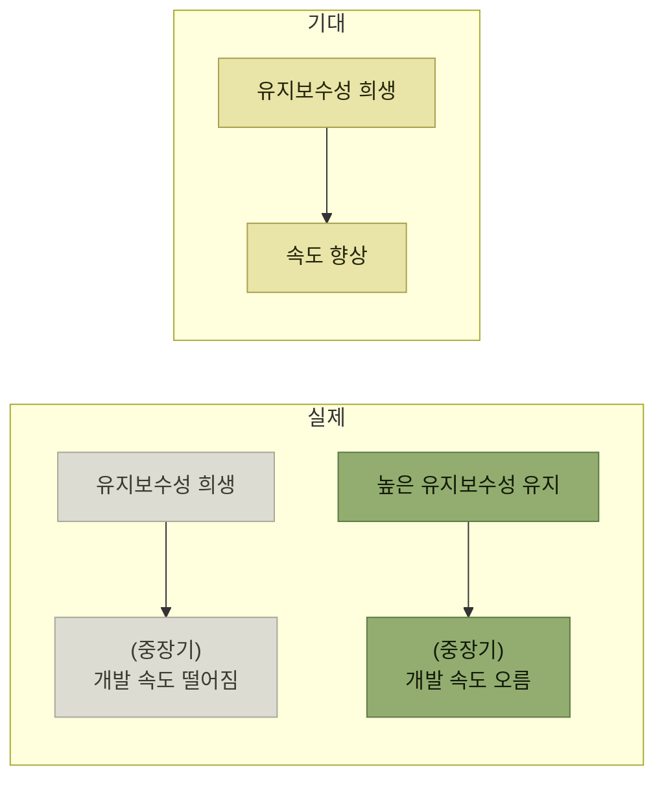

# 유지보수성은 왜 희생되는가

> [왜 좋은 코드를 작성해야 할까?](./README.md)

## 빠른 복습
- **균형을 고려하지 않고 기능을 계속 덧붙이면 유지보수성이 사라진다.** 마감에 쫓기면 **기능 구현 자체에만 집중**하게 되고 **'지금은 시간이 없으니 품질보다 속도 우선'** 이라는 태도를 갖게 된다.
- **유지보수성은 눈에 잘 보이지 않아서 우선순위가 낮아진다.** 그리고 **코드 내부 구조를 정확히 파악하는 사람은 개발자뿐이기에 유지보수성도 개발자만 느낀다.**
- **깨진 유리창 이론** — 깨진 유리창을 그대로 두면 그 지역 전체의 범죄가 늘어난다. **코드도 마찬가지다.**
- **'나중에 수정하면 되겠다'는 그 나중은 쉽게 오지 않는다.** 배포 후에도 요구사항을 반영해야 하고 경쟁 서비스에 뒤처지지 않으려면 계속 개발해야 하기 때문이다.
- **품질과 속도는 흔히 상충 관계라고 말하지만 유지보수성은 이에 해당하지 않는다.** **품질을 올리면 장기적으로 개발 속도도 오른다.**
- 개발자는 유혹을 떨치고 **유지보수성을 포기하지 말아야 한다.** **처음부터 다시 만드는 선택지도 값비싼 비용을 치른다.**

## 마감이 만드는 태도

> 개발을 할 때 **균형을 고려하지 않은 채 기능을 계속 덧붙이는 것**은 유지보수성이 사라지게 만든다. **마감에 쫓기다 보면 기능 구현 자체에만 집중하게 되고 '지금은 시간이 없으니 품질보단 속도 우선'이라는 태도를 갖게 된다.**

여기에 두 가지 조건이 겹친다.

- **유지보수성은 눈에 잘 보이지 않기도 해서 우선순위가 낮아진다.**
- **코드 내부 구조를 정확히 파악하는 사람은 개발자뿐이기에 유지보수성도 개발자만 느끼게 된다.**

**아무도 요구하지 않는 품질**이라는 점이 문제의 구조다. 기능은 사용자가 요구하고 일정은 관리자가 요구하지만, **유지보수성은 개발자만 알고 개발자만 요구할 수 있다.** [『아키텍트 첫걸음』 3.2 유지 가능성](../../아키텍트-첫걸음/3-아키텍처-설계/2-아키텍처-드라이버의-핵심-사항.md#유지-가능성--고치기-쉬운가)이 이를 **"사용자에게 드러나지 않는 내부 품질"** 로 분류했던 것과 같은 이야기다. 드러나지 않으니 **드라이버로 명시해두지 않으면 사라진다.**

## 깨진 유리창

> **깨진 유리창 이론** — **건물의 깨진 유리창을 그대로 두면 결국 그 지역 전체의 범죄가 늘어난다.** **코드도 마찬가지다.**

> **'나중'에 수정하면 되겠다고 생각하지만 그 '나중'은 쉽게 오지 않는다.** 배포하고 나서도 **사용자의 요구 사항을 반영해야 하고**, 이미 있거나 앞으로 생길 **경쟁 서비스에 뒤처지지 않으려면 배포 이후에도 개발해야 하기 때문**이다.

**나중이 오지 않는 이유가 게으름이 아니라는 점**이 중요하다. [앞 절에서 본 "배포 이후에도 계속 개발해야 한다"](./1-변화에-대응하는-소프트웨어.md)는 사실이, 바로 **"나중에 정리할 시간이 생기지 않는" 이유**가 된다. 같은 전제가 여기서는 반대 방향으로 작용한다.

## 품질과 속도는 상충하지 않는다

> **유지보수성을 높게 꾸준히 유지한다면 코드 수정 속도는 오히려 빨라진다.**

*[그림 1-2] 유지보수성과 속도의 관계 — '기대'와 '실제'를 나란히 놓은 것이다. 실제에서는 희생한 쪽이 중장기에 더 느려진다*

> **흔히 품질과 속도는 상충 관계라고 말하지만, 유지보수성은 이에 해당하지 않으며 오히려 품질을 올리면 장기적으로 개발 속도도 오른다.**

이 도식에서 눈여겨볼 것은 **"(중장기)" 라는 괄호**다. 기대 쪽에는 시간 조건이 없고 실제 쪽에만 붙어 있다. **유지보수성을 희생한 대가가 즉시 나타나지 않는다는 것**이 이 문제가 반복되는 이유다. 그래서 원서도 **"당연해 보이지만 이를 이해하고 실제로 실천하기란 그리 쉽지 않다"** 고 덧붙인다.

## 다시 만드는 것도 비용이다

> 개발자는 유혹을 떨치고 **유지보수성을 포기하지 말아야 한다.** **처음부터 다시 만드는 선택지도 값비싼 비용을 치른다.**

**"다시 만들면 되지"** 가 마지막 도피처가 되기 쉬운데, 그것도 대가가 있다는 못박음이다. [『아키텍트 첫걸음』이 다룬 거대한 진흙 덩어리(big ball of mud) 패턴](../../아키텍트-첫걸음/1-아키텍트가-하는-일/3-아키텍처의-중요성.md#나누는-순간-관계가-생긴다)이 바로 그 상태이며, 그 책도 **"심각한 기술 부채가 발생한다"** 고 표현했다.

## 함께 읽기
- [다음 절 — 희생의 결과에 붙은 이름](./3-기술-부채.md)
- [『아키텍트 첫걸음』 2.3 설계 원칙과 실천 방법](../../아키텍트-첫걸음/2-소프트웨어-설계/3-소프트웨어-설계-원칙과-실천-방법.md) · [3.2 유지 가능성](../../아키텍트-첫걸음/3-아키텍처-설계/2-아키텍처-드라이버의-핵심-사항.md#유지-가능성--고치기-쉬운가) (내부 품질)
