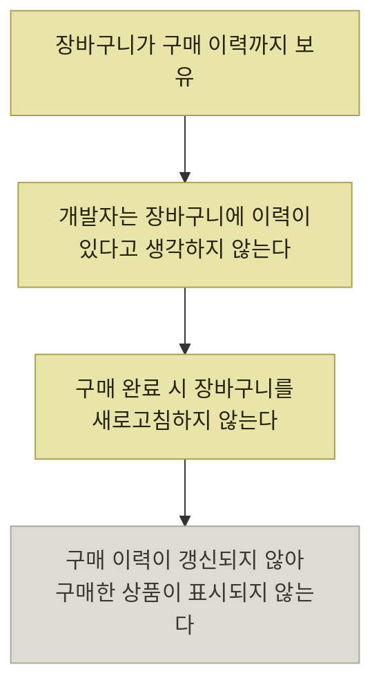

# 코드로 도메인 지식 표현하기

> [움직이는 코드에서 뜻을 전하는 코드로](./README.md)

## 빠른 복습
- **도메인**은 특정 문제 영역이나 업계·분야, **도메인 지식**은 그 영역 특유의 전문 지식이다.
- **도메인 지식을 올바르게 이해하고 필요한 요소를 잘 골라 코드로 표현하면 가독성과 유지보수성이 높아진다.**
- **현실과 괴리된 코드를 작성하지 않도록 주의**해야 한다. **이해한 내용을 코드에 반영하려고 노력**해야 한다.
- 도메인 지식을 바탕으로 설계하는 접근법이 **도메인 주도 설계(DDD)** 다.
- 대화에서 자연스럽게 떠오르는 말이 **유비쿼터스 언어**이며, 그것이 곧 코드의 이름이 된다.
- 도메인 객체는 **엔티티 · 값 객체 · 집계 · 도메인 서비스**로 나뉜다.
- **도메인에 관한 로직은 도메인 객체 안에 작성하는 게 좋다.** 그러면 **코드 중복이 사라진다.**
- **고차 함수**를 쓰면 **선언적** 방식으로 리스트를 다룰 수 있다. 선언적이란 **'어떻게 계산하는가'가 아니라 '무엇을 계산하는가'** 에 초점을 둔 방식이다.
- **프로그래밍 대상에 충실해야 한다.** 장바구니 안에 구매 이력을 두면 **버그와 혼란**을 부른다.

## 도메인과 도메인 지식

| 용어 | 무엇인가 |
| --- | --- |
| **도메인** | 특정 문제 영역이나 업계 또는 분야 |
| **도메인 지식** | 그 영역 특유의 전문 지식 |

> **도메인 지식을 올바르게 이해하고 그중에서 필요한 요소를 잘 골라 코드로 표현하면 코드의 가독성, 유지보수성을 높일 수 있다.** **현실과 괴리된 코드를 작성하지 않도록 주의**해야 하며, **이해한 내용을 코드에 반영하려고 노력**해야 한다. 도메인 지식을 바탕으로 설계하는 접근법을 **도메인 주도 설계(DDD, Domain-Driven Design)** 라 한다.

## 유비쿼터스 언어를 찾는다

쇼핑몰 사이트에서 **상품을 장바구니에 추가**하는 기능을 생각한다.

- 사용자는 상품을 장바구니에 추가할 수 있다
- 장바구니에는 여러 개의 상품을 담을 수 있다
- 장바구니에 상품을 추가할 때 개수도 지정할 수 있다

> 이 과정에서 자연스럽게 떠오르는 **'유비쿼터스 언어'** 는 **'사용자, 상품, 장바구니, 개수'** 다.

**대화에 나온 말이 그대로 코드의 이름이 된다**는 것이 이 절의 방법이다. [앞 절에서 "주요 용어를 미리 정해두라"](./2-이름-짓기.md#같은-것에는-같은-이름을)고 했던 그 용어집이 곧 유비쿼터스 언어다. [『아키텍트 첫걸음』 5.2의 BDD](../../아키텍트-첫걸음/5-품질-보증과-테스트/2-기능-테스트-자동화.md#행동-주도-개발bdd)도 같은 단어를 쓴다 — 그쪽은 **도메인 전문가·개발자·QA가 대화로 요구 조건을 만들 때** 유비쿼터스 언어로 통일한다고 했다.

## 도메인 객체의 네 가지 종류

| 종류 | 무엇인가 |
| --- | --- |
| **엔티티**(Entity) | **고유 식별자로 구별할 수 있는** 객체 |
| **값 객체**(Value Object) | **고유 식별자가 없으며 그 속성만으로 값을 표현**하는 객체 |
| **집계**(Aggregate) | 여러 엔티티나 값 객체를 **하나로 묶은 그룹**. **루트 엔티티**가 있으며 **데이터 무결성을 유지**하고자 사용한다 |
| **도메인 서비스**(Domain Service) | **엔티티나 값 객체로는 표현할 수 없는 로직**을 표현하는 데 사용하는 전용 도메인 객체 |

> **도메인 객체**는 **비즈니스에서 중요한 개념을 객체로 표현한 것**을 뜻한다.

```kotlin
class Product(val id: String, val name: String, val price: Int) {
    override fun equals(other: Any?): Boolean =
        this === other || (other is Product && id == other.id)

    override fun hashCode(): Int = id.hashCode()
}
class ShoppingCart(val productQuantities: Map<Product, Int>)
```

표를 읽는 법. **엔티티와 값 객체를 가르는 것은 식별자의 유무**다. `Product` 는 `id` 가 있으니 엔티티이고, 같은 이름·가격이어도 id가 다르면 다른 상품이다. 반대로 같은 id라면 이름·가격이 달라도 같은 엔티티로 취급하도록 `equals`와 `hashCode`를 id 기준으로 구현한다.

## 동작도 도메인 객체 안에

```kotlin
class ShoppingCart(val productQuantities: Map<Product, Int>) {
    fun withAddedProduct(product: Product, quantity: Int): ShoppingCart {
        val mutableMap = productQuantities.toMutableMap()
        val currentQuantity = mutableMap[product] ?: 0
        mutableMap[product] = currentQuantity + quantity
        return ShoppingCart(mutableMap.toMap())
    }
}
```

> **새로운 객체를 반환하는 걸 강조하고자 `with` 를 사용**한다.

```kotlin
val banana = Product("001", "banana", 100)
val apple = Product("002", "apple", 120)

val shoppingCart = ShoppingCart(emptyMap())
    .withAddedProduct(banana, 1)
    .withAddedProduct(apple, 3)
```

> 이때 **`Map` 을 직접 수정하면 무슨 동작인지 한눈에 이해하기도 어렵고, 이미 추가한 상품을 무시하고 개수를 덮어쓰기도 쉽다.** **프로그래밍 대상을 잘 이해하고 이를 코드로 올바르게 구현하면 개발자가 느낄 혼란을 크게 줄일 수 있다.**

**"개수를 덮어쓰기 쉽다"** 가 이 메서드의 존재 이유다. `map[product] = quantity` 라고 쓰면 **이미 담긴 개수가 사라진다.** `withAddedProduct` 는 **`currentQuantity + quantity`** 로 **"추가한다"는 도메인의 뜻**을 코드에 못박는다.

## 로직을 도메인 객체로 옮기면 중복이 사라진다

합계 금액 계산을 화면 쪽에서 하면 이렇게 된다.

```kotlin
fun showConfirmDialog() {
    val shoppingCart: ShoppingCart = ...
    val totalPrice = shoppingCart.productQuantities.entries
        .sumOf { (product, quantity) -> product.price * quantity }
    /* 대화 상자 표시 */
}
```

이 계산이 필요한 화면이 늘어나면 **같은 식이 여기저기 복사**된다. 그래서 **도메인에 관한 로직은 도메인 객체 안에 작성하는 게 좋다.**

```kotlin
class ShoppingCart(val productQuantities: Map<Product, Int>) {
    fun getTotalPrice(): Int {
        return productQuantities.entries
            .sumOf { (product, quantity) -> product.price * quantity }
    }
    /* ... */
}
```

이 이동이 [『아키텍트 첫걸음』 2.4의 도메인 모델 패턴](../../아키텍트-첫걸음/2-소프트웨어-설계/4-설계-패턴.md#아키텍처-패턴--방침을-코드의-구조로-옮긴다)이 말한 **"동작과 데이터를 통합한 객체 모델"** 그 자체다. 그 책은 이 패턴의 장점을 **"로직 중복을 방지하고 복잡한 비즈니스 규칙도 표현하기 쉽다"** 고 적었는데, 위의 before/after가 정확히 그 장면이다.

## 선언적으로 쓴다

> **고차 함수(인수로 함수를 받는 함수)를 사용하면 선언적 방식으로 리스트를 다룰 수 있어 코드가 간결해진다.** **선언적이란 '어떻게 계산하는가'가 아니라 '무엇을 계산하는가'에 초점을 둔 방식**이다. `sumOf` 가 그 예다.

**'어떻게'가 아니라 '무엇'** 이라는 이 구분은 [『아키텍트 첫걸음』 4.2가 기능 명세서에 요구한 What ↔ How](../../아키텍트-첫걸음/4-아키텍처-구현/2-개발-프로세스-표준화.md#기능-명세서)와 같은 축이다. 문서에서든 코드에서든 **읽는 사람이 먼저 알아야 하는 것은 What**이다.

## 프로그래밍 대상에 충실하기

> **장바구니 안에 구매 이력 정보가 있으리라고는 보통 생각하지 않는다.** 그래서 **구매 완료 시에 장바구니를 새로고침하지 않는다.** 그 결과 **구매 이력이 갱신되지 않아 구매한 상품이 표시되지 않는 버그**가 생길 수도 있다. **장바구니 안의 구매 이력이 무엇을 뜻하는지조차 애매해서 이해하기 어렵다.**

```kotlin
// 장바구니가 구매 이력까지 들고 있다 — 현실과 어긋난다
class ShoppingCart(val items: List<ShoppingCartItem>, val purchaseHistory: List<Product>) { ... }
```

> 그래서 **구매 이력은 장바구니 정보와는 구분해서 관리해야 한다.**



*현실과 어긋난 구조가 버그로 이어지는 경로. 코드는 동작했지만 아무도 그렇게 동작할 줄 몰랐다*

**버그의 원인이 문법이나 계산 실수가 아니라 "구조가 현실과 다르다"는 점**이 이 절의 결론이다. [1장에서 "도메인 지식을 무시하고 동작에만 맞춘 코드는 나중에 수정하기 어렵다"](../01-왜-좋은-코드를-작성해야-할까/3-기술-부채.md#의도적인-부채)고 했던 그 부채가 여기서 실제 버그로 나타난다.

## 핵심 정리

- 코드는 **사람이 읽기 위해** 쓴다. 짧은 것이 아니라 **이해하기 쉬운 것**이 좋은 코드다.
- 이름은 **뜻을 담고**, **한정되지 않은 단어를 피하고**, **문맥·자료형으로 알 수 있는 것은 덜어낸다.** 이름이 안 지어지면 **설계를 의심**한다.
- 주석은 **코드로 전할 수 없는 것**(왜 이렇게 했는가 · 반환값 · 오류 · null의 뜻 · 제약 · 예시)에 쓴다. **없어도 되는 주석은 유지보수 비용**이다.
- 도메인 지식은 **유비쿼터스 언어 → 도메인 객체 → 객체 안의 로직** 순으로 코드에 들어간다.
- **구조가 현실과 어긋나면 버그가 된다.** 장바구니에 구매 이력을 두지 않는다.

## 함께 읽기
- [이 장의 목차](./README.md)
- [『아키텍트 첫걸음』 2.4 설계 패턴](../../아키텍트-첫걸음/2-소프트웨어-설계/4-설계-패턴.md) (도메인 모델 ↔ 트랜잭션 스크립트)
- [같은 책 3.3](../../아키텍트-첫걸음/3-아키텍처-설계/3-시스템-아키텍처-선정.md#논리적으로-먼저-물리적으로-나중에) — DDD의 **경계 지어진 컨텍스트**로 서비스를 나누는 이야기
