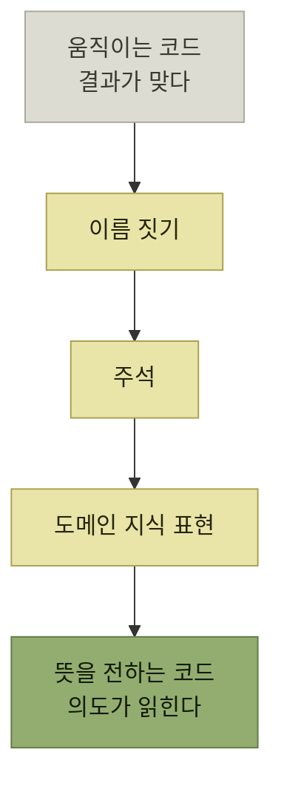

# 움직이는 코드에서 뜻을 전하는 코드로

> [내 코드가 불안한 개발자를 위한 좋은 코드의 기준](../README.md)

## 이 장이 다루는 것

**코드는 결국 사람이 읽기 위해 작성하는 것이다.** 동작하는 코드를 만드는 일과 **뜻이 전해지는 코드**를 만드는 일은 다르며, 이 장은 후자를 위한 세 가지 도구를 다룬다.

*세 도구를 거쳐야 동작하는 코드가 읽히는 코드가 된다*

## 목차

- [코드는 사람이 읽기 위해 쓴다](./1-코드는-사람이-읽기-위해-쓴다.md)
- [이름 짓기](./2-이름-짓기.md)
- [주석](./3-주석.md)
- [코드로 도메인 지식 표현하기](./4-코드로-도메인-지식-표현하기.md)

## 함께 읽기

- [1장](../01-왜-좋은-코드를-작성해야-할까/README.md)이 **왜** 좋은 코드를 써야 하는지를 말했다면, 2장은 **무엇이 좋은 코드인지**의 첫 답을 준다.
- [『아키텍트 첫걸음』 4.5 명명 규약](../../아키텍트-첫걸음/4-아키텍처-구현/5-애플리케이션-개발-준비.md#명명-규약)은 이름 짓기를 **팀 규약**의 관점에서 다룬다. 이 장이 개인의 판단이라면 그쪽은 조직의 합의다.
