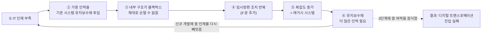

# 오늘날의 소프트웨어 개발 환경

> [아키텍트가 하는 일](./README.md)

## 빠른 복습

- 소프트웨어가 사업의 지원 도구가 아니라 **사업 그 자체**가 되었다. 유니콘 상위권은 대부분 소프트웨어로 시장을 만든 기업이다.
- DX는 **디지타이제이션 → 디지털라이제이션 → 디지털 트랜스포메이션** 3단계다. 많은 기업은 앞의 두 단계에서 멈춘다.
- 멈추는 이유는 IT 인재 부족이고, 그 인재의 다수가 **레거시 시스템 유지보수**에 묶여 있다.
- 그래서 IT 전략을 **SoE / SoR / 시민 개발**로 나눠 인력 배치를 다시 정한다.
- SoE와 SoR은 시스템의 역할을 구분하는 축이다. 자체 개발과 Fit to Standard의 선택은 업무의 차별화 가치와 표준화 가능성을 기준으로 별도 판단한다.

## 소프트웨어가 사업의 본체가 되었다

사티아 나델라(마이크로소프트 CEO)의 두 발언은 이 변화의 속도를 보여준다.

> 2015년 — "모든 비즈니스는 소프트웨어 비즈니스가 되어가고 있다"
> 2019년 — "이제 모든 기업이 소프트웨어 기업이다"

4년 사이에 "되어가고 있다"가 "이미 그렇다"로 바뀌었다. 소프트웨어로 혁신적인 서비스나 제품을 만들어 내거나 사업 혁신에 성공한 기업이 시장에서 경쟁우위를 점하며 주도권을 확보하는 흐름이 뚜렷하다.

### 평가액 상위 10개 유니콘 기업 (2023년 10월 기준)

| 순위 | 기업 | 평가액 | 국가 | 업종 |
| ---: | --- | ---: | --- | --- |
| 1 | ByteDance | $225B | 중국 | 미디어, 엔터테인먼트 |
| 2 | SpaceX | $150B | 미국 | 우주산업 |
| 3 | SHEIN | $66B | 싱가포르 | 소비재, 소매 |
| 4 | Stripe | $50B | 미국 | 금융 서비스 |
| 5 | Databricks | $43B | 미국 | 엔터프라이즈 테크 |
| 6 | Revolut | $33B | 영국 | 금융 서비스 |
| 7 | Epic Games | $31.5B | 미국 | 미디어, 엔터테인먼트 |
| 8 | Fanatics | $31B | 미국 | 소비재, 소매 |
| 9 | OpenAI | $29B | 미국 | 엔터프라이즈 테크 |
| 10 | Canva | $25.4B | 호주 | 엔터프라이즈 테크 |

*원서 [표 1-1] 평가액 상위 10개 유니콘 기업 — 출처: The Complete List Of Unicorn Companies. 평가액 단위는 10억 달러*

업종은 우주산업부터 소매·금융까지 흩어져 있지만, 목록의 어느 기업도 "소프트웨어 회사"라는 설명을 빼고는 소개할 수 없다. 소매업(SHEIN)도 금융업(Stripe, Revolut)도 경쟁력의 실체는 소프트웨어다.

## DX는 3단계이고, 대부분 2단계에서 멈춘다

스타트업만의 이야기가 아니다. 기존 기업들도 경쟁에서 살아남기 위해 IT 전략을 재검토해야 하는 상황에 놓였고, 그 흐름에서 나온 것이 **디지털 전환(digital transformation, DX)** 이다. 일본 경제산업성의 DX 리포트는 이를 세 단계로 구분한다.

| 단계 | 무엇을 디지털화하는가 | 목적 |
| --- | --- | --- |
| 디지타이제이션 | 아날로그·물리적 **데이터** | 데이터를 다룰 수 있게 만든다 |
| 디지털라이제이션 | 개별 **업무와 제조 프로세스** | 그 업무를 효율화한다 |
| 디지털 트랜스포메이션 | 조직 간 협업과 **전반적인 업무·제조 프로세스** | 고객 중심의 가치 창출로 **사업과 비즈니스 모델을 혁신**한다 |

*원서 [표 1-2] DX 리포트의 3단계 — 앞의 두 단계는 기반이고, 세 번째 단계만이 사업 모델을 바꾼다*

앞의 두 단계는 **기반을 다지는 과정**이다. 문제는 많은 기업이 그 기반에서 그치고 디지털 트랜스포메이션으로 나아가지 못한다는 점이다.

### 걸림돌은 인재 부족, 그리고 레거시

걸림돌 중 하나는 IT 인재가 부족하다는 것이다. 그래서 많은 기업이 외부 서비스와 솔루션 제공업체에 의존한다. 양적·질적으로 부족한 인재는 대부분 **기존 시스템의 유지보수**에 투입된다.

오랜 기간 가동된 시스템은 내부 구조가 블랙박스처럼 되어버린다. 구조를 알 수 없으면 제대로 손대지 못하고 임시방편 조치(`if` 문 추가 같은 것)만 반복하게 된다. 그러면 시스템은 점점 더 복잡해지고 관리가 어려운 상태, 즉 **레거시 시스템**이 된다. 그리고 그 시스템을 돌보는 데 인재가 다시 묶인다.

*인재 부족과 레거시는 서로를 강화한다. 유지보수가 인력을 계속 흡수하므로 3단계로 넘어갈 여력이 생기지 않는다*

## IT 전략을 다시 나눈다: SoE와 SoR

이 상황을 극복하려면 "어디에 사람을 쓸 것인가"를 다시 정해야 한다. 시스템을 성격에 따라 두 갈래로 나누는 것이 출발점이다.

| 구분 | SoE (System of Engagement) | SoR (System of Record) |
| --- | --- | --- |
| 무엇인가 | 고객과 만나는 접점의 시스템 | 기록을 다루는 기간계 시스템 |
| 성패 기준 | 얼마나 훌륭한 **고객 경험**을 주는가 | 얼마나 정확하고 안정적으로 기록하는가 |
| 변화의 초점 | 상호작용과 경험을 빠르게 개선한다 | 기록의 무결성·일관성·이력을 지킨다 |
| 개발 방식 | SoE라는 이유만으로 정해지지 않는다 | SoR이라는 이유만으로 정해지지 않는다 |

*SoE와 SoR은 시스템의 역할을 설명한다. 무엇을 자체 개발할지는 아래의 독립된 판단 축으로 결정한다*

| 업무의 성격 | 적합한 접근 |
| --- | --- |
| 경쟁 우위를 만드는 핵심·차별화 업무 | 핵심 인재를 투입해 가설을 검증하고 개별 개발한다 |
| 범용적이고 표준화 가능한 지원 업무 | ERP·SaaS의 표준 기능을 우선 검토하고 **Fit to Standard**를 적용한다 |

### SoE — 핵심 인재를 여기에

고객 접점 시스템은 고객 경험의 수준이 고객층 확대와 리텐션에 직접 영향을 미치고, 프로덕트와 서비스의 성공 여부를 가른다. 자사 비즈니스에 경쟁 우위를 가져다줄 수 있는 영역이므로 핵심 인재를 투입해야 한다.

다만 무엇이 정답인지 초기 단계에서는 알 수 없는 경우가 많다. 그래서 **가설 검증형 접근법과 애자일 개발 방식**으로 시행착오를 거치며 점진적으로 개선한다.

### SoR과 Fit to Standard는 다른 축이다

SoR에 포함되는 범용 업무에서는 ERP와 SaaS의 활용이 더욱 확대될 것이다. 그러나 **SoR이라는 이유만으로 Fit to Standard가 정답이 되는 것은 아니다.** 먼저 그 업무가 경쟁 우위를 만드는지, 업계 표준으로 처리해도 되는지를 따로 판단해야 한다. 문제는 표준화 가능한 업무에서도 ERP를 자사 방식에 맞춰 과도하게 커스터마이징하는 경우다. 별도의 애드온 개발이 따라붙고, 개발과 유지보수에 상당한 인력과 비용이 추가된다.

그래서 DX 시대에는 방향을 뒤집는다. **ERP의 표준 기능을 그대로 활용하고, 자사 업무 프로세스를 업계 표준에 맞추는 Fit to Standard** 의 사고방식이 요구된다. SaaS도 정산 같은 다양한 업무에 뛰어난 UI/UX를 결합해 업무 효율과 **EX(employee experience)** 향상에 기여한다.

> [!IMPORTANT]
> **SoR 안에도 경쟁력의 원천이 있다**
>
> "SoR = 표준에 맞춘다"는 등식은 성립하지 않는다. SoR 영역에도 자사의 핵심 경쟁력을 강화하는 업무 활동이 있다.
> 물류 회사라면 **경쟁사보다 더 효율적이고 빠르게 상품을 배송하도록 설계된 운영 시스템**이 그 예다. 이런 핵심 활동은 개별 시스템으로 개발해 ERP와 연동하는 것이 현명한 결정이다.

### 시민 개발 — 현장이 직접 만든다

IT 인재 부족 때문에 비개발자 인원이 주축이 되는 **시민 개발**이 주목받고 있다. RPA(robotic process automation)와 Power Platform의 발전이 이 흐름을 주도한다.

신입 인재들은 비개발자라도 높은 수준의 IT 리터러시를 갖추고 있다. 덕분에 디지타이제이션과 디지털라이제이션을 현장에서 주도적으로 추진할 수 있게 되었고, 이것이 시민 개발의 중요한 역할이다. 디지털 트랜스포메이션을 실현하는 하나의 동력이 될 수 있다.

앞의 두 단계를 현장이 맡으면, 확보된 IT 인재를 SoE와 SoR의 핵심 영역에 돌릴 수 있다. 세 갈래는 경쟁하는 선택지가 아니라 **인력을 배분하는 하나의 그림**이다.

## 핵심 정리

- 모든 기업이 소프트웨어 기업이 되었다. 유니콘 상위권은 업종을 불문하고 소프트웨어가 경쟁력의 실체다.
- DX의 3단계 중 사업을 바꾸는 것은 마지막 **디지털 트랜스포메이션**이지만, 대부분 앞의 두 단계에서 멈춘다.
- 멈추는 원인은 IT 인재 부족과, 인재를 계속 흡수하는 **레거시 시스템의 악순환**이다.
- SoE와 SoR은 고객 접점과 기록 관리라는 시스템 역할의 구분이며, 개발 방식까지 자동으로 결정하지 않는다.
- 경쟁 우위를 만드는 업무에는 핵심 인재와 개별 개발을, 범용적이고 표준화 가능한 업무에는 Fit to Standard를 적용한다. 이 판단은 SoE/SoR 구분과 독립적이다.
