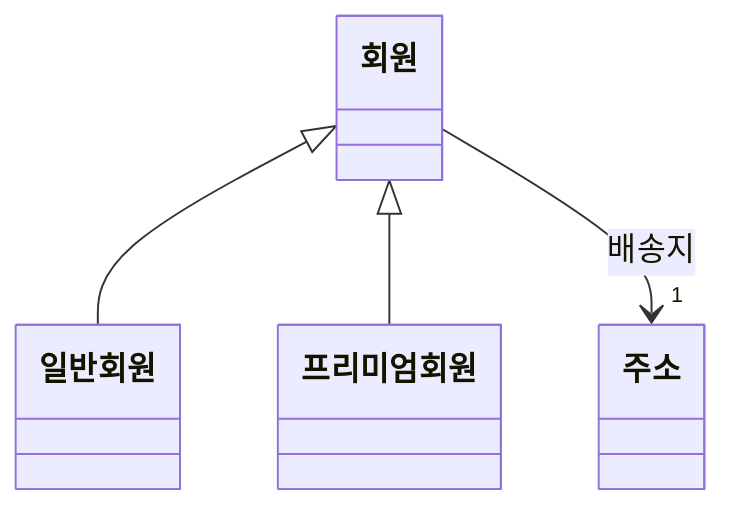
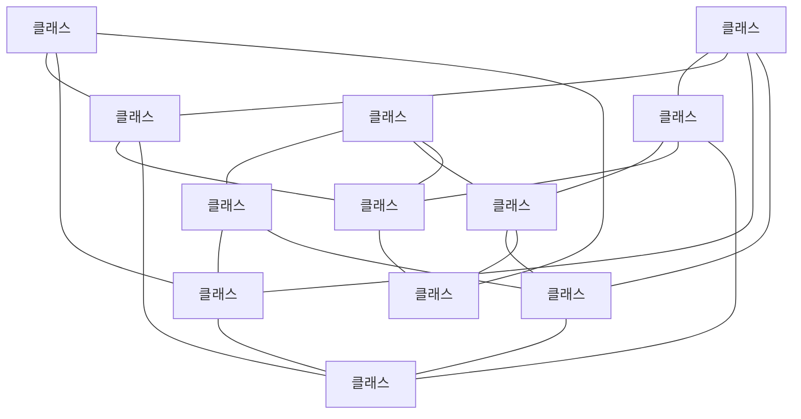
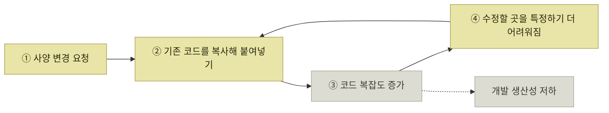
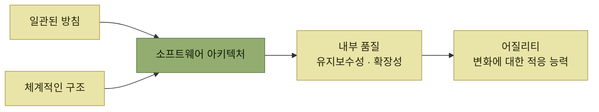

# 아키텍처의 중요성

> [아키텍트가 하는 일](./README.md)

## 빠른 복습

- 실용적인 소프트웨어는 복잡한 구조물이다. **규모가 커질수록 복잡도는 더욱 증가**한다.
- 모든 처리를 하나의 프로그램에 기술하는 것은 불가능하므로 **여러 구성 요소로 나눈다.** 객체지향에서는 대개 클래스가 그 단위다.
- 나누면 구성 요소들 사이에 **관계**가 생긴다. 아무 고려 없이 나누면 **거대한 진흙 덩어리(Big Ball of Mud)** 라는 안티패턴에 빠진다.
- 그 상태에서는 **수정할 곳을 못 찾고, 같은 수정을 여러 군데 반복하고, 고친 것이 엉뚱한 기능을 망가뜨린다.**
- 좋은 코드를 **개발자 역량에만 맡기는 것은 한계**가 있다. 누가 작성하든 일관되게 좋은 코드가 유지될 때 비로소 진정한 어질리티다.
- 그것을 가능하게 하는 **일관된 방침과 체계적인 구조**가 소프트웨어 아키텍처다.

## 나누지 않고서는 만들 수 없다

실용적인 소프트웨어는 복잡한 구조물이다. 그래서 규모가 커질수록 복잡도가 더욱 증가한다. 모든 처리를 하나의 프로그램에 기술하는 것은 불가능하므로, 소프트웨어는 여러 **구성 요소**로 나뉜다. 객체지향 언어라면 대개 **클래스**가 그 단위다.

*[그림 1.2] UML 클래스 다이어그램 — 회원을 일반·프리미엄으로 나누고, 주소를 별도 구성 요소로 떼어낸 모습*

여기서 짚을 것은 분할이 **선택이 아니라는 점**이다. 규모가 분할을 강제한다. 그러므로 문제는 "나눌 것인가"가 아니라 **"어떻게 나눌 것인가"** 다.

## 나누는 순간 관계가 생긴다

구성 요소가 많아질수록 그 사이의 **의존 관계 역시 늘어난다.** 위 그림에서도 회원은 이미 주소를 알아야 하고, 일반 회원과 프리미엄 회원은 회원을 알아야 한다.

만약 아무런 고려 없이 구성 요소를 분할하면 관계가 복잡하게 얽혀, **'거대한 진흙 덩어리Big Ball of Mud'** 로 불리는 **안티패턴anti-pattern** 에 빠질 수 있다. 이는 흔히 **스파게티 코드spaghetti code** 라고 불리는 상태와도 유사하다.

*[그림 1.3] 거대한 진흙 덩어리 패턴 — 구성 요소 하나하나는 멀쩡한데, 관계가 무질서해서 전체를 파악할 수 없다*

주목할 것은 이 그림에 **잘못 만든 클래스가 하나도 없다**는 점이다. 망가진 것은 구성 요소가 아니라 **구성 요소 사이의 관계**다. 그래서 클래스를 하나씩 잘 만드는 것만으로는 이 상태를 벗어날 수 없다.

### 사양 변경이 들어올 때 대가를 치른다

이런 상황에서 사양 변경에 대응하려 할 경우 다음과 같은 문제가 발생한다.

| 겪는 일 | 왜 그런가 |
| --- | --- |
| 어떤 프로그램을 수정해야 할지 **특정하기 어렵다** | 하나의 관심사가 어디에 흩어져 있는지 구조가 알려주지 않는다 |
| 같은 수정을 **여러 군데에서 반복**해야 한다 | 같은 역할이 여러 구성 요소에 중복돼 있다 |
| 수정한 내용이 **다른 기능에 예기치 않은 영향**을 준다 | 의존 관계가 얽혀 있어 변경의 파급 범위를 예측할 수 없다 |

표를 읽는 법. 세 가지는 별개의 증상이 아니라 **하나의 원인이 서로 다른 시점에 드러난 것**이다. 원인은 모두 오른쪽 열, 즉 관계의 무질서다. 첫 번째는 수정을 시작할 때, 두 번째는 수정하는 동안, 세 번째는 배포한 뒤에 나타난다.

## 그리고 악순환이 시작된다

여기서 흔히 나오는 선택이 있다. 성능 저하를 피하려고 **기존 코드를 단순히 복사해 붙여 넣는 것**이다. 당장은 안전해 보이지만, 이는 코드의 복잡도를 키우는 또 다른 원인이 되어 악순환을 키운다.

*복붙은 문제를 해결하지 않고 다음 사양 변경으로 미룬다 — 회차마다 고리가 한 바퀴 더 돈다*

이 고리가 [기술 부채로 인한 생산성 저하](./2-어질리티-변화에-대한-적응-능력.md#어질리티는-왜-떨어지는가)의 실제 내용이다. 앞 절이 "출시 회차가 늘수록 생산성이 급격히 떨어진다"고 현상을 보여줬다면, 이 절은 **그 안에서 무슨 일이 벌어지는지**를 보여준다.

## 좋은 코드를 사람에게만 맡길 수는 없다

경험이 풍부한 개발자라면 의존 관계가 복잡하게 얽힌 나쁜 코드 상태를 피하고 좋은 코드를 작성할 수 있다. 하지만 **개발자 역량에 의존하는 것은 한계가 있다.** 프로덕트는 한 사람이 만들지 않고, 만든 사람이 끝까지 지키지도 않는다.

> 누가 작성하든 일관되게 좋은 코드가 유지될 때, 비로소 소프트웨어가 진정한 어질리티를 갖추었다고 할 수 있다.

이 문장이 아키텍트라는 역할이 필요한 이유이기도 하다. 뛰어난 한 사람이 좋은 코드를 쓰는 것은 **개인의 성취**지만, 팀 누구가 써도 좋은 코드가 나오는 것은 **구조의 성취**다.

## 그래서 아키텍처다

변화에 쉽게 대응할 수 있도록 코드의 **유지보수성과 확장성**을 높여, 소프트웨어의 **내부 품질**을 향상시키는 것이 중요하다. 이를 가능하게 하는 핵심이 바로 **일관된 방침과 체계적인 구조**이며, 이것이 곧 **소프트웨어 아키텍처**다.

*아키텍처가 겨냥하는 것은 기능이 아니라 내부 품질이고, 그 내부 품질이 어질리티를 떠받친다*

내부 품질이라는 말에 주의한다. 사용자는 이것을 직접 보지 못한다. 그래서 **급할 때 가장 먼저 양보되는 것도 이것**이고, 양보한 대가를 치르는 것은 앞의 악순환이다.

## 핵심 정리

- 소프트웨어는 규모 때문에 반드시 나뉜다. 문제는 나눌지 여부가 아니라 어떻게 나눌지다.
- 나누면 관계가 생긴다. 관계를 고려하지 않고 나누면 거대한 진흙 덩어리가 된다.
- 진흙 덩어리에서 망가진 것은 구성 요소가 아니라 구성 요소 사이의 관계다.
- 그 대가는 사양 변경 때 세 가지로 나타난다 — 수정할 곳을 못 찾고, 같은 수정을 반복하고, 엉뚱한 곳이 깨진다.
- 복붙은 그 대가를 다음 회차로 미루면서 복잡도를 더 키우는 악순환이다.
- 개인의 역량에 기대는 좋은 코드는 팀 규모에서 유지되지 않는다.
- 누가 써도 좋은 코드가 유지되게 하는 일관된 방침과 체계적인 구조, 그것이 소프트웨어 아키텍처다.
