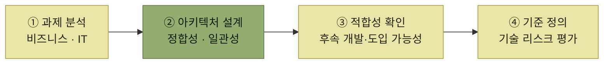
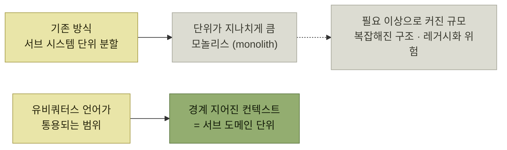
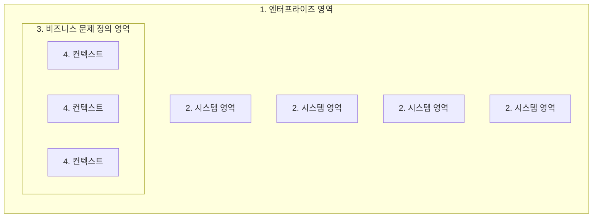
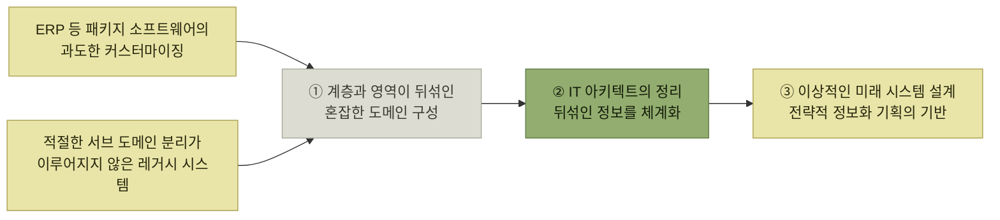

# 아키텍트

> [아키텍트가 하는 일](./README.md)

## 빠른 복습

- 아키텍트는 **복잡한 구조물인 소프트웨어의 적절한 설계를 결정짓는 역할**이다.
- 전통적으로 **애플리케이션 · 통합 · 인프라** 아키텍처로 나뉘지만, **클라우드 때문에 경계가 허물어지고 있다.** 그만큼 더 넓은 지식이 요구된다.
- 직무의 핵심은 **기업의 비즈니스 목표와 IT 전략을 잇는 최적의 기술 아키텍처**를 설계하고 구현하는 것이다. 그래서 기술 전문성만큼 **커뮤니케이션 능력**이 요구된다.
- **DDD**는 개발자와 도메인 전문가의 논의에서 얻은 지식으로 도메인 모델을 만들고, 그것을 중심에 두고 개발한다.
- **전략적 설계**가 시스템을 어떻게 나누고 통합할지의 방향을 정한다. 나누는 단위는 **경계 지어진 컨텍스트(bounded context)** 이고, 그 경계는 **유비쿼터스 언어가 통하는 범위**다.
- 예전의 **서브시스템 분할은 단위가 너무 커서** 모놀리스로 이어지고, 레거시화의 위험이 된다.
- 현행 시스템의 도메인을 그려 보면 대개 **뒤섞여 있다.** 그것을 체계적으로 정리하는 것이 IT 아키텍트의 일이다.

## 아키텍트는 무엇을 결정하는가

아키텍트는 복잡한 구조물인 **소프트웨어의 적절한 설계를 결정짓는 역할**을 한다. [앞 절](./3-아키텍처의-중요성.md)에서 본 "어떻게 나눌 것인가"라는 질문에 답을 내리는 자리가 이 역할이다.

아키텍트는 전문 분야에 따라 세 갈래로 나뉜다.

- **애플리케이션 아키텍처**
- **통합 아키텍처**
- **인프라 아키텍처**

다만 최근에는 **클라우드 덕분에 실무에서 전문 분야 간의 경계가 점점 허물어지고 있다.** 인프라가 코드로 다뤄지고 통합이 관리형 서비스로 제공되면서, 한 사람이 다뤄야 하는 범위가 넓어졌다. 그래서 아키텍트에게는 **이전보다 더 광범위한 지식이 요구된다.**

## 일본 IT 스킬 표준이 정의한 IT 아키텍트

일본의 IT 스킬 표준(V3 2011)은 IT 아키텍트의 역할을 이렇게 정의한다.

> - 비즈니스 및 IT 과제를 분석하고, 그 결과를 바탕으로 솔루션을 설계하여 **정보 시스템 요건으로 재정의**한다.
> - 하드웨어 및 소프트웨어 관련 기술(애플리케이션 기술, 방법론 등)을 활용해 고객의 비즈니스 전략을 지원할 수 있도록, 정보 시스템 전반의 **정합성과 일관성을 유지하는 IT 아키텍처를 설계**한다.
> - 설계된 아키텍처가 해당 과제에 대한 솔루션으로 **적합한지 확인**하고, 후속 개발 및 도입이 원활하게 이루어질 수 있는지도 함께 점검한다.
> - 솔루션을 구성하기 위해 정보 시스템이 갖추어야 할 **기준을 명확히 정의**하며, 실현 과정에서 발생할 수 있는 **기술적 리스크도 사전에 평가**한다.

*원서 인용 — 일본 IT 스킬 표준 V3 2011의 IT 아키텍트 정의*

*네 항목을 순서로 읽으면 아키텍트의 일이 설계 한 번으로 끝나지 않는다는 것이 드러난다 — 설계한 뒤에 적합성을 확인하고, 기준과 리스크까지 남긴다*

네 항목에서 눈여겨볼 것은 **첫 항목과 마지막 항목**이다. 아키텍트는 요건을 받아서 시작하는 것이 아니라 **과제를 분석해 요건으로 재정의하는 쪽**에서 시작하고, 설계도를 넘기는 것으로 끝나는 것이 아니라 **기준과 리스크를 남기는 쪽**에서 끝난다.

## 아키텍트의 주요 직무

- 넓게는 **전사 정보화 전략 수립 과정에서부터 기획 단계까지** 적극적으로 참여하는 것을 포함한다.
- 핵심은 **기업의 비즈니스 목표와 IT 전략을 효과적으로 연결**하기 위한 최적의 기술 아키텍처를 설계하고 구현하는 일이다.
- **시스템 간 연계 구조, 데이터 흐름, 인프라 구성, 보안 요소** 등 다양한 관점을 고려해야 한다.
- 그래서 **기술적 전문성과 커뮤니케이션 능력**이 함께 요구된다.

커뮤니케이션 능력이 함께 붙는 이유가 여기서 읽힌다. 연결해야 할 두 끝(비즈니스 목표와 IT 전략)이 **서로 다른 언어를 쓰는 사람들의 것**이기 때문이다. 기술만으로는 한쪽 끝에만 닿는다.

## 도메인 주도 설계에서의 도메인 분석

**도메인 주도 설계(Domain-Driven Design, DDD)** 는 개발자와 **도메인**(사업 활동 또는 업무 영역) 전문가 간의 논의를 통해 얻어진 지식을 바탕으로 **도메인 모델**을 구축하고, 이를 중심으로 소프트웨어 개발을 진행하는 것이 핵심이다.

DDD는 두 갈래의 설계로 나뉜다.

| 구분 | 무엇을 정하는가 |
| --- | --- |
| **전략적 설계**(strategic design) | 시스템을 **어떻게 분할하고 통합할지**에 대한 전체적인 방향 |
| **전술적 설계**(tactical design) | 그 안을 어떻게 구현할지 (원서는 이 절에서 다루지 않는다) |

표를 읽는 법. 아키텍트가 서는 자리는 **위쪽**이다. 이 절이 전략적 설계만 다루는 것은 그 때문이다.

### 어디에 자원을 몰아줄 것인가 — 핵심 도메인

사업 전체를 하나의 도메인으로 간주한다면, 그중에서도 **기업의 성공에 핵심적인 역할을 하는 중요한 영역**이 있다. 이를 **핵심 도메인(core domain)** 이라고 한다.

> 이 핵심 도메인이 **IT 리소스를 집중 투자할 가치가 있는 중요한 영역**이다.

분할이 자원 배분의 문제이기도 하다는 점이 여기서 드러난다. 모든 영역을 똑같이 잘 만들 수는 없으므로, **어디를 잘 만들지 고르기 위해서** 나눈다.

### 서브시스템을 나누는 것과 서브도메인을 나누는 것은 다르다

과거 대규모 업무 시스템에서는 **서브 시스템**을 나누는 작업이 일반적이었다. 하지만 이 방식이 도메인 주도 설계의 기준에 따라 적절하게 **서브 도메인**을 분리하는 것과 **항상 일치하지는 않는다.**

DDD가 쓰는 경계는 언어다. 도메인 모델이 이해관계자 간에 공통 언어로 통용되는 **유비쿼터스 언어(ubiquitous language)** 의 범위, 그 경계를 **경계 지어진 컨텍스트(bounded context)** 라 부르며, **이 단위를 기준으로 서브 도메인을 나눈다.**

*나누는 기준이 다르면 나온 단위의 크기가 다르다 — 위는 시스템을 기준으로, 아래는 말이 통하는 범위를 기준으로 자른다*

모놀리스가 **항상 문제인 것은 아니다.** 다만 필요 이상으로 소프트웨어의 규모가 커지고 구조가 복잡해지면서 **레거시 시스템을 초래할 위험**이 있어 주의가 필요하다. [1절](./1-오늘날의-소프트웨어-개발-환경.md)에서 본 레거시 문제가 분할 단위의 문제로 되돌아오는 지점이다.

### 현행을 그려 보면 뒤섞여 있다

현행 시스템을 분석하여 기업 전체의 도메인을 시각화하면, **다양한 계층의 도메인 구성이나 영역이 뒤섞여 혼잡한 모습**을 보이는 경우가 흔하다.

*[그림 1.4] 도메인의 영역 구성 — 네 계층의 포함 관계만 옮겼다. 원서 그림에서는 영역들의 크기가 제각각이고 서로 겹쳐 있으며, 그 뒤섞인 모습 자체가 요점이다. (원서 각주 출처: 『전략적 모놀리스와 마이크로서비스』, 에이콘출판, 2025)*

혼잡의 원인은 두 가지로 지목된다.

*뒤섞인 현행을 체계적으로 정리하는 것이 IT 아키텍트의 일이고, 그 정리가 이상적인 미래 설계와 전략적 정보화 기획의 기반이 된다*

여기서 아키텍트의 일이 신규 설계에 국한되지 않는다는 점이 분명해진다. **이미 있는 것을 읽고 정리하는 작업**이 먼저 온다. 정리되지 않은 현행 위에서는 이상적인 미래 그림도 그릴 수 없기 때문이다.

## 핵심 정리

- 아키텍트는 복잡한 소프트웨어의 적절한 설계를 결정짓는 역할이다.
- 애플리케이션 · 통합 · 인프라로 나뉘던 전문 분야의 경계는 클라우드로 허물어졌고, 요구되는 지식의 범위는 넓어졌다.
- IT 스킬 표준의 정의는 분석에서 시작해 기준과 리스크로 끝난다. 요건을 받는 자리도, 설계도를 넘기는 자리도 아니다.
- 직무의 핵심은 비즈니스 목표와 IT 전략을 잇는 것이고, 그래서 커뮤니케이션 능력이 함께 요구된다.
- DDD의 전략적 설계가 분할과 통합의 방향을 정하며, 핵심 도메인은 IT 리소스를 집중할 영역이다.
- 나누는 단위는 유비쿼터스 언어가 통하는 범위, 즉 경계 지어진 컨텍스트다.
- 예전의 서브시스템 분할은 단위가 커서 모놀리스로 이어졌다. 모놀리스 자체가 문제는 아니지만 레거시화의 위험이 된다.
- 현행 도메인은 대개 뒤섞여 있다. 그것을 정리하는 일이 미래 설계와 전략적 정보화 기획의 출발점이다.
