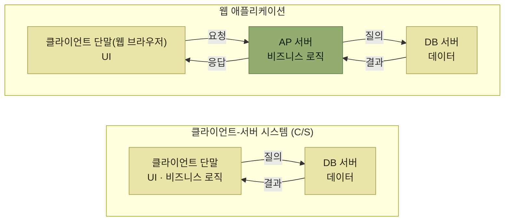
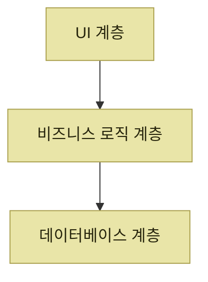
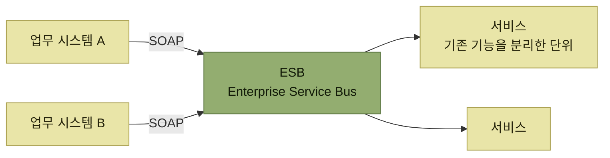
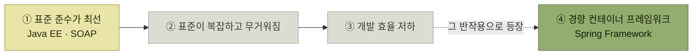
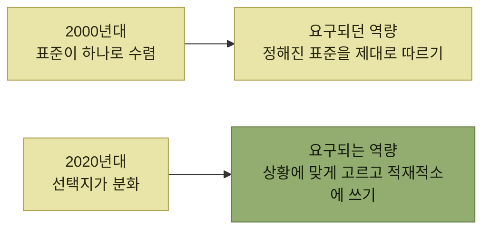

# 아키텍처 설계의 과거와 현재

> [아키텍트가 하는 일](./README.md)

## 빠른 복습

- **2000년대**는 메인프레임에서 오픈형 시스템으로, 클라이언트-서버에서 웹 애플리케이션으로 옮겨간 시기다. 애플리케이션은 **3계층 아키텍처**로 정리됐다.
- 통합 쪽에서는 기능을 서비스 단위로 떼어 재사용하려는 **SOA**가 나왔고, **ESB · Java EE · SOAP** 같은 표준이 자리 잡았다. **표준을 준수하는 것이 최선**으로 간주됐다.
- 그 표준이 지나치게 복잡하고 무거워지면서 개발 효율이 낮아졌고, 그 반작용으로 **Spring 같은 경량 컨테이너**가 등장했다.
- **2020년대**의 과제는 **매력적인 서비스를 얼마나 신속하게 제공하는가**다. AWS 이후 **클라우드 퍼스트 · 클라우드 네이티브**가 전제가 됐고, REST API로 연동이 쉬워졌다.
- **마이크로서비스 아키텍처**는 분산 시스템의 복잡성을 대가로 치르지만, **어질리티를 크게 향상**시킨다.
- 언어 · 데이터베이스 · 프런트엔드 모두 선택지가 늘었다. 그래서 이제 요구되는 것은 **상황에 맞는 기술을 골라 적재적소에 쓰는 역량**이다.

## 2000년대 — 표준을 따르는 것이 최선이던 시기

### 무게중심이 서버로 옮겨간다

기업의 업무 시스템이 **메인프레임에서 오픈형 시스템으로 전환**되던 흐름이 있었다. 동시에 **인터넷의 폭발적 보급과 스마트폰의 등장**으로, 이커머스 사이트를 비롯한 일반 소비자 대상 웹사이트가 **새로운 판매 채널**이 되었다.

그전까지는 업무용 애플리케이션이 클라이언트에, 데이터베이스가 서버에 있는 **클라이언트-서버 시스템(C/S)** 이 주류였다. 이것이 점차 **웹 애플리케이션**(브라우저 – AP 서버 – DB 서버)으로 전환된다. **Struts**, **Ruby on Rails** 같은 프레임워크가 이 전환을 뒷받침했다.

*[그림 1.5] 클라이언트-서버 시스템(위)과 웹 애플리케이션(아래) — 달라진 것은 **비즈니스 로직의 자리**다. 클라이언트에 있던 것이 AP 서버로 옮겨오면서 계층이 하나 늘었다*

**비즈니스 로직이 어디에 있는가**가 두 그림의 차이 전부다. 클라이언트에 로직이 있으면 고칠 때마다 모든 단말에 배포해야 하지만, AP 서버에 있으면 서버만 고치면 된다.

이 변화가 애플리케이션 아키텍처에도 반영되어, **UI 계층 – 비즈니스 로직 계층 – 데이터베이스 계층**으로 구성된 **3계층 아키텍처**가 널리 적용되었다.

*3계층 아키텍처 — 웹 애플리케이션의 물리 구성이 그대로 애플리케이션 내부의 계층 구분이 되었다*

### 통합의 표준 — SOA

애플리케이션 통합 관점에서는 **기존 애플리케이션의 기능을 서비스 단위로 분리하고, 이를 다양한 시스템에서 다시 사용할 수 있도록 구성하는 것**을 목표로 **SOA(Service Oriented Architecture, 서비스 지향 아키텍처)** 가 나왔다.

이를 뒷받침하는 **ESB(Enterprise Service Bus)** 미들웨어가 대기업 중심으로 도입되었다. Java 진영에서는 **Java EE**가, SOA 서비스를 구현하는 프로토콜로는 **SOAP(Simple Object Access Protocol, 단순 객체 접근 프로토콜)** 이 나왔다.

*SOA의 구도 — 시스템끼리 직접 잇지 않고 버스를 거치게 해서, 떼어낸 서비스를 여러 시스템이 다시 쓰게 한다*

이 시기의 특징은 여기에 있다. **아키텍처 설계 역시 이 표준을 준수하는 것이 최선으로 간주**되었다. 무엇을 고를지가 아니라 **정해진 것을 얼마나 제대로 따르는지**가 설계의 품질이었다.

### 표준이 무거워지자 반작용이 왔다

그러나 **표준이 지나치게 복잡하고 무거워지면서 개발 효율이 낮아졌다.** 그 결과 **Spring Framework** 같은 **경량 컨테이너** 애플리케이션 프레임워크가 등장한다.

*표준을 따르는 것이 최선이라는 전제가 흔들린 지점 — 표준을 지키는 비용이 표준이 주는 이득을 넘어섰다*

## 2020년대 — 고르는 것이 일이 된 시기

### 무엇이 과제가 되었나

B2C든 B2B든 **매력적인 서비스를 얼마나 신속하게 제공할 수 있는지**가 중요한 과제로 부상했다. 기업 내부에서도 백오피스 업무 시스템과 경영 가시화 도구 등 다양한 소프트웨어가 등장했고, **이들 간의 긴밀한 연결**이 필요해졌다.

2023년 이후로는 **생성형 AI를 비롯한 AI 관련 기술의 발전 속도**가 더욱 빨라지고 있으며, 서비스에 AI 기술을 접목하는 현상도 나타나고 있다.

과제가 "신속하게"로 옮겨간 것에 주목한다. 이것이 [어질리티](./2-어질리티-변화에-대한-적응-능력.md)가 아키텍처의 문제가 되는 이유다.

### 클라우드가 전제가 되었다

**2006년 AWS가 등장**한 이래, 현재는 새로운 시스템을 도입할 때 **클라우드 퍼스트(cloud first)** 사고방식이 정착되어 클라우드를 우선적으로 검토한다. 나아가 **클라우드에 최적화된 아키텍처를 채택해야 한다는 클라우드 네이티브(cloud native)** 의 개념이 중요해졌다.

다양한 클라우드 서비스가 **REST API를 기본적으로 제공**하면서, 애플리케이션과 서비스 간 연동도 수월해졌다. 2000년대에 ESB와 SOAP가 맡던 자리를 REST API가 훨씬 가볍게 대신하게 된 셈이다.

### 마이크로서비스 아키텍처

**마이크로서비스 아키텍처(microservice architecture)** 는 **여러 개의 독립적인 소규모 서비스를 조합하여 하나의 애플리케이션을 구성하는 설계 방식**이다.

| 얻는 것 | 치르는 대가 |
| --- | --- |
| 각 서비스 단위로 **독립적인 개발·배포**가 가능하다 | **분산 시스템 특성상 복잡성이 증가**한다 |
| 필요한 경우 **서비스 단위로 스케일링**할 수 있다 | 그에 따라 발생하는 **고유한 과제를 해결**해야 한다 |
| 각 서비스에 적합한 **기술을 개별적으로 선택**할 수 있다 | |

표를 읽는 법. 왼쪽 세 가지는 모두 **"서비스 단위로"** 라는 한 마디에서 나온다. 그리고 오른쪽의 대가도 같은 곳에서 나온다. 나눴기 때문에 따로 배포하고 따로 늘릴 수 있고, 나눴기 때문에 분산 시스템이 된다. **얻는 것과 잃는 것의 뿌리가 같다.**

> 그럼에도 마이크로서비스 아키텍처는 **소프트웨어의 어질리티를 크게 향상시킬 수 있는 아키텍처**이며, 변화에 유연하게 대응해야 하는 현대 개발 환경에서 **충분히 검토할 가치가 있다.**

나누는 단위를 무엇으로 잡을지는 [경계 지어진 컨텍스트](./4-아키텍트.md#서브시스템을-나누는-것과-서브도메인을-나누는-것은-다르다)에서 이미 다뤘다. 마이크로서비스는 그 분할을 배포 단위까지 밀고 간 형태다.

### 선택지가 늘었다

- **언어** — Java, C# 같은 객체 지향 언어, Haskell, Clojure 같은 함수형 언어가 함께 개발되고 있고, 두 성격을 겸한 하이브리드 언어도 있다.
- **데이터베이스** — 다양한 데이터베이스를 **용도에 따라 선택**할 수 있다.
- **프런트엔드** — 과거에는 웹 애플리케이션 서버가 렌더링한 HTML을 브라우저가 표시하고 **jQuery**가 클라이언트 동작을 구현했다. 최근에는 **React, Vue.js** 같은 JS 라이브러리를 활용한 **SPA(Single-Page Application)** 아키텍처가 주요 방식으로 자리 잡았다.

> 애플리케이션 개발의 각 분야에서 활용할 수 있는 기술이 매우 다양해짐에 따라, **상황에 맞는 기술을 선택하고 이를 적재적소에 활용하는 역량**이 요구되고 있다.

## 두 시기를 관통하는 변화

두 시기를 나란히 놓으면 기술 목록보다 **아키텍트에게 요구되는 것이 무엇으로 바뀌었는지**가 먼저 보인다.

*설계의 난이도가 옮겨간 자리 — 예전에는 "제대로 따랐는가"를 물었고, 지금은 "왜 그것을 골랐는가"를 묻는다*

정답이 하나일 때는 그것을 아는 것이 실력이었다. 정답이 여럿일 때는 **고른 이유를 설명할 수 있는 것**이 실력이 된다.

## 핵심 정리

- 2000년대는 메인프레임 → 오픈형, C/S → 웹으로 무게중심이 옮겨간 시기이며, 비즈니스 로직이 클라이언트에서 AP 서버로 이동해 3계층 아키텍처가 자리 잡았다.
- 통합 쪽에서는 SOA가 나왔고 ESB · Java EE · SOAP가 표준이 되었다. 이 시기 설계의 품질은 표준을 얼마나 제대로 따르는가였다.
- 표준이 무거워져 개발 효율이 떨어지자 Spring 같은 경량 컨테이너가 등장했다. 표준을 지키는 비용이 이득을 넘어선 지점이다.
- 2020년대의 과제는 속도다. 클라우드 퍼스트·클라우드 네이티브가 전제가 되었고, REST API가 연동의 기본이 되었다.
- 마이크로서비스는 분산의 복잡성을 대가로 독립 배포·개별 스케일링·기술 선택을 얻는다. 얻는 것과 잃는 것의 뿌리가 같다.
- 언어·데이터베이스·프런트엔드 모두 선택지가 늘었다. 요구되는 것은 표준 준수가 아니라 선택과 배치의 역량이다.
