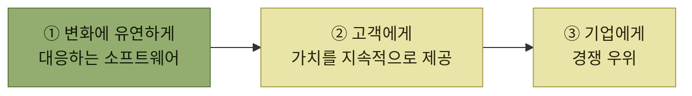
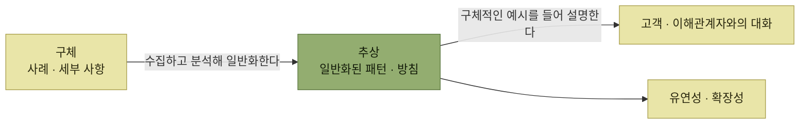
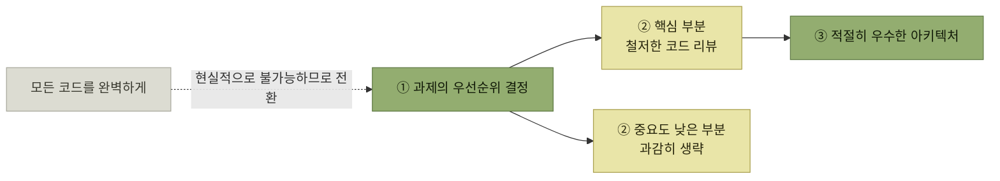

# 아키텍트의 자질

> [아키텍트가 하는 일](./README.md)

## 빠른 복습

- 아키텍트의 보람은 **변화에 유연하게 대응하는 소프트웨어**로 고객에게 **가치를 지속적으로 제공**하면서 기업에는 **경쟁 우위**를 가져다주는 일에 있다.
- **설계 능력과 코딩 실력** — 아키텍처 설계와 하위 설계는 완전히 독립적이지 않다. 하위 설계와 코딩이 약하면 좋은 아키텍처를 설계하기 어렵다.
- **추상화 능력** — 본질(추상)과 세부(구체)를 나누는 것이 좋은 설계의 출발점이고, 둘 사이를 **자유롭게 오가는 것**이 소통의 조건이다.
- **비즈니스에 대한 이해** — 부족하면 우선순위를 잘못 잡거나 쓸모없는 아키텍처를 만든다. 핵심은 **잘 듣고 이해하는 것**이다.
- **호기심** — 어제의 베스트 프랙티스가 오늘의 안티패턴이 되는 시대에, 고정된 방식을 고집하지 않는 태도.
- **완벽주의보다 합리주의** — 모든 면에서 완벽한 설계는 없다. **아키텍처는 목적이 아니라 수단**이므로 적절히 우수한 것을 목표로 삼는다.

## 무엇을 보람으로 삼는가

아키텍트가 보람을 느끼는 순간은 이것이다. **변화에 유연하게 대응하는 소프트웨어를 통해 고객에게 가치를 지속적으로 제공하면서, 기업에게는 경쟁 우위를 가져다주는 일.**

*아키텍트의 일이 향하는 곳 — 설계 자체가 아니라 그 끝의 가치와 경쟁 우위다*

이 문장을 먼저 두는 이유가 있다. 아래 다섯 가지 자질은 **이 결과에 도달하기 위해 필요한 것들**이지, 아키텍트라는 직함에 붙는 장식이 아니다.

## 다섯 가지 자질

| 자질 | 없으면 무슨 일이 생기는가 |
| --- | --- |
| **설계 능력과 코딩 실력** | 하위 설계가 받쳐주지 않아 좋은 아키텍처가 나오지 않는다 |
| **추상화 능력** | 본질과 세부가 뒤섞여 유연성과 확장성을 잃는다 |
| **비즈니스에 대한 이해** | 우선순위를 잘못 잡거나 유용하지 않은 아키텍처를 만든다 |
| **호기심** | 과거의 베스트 프랙티스를 안티패턴이 된 뒤에도 고집한다 |
| **완벽주의보다 합리주의** | 완벽을 좇다가 정작 중요한 곳에 자원을 못 쓴다 |

표를 읽는 법. 오른쪽 열을 보면 다섯 가지가 성격이 다르다는 것이 드러난다. 앞의 세 가지는 **못 해내는 것**에 대한 이야기이고, 뒤의 두 가지는 **태도가 잘못 굳는 것**에 대한 이야기다. 앞은 키우면 되지만, 뒤는 **경계하지 않으면 경력이 쌓일수록 오히려 나빠질 수 있다.**

## 설계 능력과 코딩 실력

아키텍처 설계는 클래스 설계나 컴포넌트 설계에 비해 **개념적 수준과 방향성을 설정하는 데 더 많은 검토가 필요**하며, 고려해야 할 관점도 다르다.

그렇다고 위쪽만 잘하면 되는 것은 아니다. **아키텍처 설계와 하위 설계는 완전히 독립적이지 않기 때문에, 하위 설계 능력이나 코딩 실력이 부족한 개발자는 좋은 아키텍처를 설계하기 어렵다.**

게다가 기술 트렌드는 끊임없이 변한다. **과거에 좋은 패턴으로 여겨진 것이 시간이 흐르면서 안티패턴이 될 수도 있다.** 그래서 설계 능력과 코딩 실력은 한 번 갖추고 끝나는 것이 아니라 **꾸준히 키워야 하는 것**이다.

## 추상화 능력

좋은 설계는 **본질(추상)과 세부(구체)를 적절히 나누는 데에서** 시작된다. 문제 영역에서 중요한 **본질적 요소**와, 그 외 **대체 가능한 세부 사항**을 구분함으로써 소프트웨어에 **유연성과 확장성**을 부여할 수 있다.

다만 능력의 방향이 하나가 아니다.

*추상화 능력은 올라가는 힘과 내려오는 힘 둘 다를 말한다 — 사례에서 방침을 뽑아내고, 방침을 다시 예시로 풀어낸다*

구체적인 사례를 수집하고 이를 분석하여 **일반화된 패턴과 방침을 도출하는 능력**이 중요하다. 그러나 고객이나 이해관계자와 대화할 때에는 **구체적인 예시를 들어 설명**해야 한다. 즉 **추상적 개념과 구체적 세부 사항을 자유롭게 오가며 상황에 맞게 소통하는 능력**이 필수다.

한쪽만 있는 경우를 생각해 보면 왜 둘 다인지가 분명해진다. 올라가지 못하면 사례를 모으고도 방침을 못 만들고, 내려오지 못하면 옳은 방침을 세우고도 아무도 설득하지 못한다.

## 비즈니스에 대한 이해

아키텍트가 비즈니스에 대한 이해가 부족한 상태에서 아키텍처를 설계하면, **우선순위를 잘못 설정하거나 유용하지 않은 아키텍처를 만들 수 있다.**

어디까지 이해해야 하는지는 정해져 있지 않다. **회사나 조직의 특성, 문화, 분위기 등에 따라 다르다.**

| 어디에 속했는가 | 무엇을 이해해야 하는가 |
| --- | --- |
| **사업체에 속한 아키텍트** | 사업의 내용, 그리고 그 사업의 경쟁 우위 요소 |
| **SI 개발** | 일반적인 업무 지식에 더해, 해당 업계에서 통용되는 업무 방식 · 관행 · 규제 |

표를 읽는 법. 두 경우 모두 **고객과의 커뮤니케이션**을 위한 것이다. SI 쪽에 관행과 규제가 들어가는 것은 그것을 모르면 대화가 성립하지 않기 때문이다.

> 중요한 것은 비즈니스 전문가와의 대화를 통해 소프트웨어 및 아키텍처에 필요한 **핵심 정보를 효과적으로 이끌어내는 능력**이다. 즉 아키텍트는 **잘 듣고 이해하는 사람**이 되어야 한다.

[주요 직무에서 커뮤니케이션 능력이 함께 요구된 이유](./4-아키텍트.md#아키텍트의-주요-직무)가 여기서 구체화된다. 말하는 능력이 아니라 **듣는 능력**이 먼저다.

## 호기심

지금은 **어제의 베스트 프랙티스가 오늘의 안티패턴으로 바뀌는** 시대다. 그 안에서 **변화에 무뎌지지 않고 열린 자세로 기술을 접하려는 태도**가 필요하다.

- **하나의 고정된 방식을 고집하기보다**, 다양한 선택지를 비교·평가하고 그중에서 최적의 방법을 선택할 수 있어야 한다.
- 흥미로운 기술이 있다면 **시험 삼아 간단한 코드 한 줄이라도 작성해 보는** 능동적 탐구 자세를 갖추는 것이 좋다.

[선택지가 분화된 시대](./5-아키텍처-설계의-과거와-현재.md#두-시기를-관통하는-변화)의 자질이 바로 이것이다. 표준이 하나였을 때는 호기심이 없어도 됐지만, 고르는 것이 일이 된 지금은 **고를 후보를 아는 것 자체가 실력**이다.

## 완벽주의보다 합리주의

많은 사람이 함께하는 대규모 소프트웨어 개발에서 각각의 코드가 완벽하게 작성된다면 이상적이지만, **현실적으로 그렇게 되기는 어렵다.**

그래서 힘을 어디에 쓸지 정해야 한다. 소프트웨어에서 **핵심적인 부분은 철저히 코드 리뷰를 하되**, 상대적으로 **중요도가 낮은 부분은 때로는 과감히 생략할 줄 아는 결단력**도 필요하다.

*생략은 포기가 아니라 배분이다 — 어디를 생략할지 정해야 어디를 철저히 볼지가 정해진다*

아키텍트도 마찬가지다. **모든 측면에서 완벽한 설계는 존재하지 않는다.** 해결해야 할 과제의 **우선순위를 정하고 적절히 우수한 아키텍처를 목표로** 삼아야 한다.

> 아키텍처는 **목적이 아니라 수단**이기 때문이다.

이 문장이 이 장 전체의 마무리이기도 하다. [아키텍처가 중요하다](./3-아키텍처의-중요성.md)는 말과 모순되지 않는다. 중요한 것은 그것이 **무엇을 위해 중요한지**이고, 그 답은 이 절 첫머리의 보람 — 고객에게 가는 가치와 기업의 경쟁 우위다.

## 핵심 정리

- 아키텍트의 보람은 유연한 소프트웨어로 고객에게 가치를, 기업에는 경쟁 우위를 가져다주는 데 있다.
- 아키텍처 설계와 하위 설계는 독립적이지 않다. 코딩 실력이 약하면 좋은 아키텍처도 나오지 않는다.
- 좋은 패턴도 시간이 지나면 안티패턴이 될 수 있으므로 설계 능력과 코딩 실력은 계속 키워야 한다.
- 추상화 능력은 사례에서 방침을 뽑아내는 힘과, 방침을 예시로 풀어내는 힘 둘 다를 말한다.
- 비즈니스 이해의 깊이는 조직에 따라 다르지만, 공통 핵심은 잘 듣고 핵심 정보를 이끌어내는 것이다.
- 호기심은 선택지가 분화된 시대의 자질이다. 고를 후보를 아는 것 자체가 실력이 된다.
- 완벽한 설계는 없다. 우선순위를 정해 적절히 우수한 아키텍처를 목표로 삼는다. 아키텍처는 수단이다.
