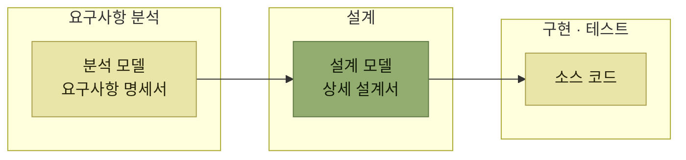
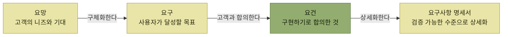
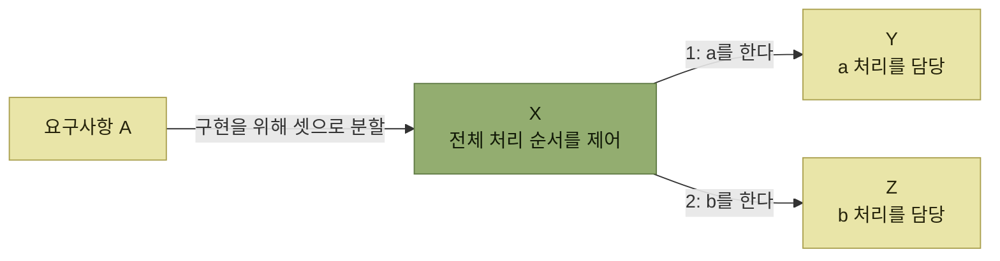
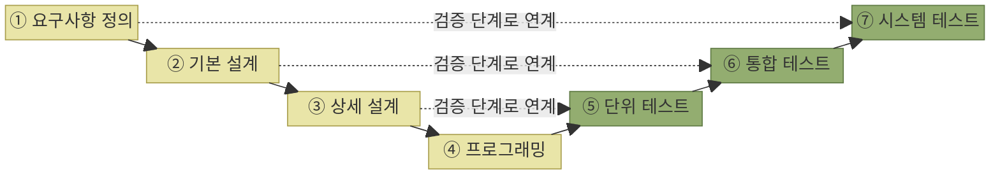

# 소프트웨어 개발 프로세스

## 빠른 복습

- 개발 프로세스는 **요구사항 분석 → 설계 → 구현·테스트**를 거치고, 단계마다 **산출물**이 다르다.
- 이 장의 예에서는 요구사항 분석을 **AS-IS 인터뷰 → TO-BE 설계 → 유스케이스 모델**로 설명한다. 개념 모델은 **UML 클래스 다이어그램**으로 표현할 수 있다.
- 이 장은 요구를 **업무 요구 · 사용자 요구 · 기능 요구** 세 수준으로 나누고, **요망 · 요구 · 요건**이라는 말에 대응시켜 설명한다. 실제 프로젝트의 용어와 구분은 다를 수 있다.
- 이 장의 용어 구분에서는 **요건을 고객과 합의한 구현 범위**로 설명한다.
- 설계에서 검토하는 것은 셋이다 — **분할 방법 · 책임 할당 · 상호작용**.
- **문서의 종류와 상세도는 프로세스가 정하지만, 설계를 하지 않는 프로세스는 없다.** 애자일도 필요한 문서를 남기며 CRC 카드나 TDD 같은 방식으로 설계를 발전시킬 수 있다.
- **V 모델**은 개발 단계와 테스트 단계를 짝지어 보여준다. 다만 **단계의 구분과 명칭은 표준화되어 있지 않다.**

## 세 단계와 각 단계의 산출물

소프트웨어 개발 프로세스는 **요구사항 분석 – 설계 – 구현·테스트**를 거친다. 각 단계에서 어떤 작업을 수행하고 대체로 어떤 산출물을 만드는지를 보면 단계의 성격이 드러난다.

*[그림 2.1] 소프트웨어 개발 프로세스 — 요구사항 분석에는 고객과 소프트웨어 엔지니어가 함께 참여한다*

산출물의 이름을 나란히 놓으면 단계가 무엇을 하는 곳인지가 읽힌다. **분석은 "무엇을"을 문서로 만들고, 설계는 "어떻게"를 문서로 만들고, 구현은 그것을 실제로 도는 코드로 만든다.**

## 요구사항 분석

### AS-IS를 듣고 TO-BE를 그린다

요구사항 분석 단계에서는 먼저 고객의 **현재 업무(AS-IS)** 에 대해 인터뷰한 후, **업무의 흐름과 업무 규칙을 정리**한다. 그다음 **바람직한 모습(TO-BE)** 을 업무 흐름도 등으로 설계한다.

**TO-BE의 새로운 업무 흐름을 실현하기 위해 소프트웨어가 사용자에게 제공해야 할 기능**, 그것이 **유스케이스 모델**로 정의된다.

| 모델 | 무엇을 담는가 | 어떻게 표기하는가 |
| --- | --- | --- |
| **유스케이스 모델** | 소프트웨어가 사용자에게 제공해야 할 기능 | UML **유스케이스 다이어그램** + **유스케이스 기술서** |
| **개념 모델** | 다루려는 업무의 주요 개념(주요 비즈니스 이벤트, 처리 대상 데이터)과 그 관계 | UML **클래스 다이어그램** 등을 활용할 수 있다 |

표를 읽는 법. 두 모델은 보는 각도가 다르다. **유스케이스 모델은 "사용자가 무엇을 하는가"를, 개념 모델은 "업무에 무엇이 있는가"를** 담는다. 유스케이스 기술서는 그중 **유스케이스의 구체적인 동작을 체계적으로 정리한 문서**다.

### 전반부와 후반부

요구사항 분석 안에서도 무게중심이 한 번 옮겨간다.

| | 무엇을 하는가 |
| --- | --- |
| **전반부** | 대상 업무 영역을 분석하고, **업무상의 과제를 소프트웨어로 해결하는 관점**에서 모델링을 수행한다 |
| **후반부** | 각 유스케이스를 구현하기 위해 필요한 **기능**(화면, 업무 산출물, 외부 시스템과의 인터페이스)을 정의한다 |

표를 읽는 법. 전반부는 **업무를 본다.** 후반부는 **시스템을 본다.** 같은 단계 안에서 시선이 업무에서 시스템으로 넘어가는 것이고, 그 경첩 역할을 하는 것이 유스케이스다.

## 요망 · 요구 · 요건

**요구 공학(requirements engineering)** 에서는 이해관계자의 목표에서 시스템 요구사항까지 요구를 여러 수준으로 구분한다. 이 장에서는 다음과 같이 세 수준과 세 용어를 대응시켜 설명한다. 다만 **요망 · 요구 · 요건의 용법과 수준 구분은 조직이나 방법론마다 다를 수 있으므로**, 실제 프로젝트에서는 용어 정의와 합의 기준을 먼저 맞춰야 한다.

| 수준 | 누구의 목표인가 | 대응하는 말 | 무엇인가 |
| --- | --- | --- | --- |
| **업무 요구** | 시스템 도입 고객사가 설정한 **상위 목표** | **요망** | 시스템 도입의 배경이 되는 고객의 니즈와 기대 |
| **사용자 요구** | 시스템을 **사용하는 사용자**가 달성해야 할 목표 | **요구** | 요망을 구체화하여 사용자가 시스템을 통해 달성해야 할 목표를 정의한 것 |
| **기능 요구** | 이를 실현하기 위해 **개발자**가 시스템에 구현하는 목표 | **요건** | 요구 중 **시스템에서 구현하기로 고객과 합의한 내용**을 개발 관점에서 명확하고 구체적으로 정의한 것 |

표를 읽는 법. 이 장의 구분에 따라 세 줄을 위에서 아래로 읽으면 **주어가 고객사 → 사용자 → 개발자로 내려온다.** 그리고 결정적인 차이는 마지막 줄에 있다. 여기서 요건은 **구현 범위로 합의된 내용**을 뜻한다.

이것을 바탕으로 시스템이 수행해야 할 동작과 품질 조건이 **소프트웨어 요구사항 명세서(SRS, Software Requirements Specification)** 로 문서화된다. 요구사항 명세서는 **기능 요구뿐 아니라 비기능 요구, 외부 인터페이스, 제약 사항 등을 검증 가능한 수준으로 상세화한 결과물**이다.

*이 장의 정의에서는 요망이 요구로 구체화되고, 구현하기로 합의한 내용이 요건과 명세로 상세화된다*

"검증 가능한 수준"이라는 말에 주목한다. 명세서의 목적이 여기서 드러난다. **나중에 테스트로 확인할 수 없는 문장은 요구사항 명세서에 적혀도 소용이 없다.**

## 설계

설계 단계는 요구사항 분석에서 정한 내용을 **구조·책임·상호작용·데이터와 인터페이스로 구체화하는 일**이다. 일부 결정은 기술과 독립적으로 내릴 수 있고, 상세 설계에서는 프로그래밍 언어·프레임워크·라이브러리 같은 구현 기술도 함께 고려한다.

그런데 실용적인 소프트웨어는 규모가 크고 구조도 복잡해서 간단히 구현할 수 없다. 하나의 배포 단위인 모놀리스로 만들더라도, **내부를 나누지 않은 하나의 거대한 구성 요소로는 복잡성을 다루기 어려워 여러 구성 요소로 분할해 개발한다.** [1장에서 본 분할](../1-아키텍트가-하는-일/3-아키텍처의-중요성.md)이 여기서 실제 작업으로 내려온다.

### 무엇을 검토하는가

설계 단계에서는 다음 세 가지를 검토한다.

- **구성 요소로 분할하는 방법**
- **각 구성 요소에 대한 책임 할당**
- **구성 요소 간의 상호작용**(협력 방식)

*[그림 2.2] 협업 다이어그램 — 하나의 요구사항을 X · Y · Z로 나누고, 각 클래스가 수행할 책임의 분담과 처리 순서를 나타낸다*

이 한 장에 앞의 세 가지가 모두 들어 있다. **어떻게 나눴는지**(X·Y·Z), **누가 무엇을 맡는지**(a는 Y, b는 Z), **어떤 순서로 협력하는지**(1 다음 2)가 그것이다.

### 문서로 남길지는 프로세스가 정한다

설계한 결과를 **설계 모델이나 상세 설계서 같은 문서로 남길지 여부**는 채택된 개발 프로세스나 프로젝트의 방침에 따라 결정된다.

> 애자일 개발은 문서를 없애는 방식이 아니다. 필요한 문서를 가치에 맞는 수준으로 남기며, 문서가 가볍다고 해서 **설계를 하지 않는다는 뜻도 아니다.**

**CRC 카드**를 사용하거나 **테스트 주도 개발**을 통해 설계와 구현을 조금씩 동시에 진행하는 등, 어떤 형태로든 설계 작업은 이루어진다. 즉 프로세스가 정하는 것은 **설계의 유무가 아니라 설계의 형태와 기록 방식**이다.

### CRC 카드

**CRC 카드**는 클래스를 설계할 때 사용하는 모델링 기법이다. 작은 카드를 이용해 **클래스의 책임**과, 그 책임을 수행하기 위해 **협력해야 하는 대상**을 발견하는 데 사용한다. CRC는 **Class, Responsibility, Collaborator**를 의미한다.

<table>
<thead>
<tr>
<th colspan="2" style="text-align:center; white-space:nowrap">(클래스명) 주문</th>
</tr>
</thead>
<tbody>
<tr>
<td style="text-align:left; white-space:nowrap; vertical-align:top">(책임) 주문 금액 계산 결제 수단 지정 주문 확정 주문 취소</td>
<td style="text-align:left; white-space:nowrap; vertical-align:top">(협력할 클래스) 주문 명세 상품</td>
</tr>
</tbody>
</table>

*원서 [그림 2.3] CRC 카드*

카드는 세 영역으로 나뉜다.

- **상단** — 클래스 이름
- **왼쪽 하단** — 그 클래스가 수행해야 할 **책임**
- **오른쪽 하단** — 클래스가 단독으로 책임을 수행할 수 없을 때, 정보를 얻거나 처리를 요청할 **상호작용 상대**

실제 작업에서는 **여러 사람이 책상을 둘러싸고 카드를 배열하며** 진행한다. 각자가 담당할 클래스를 정하고 **롤플레잉**을 통해 설계를 발전시키는데, 대화하는 중에 **새로운 클래스를 발견하거나 책임을 적절히 재배치하는 일이 자연스럽게 발생**한다. 이러한 과정을 통해 모델을 정교하게 다듬을 수 있다.

카드가 작다는 점이 우연이 아니라는 데 주목한다. **한 장에 다 안 들어가면 그 클래스가 너무 많은 책임을 지고 있다는 신호**가 된다.

## 구현 및 테스트

구현 및 테스트 단계에서는 설계에 따라 **실제로 작동하는 소스 코드를 구현**하고, 완성된 소프트웨어가 **기능 요구를 충족하는지 테스트를 통해 검증**한다.

### V 모델

**V 모델**은 **개발 단계와 그에 상응하는 테스트 단계를 연결한 모델**이다. 각 테스트 단계의 목적과 검증할 수준을 보여준다.

*[그림 2.4] V 모델 — 개발 단계는 왼쪽에서 내려가고 테스트 단계는 오른쪽에서 올라간다. ①~⑦은 전체 진행 순서이며, 점선은 어느 단계의 결정을 어느 테스트가 확인하는지를 짝지은 것이다*

짝을 보면 테스트의 성격이 정해지는 방식이 읽힌다. **단위 테스트는 상세 설계를, 통합 테스트는 기본 설계를, 시스템 테스트는 요구사항 정의를 확인한다.** 테스트 단계가 높아질수록 확인하는 문서도 위쪽 것이 된다.

### 명칭은 표준화되어 있지 않다

여기서 주의할 것이 있다. **단계의 구분 방식과 명칭은 표준화되어 있지 않다.** 프로젝트마다 다를 수 있으므로, V 모델의 칸 이름을 그대로 통용되는 표준으로 여기면 안 된다.

> 중요한 것은 프로젝트에서 채택한 개발 프로세스에 맞춰 **적절한 테스트 계획을 수립하는 것**이다.

워터폴이든 애자일이든 상관없이, **초기 단계부터 테스트를 수행하는 시프트 레프트(shift left) 접근법**이 효과적일 수 있다.

시프트 레프트가 V 모델과 충돌하지 않는다는 점을 짚어둔다. V 모델은 **무엇이 무엇을 검증하는지**를 말할 뿐, **언제 해야 하는지**를 말하지 않는다. 짝은 그대로 두고 시점만 앞으로 당기는 것이 시프트 레프트다.

## 핵심 정리

- 개발 프로세스는 요구사항 분석 → 설계 → 구현·테스트로 진행되며, 각각 분석 모델·요구사항 명세서 / 설계 모델·상세 설계서 / 소스 코드를 남긴다.
- 이 장의 요구사항 분석 예시는 AS-IS 인터뷰에서 시작해 TO-BE를 그리고, 그것을 유스케이스 모델로 정의한다. 개념 모델은 업무의 주요 개념과 관계를 클래스 다이어그램 등으로 표현할 수 있다.
- 분석 안에서도 전반부는 업무를, 후반부는 시스템(화면·산출물·인터페이스)을 본다.
- 이 장에서는 요망 → 요구 → 요건으로 구체화하며 요건을 합의된 구현 범위로 설명한다. 실제 용어 체계는 조직과 방법론마다 다를 수 있다.
- 요구사항 명세서의 기준은 검증 가능성이다.
- 설계는 분할 방법 · 책임 할당 · 상호작용을 검토한다. 협업 다이어그램 한 장에 이 셋이 모두 담긴다.
- 문서의 종류와 상세도는 프로세스가 정하지만, 설계 자체를 건너뛰는 프로세스는 없다. CRC 카드와 TDD는 설계를 발전시키는 데 활용할 수 있다.
- V 모델은 개발 단계와 테스트 단계를 짝짓는다. 다만 단계 명칭은 표준이 아니며, 시점을 앞당기는 시프트 레프트와는 양립한다.
