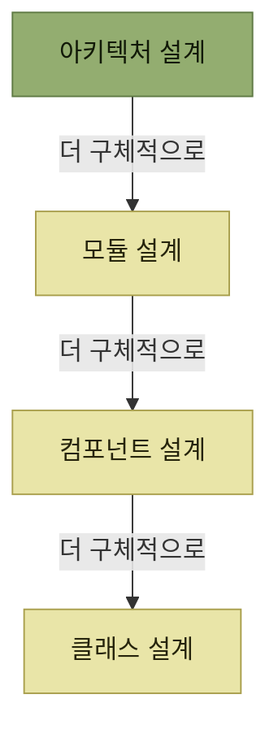
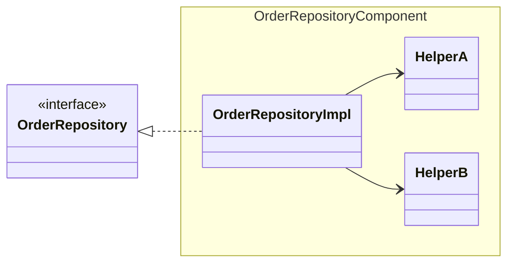
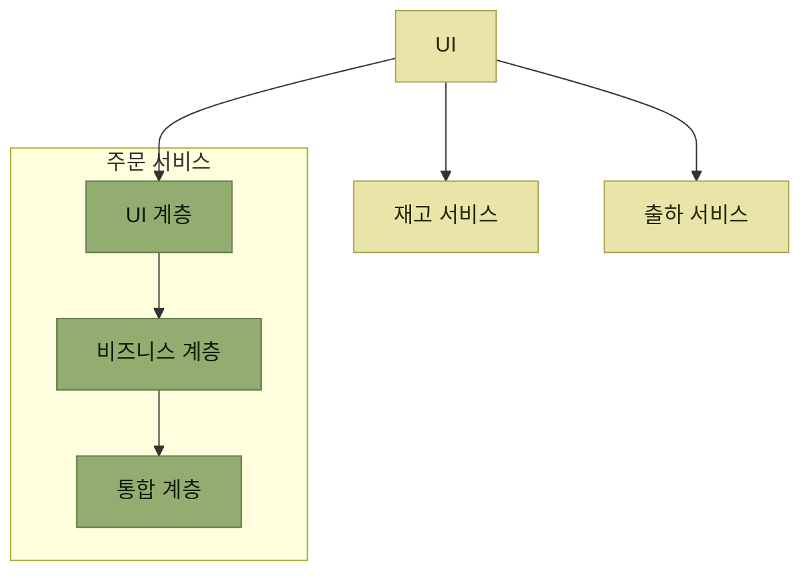
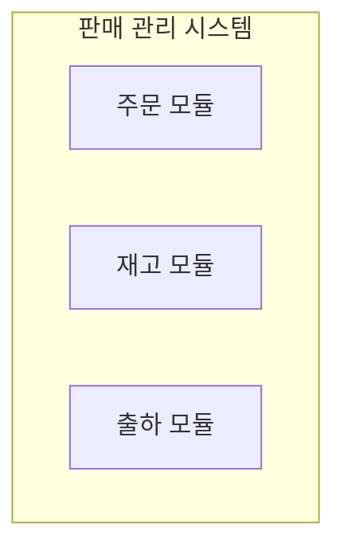
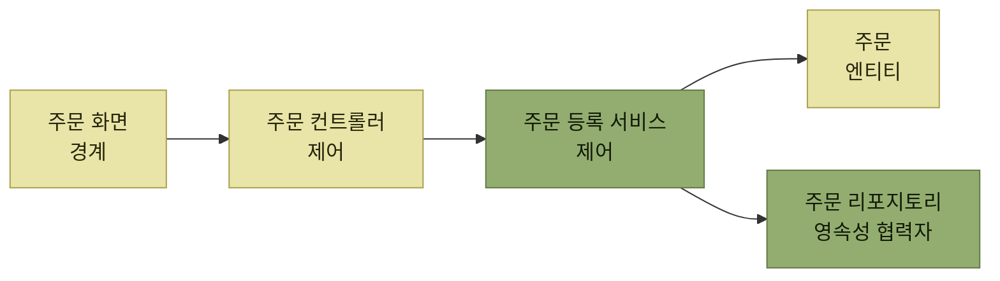

# 소프트웨어 설계의 추상화 레벨

## 빠른 복습

- 이 장은 설계를 이해하기 위한 관점으로 **아키텍처 → 모듈 → 컴포넌트 → 클래스** 네 레벨을 사용한다. 앞이 더 추상적이다.
- 객체 지향 설계에서는 **클래스**를 세부 설계 단위로 다룬다. 함수형 설계에서는 함수와 데이터 타입 등이 그 자리에 올 수 있다.
- **컴포넌트**는 **특정 동작을 수행할 책임을 가지며 명확한 인터페이스로 정의된** 구성 요소다. 여러 클래스로 구성되기도 한다.
- 명확한 인터페이스와 호환되는 동작 계약은 구현을 대체할 가능성을 높인다. Spring의 DI는 구현을 외부에서 주입하는 한 가지 수단이다.
- 이 장에서는 **모듈**을 유스케이스 실행에 필요한 컴포넌트를 모아 조직화한 구조로 설명한다. 다만 모듈과 컴포넌트의 정의는 언어·플랫폼·문헌마다 다르다.
- 마틴 파울러는 **독립적 대체 가능성**을 소프트웨어 컴포넌트의 특징으로 제시한다. 이것이 모든 문맥에서 모듈과 컴포넌트를 가르는 유일한 기준은 아니다.
- **아키텍처 설계**는 가장 추상적인 단계로, 시스템 전체 구조와 함께 **하위 설계에 영향을 미치는 원칙과 정책**을 정한다.

## 네 개의 레벨

*추상화 레벨 — 위로 갈수록 추상적이고 아래로 갈수록 구체적이다. 위의 결정이 아래의 선택지를 좁힌다*

| 레벨 | 무엇을 결정하는가 | 소스 코드에서는 |
| --- | --- | --- |
| **아키텍처 설계** | 시스템 전체 구조, 애플리케이션의 기본 구조, 전체에 걸친 원칙과 정책 | — |
| **모듈 설계** | 시스템을 구성하는 모듈 구조, 모듈 간 연동 방식 | 패키지 트리·빌드 모듈·배포 단위 등 |
| **컴포넌트 설계** | 컴포넌트의 구성 방식과 협력 방식 | 패키지·네임스페이스·라이브러리·서비스 등 |
| **클래스 설계** | 객체의 책임·상태·협력 | 클래스 선언; 파일 배치는 언어마다 다르다 |

표를 읽는 법. 오른쪽 열은 **이 장의 예시적인 대응 관계**다. 실제로는 한 파일에 여러 클래스를 둘 수도 있고, 컴포넌트나 모듈이 패키지·빌드 산출물·배포 단위 등으로 표현될 수도 있다. 아키텍처도 원칙과 문서에만 머무는 것이 아니라 코드 구조, 의존 관계, 배포 토폴로지에 구현된다.

## 클래스 설계

객체 지향 설계에서 **클래스의 책임, 상태, 공개 인터페이스와 다른 객체와의 협력**을 정하는 일이다. 함수형 프로그래밍에서는 함수와 데이터 타입, 모듈 경계 등을 세부 설계 단위로 다룰 수 있다.

Java처럼 하나의 공개 클래스를 파일 하나에 두는 관례가 있는 언어도 있지만, **클래스와 파일의 대응은 언어와 팀 규칙에 따라 달라진다.**

## 컴포넌트 설계

**컴포넌트**란 **특정한 동작을 수행하는 책임을 가지며, 명확한 인터페이스로 정의된 소프트웨어 구성 요소**를 의미한다. 여러 클래스로 구성되기도 한다.

컴포넌트 설계는 **클래스 설계보다 높은 추상화 레벨에서 구성 방식과 협력 방식을 결정**한다. **Spring Framework의 DI(Dependency Injection, 의존성 주입)** 는 컴포넌트 간 의존을 연결하는 데 활용할 수 있는 구현 메커니즘이다.

*[그림 2.6] 컴포넌트 예시 — `OrderRepositoryImpl`과 두 Helper는 `OrderRepositoryComponent` 경계 안에 묶여 있고, 외부에 공개하는 인터페이스 `OrderRepository`는 경계 밖에 있다*

`OrderRepositoryImpl`은 `OrderRepository` 인터페이스를 구현한 실체다. 하지만 **이 클래스 혼자 모든 처리를 수행하지 않고**, 내부 작업을 `HelperA`와 `HelperB`에 위임하여 전체 작업을 완성한다. 이처럼 **여러 클래스가 모여 하나의 컴포넌트**가 된다.

여기서 인터페이스의 의미가 드러난다.

> 컴포넌트가 명확한 인터페이스와 호환되는 동작 계약을 가지면, **클라이언트를 크게 바꾸지 않고 구현을 대체할 가능성**이 높아진다.

`OrderService`가 `OrderRepository` 인터페이스에만 의존한다면, 다른 구현을 주입할 수 있다. 다만 새 구현이 같은 동작 계약을 지키고, 설정·데이터 형식·성능 같은 비기능 조건도 충족해야 실제로 안전하게 대체할 수 있다.

일반적으로 소스 코드에서는 컴포넌트를 구성하는 클래스들을 **패키지나 네임스페이스 단위로 그룹화**하여 한 곳에 모아 관리한다.

## 모듈 설계

이 장에서는 **모듈을 컴포넌트의 집합체**로 설명한다. 왜 집합이 필요한지는 컴포넌트의 역할 범위에서 나온다.

> 하나의 컴포넌트만으로 유스케이스 전체를 완성하기보다, 여러 컴포넌트가 협력해 사용자에게 의미 있는 기능을 제공하는 경우가 많다.

그래서 **유스케이스 실행에 필요한 기능을 제공하기 위해 관련된 컴포넌트를 모아 조직화한 구조**가 모듈이고, **시스템을 구성하는 모듈 구조를 결정하는 것**이 모듈 설계다. 소스 코드에서는 **여러 컴포넌트와 클래스를 포함하는 패키지 트리 구조 전체**를 모듈로 이해할 수 있다.

기준이 사용자 쪽에 있다는 점을 짚어둔다. 컴포넌트는 **동작**으로 나뉘지만, 모듈은 **사용자에게 의미 있는 기능**으로 묶인다.

## 컴포넌트와 모듈은 무엇이 다른가

두 용어는 자주 섞여 쓰인다. [마틴 파울러의 글](https://martinfowler.com/bliki/SoftwareComponent.html)이 제시하는 기준은 이렇다.

> **세분화 정도나 추상화 레벨의 차이로 컴포넌트와 모듈을 구분하는 것이 아니라, 독립적으로 대체할 수 있는 특성이 있는지 여부가 핵심이다.**

컴포넌트의 예로는 **JAR, DLL과 같은 라이브러리**, 또는 **REST, RPC를 통해 호출되는 서비스**가 있다. 파울러의 관점에서는 라이브러리든 서비스든 **특정 기능을 독립적으로 교체하거나 업그레이드할 수 있다**는 점이 공통점이다.

| 구분하는 관점 | 컴포넌트 | 모듈 |
| --- | --- | --- |
| **독립적 대체 가능성**(파울러) | 독립적으로 교체·업그레이드할 수 있는 단위 — JAR · DLL, REST · RPC 서비스 | 모듈의 필수 속성으로 보지는 않는다 |
| **물리와 논리** | 실행 또는 배포 관점의 단위로 쓰이기도 한다 | 코드의 논리적·물리적 분할 단위로 쓰이기도 한다 |
| **언어 · 프레임워크** | 각자 고유한 정의를 부여하는 경우가 있다 | 마찬가지다 |

표를 읽는 법. 이 표는 **정답표가 아니라 관점의 목록**이다. 세 줄이 서로 다른 기준을 쓰고 있으므로, 어떤 글에서 두 용어를 만나면 그 글이 몇 번째 줄의 기준을 쓰는지부터 봐야 한다.

> 두 용어를 접할 때에는 **문맥에 따라 어떤 의도로 사용되고 있는지를 정확히 파악**해야 한다.

## 아키텍처 설계

**가장 추상적인 설계 단계**다. 여기서 결정하는 것은 두 갈래다.

- **구조** — 마이크로서비스 아키텍처와 같은 **시스템 전체의 구조**, 레이어드 아키텍처와 같은 **애플리케이션의 기본 구조**를 검토하고 결정한다.
- **원칙과 정책** — **하위 설계에 영향을 미치는 시스템 전체의 원칙과 정책**을 정하는 일도 아키텍처 설계의 중요한 역할이다.

두 번째가 특히 중요하다. 아키텍처 설계는 그림을 그리는 것으로 끝나지 않고, **아래 세 레벨이 따라야 할 판단 기준을 남긴다.**

## 하나의 예로 네 레벨을 훑는다

판매 업무 지원 시스템을 개발한다고 하자. 같은 시스템이 네 레벨에서 어떻게 다르게 다뤄지는지 보인다.

### 아키텍처 설계

**주문, 재고, 출하를 각각 마이크로서비스로 구성**하고 **서비스 간의 연동 방식**을 정한다. 그리고 **각 서비스의 내부 구조로는 레이어드 아키텍처를 채택**한다.

*[그림 2.7] 아키텍처 설계 예시 — 서비스별 데이터 소유권을 분리하고 다른 서비스가 데이터베이스를 직접 공유하지 않도록 한다. 물리적인 데이터베이스 서버까지 반드시 하나씩 분리해야 한다는 뜻은 아니다. 주문 서비스 내부를 확대하면 레이어드 아키텍처가 보인다*

이 한 장에 **두 종류의 구조**가 겹쳐 있다는 점이 이 그림의 요점이다. 서비스를 어떻게 나눌지는 **시스템 전체의 구조**이고, 서비스 안을 어떻게 층으로 쌓을지는 **애플리케이션의 기본 구조**다.

### 모듈 설계

여기서 아키텍처의 선택이 곧바로 영향을 미친다.

- **마이크로서비스 아키텍처**에서는 특성상 **각 서비스를 물리적으로 분리된 모듈로 구성하여 개별적으로 배포**하는 것이 기본이다.
- **모놀리스 방식**이라면 **하나의 애플리케이션 안에서 주문·재고·출하 기능을 논리적인 모듈 단위로 나누어** 구성한다.

*[그림 2.8] 모듈 설계 예시 — 모놀리스로 개발할 때의 논리적 모듈 구성*

그림에는 **모듈 구조만 나타나 있지만**, 실제로는 **각 모듈 간의 연동 방식(API 연계, 메시징 등)도 함께 결정해야 한다.** 배치도가 보여주지 않는 절반이 여기 있다.

### 컴포넌트 설계

**주문 등록 유스케이스를 구현하기 위해 필요한 컴포넌트를 도출**하고, **이들 간의 상호작용을 설계**한다. 이때 **로버스트니스 다이어그램(robustness diagram)** 표기를 이용하기도 한다.

*[그림 2.9] 컴포넌트 설계 예시 — 로버스트니스 다이어그램의 경계·제어·엔티티 관점을 참고하되, 주문 리포지토리는 영속성을 담당하는 협력자로 별도 표기했다*

### 클래스 설계

**각 컴포넌트를 클래스로 분할**하고, **여러 클래스가 협력하여 컴포넌트의 책임을 구현**할 수 있도록 설계한다.

예를 들어 [그림 2.9]의 **주문 리포지토리 컴포넌트를 더 세분화하여 클래스 다이어그램으로 표현하면, 앞서 본 [그림 2.6]과 같은 결과**를 얻게 된다. 네 레벨이 한 바퀴 돌아 처음 그림으로 이어지는 셈이다.

*같은 시스템이 네 레벨에서 어떻게 불리는지 — 레벨이 다른 시스템이 아니라, 하나의 시스템을 다른 배율로 본 것이다*

## 핵심 정리

- 이 장은 설계를 아키텍처 → 모듈 → 컴포넌트 → 클래스 순의 추상화 레벨로 설명한다. 이는 유용한 관점이지 보편적인 표준 분류는 아니다.
- 클래스·파일, 컴포넌트·패키지, 모듈·패키지 트리의 대응은 예시다. 실제 물리 구조는 언어와 빌드·배포 방식에 따라 달라진다.
- 명확한 인터페이스와 호환되는 동작 계약은 컴포넌트 구현의 대체 가능성을 높인다.
- 이 장에서는 유스케이스에 필요한 컴포넌트를 조직화한 구조를 모듈로 설명한다.
- 파울러는 독립적 대체 가능성을 컴포넌트의 특징으로 제시하지만, 모듈과 컴포넌트라는 용어의 뜻은 문맥마다 다르므로 먼저 정의를 확인해야 한다.
- 아키텍처 설계는 구조뿐 아니라 하위 설계가 따라야 할 원칙과 정책을 남긴다.
- 네 레벨은 서로 다른 대상이 아니라 하나의 시스템을 다른 배율로 본 것이다.
