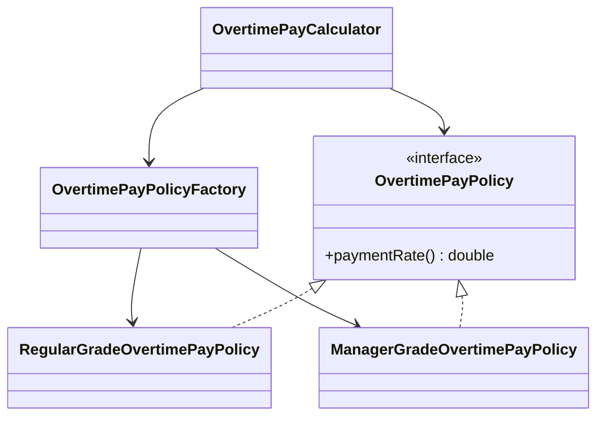
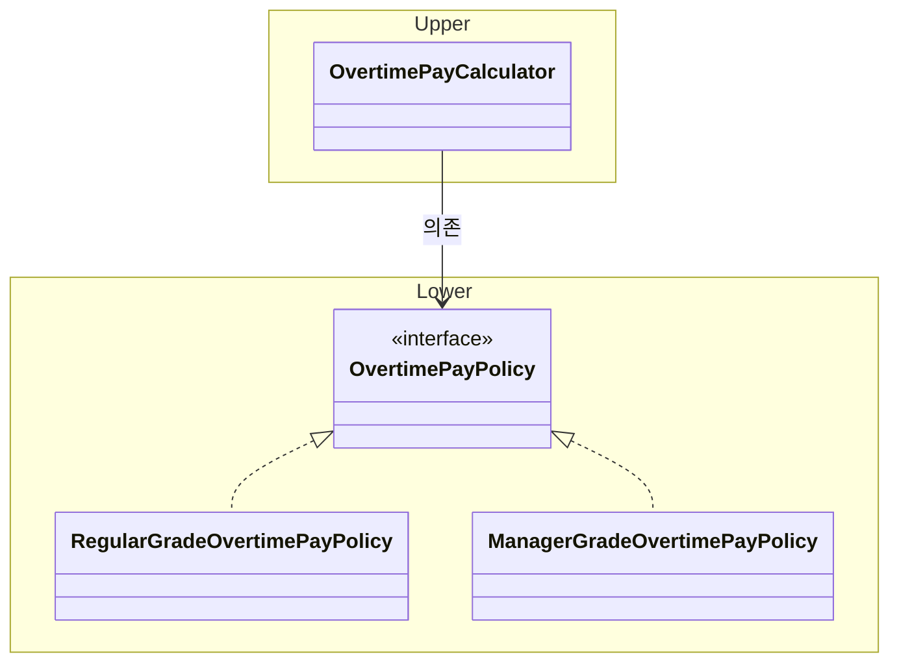
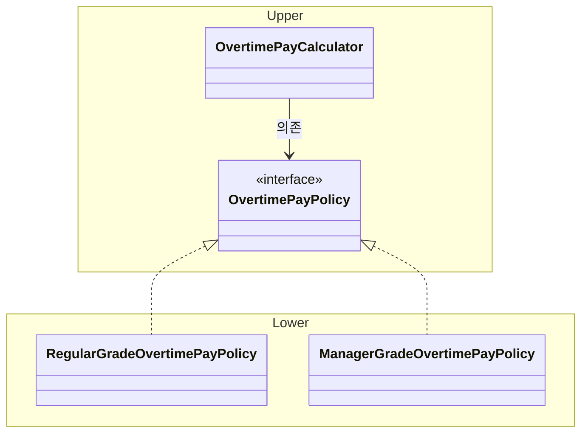
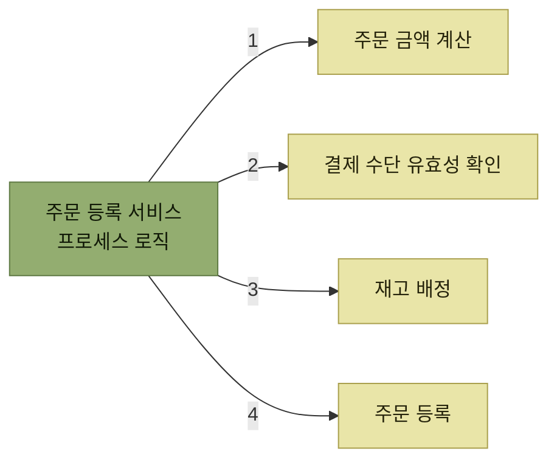
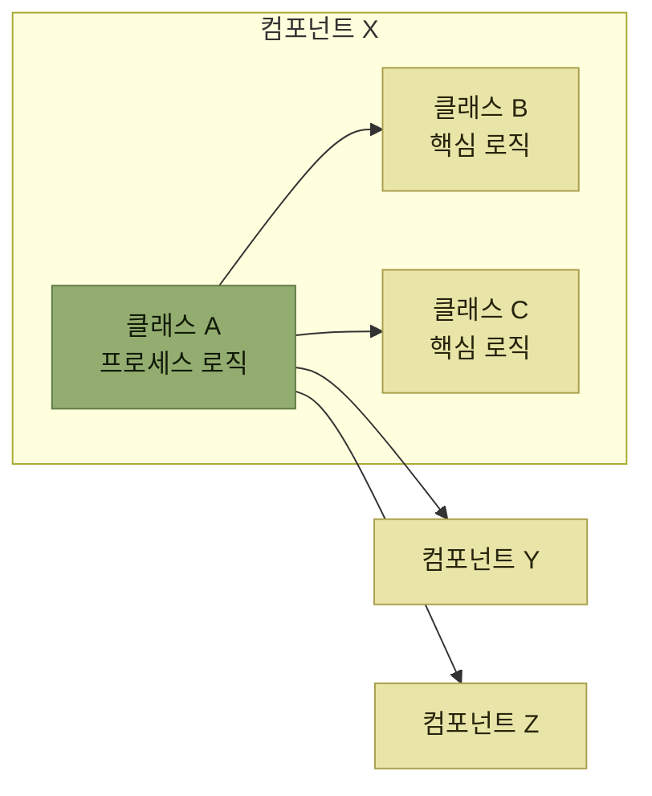

# 소프트웨어 설계 원칙과 실천 방법

> [소프트웨어 설계](./README.md)

## 빠른 복습

- 설계의 품질이 소프트웨어의 **내부 품질**을 좌우한다. 신중하지 않으면 **거대한 진흙 덩어리**에 빠져 심각한 기술 부채가 된다.
- **SRP** — 클래스를 **변경하는 이유는 단 하나**여야 한다. 세분화의 기준은 **클라이언트의 관점**이다.
- **OCP** — 확장에는 열고 수정에는 닫는다. 핵심은 수정을 없애는 것이 아니라 **안정적인 코드와 불안정한 코드를 분리**하는 것이다.
- **LSP** — 파생형은 기본형을 대체할 수 있어야 한다. **사전 조건은 강화 금지, 사후 조건은 약화 금지, 불변 조건은 유지**다.
- **ISP** — 사용하지 않는 메서드에 대한 의존을 클라이언트에게 강요하지 않는다. SRP와 밀접하다.
- **DIP** — 상위도 하위도 **추상에 의존**한다. 인터페이스를 **상위 쪽에 두어** 의존 방향을 역전시킨다.
- 이 장이 소개하는 클린 코드의 다섯 기준은 **응집성 · 느슨한 결합 · 캡슐화 · 단정적 · 비중복**이며, 서로 영향을 줄 수 있다.
- **핵심 로직(도메인 로직)** 과 **프로세스 로직(애플리케이션 서비스 로직)** 을 분리하는 관점은 여러 추상화 레벨에서 반복해 적용할 수 있다. 이 장은 그 유사성을 소프트웨어의 **프랙탈 구조**에 비유한다.

## 설계 품질이 내부 품질을 좌우한다

설계의 품질은 소프트웨어의 **내부 품질**을 좌우한다. 설계를 신중하게 하지 않으면 [1장의 거대한 진흙 덩어리 패턴](../1-아키텍트가-하는-일/3-아키텍처의-중요성.md#나누는-순간-관계가-생긴다)에 빠져 **심각한 기술 부채**가 발생한다.

[앞 절](./2-소프트웨어-설계의-추상화-레벨.md)이 설계를 **어떤 레벨에서** 하는지를 다뤘다면, 이 절은 그 각 레벨에서 **무엇을 기준으로 판단할지**를 다룬다.

## SOLID 원칙

| 약어 | 영문 표기 | 원칙 |
| --- | --- | --- |
| **SRP** | Single Responsibility Principle | 단일 책임 원칙 |
| **OCP** | Open-Closed Principle | 개방-폐쇄 원칙 |
| **LSP** | Liskov Substitution Principle | 리스코프 치환 원칙 |
| **ISP** | Interface Segregation Principle | 인터페이스 분리 원칙 |
| **DIP** | Dependency Inversion Principle | 의존성 역전 원칙 |

### SRP — 단일 책임 원칙

> 클래스는 오직 **하나의 명확한 역할(책임)** 을 가져야 한다. 즉 **클래스를 변경하는 이유는 단 하나뿐**이어야 한다.

여러 역할을 맡으면 클래스가 비대해져 **질이 낮아지거나 비효율적인 코드가 될 가능성**이 있다. 게다가 **그 클래스에 의존하는 다른 클래스도 늘어나** 의존 관계가 복잡해질 위험이 있다. 그래서 객체 지향 설계에서는 **하나의 역할을 맡는 작고 독립적인 클래스로 나누는 것**을 기본으로 한다.

근태 실적을 다루는 아래 코드를 보자.

```java
// 근태 실적
public record WorkRecord(LocalDate date, boolean isHoliday,
                         LocalDateTime clockIn, LocalDateTime clockOut, Grade grade) {

    private static final int STANDARD_WORK_HOURS = 8; // 표준 근로 시간
    private static final int BREAK_TIME = 1;          // 휴식 시간

    // 초과 근무 시간 계산
    public int calcOvertimeHours() {
        // 휴식 시간을 차감하되 근무 시간이 음수가 되지 않도록 보정
        int hours = Math.max(0,
                (int) Duration.between(clockIn, clockOut).toHours() - BREAK_TIME);
        // 휴일은 모두 초과근무로 처리
        if (isHoliday()) {
            return hours;
        }
        // 표준근로시간보다 짧은 경우는 초과근무 없음
        if (hours <= STANDARD_WORK_HOURS) {
            return 0;
        }
        // 초과근무시간 계산 (1시간 미만은 버림)
        return hours - STANDARD_WORK_HOURS;
    }

    // 초과 근무 수당 계산
    public int calcOvertimePay() {
        return calcOvertimeHours() * grade().hourlyRate();
    }
}
```

무엇이 문제인지는 **두 메서드의 사용처가 다르다**는 데서 드러난다.

- **초과근무시간**은 급여 계산 유스케이스에서 초과근무수당을 계산하는 데 쓰일 뿐 아니라, **직원의 노동 환경을 체크하는 유스케이스**에서도 참조될 가능성이 높다.
- 반면 **초과근무수당을 계산하는 로직 자체**는 **급여 계산 유스케이스에서만** 필요한 기능이다.

즉 `WorkRecord`는 **초과근무수당 계산**과 **노동환경 체크**라는 두 가지 책임을 갖고 있다. 초과근무수당 계산에 필요한 정보가 생성자 인자에 추가된다면, 이 변경은 **본래 관련이 없는 노동환경 체크 프로그램에도 영향**을 끼치게 된다.

```java
// 근태 실적 — 생성자 인수에서 Grade를 빼고, calcOvertimePay 메서드를 삭제했다
public record WorkRecord(LocalDate date, boolean isHoliday,
                         LocalDateTime clockIn, LocalDateTime clockOut) {
    // 그 외 수정 사항 없음
}

// 초과근무수당 계산 클래스
public class OvertimePayCalculator {

    // 초과근무수당 계산
    public int calcOvertimePay(int overtimeHours, Grade grade) {
        return overtimeHours * grade.hourlyRate();
    }
}
```

여기서 자연히 따라오는 고민이 있다. **각 클래스의 역할을 어느 정도까지 세분화해야 하는가.**

극단적으로 **각 클래스가 하나의 인스턴스 변수와 하나의 메서드만 갖도록 분할하는 것은 옳지 않다.** 중요한 것은 **클래스를 사용하는 클라이언트의 관점**에서 설계를 고려하는 것이다. 클라이언트는 자신이 수행해야 할 작업을 완수하기 위해 클래스에 특정 역할을 요청한다.

기준이 클래스 안쪽이 아니라 바깥쪽에 있다는 뜻이다. **"이 클래스가 하는 일이 하나인가"가 아니라 "누가 무엇을 위해 이 클래스를 부르는가"** 를 묻는다.

### OCP — 개방-폐쇄 원칙

> 소프트웨어의 구성 요소(클래스, 모듈, 함수 등)는 **확장에는 개방(Open)** 되어 있고, **수정에는 폐쇄(Closed)** 되어 있어야 한다.

**확장성**과 관련이 깊다. 기존 코드를 **수정하지 않고도**(폐쇄) 새로운 동작을 **추가하여 확장할 수 있도록**(개방) 설계하는 데 활용된다.

```java
// 초과근무수당 계산 클래스
public class OvertimePayCalculator {

    // 초과근무수당 계산
    public int calcOvertimePay(WorkRecord workRecord, Grade grade) {
        return switch (grade) {
            // 휴일은 20% 가산
            case Regular -> (int) (workRecord.calcOvertimeHours() * grade.hourlyRate()
                                   * (workRecord.isHoliday() ? 1.2 : 1));
            // 관리직은 초과근무수당 없음
            case Manager -> 0;
        };
    }
}
```

**관리직도 휴일 초과근무수당을 지급하도록 사양이 변경된다면**, 이 조건 분기 로직을 직접 수정해야 한다. 계산 규칙이 바뀔 때마다 계산기 자체를 여는 구조다.

```java
// 초과근무수당 계산 클래스
public class OvertimePayCalculator {

    // 초과근무수당 계산
    public int calcOvertimePay(WorkRecord workRecord, Grade grade) {
        var policy = OvertimePayPolicyFactory.of(workRecord.isHoliday(), grade);
        return (int) (workRecord.calcOvertimeHours() * grade.hourlyRate() * policy.paymentRate());
    }
}

// 초과근무수당 지급 정책
public interface OvertimePayPolicy {
    double paymentRate();
}

// 초과근무수당 정책 팩토리
public class OvertimePayPolicyFactory {

    public static OvertimePayPolicy of(boolean isHoliday, Grade grade) {
        return switch (grade) {
            case Regular -> new RegularGradeOvertimePayPolicy(isHoliday);
            case Manager -> new ManagerGradeOvertimePayPolicy(isHoliday);
        };
    }
}

public class RegularGradeOvertimePayPolicy implements OvertimePayPolicy {

    private final boolean isHoliday;

    public RegularGradeOvertimePayPolicy(boolean isHoliday) {
        this.isHoliday = isHoliday;
    }

    @Override
    public double paymentRate() {
        return isHoliday ? 1.2 : 1; // 휴일은 20% 가산
    }
}

public class ManagerGradeOvertimePayPolicy implements OvertimePayPolicy {

    private final boolean isHoliday;

    public ManagerGradeOvertimePayPolicy(boolean isHoliday) {
        this.isHoliday = isHoliday;
    }

    @Override
    public double paymentRate() {
        return isHoliday ? 1 : 0; // 휴일 초과근무만 지급
    }
}
```



*[그림 2.11] OCP 적용 후 클래스 다이어그램 — 계산기는 정책의 인터페이스만 알고, 등급별 규칙은 각 정책 클래스가 가진다*

여기서 오해하기 쉬운 지점을 짚는다. **확장을 위해 코드 수정이 불가피하다.** 위 구조에서도 새 등급이 생기면 팩토리는 손대야 한다.

> OCP의 핵심은 수정 과정을 완전히 없애는 것이 아니라, **변경이 적은 안정적인 코드와 변경이 잦은 불안정한 코드를 분리**하는 데 있다.

안정적인 코드를 보호하려면, **불안정하고 구체적인 구현**(특정 클래스나 메서드 같은)에 직접 의존하기보다 **이들을 일반화한 추상적인 개념에 의존**하는 방식으로 설계하는 것이 좋다.

이 구조의 실질적인 이득은 테스트에서도 나온다. 변경을 제한된 범위에 가두면 영향 분석 결과에 따라 집중적으로 확인할 단위 테스트의 범위를 좁힐 수 있다. 다만 회귀 위험, 통합 지점, 사용자 시나리오에 따라 **통합 테스트나 사용자 수용 테스트가 여전히 필요할 수 있으므로**, 코드 수정 범위가 작다는 이유만으로 전체 검증 범위를 자동 축소해서는 안 된다.

### LSP — 리스코프 치환 원칙

> **파생형은 기본형을 대체할 수 있어야 한다.**

기본형(부모 클래스)을 사용하여 작성된 모든 프로그램이, **프로그램의 동작을 변경하지 않고도** 기본형을 파생형(자식 클래스)으로 치환할 수 있어야 한다는 원칙이다.

객체 지향 언어의 추상 클래스나 인터페이스를 사용해 설계하면 이 원칙이 저절로 지켜질 것 같지만, **실제로는 위반하는 경우가 있다.**

```java
public abstract class Ticket {

    protected int point;

    public void estimate(int point) {
        if (point < 1) {
            throw new IllegalArgumentException("견적은 양의 정수(포인트)여야 한다");
        }
        this.point = point;
    }
    // 기타 메서드 생략
}

public class BugTicket extends Ticket {
}

public class StoryTicket extends Ticket {

    private static final Set<Integer> FIBONACCI_NUMBERS = Set.of(1, 2, 3, 5, 8, 13, 21);

    @Override
    public void estimate(int point) {
        if (!FIBONACCI_NUMBERS.contains(point)) {
            throw new IllegalArgumentException("견적 포인트는 피보나치 수여야 한다");
        }
        super.estimate(point);
    }
}
```

`Ticket`으로 작성된 코드가 `4`를 넘기면 어떻게 되는가. **양의 정수이므로 기본형의 조건은 만족하지만**, 피보나치 수가 아니므로 `StoryTicket`에서 `IllegalArgumentException`이 발생한다. 기본형만 보고 쓴 클라이언트 입장에서는 정당한 값을 넘겼는데 실패한 것이다.

원인은 **파생형이 기본형보다 더 까다로운 조건을 요구**한 데 있다. 지켜야 할 규칙은 세 가지다.

| 조건 | 무엇인가 | 파생형이 지켜야 할 것 |
| --- | --- | --- |
| **사전 조건** | 메서드를 호출하기 전에 만족해야 하는 조건 | **강화해서는 안 된다** |
| **사후 조건** | 메서드 실행 후 반드시 만족해야 하는 조건 | **약화해서는 안 된다** |
| **불변 조건** | 항상 만족되어야 하는 객체의 상태 조건 | **반드시 유지되어야 한다** |

표를 읽는 법. 방향이 서로 반대라는 점이 요점이다. **파생형은 요구는 더 적게, 보장은 더 많이** 해야 한다. 위 코드는 요구를 더 늘렸으므로 위반이다.

LSP를 준수하고 기본형과 파생형을 올바르게 다루려면, 애플리케이션 내에서 이들이 올바르게 작동하도록 **보장하는 조건(사전 · 사후 · 불변)을 명확히 정의**할 필요가 있다.

### ISP — 인터페이스 분리 원칙

> **사용하지 않는 메서드에 대한 의존을 클라이언트에게 강요해서는 안 된다.**

하나의 큰 인터페이스를, 각 클라이언트가 **실제로 필요로 하는 기능만 담아** 더 작고 명확한 인터페이스들로 분리하자는 설계 원칙이다.

```java
public interface Ticket {
    void start();                       // 티켓 시작
    void close();                       // 티켓 종료
    void assign(String assignee);       // 담당자 할당
    void estimate(int estimationPoint); // 견적
    void record(int actualPoint);       // 실적 기록
}

public class BugTicket implements Ticket {
    // 구현 생략
}

public class StoryTicket implements Ticket {
    // 구현 생략
}

public class IssueTicket implements Ticket {

    @Override
    public void estimate(int estimationPoint) {
        throw new UnsupportedOperationException();
    }

    @Override
    public void record(int actualPoint) {
        throw new UnsupportedOperationException();
    }

    // 다른 구현 생략
}
```

티켓 관리 도구에 **과제 티켓만을 다루는 기능**이 있다고 하자. 그 기능은 `IssueTicket`만 취급하므로 `estimate`나 `record`는 불필요하고, **인터페이스에 포함되어 있다는 점이 오히려 방해**가 된다.

더 큰 문제가 뒤따른다. `Ticket` 인터페이스를 사용하는 클라이언트 코드가 **`IssueTicket`의 특성을 고려하지 않고 메서드를 호출하면 오류가 나므로, LSP 위반이 발생**한다.

```java
public interface Ticket {
    void start();                 // 티켓 시작
    void close();                 // 티켓 종료
    void assign(String assignee); // 담당자 할당
}

public interface Estimatable {
    void estimate(int estimationPoint); // 견적
    void record(int actualPoint);       // 실적 기록
}

public class BugTicket implements Ticket, Estimatable {
    // 구현 생략
}

public class StoryTicket implements Ticket, Estimatable {
    // 구현 생략
}

public class IssueTicket implements Ticket {
    // Estimatable을 구현하지 않으므로 던질 예외도, 빈 구현도 없다
}
```

`estimate`와 `record`를 `Ticket`에서 분리했다. 이 덕분에 **견적·실적 기록에 대한 사양이 변경되어 `Estimatable`을 수정하게 되더라도 `IssueTicket`이나 그와 관련된 클라이언트 코드는 영향을 받지 않는다.** ISP는 **SRP와 밀접한 연관**이 있다 — 인터페이스를 역할별로 자르는 일이기 때문이다.

### DIP — 의존성 역전 원칙

> - **상위 모듈은 하위 모듈에 의존해서는 안 된다.** 두 모듈 모두 '추상'에 의존해야 한다.
> - **'추상'은 구현의 세부 사항에 의존해서는 안 된다.** 구현의 세부 사항이 '추상'에 의존해야 한다.

DIP는 다른 네 가지 원칙보다 **더 높은 추상 레벨에서 이해해야 하는 원칙**이다. 컴포넌트나 모듈을 분할할 때 **그들 사이의 의존 관계를 어떻게 설정할지, 관계 구조 자체를 설계 대상으로 다루기 때문**이다.

OCP에서 본 초과근무수당 계산 클래스들을 상위·하위 컴포넌트로 나눠 보자. 여기서 컴포넌트는 **Java의 패키지**와 같다고 봐도 무방하다.



*[그림 2.12] DIP 적용 전 클래스 다이어그램 — 인터페이스가 하위 쪽에 있어, 컴포넌트 의존 방향이 상위 → 하위다. 점선은 UML의 실현(구현) 관계다*

`OvertimePayCalculator`는 **상위 정책**에 해당하고, `RegularGradeOvertimePayPolicy`와 `ManagerGradeOvertimePayPolicy`가 제공하는 **구체적인 계산 규칙은 구현의 세부 사항**에 해당한다. 다만 이 두 컴포넌트 사이의 관계는 **어디까지나 상대적**이어서, 상황에 따라 상위와 하위의 구분은 달라질 수 있다.

문제는 변화의 속도가 다르다는 데 있다. **일반적으로 상위 정책보다 하위 구현의 세부 사항이 더 자주 바뀌고 불안정하다.** DIP는 이런 구조에서 **상위 모듈이 하위 모듈의 변경 영향을 받지 않도록** 하려는 동기에서 출발한다.



*[그림 2.13] DIP 적용 후 클래스 다이어그램 — 인터페이스를 상위 컴포넌트 쪽으로 옮기자 컴포넌트 간 의존 방향이 하위 → 상위로 역전된다. 점선은 UML의 실현(구현) 관계다*

**두 그림에서 이동한 것은 인터페이스 하나뿐이다.** 클래스도 그대로고 화살표의 방향도 그대로인데, **경계선이 어디를 지나가느냐만 바뀌었다.** 그 결과 컴포넌트 사이의 의존 방향이 뒤집힌다. 이것이 "역전"이라는 이름의 뜻이다.

이 구조를 통해 **상위 컴포넌트는 하위 구현의 구체적인 타입을 알지 않고 인터페이스를 기준으로 독립적인 개발과 테스트를 진행할 수 있다.** 실행 시에는 조립 코드나 DI 컨테이너가 구현을 연결해야 한다. 이 접근법은 **클린 아키텍처(clean architecture)** 와 **헥사고날 아키텍처(hexagonal architecture)** 같은 애플리케이션 아키텍처 스타일의 기초가 되며, 관련 내용은 3장에서 다룬다.

## 실천 방법

데이빗 스콧 번스타인은 『Beyond Legacy Code: Nine Practices to Extend the Life (and Value) of Your Software』에서, 설계 원칙을 준수하며 코드 품질을 개선하기 위한 실천 방법을 따를 것을 권장한다. 그가 고른 실천 방법의 기준은 이렇다.

- **대부분의 경우에 가치가 있는 것**
- **배우기 쉽고, 가르치기도 쉬운 것**
- **복잡한 사고 과정 없이도 실행할 수 있을 만큼 단순한 것**

세 기준이 모두 **난이도**를 말하고 있다는 점에 주목한다. 아무리 옳은 원칙이라도 **팀 전체가 매일 반복할 수 없으면 실천 방법이 되지 못한다.**

### 클린 코드 — 다섯 가지 품질 기준

**클린 코드**는 다섯 가지 코드 품질 기준을 충족함으로써 소프트웨어의 **내부 품질을 높이는 것**을 목표로 하는 실천 방법이다.

| 기준 | 영문 | 무엇을 말하는가 |
| --- | --- | --- |
| **응집성** | Cohesive | 컴포넌트나 모듈에 포함된 구성 요소들이 **기능적으로 서로 연관되고 하나의 목적을 중심으로 정돈된 상태** |
| **느슨한 결합** | Loosely Coupled | 한 요소의 변경이 다른 요소로 불필요하게 퍼지지 않도록 의존을 최소화한 상태. 추상화와 인터페이스는 이를 돕는 수단이다 |
| **캡슐화** | Encapsulated | 클라이언트가 **관심을 가질 필요가 없는 세부 사항을 숨기는 것** |
| **단정적** | Assertive | 필요한 **데이터와 동작을 한 곳에 보유**하여, 다른 객체에 과도하게 의존하지 않고 자신의 책임을 다할 수 있는 상태 |
| **비중복** | Nonredundant | **동일한 코드가 여러 곳에서 중복되지 않도록** 하는 것 |

표를 읽는 법. 다섯 기준은 앞의 SOLID와 따로 노는 목록이 아니다. **응집성은 SRP**와, **느슨한 결합은 OCP·DIP의 추상화를 통한 확장성 확보**와 같은 맥락이다.

- **응집성이 높은 코드**는 밀접하게 관련된 구성 요소가 모여 하나의 책임을 완수하는 구조를 가진다. **필요한 것만으로 꽉 차 있고 불필요한 요소는 배제된 상태**를 연상하면 된다.
- **캡슐화**는 클라이언트가 요구하는 것(**What**)과 이를 구현하는 방법(**How**)을 분리하는 일이다. 그러면 코드 간 결합도가 낮아진다. **내부 데이터를 감추고 필요한 동작만 외부에 공개**되도록 설계해야 결합도를 효과적으로 낮출 수 있다.

> 코드 품질 기준은 서로 연관되어 있어, 한 기준을 개선하면 다른 기준에도 긍정적인 영향을 줄 수 있다. 다만 항상 자동으로 함께 개선되는 것은 아니므로 균형과 검증이 필요하다.

## 핵심 로직과 프로세스 로직

이 장에서는 소프트웨어의 동작을 이해하는 관점으로 코드를 다음 두 가지로 나눈다.

| 구분 | 무엇인가 | 비즈니스 로직 안에서의 이름 |
| --- | --- | --- |
| **핵심 로직** | **업무에 대한 지식과 규칙**을 직접적으로 담고 있는 코드<br>(예: 할인이나 배송료를 포함한 주문 금액 계산) | **도메인 로직**(domain logic) |
| **프로세스 로직** | 여러 처리를 순서대로 엮는 **일련의 흐름**<br>(예: 금액 계산 → 결제 수단 유효성 확인 → 재고 배정 → 주문 등록) | **애플리케이션 서비스 로직**(application service logic) |

표를 읽는 법. 프로세스 로직의 중심 책임은 **여러 도메인 객체와 외부 협력자의 동작을 적절히 조율하는 것**이다. 트랜잭션 경계나 권한 확인처럼 유스케이스 수준의 정책을 포함할 수 있지만, 핵심 도메인 규칙까지 가져와서는 안 된다.



*프로세스 로직은 순서를 알고, 핵심 로직은 규칙을 안다*

일반적으로 **핵심 로직과 프로세스 로직의 역할을 명확히 분리하여 설계하면 코드의 가독성이 향상된다.** 이와 유사한 **핵심 기능과 조정 흐름의 분리 관점**은 다른 계층과 추상화 레벨에도 반복해서 적용할 수 있지만, 모든 요소가 반드시 둘 중 하나로 깔끔하게 나뉘는 것은 아니다.

프레젠테이션 계층을 예로 들면 이렇다.

- **컨트롤러**는 요청을 해석하고 애플리케이션 서비스를 호출한 뒤 응답이나 뷰를 선택하는 **프레젠테이션 흐름**을 조정한다.
- **애플리케이션 서비스**는 유스케이스의 순서를 조율하고, 업무 지식과 규칙인 **도메인 핵심 로직**은 도메인 객체나 도메인 서비스가 담당한다.
- **뷰**는 화면을 렌더링하는 프레젠테이션 책임을 맡는다. 이는 사용자에게 필요한 기능이지만 도메인 핵심 로직은 아니다.
- 컨트롤러에는 애플리케이션 서비스 내부의 여러 협력과 처리 순서가 **유스케이스를 수행하는 하나의 기능**으로 공개된다.

로직의 성격 자체가 관점에 따라 바뀌는 것은 아니다. 다만 **상위 수준에서는 하위의 여러 구성 요소와 조정 과정이 하나의 기능 경계 뒤로 캡슐화되어 보인다.** 이 반복되는 모양이 다음 이야기로 이어진다.

## 프랙탈 구조

[단일 책임 원칙](#srp--단일-책임-원칙)에 따라 소프트웨어의 구성 요소에 단일 역할을 부여하면 **코드의 응집도가 높아진다.** 그 결과 구성 요소 간 **불필요한 의존 관계가 줄어들고 결합도도 낮아질 수 있다.**

그런데 이 이야기는 레벨을 올려도 그대로 반복된다.

| 레벨 | 응집도가 높다는 것은 | 두 종류로 나뉘는 것은 |
| --- | --- | --- |
| **클래스** | 자신의 역할 수행에 **필요한 변수와 메서드만** 포함한다 | 핵심 로직을 담당하는 클래스 / 프로세스 로직을 담당하는 클래스 |
| **컴포넌트** | 그 역할 수행에 **필요한 클래스만으로** 구성된다 | 핵심 로직을 담당하는 컴포넌트 / 프로세스 로직을 담당하는 컴포넌트 |
| **모듈 · 아키텍처** | 마찬가지다 | 마찬가지다 |

표를 읽는 법. 세 줄의 문장이 **주어만 바뀌고 구조는 같다.** 이것이 프랙탈이라는 말의 뜻이다.



*[그림 2.14] 소프트웨어의 프랙탈 구조 — 클래스 안의 관계가 컴포넌트 사이에서 같은 모양으로 반복된다*

> 소프트웨어의 여러 추상화 레벨에서 유사한 분할과 협력 구조가 반복된다는 점을 **프랙탈 구조(fractal structure)** 에 비유할 수 있다.

이것이 뜻하는 바는 분명하다. **SOLID와 같은 클래스 수준의 설계 원칙이 상위 추상화 레벨에서도 확장 가능하다**는 것이다. 그리고 그러기 위해서는 각 설계 원칙의 **표면적인 실천 방법을 넘어 그 본질을 이해하고, 이를 일반화하여 사고할 수 있는 능력**이 중요하다.

[아키텍트의 추상화 능력](../1-아키텍트가-하는-일/6-아키텍트의-자질.md#추상화-능력)이 왜 자질로 꼽혔는지가 여기서 드러난다. 원칙을 외운 사람은 클래스에만 적용하지만, 본질을 이해한 사람은 **같은 판단 기준을 상위 구조에도 응용**한다.

## 핵심 정리

- 설계 품질이 내부 품질을 좌우하고, 소홀히 하면 거대한 진흙 덩어리와 기술 부채로 돌아온다.
- SRP의 기준은 클래스 안이 아니라 클라이언트 쪽에 있다. 무한히 잘게 쪼개는 것이 답이 아니다.
- OCP는 수정을 없애는 것이 아니라 안정적인 코드와 불안정한 코드를 갈라놓는 것이다. 변경 영향이 제한되면 집중할 단위 테스트 범위를 줄일 수 있지만 상위 검증 범위는 위험을 보고 결정한다.
- LSP에서 파생형은 요구를 더 적게, 보장을 더 많이 해야 한다. 사전 조건 강화가 대표적인 위반이다.
- ISP는 쓰지 않는 메서드에 대한 의존을 강요하지 않는 것이고, 이를 어기면 LSP 위반으로도 이어진다.
- DIP는 상위 정책이 정의한 추상에 하위 구현이 의존하도록 컴포넌트 의존 방향을 뒤집는다. 실행 시 구현을 연결하는 조립은 별도로 필요하다.
- 이 장의 클린 코드 다섯 기준(응집성·느슨한 결합·캡슐화·단정적·비중복)은 서로 영향을 줄 수 있지만 자동으로 함께 개선되는 것은 아니다.
- 핵심 도메인 규칙과 이를 조율하는 프로세스 로직을 분리하되, 유스케이스 수준의 정책은 프로세스 로직에 포함될 수 있다.
- 유사한 분할과 협력 구조가 클래스 → 컴포넌트 → 모듈 → 아키텍처에서 반복될 수 있으므로, 원칙의 본질을 이해해 상위 구조에 응용해야 한다.
