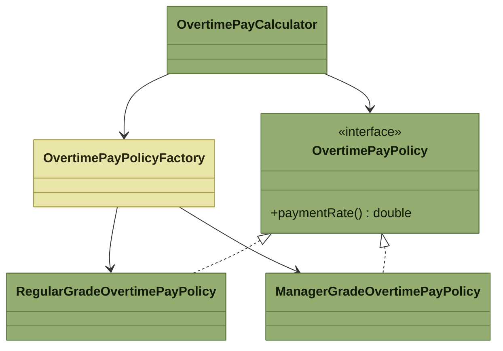
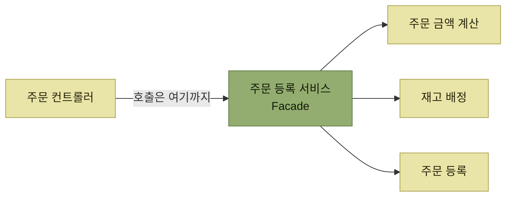
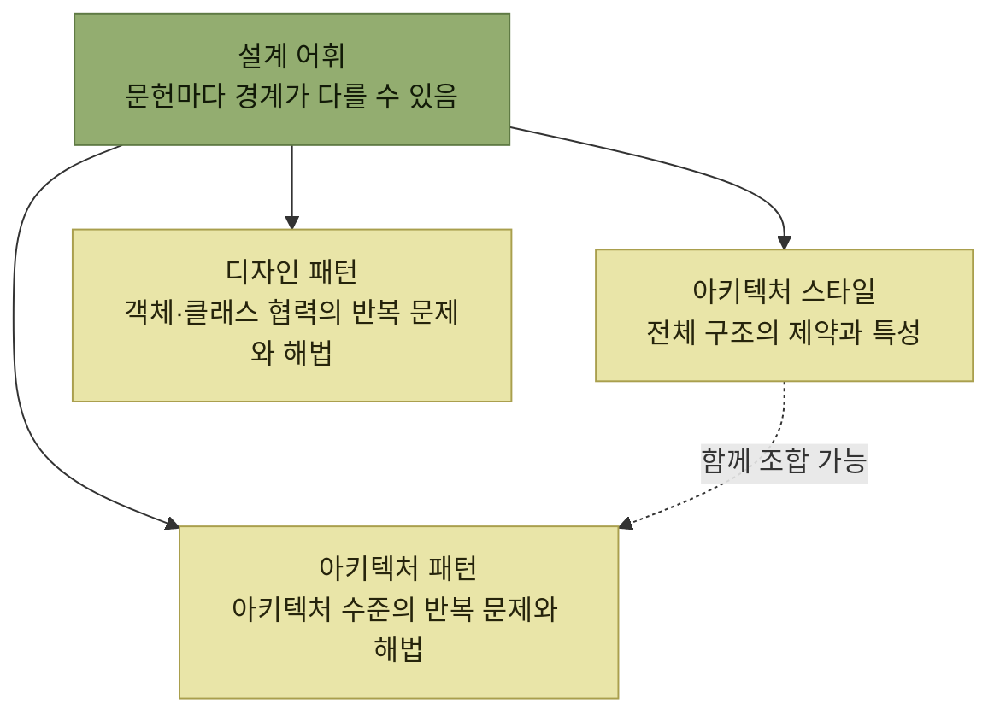

# 설계 패턴

> [소프트웨어 설계](./README.md)

## 빠른 복습

- **패턴**은 설계 과정에서 **자주 마주치는 문제의 해결책이나 접근 방식을 재사용 가능한 형식으로 정리한 것**이다.
- **GoF 디자인 패턴**은 객체 지향 시스템에서 반복되는 설계 방식에 **이름을 붙이고 설명과 평가를 덧붙인** 것이며, **생성 · 구조 · 행동** 세 갈래로 나뉜다.
- 패턴은 설계에만 있지 않다. **분석 · 구현 · 개발 프로세스 · 조직**에 이르기까지 발견되어 문헌으로 체계화되었다.
- 앞 절의 OCP 예제에는 인터페이스로 알고리즘을 분리한 GoF **Strategy**와 객체 생성 결정을 모은 **정적 팩토리**가 들어 있다. 이 정적 메서드는 GoF **Factory Method** 패턴과는 구분해야 한다.
- 이 장은 **아키텍처 스타일**을 전체 구조의 방침으로, **아키텍처 패턴**을 반복되는 문제의 구조적 해법으로 구분한다. 다만 두 용어는 문헌마다 겹치거나 바뀌어 쓰인다.
- 하나의 시스템에 여러 스타일과 패턴을 조합할 수 있다. 조합할 때는 각 선택의 제약과 충돌도 함께 검토해야 한다.
- 도메인 계층의 아키텍처 패턴으로 **트랜잭션 스크립트 · 도메인 모델 · 테이블 모듈 · 서비스 레이어**가 있고, **문제의 성격에 맞게 고르는 것**이 설계 품질을 좌우한다.

## 패턴은 이름이 붙은 해결책이다

> 패턴이란 소프트웨어 설계 과정에서 자주 접하게 되는 문제에 대한 **해결책이나 설계 접근 방식을 재사용 가능한 형식으로 정리한 것**이다.

가장 널리 알려진 것이 『Design Patterns: Elements of Reusable Object-Oriented Software』, 흔히 **GoF**로 부르는 책이다. 디자인 패턴은 객체 지향 시스템에서 **중요하면서도 반복적으로 나타나는 설계 방식을 체계적으로 정리하고, 그에 이름을 붙이고 설명과 평가를 덧붙인 것**이다.

여기서 중요한 것은 "이름을 붙였다"는 대목이다. 패턴은 새로운 기술이 아니라 **이미 여러 사람이 따로따로 도달해 있던 해법에 공통의 호칭을 준 것**이다. 이름이 생기면 설계 논의가 짧아진다.

그리고 패턴은 설계에만 한정되지 않는다. **분석과 구현, 더 나아가 개발 프로세스나 조직에 이르기까지** 소프트웨어 개발 전반에서 발견되었으며, 이러한 내용은 다양한 문헌으로 정리되어 체계화되었다.

## 디자인 패턴 23가지

| 분류 | 패턴 |
| --- | --- |
| **생성 패턴** | Abstract Factory, Builder, Factory Method, Prototype, Singleton |
| **구조 패턴** | Adapter, Bridge, Composite, Decorator, Facade, Flyweight, Proxy |
| **행동 패턴** | Chain of Responsibility, Command, Interpreter, Iterator, Mediator, Memento, Observer, State, Strategy, Template Method, Visitor |

표를 읽는 법. 세 분류는 **패턴이 무엇을 다루는지**로 갈린다. **생성**은 객체를 어떻게 만들 것인가, **구조**는 객체를 어떻게 조립해 더 큰 구조를 만들 것인가, **행동**은 객체 사이에 책임과 상호작용을 어떻게 나눌 것인가의 문제다.

## 앞 절의 코드에 이미 패턴이 들어 있었다

[OCP를 적용해 고쳐 쓴 초과근무수당 계산](./3-소프트웨어-설계-원칙과-실천-방법.md#ocp--개방-폐쇄-원칙)을 다시 꺼내 보면, 정책 교체에는 Strategy 패턴이 쓰였고 객체 생성 결정은 별도의 팩토리 클래스로 모였다.

*[그림 2.15] OCP 적용 후의 클래스 다이어그램 — Strategy 부분은 초록, 구현 객체의 선택과 생성을 모은 정적 팩토리는 노랑으로 표시했다*

### Strategy — 알고리즘을 클라이언트에서 떼어낸다

**Strategy 패턴**은 **인터페이스를 도입하여 구체적인 알고리즘을 클라이언트로부터 분리**한다. 이를 통해 클라이언트가 **추상에만 의존하고 구현 세부 사항에는 영향을 받지 않게** 만들어, **알고리즘을 교체할 수 있는 유연성을 제공하는 것**이 특징이다.

`OvertimePayCalculator`는 `OvertimePayPolicy`라는 인터페이스만 알고, 등급별 지급률이 실제로 어떻게 계산되는지는 모른다. 새 등급의 정책이 추가되어도 계산기는 그대로다.

### 정적 팩토리 — 객체를 만드는 방법도 감춘다

이 예에서 클라이언트인 `OvertimePayCalculator`는 `OvertimePayPolicy` 인터페이스의 **구현 객체를 얻기 위해** `OvertimePayPolicyFactory` 클래스의 정적 `of` 메서드를 호출한다. 구체적인 객체 선택과 생성을 클라이언트에서 분리한 구조지만, 정확히는 **정적 팩토리 또는 Simple Factory로 부르는 기법**에 가깝다.

GoF의 **Factory Method**는 객체 생성을 위한 메서드를 정의하고 하위 클래스가 생성할 구체 타입을 결정하게 하는 패턴이다. 현재 예제처럼 하나의 정적 메서드 안에서 `switch`로 구현체를 선택하는 구조와는 다르다. Strategy만으로는 **"어떤 구현체를 쓸지 고르는 순간"** 에 클라이언트가 다시 구체 클래스를 알게 되므로, 이 예제는 그 결정을 별도 팩토리에 모아 감춘다.

## Facade — 모듈 뒤에 있는 것을 숨긴다

[주문 등록 유스케이스](./3-소프트웨어-설계-원칙과-실천-방법.md#핵심-로직과-프로세스-로직)에서, 주문 컨트롤러 관점에서는 **주문 등록 서비스 뒤에 있는 객체가 숨겨져 있다**고 언급한 적이 있다. 이러한 구조는 **Facade(파사드) 패턴**의 관점으로 설명할 수 있다.

*Facade가 없으면 컨트롤러가 뒤쪽 세 컴포넌트를 각각 알아야 한다. 화살표의 출발점이 하나로 모이는 것이 이 패턴의 전부다*

Facade 패턴은 **모듈을 구성하는 개별 컴포넌트에 클라이언트가 직접 접근할 경우 모듈 간 결합도가 높아지는 문제를 방지**하기 위해, **Facade를 통해 모듈의 기능을 간접적으로 제공하는 구조**다.

[앞 절](./3-소프트웨어-설계-원칙과-실천-방법.md#핵심-로직과-프로세스-로직)에서 본 것처럼, 컨트롤러에는 서비스 내부의 여러 협력과 처리 순서가 하나의 유스케이스 인터페이스 뒤로 캡슐화되어 보인다. 이 경계를 Facade의 관점으로 이해할 수 있다.

## 아키텍처 스타일과 아키텍처 패턴

패턴은 클래스 레벨에만 있는 것이 아니다. **아키텍처 설계 단계에서 반복적으로 등장하는 문제를 해결하기 위한 방식**으로 **아키텍처 스타일**과 **아키텍처 패턴**이 있으며, 이 둘은 **설계 관점에서 차이가 있다.**

*세 용어는 적용 범위와 강조점이 다르지만 엄격한 한 줄짜리 계층은 아니다. 특히 아키텍처 스타일과 패턴은 문헌마다 서로 바뀌어 쓰이기도 한다*

### 아키텍처 스타일 — 전체의 방침을 정한다

이 장에서 **아키텍처 스타일**은 소프트웨어 구성 요소와 상호작용에 적용되는 **포괄적인 구조와 제약**을 뜻한다. 전체 방향을 설명하는 어휘로 사용하지만, 이를 아키텍처 패턴보다 항상 상위인 개념으로 보는 분류가 보편적인 표준은 아니다.

| 스타일 예시 | 주로 다루는 관심사 | 조합 시 주의할 점 |
| --- | --- | --- |
| **레이어드 · 파이프라인 · 마이크로커널** | 애플리케이션 내부의 책임 분할과 의존 구조 | 하나의 배포 단위뿐 아니라 서비스 내부에도 적용할 수 있다 |
| **서비스 기반 · 서비스 지향 · 마이크로서비스** | 서비스 경계, 분산 배포와 통합 | 분산 시스템의 운영 복잡성과 데이터 일관성을 함께 다뤄야 한다 |
| **이벤트 기반** | 이벤트를 통한 비동기 상호작용 | 모놀리스와 분산 시스템 모두에 조합할 수 있다 |
| **공간 기반** | 분산 데이터와 처리 노드로 확장성·복원력을 확보 | 데이터 복제와 일관성, 운영 난도가 커질 수 있다 |

표를 읽는 법. 이 목록은 하나를 골라 나머지를 버리는 상호 배타적 분류가 아니다. 레이어드는 서비스 내부 구조를, 이벤트 기반은 서비스 사이의 상호작용을 설명하는 식으로 **서로 다른 축의 결정을 다룰 수 있다.**

그래서 필요에 따라 **여러 스타일의 개념을 조합하여 아키텍처 방침으로 채택할 수 있다.** 다만 조합이 항상 더 좋은 것은 아니며, 각 스타일이 요구하는 제약과 운영 비용이 충돌하지 않는지 확인해야 한다. 예를 들면 이런 식이다.

- 분산 시스템 전체는 **마이크로서비스** 아키텍처를 기반으로 삼는다.
- 각각의 독립적인 서비스 내부는 **레이어드** 아키텍처의 구조를 따른다.
- 확장성이 특히 중요한 일부 서비스에는 **마이크로커널** 아키텍처의 개념을 적용한다.

### 아키텍처 패턴 — 방침을 코드의 구조로 옮긴다

이 장에서 **아키텍처 패턴**은 **아키텍처 수준에서 반복되는 특정 문제와 그 구조적 해법**을 뜻한다. [네 가지 추상화 레벨](./2-소프트웨어-설계의-추상화-레벨.md#네-개의-레벨) 가운데 모듈과 컴포넌트 설계에 구체적으로 나타날 수 있지만, 패턴에 따라 시스템 전체 구조까지 다룰 수도 있다.

『엔터프라이즈 애플리케이션 아키텍처』(위키북스, 2015)에서는 다양한 아키텍처 패턴을 소개한다. 예를 들어 **도메인 계층(비즈니스 로직 계층)** 에는 다음과 같은 패턴이 제시되어 있다.

- **트랜잭션 스크립트**
- **도메인 모델**
- **테이블 모듈**
- **서비스 레이어**

이 가운데 앞의 두 가지가 자주 대비된다.

| 패턴 | 어떻게 쓰는가 | 장점 | 대가 |
| --- | --- | --- | --- |
| **트랜잭션 스크립트** | 일련의 비즈니스 로직을 **절차적으로 기술**한다 | **명확하고 단순한 구조** | **로직이 중복되기 쉽다** |
| **도메인 모델** | **동작과 데이터를 통합한 객체 모델**을 구축해 비즈니스 로직을 표현한다 | 로직 중복을 방지하고 **복잡한 비즈니스 규칙도 표현하기 쉽다** | **설계 난이도가 높다.** 단순한 문제에는 **과도한 설계**가 될 수 있다 |

표를 읽는 법. 두 패턴은 **우열 관계가 아니라 문제의 복잡도에 대한 서로 다른 베팅**이다. 규칙이 단순한 곳에 도메인 모델을 세우면 과잉이고, 규칙이 복잡한 곳에 트랜잭션 스크립트를 두면 같은 로직이 여기저기 복사된다.

> 각 패턴의 특징을 충분히 파악한 후, 해결하고자 하는 문제의 성격에 맞게 적절한 패턴을 선택하여 활용하는 것이 **설계의 품질을 좌우하는 요소**가 된다.

패턴을 아는 것과 고를 줄 아는 것은 다르다는 뜻이다. 이 절의 목록들은 **외울 대상이 아니라 선택지의 지도**다.

## 핵심 정리

- 패턴은 반복되는 문제의 해결책에 **이름을 붙여 재사용 가능하게 만든 것**이고, 설계뿐 아니라 분석·구현·프로세스·조직에도 있다.
- GoF 디자인 패턴 23가지는 **생성 · 구조 · 행동**으로 나뉜다.
- 앞 절에서 OCP를 지키려고 짠 코드에는 **Strategy + 정적 팩토리**가 있었다. 정적 팩토리는 GoF Factory Method와 구분해야 한다.
- Facade는 **모듈 뒤의 개별 컴포넌트를 감춰 결합도를 낮추는** 구조이며, 주문 등록 서비스가 그 예다.
- 이 장은 아키텍처 스타일을 전체 구조의 제약과 특성, 아키텍처 패턴을 반복 문제의 구조적 해법으로 구분한다. 다만 문헌마다 두 용어의 경계는 다르다.
- 서로 다른 관심사를 다루는 스타일은 조합할 수 있다. 조합 자체가 목적은 아니며 제약의 충돌과 운영 비용을 함께 평가한다.
- 도메인 계층 패턴은 **트랜잭션 스크립트와 도메인 모델**이 대표적이며, **문제의 복잡도에 맞게 고르는 판단**이 설계 품질을 가른다.

## 함께 읽기

- [설계 원칙과 실천 방법](./3-소프트웨어-설계-원칙과-실천-방법.md) — 이 절의 패턴들이 어떤 원칙을 지키려다 나온 것인지
- [추상화 레벨](./2-소프트웨어-설계의-추상화-레벨.md) — 스타일과 패턴이 각각 어느 레벨에 적용되는지
- 3장의 시스템 아키텍처 선정 — 여기 나온 스타일을 실제로 고르는 과정
- 3장의 아키텍처 비교 평가 — 고른 대안을 어떻게 견주고 남기는지
