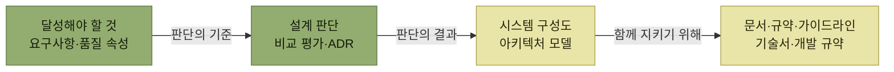
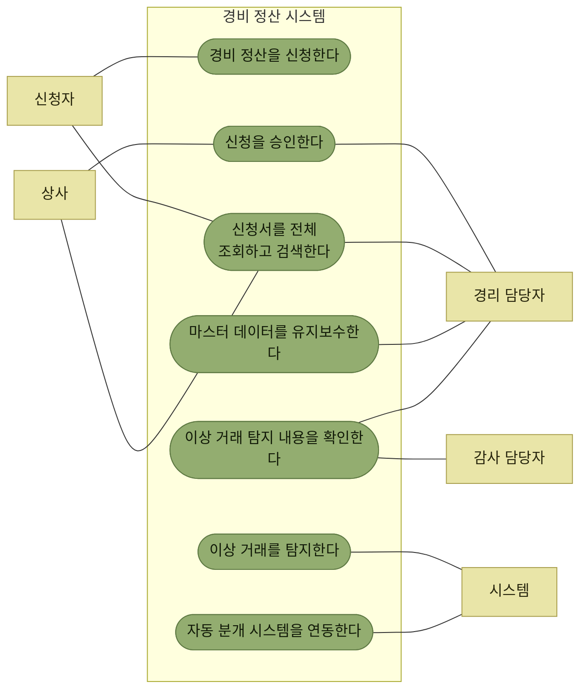

# 아키텍처 설계의 주요 개념

> [아키텍처 설계](./README.md)

## 빠른 복습

- **ISO/IEC/IEEE 42010:2011**의 정의 — 아키텍처는 **시스템이 처한 환경 속에서**, 요소·관계·**설계와 발전의 원칙**에 따라 구체화된 **시스템의 기본 개념과 특성**이다.
- 풀어 말하면 아키텍처는 **소프트웨어를 어떻게 설계하고 앞으로 어떻게 발전시킬지를 결정하는 기본 원리와 원칙**이다. **지금의 모양만이 아니라 앞으로의 방향까지** 포함한다.
- 아키텍처는 네 갈래로 이야기된다 — **달성해야 할 것 · 설계 판단 · 시스템 구성도 · 문서와 규약**.
- **시작 단계부터 누구를 위해 어떤 목적으로 만드는지**를 구체화하지 않으면 **아키텍처의 목적 자체가 흔들린다.**
- 아키텍처는 **설계 과정에서 내려지는 일련의 선택들**이며, 그래서 **아키텍처는 트레이드오프**라고도 표현한다. 그 **판단의 근거를 기록으로 남기는 것**(ADR)이 중요하다.
- 아키텍처 설계 작업은 **요구사항 도출 → 아키텍처 선정 → 문서화** 세 단계로 정리된다.

## 아키텍처는 발전의 원칙까지 포함한다

표준의 정의부터 본다.

> **아키텍처** — 시스템이 처한 환경 속에서 시스템의 요소, 관계, **설계와 발전의 원칙**에 따라 구체화된 시스템의 **기본 개념과 특성**
> (ISO/IEC/IEEE 42010:2011)

시스템은 **특정 과제를 해결하고 사용자에게 가치를 제공하는 것을 목표**로 한다. 그 목표를 두고, 아키텍처는 **소프트웨어를 어떻게 설계하고 앞으로 어떻게 발전시킬지를 결정하는 기본 원리와 원칙**이 된다.

정의에서 눈여겨볼 곳은 **"발전의 원칙"** 이다. 아키텍처는 완성된 구조의 이름이 아니라, **앞으로 무엇을 어떻게 바꿔 나갈지에 대한 약속**까지 포함한다. [어질리티](../1-아키텍트가-하는-일/2-어질리티-변화에-대한-적응-능력.md)가 아키텍처의 문제였던 이유가 여기에 있다.

## 아키텍처는 네 갈래로 이야기된다

| 갈래 | 무엇을 정하는가 | 산출물 |
| --- | --- | --- |
| **아키텍처로 달성해야 할 것** | 시스템이 누구를 위해 무엇을 이뤄야 하는가 | 비즈니스적 요구사항, 기능, **품질 속성** |
| **설계 판단** | 여러 선택지 가운데 무엇을 왜 골랐는가 | 비교 평가 매트릭스, **아키텍처 의사결정 기록(ADR)** |
| **시스템 구성도** | 어떤 구성 요소로 나뉘고 어떻게 상호작용하는가 | 아키텍처 모델 |
| **문서 · 규약 · 가이드라인** | 그 개념과 방침을 팀이 어떻게 일관되게 지키는가 | 아키텍처 기술서, 개발 규약, 자동화된 검증 시스템 |

표를 읽는 법. 네 갈래는 병렬 목록이 아니라 **순서**다. **목표가 판단의 기준이 되고, 판단의 결과가 구성도로 나타나며, 구성도를 여러 사람이 함께 지키기 위해 문서와 규약이 필요해진다.**

*네 갈래는 앞의 것이 뒤의 것을 낳는 순서로 이어진다*

### 무엇을 위한 시스템인지를 먼저 못박는다

**시작 단계부터 시스템이 누구를 위해, 어떤 목적으로 만들어지는지를 구체화해야 한다.** 그렇지 않으면 **아키텍처의 목적이 흔들릴 수 있고, 시스템이 기대한 대로 동작하지 않을 수 있기 때문**이다.

그래서 하는 일이 **선별**이다.

- **비즈니스적 요구사항과 그에 따라 도출된 기능** 중 **아키텍처에 영향을 미치는 요소**를 선별한다.
- **비기능적 요소 중에서도 품질에 영향을 주는 요소**를 찾아낸다.

이렇게 해서 **아키텍처가 달성해야 할 목표를 명확히 설정한다.** 요구사항 전부가 아키텍처의 문제가 되는 것은 아니라는 점이 요점이다. 이 선별의 결과가 [다음 절의 아키텍처 드라이버](./2-아키텍처-드라이버의-핵심-사항.md)다.

### 아키텍처는 트레이드오프다

목표를 실제로 구현하기 위해 아키텍처를 구체적으로 선정하는 과정에서는 **다양한 설계 판단**을 내려야 한다. 그래서 아키텍처를 **설계 과정에서 내려지는 일련의 선택들**로 보거나, **아키텍처는 트레이드오프**라고 표현하기도 한다.

> 아키텍처 선정에 이르게 된 **판단의 근거나 이유는 기록으로 남기는 것이 중요**하다. 이렇게 기록한 것들이 **향후 아키텍처를 발전시켜 나가는 과정에서 참고할 만한 자료**가 되기 때문이다.

기록의 이유가 "결정을 증명하기 위해서"가 아니라 **"나중에 바꾸기 위해서"** 라는 데 주의한다. 앞의 정의에 있던 **발전의 원칙**이 여기서 실무의 모습을 갖춘다. 무엇을 포기하고 무엇을 얻었는지가 남아 있어야, 전제가 달라졌을 때 그 결정을 다시 열어볼 수 있다.

### 구성도는 코드가 되어야 비로소 동작한다

여러 관점에서 이루어진 설계 판단의 결과로 **시스템이 어떤 구성 요소로 나뉘고 이들이 어떻게 상호작용하는지**가 결정된다. 이 과정에서 형성된 **논리적 구조를 도식으로 표현한 것이 시스템 구성도**다.

시스템 구성도는 개발할 소프트웨어의 **주요 개념과 기본 방침**을 나타낸다. 이를 구체화하기 위해 **소스 코드로 변환하면 비로소 동작 가능한 소프트웨어 시스템이 완성된다.**

그리고 대규모 시스템에서는 **여러 개발자가 함께 작업**하게 되므로, 아키텍처의 개념과 방침을 **일관되게 유지하려면 개발 문서와 규약, 가이드라인을 체계적으로 갖추는 것이 중요**하다. 문서와 규약이 네 번째 갈래로 들어와 있는 이유는 **아키텍처가 사람 여럿을 거쳐야 코드가 되기 때문**이다.

## 아키텍처 설계 작업

| 작업 | 주요 내용 | 산출물 예시 |
| --- | --- | --- |
| **핵심 아키텍처 요구사항 도출** | 요구사항 분석·정리, **아키텍처 드라이버 선정** | 아키텍처 드라이버 목록(선정 과정에서 도출된 결과물), 품질 속성 시나리오 |
| **아키텍처 선정** | 아키텍처 패턴의 활용 여부 검토, **트레이드오프 분석 / 비교 평가** | 아키텍처 모델, 비교 평가 매트릭스, 아키텍처 프로토타입, **아키텍처 의사결정 기록(ADR)** |
| **아키텍처 문서화** | 아키텍처 관련 문서 작성 | 아키텍처 기술서, 각종 규약·가이드라인 |

표를 읽는 법. 앞의 네 갈래를 **작업의 순서로 다시 늘어놓은 것**이다. 첫 줄이 "달성해야 할 것", 둘째 줄이 "설계 판단과 시스템 구성도", 셋째 줄이 "문서와 규약"에 대응한다. 3장의 나머지 절들이 이 표를 위에서 아래로 따라간다.

## 사례 연구 — 경비 정산 시스템

3장은 이해를 돕기 위해 **가상의 소프트웨어 개발 프로젝트**를 사례로 삼는다. 뒤에 나오는 드라이버 선정과 아키텍처 비교가 모두 이 프로젝트를 대상으로 하므로, 요구사항을 한 번 훑어둔다.

### 프로젝트 개요

- 전체 **그룹사 약 20개, 직원 3만 명**에 달하는 **대기업의 경비 정산 시스템** 개발이 목적이다.
- 일반적으로 경비 정산 업무는 **SaaS나 패키지를 이용하는 경우가 많지만**, 많은 직장인이 경비 정산을 해본 경험이 있어 **업무를 쉽게 떠올릴 수 있다는 점**에서 이 소재를 선정했다.

### 유스케이스

*[그림 3.2] 경비 정산 시스템의 유스케이스 — 가운데 초록이 유스케이스, 바깥 노랑이 액터다. 선은 방향 없는 연관 관계다*

액터가 다섯이고 그중 하나가 **시스템 자신**이라는 점을 눈여겨본다. **이상 거래 탐지와 자동 분개 연동은 사람이 시작하지 않는다.** 이 두 유스케이스가 뒤에서 아키텍처를 가르는 요구가 된다.

### 기능 요구사항

요구사항은 **`REQ-nn` 형식의 관리 번호**로 표기한다.

- **[REQ-11]** 대납 비용을 정산하기 위한 **신청과 승인**을 할 수 있다. (교통비, 국내외 출장여비, 접대비, 일반 경비)
- **[REQ-12]** **그룹사별 사내 규정에 따라** 신청서 항목과 입력 검증 방식을 **커스터마이징**할 수 있다.
- **[REQ-13]** 교통비 **경로 탐색**을 할 수 있다. (**외부 서비스 이용**)
- **[REQ-14]** 최종 승인된 경비 정산 신청 데이터를 기준으로 **회계 분개 데이터를 작성**하고, 이를 **회계 ERP에 자동 연동**할 수 있다.
- **[REQ-15]** 신청된 경비 정산 신청 데이터를 대상으로 **이상 거래 여부를 검사**할 수 있다. (**머신 러닝을 통한 패턴 감지** 및 규칙 위반 사항에 대한 감지 포함)
- **[REQ-16]** 워크플로로 처리되는 경비 정산뿐만 아니라 **인사·총무 등 다양한 업무에도 활용**할 수 있도록 **공통 워크플로 엔진**으로 구성한다.
- **[REQ-17]** 신청서에 첨부된 증빙(영수증이나 청구서)에 **타임스탬프를 부여**하여 **전자문서 및 전자거래기본법 요건**에 맞춰 관리한다.

### 비기능 요구사항

- **[REQ-21]** **SSO**(Single Sign-On)로 로그인 인증이 가능하도록 한다.
- **[REQ-22]** **사용자 역할에 따라 이용 가능한 기능**을 제한한다.
- **[REQ-23]** **사용자 역할에 따라 데이터 열람 가능 범위**를 제한한다.
- **[REQ-24]** 신청과 승인은 **스마트폰이나 태블릿 단말기에서도** 가능하도록 한다.
- **[REQ-25]** 사용자는 각 그룹사를 포함해 **약 3만 명**의 직원으로 한다.
- **[REQ-26]** **월말과 월초에 신청과 승인이 집중되는 상황**(피크 타임에 **시간당 약 1,000건** 신청 예상)에서도 **스트레스 없이** 시스템을 이용할 수 있도록 한다.

이 목록을 그대로 읽으면 서로 성격이 다른 요구가 섞여 있다는 것이 보인다. **[REQ-12]는 변경 용이성**, **[REQ-16]은 재사용성**, **[REQ-25]·[REQ-26]은 성능과 확장성**, **[REQ-21]~[REQ-23]은 보안**의 이야기다. 이 가운데 **아키텍처를 가르는 것만 골라내는 일**이 [다음 절의 주제](./2-아키텍처-드라이버의-핵심-사항.md)다.

## 핵심 정리

- 42010의 정의에서 아키텍처는 **요소와 관계뿐 아니라 "발전의 원칙"** 까지 포함한다.
- 아키텍처는 **달성해야 할 것 → 설계 판단 → 시스템 구성도 → 문서·규약**의 순서로 구체화된다.
- **누구를 위해 무엇을 위한 시스템인지**를 먼저 못박지 않으면 아키텍처의 목적이 흔들린다.
- 요구사항 전부가 아니라 **아키텍처에 영향을 주는 것만 선별**해 목표로 삼는다.
- 아키텍처는 **일련의 선택**, 곧 **트레이드오프**이며, 그 근거를 **ADR로 남기는 이유는 나중에 다시 바꾸기 위해서**다.
- 설계 작업은 **요구사항 도출 · 아키텍처 선정 · 문서화** 세 단계이고, 3장이 이 순서를 따라간다.
- 사례로 삼는 **경비 정산 시스템**은 그룹사 20개·직원 3만 명 규모이며, 요구사항 안에 **커스터마이징·재사용·성능·보안**이 뒤섞여 있다.

## 함께 읽기

- [추상화 레벨의 맨 위 — 이 절이 말하는 "아키텍처"가 어느 자리인지](../2-소프트웨어-설계/2-소프트웨어-설계의-추상화-레벨.md#아키텍처-설계)
- [아키텍처 스타일과 패턴 — 선정 단계에서 후보가 되는 것들](../2-소프트웨어-설계/4-설계-패턴.md#아키텍처-스타일과-아키텍처-패턴)
- [아키텍트 — 이 판단들을 실제로 내리는 사람](../1-아키텍트가-하는-일/4-아키텍트.md)
