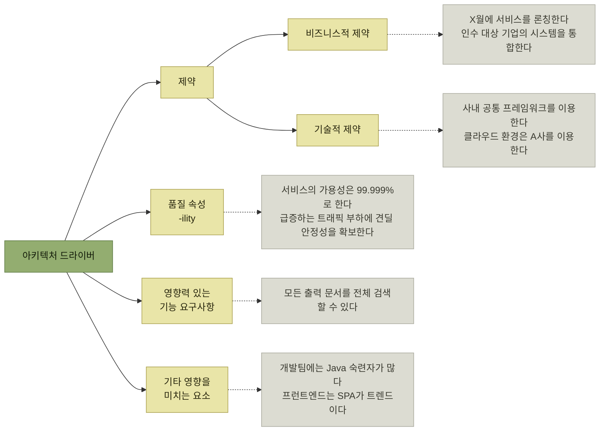

# 아키텍처 드라이버의 핵심 사항

> [아키텍처 설계](./README.md)

## 빠른 복습

- **아키텍처 드라이버**는 **시스템의 구조를 검토할 때 중요한 고려 사항이 되는 요구사항**이다. **제약 · 품질 속성 · 영향력 있는 기능 요구사항 · 기타 영향을 미치는 요소** 네 갈래로 분류한다.
- **제약**은 **개발부터 운영 환경 배포까지 전 과정에 부과되는 특정 조건**이며, **비즈니스적 제약**(예산·일정·법규)과 **기술적 제약**(언어·프레임워크·환경)으로 나뉜다.
- **품질 속성**은 소프트웨어 품질을 **측정 가능한 속성으로 정의한 것**이고, **KS X 25010**이 8개 품질 속성과 그 아래 **품질 부속성**으로 분류한다.
- 8개 품질 속성은 **모두 아키텍처 드라이버 후보로 검토**한다. 기능 적합성과 유용성도 핵심 기능의 구조적 복잡성, 접근성, 인증 흐름, UI 제공 채널 등에 따라 아키텍처에 영향을 줄 수 있다.
- 어느 품질 속성이 드라이버가 되는지는 **기술적 위험이 있느냐**로 갈리고, 그 판단은 **설계자와 조직의 과거 경험**에 달려 있다.
- **품질 속성 시나리오**는 **외부 입력 · 요청 주체 · 적용 대상 · 처리 결과 · 결과 측정 · 환경** 여섯 요소로 **달성 조건을 오해 없이** 적는 방법이다. **형식보다 합의가 목적**이다.
- **기능 요구사항도 아키텍처를 가를 수 있다.** 그래서 비기능 요구사항만이 아니라 유스케이스까지 **심층적으로 파악**해야 한다.
- **팀의 지식과 기술 수준, 기술 트렌드, 오픈소스의 지원 중단 위험**도 아키텍처에 영향을 준다.

## 드라이버는 네 갈래로 분류된다

> **아키텍처 드라이버**(architectural driver) — 시스템의 구조를 검토할 때 **중요한 고려 사항이 되는 요구사항**

아키텍트는 **시스템의 요구를 분석하는 과정에서 주요 요구사항이 되는 항목들을 수집하고 정리한다.** 그 결과를 네 갈래로 늘어놓으면 이렇게 된다.

*[그림 3.3] 아키텍처 드라이버 — 실선은 분류, 점선 끝의 회색은 원서가 각 갈래에 붙여둔 예시다*

## 제약 — 개발부터 배포까지 걸리는 조건

**제약**은 **시스템의 개발부터 운영 환경에 배포되기까지의 전 과정에 부과되는 특정 조건**을 뜻한다.

- **비즈니스적 제약** — 프로젝트의 **예산, 일정** 등이다. 운영 단계에서는 **유지보수 및 관리 비용**까지 고려해야 한다. **외부 환경으로부터 영향을 받는 제약**도 있다. **법적 규제를 지키기 위해 정해진 기한 내에 서비스를 출시**해야 할 수도 있고, **업계 표준을 따르지 않으면 경쟁에서 불리해질 위험**도 있다.
- **기술적 제약** — 사용해야 하는 **프로그래밍 언어, 라이브러리, 프레임워크, 개발 환경** 등에 대한 조건이다. 일부 기업에서는 **IT 정책을 통해 기술적 요구사항을 명확히 정하거나 특정 기술을 권장**하기도 한다.

경비 정산 시스템의 제약은 이렇게 정리되었다.

| 유형 | 제약 사항 | 이유(제약 배경) |
| --- | --- | --- |
| **비즈니스** | 내년 초에 시스템을 릴리스한다 | 현재 이용 중인 패키지가 **EOS**(End of Support, 공식 지원 종료) 상태가 되므로, 새로운 시스템에서 경비 정산을 해야 함 |
| **기술** | RDBMS는 **PostgreSQL**을 채택한다 | 전사 DBA팀, 공통 DBA팀의 지원 가능 |
| **기술** | **A사의 클라우드 환경**에서 운영한다 | 클라우드 비용 최적화 옵션을 통해 더 낮은 요금으로 운영 가능 |

표를 읽는 법. 오른쪽 열이 있다는 것이 요점이다. **제약은 "정해졌으니 따른다"가 아니라 배경이 있는 판단**이다. 배경이 적혀 있어야 전제가 달라졌을 때 — 지원이 연장되거나 다른 클라우드가 더 싸지면 — 그 제약을 다시 열어볼 수 있다.

## 품질 속성

소프트웨어 품질에는 **성능, 사용 편의성처럼 사용자가 직접 이용하고 인식할 수 있는 외부 품질**과, **유지보수의 용이성처럼 사용자에게 드러나지 않는 내부 품질**이 있다.

### 품질 모델 — 측정 가능한 속성으로 정의한다

> 소프트웨어 품질을 **측정 가능한 속성으로 정의한 것**이 **품질 속성**(quality attribute)이다.

이러한 품질 속성을 정리하고 분류한 품질 모델로 **KS X 25010**(ISO/IEC 25010:2011) 표준 규격이 있다. 8개 항목을 **품질 속성**, 그 아래 나열된 항목을 **품질 부속성**(sub-quality attribute)으로 분류한다.

| 품질 속성 | 품질 부속성 | 아키텍처 관점 |
| --- | --- | --- |
| **기능 적합성** | 기능 성숙도, 기능 정확도, 기능 타당성 | 기능 설계가 중심이지만 구조적 영향도 함께 검토 |
| **수행 효율성** | 시간 반응성, 요소 활용, 기억 용량 | **검토 대상** |
| **호환성** | 공존, 상호 운용성 | **검토 대상** |
| **유용성** | 타당성 식별력, 학습성, 운용성, 사용자 오류 보호, 사용자 인터페이스 미학, 접근성 | UX/UI가 중심이지만 접근성·운영 구조 등 아키텍처 영향도 존재 |
| **신뢰도** | 성숙도, 가용성, 결점 완화, 회복 가능성 | **검토 대상** |
| **보안성** | 기밀성, 무결성, 부인 방지, 책임성, 진본성 | **검토 대상** |
| **유지가능성** | 모듈성, 재사용성, 분석성, 수정 가능성, 시험 가능성 | **검토 대상** |
| **이식성** | 적용성, 설치성, 대체성 | **검토 대상** |

*원서 [그림 3.4] 품질 모델 (KS X 25010)*

표를 읽는 법. 셋째 열이 이 절의 실제 주장이다. **수많은 품질 속성 가운데 자신이 설계하는 아키텍처에서 특히 중요한 것, 곧 아키텍처 드라이버가 되는 품질 속성을 명확히 지정해야 한다.** 기능 적합성과 유용성은 기능·UX 설계에서 주로 다루더라도 아키텍처와 무관하지 않으므로, 요구와 위험에 따라 여덟 속성 모두 후보로 검토한다. 품질 속성 이름이 대개 `-ility`로 끝나 우리말로는 **'-성', '-도'** 로 옮겨진다.

### 수행 효율성 — 몰리는 시간에도 버티는가

**시스템의 성능**을 나타내는 품질 속성이다. **처리 응답 시간과 처리량**(시간 반응성), **시스템 리소스 크기**(기억 용량) 등의 부속성을 포함한다.

외주 개발 프로젝트라면 **RFP**(Request for Proposal)에 비기능 요구사항으로 명시되어 있는 경우가 많다. **명확하게 정의된 비기능 요구사항이 없을 경우**에는 **현재 운영 중인 업무나 시스템의 트랜잭션량을 기준으로 추정**하거나, **비즈니스의 향후 확장 계획을 고려하여 요구 수준을 결정**한다.

**동시 트랜잭션 수가 매우 많거나 방대한 양의 데이터를 처리해야 하고, 거기에 기술적 위험이 있다면** 수행 효율성은 아키텍처 드라이버 후보가 된다. 다만 **실제 위험으로 간주할지는 설계자나 조직의 과거 경험에 따라 달라진다.**

이 마지막 문장이 이 절 전체에 반복해서 나온다. **같은 숫자라도 그것을 해본 팀에게는 제약이 아니고, 처음 하는 팀에게는 아키텍처를 가르는 위험**이라는 뜻이다.

### 호환성 — 남과 나란히 설 수 있는가

두 가지 부속성으로 구성된다.

- **공존**(co-existence) — 여러 시스템이 **다른 시스템에 영향을 주지 않으면서 환경과 자원을 공유**할 수 있는가.
- **상호 운용성**(interoperability) — 여러 시스템 간 **연계가 원활하게** 이루어질 수 있는가.

**마이크로서비스 등 여러 서브시스템으로 구성된 시스템**에서 특히 중요하고, **외부 시스템이나 서비스와 연계할 때 기술적 위험이 존재한다면** 아키텍처 설계 시 이를 고려해야 한다. **트랜잭션이 여러 시스템에 걸쳐 이루어지는 분산 트랜잭션이 필요한 경우**에는 공존과 상호 운용성을 만족하도록 **구현 방법을 검토하고 검증**해야 하며, 이를 **아키텍처 드라이버로 인식하는 것이 중요**하다.

### 신뢰도 — 필요할 때 거기 있는가

시스템을 **안정적으로 이용할 수 있는 정도**를 나타낸다.

| 부속성 | 묻는 것 |
| --- | --- |
| **가용성** | 시스템이 필요할 때 **상시 이용 가능한가** |
| **결점 완화** | **일부에서 장애가 발생해도** 시스템의 운용이 계속 가능한가 |
| **회복 가능성** | 시스템이 다운되었을 때 **적절한 시간 내에 정상 상태로 복구**할 수 있는가 |

표를 읽는 법. 세 줄은 **장애 전 · 장애 중 · 장애 후**의 이야기다. 어느 것을 얼마나 요구할지는 시스템마다 다르다.

**얼마나 높은 수준의 가용성과 결점 완화가 필요한지, 이를 위해 어느 정도의 시스템 중복화가 필요한지는 업무의 중요도에 따라 다르다.**

- **주문 및 출하와 같은 핵심 업무**가 중단되면 **판매 기회 손실**로 이어지므로 높은 수준의 가용성과 결점 완화가 요구된다.
- **주변 정보 시스템**이라면 상대적으로 허용 범위가 넓을 수 있다.
- **B2B나 B2C 서비스**의 경우 **SLA**(Service Level Agreement)에 따라 요구 품질 수준이 사전에 명시되며, 이를 충족하지 못하면 **이용 금액 감액이나 환불 등의 보상**이 필요할 수 있다.

여기서도 마찬가지로, **설계자나 조직의 과거 경험에 비추어 기술적 위험이 있다고 판단된다면** 신뢰도는 아키텍처 드라이버 후보가 된다.

### 보안성 — 지켜야 할 것을 지키는가

시스템이 취급하는 **정보와 데이터를 안전하게 보호할 수 있는 정도**다. 사용자가 **허가된 정보와 데이터에만 접근**할 수 있는가(**기밀성**), 정보와 데이터를 **부정 접근으로부터 보호하고 완전한 상태로 유지**할 수 있는가(**무결성**) 같은 부속성을 가진다.

요구 수준은 **취급하는 정보와 데이터가 얼마나 기밀한지**, **정보 유출 등 중대한 보안 사고 발생 시 예상되는 손실 규모**에 따라 달라진다. 그리고 **개인정보보호법, 전자문서 및 전자거래 기본법 등 법률에서 정한 보안 요건을 충족하는 것이 필수인 경우**도 있으므로, **시스템이 취급하는 정보와 데이터의 종류를 정확히 파악**해야 한다. **주의가 필요한 보안 요건은 아키텍처 드라이버로 인식**해야 한다.

### 유지 가능성 — 고치기 쉬운가

**시스템의 수정, 보수, 확장이 얼마나 효율적이고 용이한지**를 나타낸다. **적절한 구성 요소로 분해되어 있는가**(모듈성), **성능 저하 등의 문제 없이 효율적으로 소스 코드를 수정할 수 있는가**(수정 가능성), **유효성이 높은 테스트를 효율적으로 수행할 수 있는가**(시험 가능성)가 여기에 해당한다.

[2장의 설계 원칙들](../2-소프트웨어-설계/3-소프트웨어-설계-원칙과-실천-방법.md#solid-원칙)이 겨냥하던 것이 바로 이 품질 속성이다. 다른 품질 속성과 달리 **사용자에게 드러나지 않는 내부 품질**이라는 점도 같다.

### 이식성 — 옮겨 심을 수 있는가

**시스템을 다른 환경이나 플랫폼으로 쉽게 이전할 수 있는 정도**다. **설치 및 배포가 효율적으로 이루어지는가**(설치성), **같은 목적의 다른 제품 또는 제품의 새로운 버전으로 쉽게 대체할 수 있는가**(대체성) 등의 부속성을 가진다.

**패키지 제품이나 서비스 개발 분야에서 특히 중요**하다.

- **마이크로서비스로 구성되어 하루에 여러 번 배포되는 시스템**에서는 **설치성**이 높아야 한다.
- **패키지 제품**은 도입 시 개발된 **애드온이 대체성을 저해할 위험**이 있으므로, 아키텍처 설계 시 이를 **회피하거나 완화할 수 있는지** 고려해야 한다.
- **개별 시스템**이라도 로컬 환경에서 개발·디버깅한 후 클라우드 환경에 배포하여 테스트하는 과정이 일반적이므로, **설치성을 충분히 고려하는 것이 좋다.**

### 경비 정산 시스템의 품질 속성

| 품질 속성 | 품질 부속성 | 적용 예시 |
| --- | --- | --- |
| **수행 효율성** | 시간 반응성 | 월말·월초에 신청이 집중되는 시간대에도 **단위 시간당 일정량을 처리**할 수 있어야 함. 특히 **경리 담당자는 많은 회계 내역을 처리**하므로 응답 속도가 저하되지 않아야 함 |
| **호환성** | 상호 운용성 | **회계 ERP나 경로 탐색 서비스와의 연동**이 필요함. **워크플로 엔진을 공통 서비스로 구현**하여 제공하고, 이를 각 시스템과 연동해야 함 |
| **보안성** | 기밀성 | **역할 기반 액세스 제어** 기능과 **데이터 접근 권한 관리**가 필요함 |
| **보안성** | 무결성 | **전자문서 및 전자거래기본법을 준수**하여 **증빙의 위·변조를 방지**해야 함 |
| **유지 가능성** | 분석성 | 시스템 장애나 애플리케이션 장애가 발생했을 때 **로그를 추적하여 원인을 명확히 파악**할 수 있어야 함 |
| **유지 가능성** | 수정 가능성 | **변경 요구에 유연하게 대응**할 수 있으며, **커스터마이징이 쉽고 변경이 용이**해야 함 |

표를 읽는 법. 오른쪽 칸의 문장들이 [앞 절의 REQ 목록](./1-아키텍처-설계의-주요-개념.md#비기능-요구사항)에서 온 것임을 확인할 수 있다. **요구사항 목록이 품질 속성의 이름으로 다시 정리된 것**이 이 표다.

### 품질 속성 시나리오 — 어느 수준까지인지를 적는다

품질 속성은 **품질을 평가할 수 있도록 측정 가능한 기준으로 구성**되므로, **어느 수준까지 충족해야 하는지를 분명히 정의하는 것이 중요**하다. 이를 위해 **시스템이 특정 환경이나 상황에서 구체적으로 어떻게 동작해야 하는지를 시나리오 형식으로 기술하는 방법**이 **품질 속성 시나리오**다.

| 시나리오 요소 | 요소 설명 | 사례 시나리오 |
| --- | --- | --- |
| **외부 입력** | 시스템에 응답을 요구하는 **이벤트** (예: 사용자 조작, API 호출) | 경비 정산 신청서에 증빙(영수증, 청구서)으로 **이미지 또는 PDF 파일 첨부** |
| **요청 주체** | 외부 입력의 **주체(엔티티)** (예: 사용자, 시스템) | 사용자(신청자) |
| **적용 대상** | 외부 입력을 처리하는 **시스템 또는 시스템의 일부** | 경비 정산 서비스 |
| **처리 결과** | 외부 입력의 결과로 시스템에 나타나는 **관찰 가능한 동작** | **타임스탬프가 부여된 증빙 파일**이 생성되고, 증빙 관리 서비스에 저장됨 |
| **결과 측정** | 산출물이 목표를 달성했는지 판단하기 위한 **기준** | **신청 후 1시간 이내**에 모든 첨부 증빙 파일에 타임스탬프가 부여됨 |
| **환경** | 시스템을 둘러싼 **환경 조건** | **월말·월초의 피크 타임** |

표를 읽는 법. 여섯 요소는 **"누가 · 무엇을 하면 · 어디서 · 무엇이 일어나고 · 그것을 무엇으로 재며 · 어떤 상황에서인가"** 를 빠짐없이 적게 하는 칸이다. 특히 **결과 측정**이 있어야 "빠르게"나 "안전하게" 같은 말이 검증 가능한 문장이 된다.

형식에 얽매일 필요는 없다.

- 품질 속성 시나리오는 **형식적인 틀이 있지만 반드시 따를 필요는 없다.** 여섯 요소 중 **필요한 요소만 골라 기술해도 무방**하다.
- **결과 측정 조건은 가급적 정량적으로** 기술하는 것이 좋지만, **일부 품질 속성은 정량적으로 표현하기 어렵다.** 그런 경우에는 **정성적 기준을 기술하되 구체적인 예를 추가**하는 등 알기 쉽게 표현한다.

> 중요한 것은 아키텍처 드라이버로 선정된 각 품질 속성의 **달성 조건을 누구나 오해 없이 명확하게 이해할 수 있도록 기술**하고, **이해관계자 간의 합의를 얻는 것**이다.

목적이 문서가 아니라 **합의**라는 점을 못박아 둔다. 형식을 다 채웠는데 읽는 사람마다 다르게 이해한다면 그 시나리오는 실패한 것이다.

## 영향력 있는 기능 요구사항

**일부 기능 요구사항은 아키텍처 설계에 직접적인 영향을 줄 수 있어 추가적인 고려가 필요하다.** 경비 정산 시스템에서는 이 요구사항이 그랬다.

> **[REQ-12]** 그룹사별 사내 규정에 따라 신청서 항목과 입력 검증 방식을 커스터마이징할 수 있다.

이 요구사항을 **심층 분석한 결과**, 그룹사 IT 담당자가 자사의 사내 규정에 맞춰 **신청 화면의 항목을 직접 구성할 수 있는 기능**이 필요했다. 구체적으로는 **드래그 앤 드롭으로 항목의 정렬 순서를 변경하거나 항목을 추가·삭제**할 수 있어야 하며, 경우에 따라 **스크립트를 삽입하여 입력값의 유효성을 검증하는 기능**도 요구되었다.

| 기능 요구 번호 | 세부 항목 | 주요 검토 사항 |
| --- | --- | --- |
| **REQ-12** | 드래그 앤 드롭으로 신청 화면을 커스터마이징할 수 있는 기능 | 프런트엔드 구현 검증 / 사용할 라이브러리 선정 |
| **REQ-12** | 입력값 유효성 검증용 **스크립트 내장** 기능 | 사용 가능한 스크립트 언어 선정 / 실행을 위한 런타임 라이브러리 선정 / **보안 측면도 고려 필요** |

*원서 [표 3.5] 아키텍처에 영향을 주는 기능 요구사항 예시*

표를 읽는 법. 한 줄짜리 요구사항이 **두 개의 검토 항목으로 쪼개졌다**는 것이 핵심이다. 특히 둘째 줄은 "화면을 고칠 수 있게 해달라"는 요구가 **시스템 안에서 사용자 스크립트를 실행하는 문제**로 번진 경우다. 이렇게 되면 이미 기능이 아니라 아키텍처의 문제다.

> 아키텍처 설계에 영향을 미치는 기능 요구사항을 올바르게 식별하려면, 아키텍트는 **비기능 요구사항뿐만 아니라 기능 요구사항도 면밀히 검토**해야 한다.

**유스케이스 목록과 각 유스케이스 개요를 미리 파악하고, 궁금한 점이 있으면 업무팀 담당자와 논의를 거쳐 요구사항을 심층적으로 파악**해야 한다. 이런 과정을 통해 해당 기능 요구사항을 **아키텍처 드라이버로 포함할 필요가 있는지 신중히 판단**한다.

## 그 외 영향을 미치는 요소

**아키텍트와 개발팀의 지식과 기술 수준, 과거 경험도 아키텍처에 영향을 끼친다.**

누구나 **새롭고 획기적인 기술**을 활용해 더 뛰어난 소프트웨어를 개발하고 싶어 한다. 하지만 **모든 부분에 신기술을 도입하는 것에는 기술적 리스크가 있으며 실패 가능성이 크므로 신중히 접근해야 한다.** 신기술을 도입할 때는 이런 것들을 검토한다.

- **최소한의 검증**을 거쳤는가.
- **사내 다른 팀에서 사용한 사례**가 있는가.
- 사전에 **리스크를 대비할 방안**이 있는가.

**아키텍트는 알고 있으나 팀원들이 알지 못한다면** — 예를 들어 함수형이나 객체 지향 같은 패러다임이 그렇다 — **이것도 리스크가 될 수 있다.** 개인의 역량이 아니라 **팀의 역량이 기준**이라는 뜻이다.

그렇다고 새것을 멀리하라는 이야기는 아니다. **기술 트렌드를 지속적으로 파악하는 것이 중요**하다.

- **인재 시장에서 개발자를 유치하는 데 유리**하다.
- **특정 기술이 인기를 얻는 데에는 그만한 이유가 있다.** 적절히 채택하면 **개발 프로세스 개선과 소프트웨어의 경쟁력·품질 향상**을 기대할 수 있다.

반대 방향의 위험도 본다. **오픈소스 제품이 갑자기 유지보수 지원 중단이 될 수도 있다**는 점을 감안해야 하고, **기술에 대한 문서 등이 부족하지 않은지**도 검토 대상이다.

| 항목 | 기술 선택 고려사항 |
| --- | --- |
| **백엔드 기술** | **Java/Spring Framework** 개발자가 많고, 사내에도 적용 사례가 풍부함 / 부정 탐지 시스템은 기계 학습에 적합한 **Python**을 후보로 고려(외부에서 기술 컨설턴트 초빙 예정) |
| **프런트엔드 기술** | React, Vue.js, Svelte 등의 프레임워크가 인기가 높음 / **A 개발자**는 이전 프로젝트에서 프런트엔드 테크 리더를 맡았고, 개발 행사에서 발표하는 등 **Vue.js에 대해 깊은 지식**을 갖추고 있음 |
| **마이크로서비스** | 여러 마이크로서비스로 시스템을 구축하고 **Docker/Kubernetes 환경에서 운영 중인 사내 사례**가 존재함 / 장단점을 살펴보고 논의를 거쳐 **채택 여부를 검토할 예정** |

*원서 [표 3.6] 기타 영향을 미치는 요소의 예시*

표를 읽는 법. 세 줄 모두 **기술의 우수함이 아니라 "우리 쪽에 있는가"** 를 적고 있다. 사내 사례가 있는지, 그 기술을 아는 사람이 팀에 있는지, 없다면 어떻게 메울 것인지(컨설턴트 초빙)가 판단의 재료다.

## 핵심 정리

- 아키텍처 드라이버는 **구조를 검토할 때 고려해야 하는 요구사항**이며, **제약 · 품질 속성 · 영향력 있는 기능 요구사항 · 기타 요소** 네 갈래다.
- 제약은 **비즈니스적 제약과 기술적 제약**으로 나뉘고, **왜 그 제약이 걸렸는지를 함께 적어야** 나중에 다시 열어볼 수 있다.
- 품질 속성은 **KS X 25010**의 8개 항목과 그 부속성으로 정리되며, 아키텍처는 **기능 적합성·유용성을 뺀 6개**를 중심으로 본다.
- 어떤 품질 속성이 드라이버가 되는지는 **기술적 위험의 유무**로 갈리고, 위험의 판단 기준은 **조직의 과거 경험**이다.
- **품질 속성 시나리오**는 여섯 요소로 달성 조건을 적는 방법이고, 목적은 형식 충족이 아니라 **이해관계자의 합의**다.
- **기능 요구사항도 아키텍처를 가를 수 있다.** REQ-12처럼 한 줄의 요구가 스크립트 실행이라는 구조 문제로 번지기도 한다.
- **팀의 기술 수준, 트렌드, 오픈소스의 지속 가능성**도 드라이버이며, 판단의 기준은 기술의 우수함이 아니라 **우리가 감당할 수 있는가**다.

## 함께 읽기

- [앞 절 — 여기서 선별한 드라이버가 아키텍처 선정의 기준이 된다](./1-아키텍처-설계의-주요-개념.md)
- [설계 원칙 — 유지 가능성이라는 품질 속성을 코드 레벨에서 지키는 방법](../2-소프트웨어-설계/3-소프트웨어-설계-원칙과-실천-방법.md)
- [아키텍트의 자질 — 기술 트렌드를 좇는 일이 왜 자질에 들어가는지](../1-아키텍트가-하는-일/6-아키텍트의-자질.md)
- [WMS KPI — 품질 목표를 오류율·처리시간·회전율처럼 측정 가능한 값으로 만든 도메인 사례](../../wms-원리와-이해/06-재고관리/8-재고관리-체크리스트와-KPI.md#입고출고-kpi와-무엇이-다른가)
