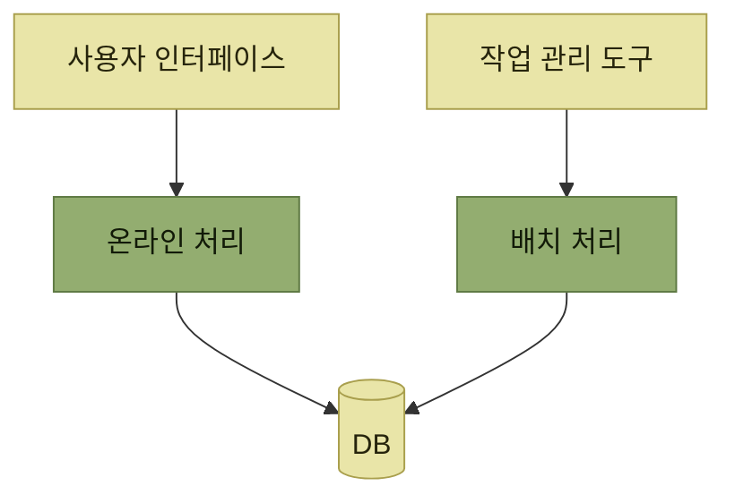
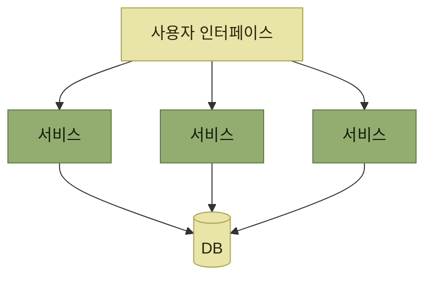
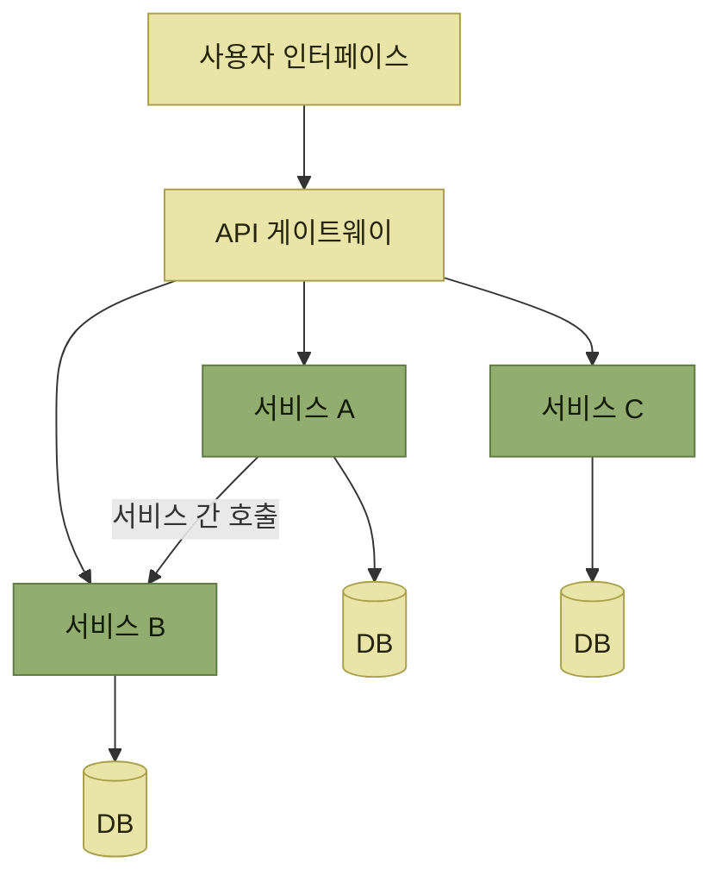
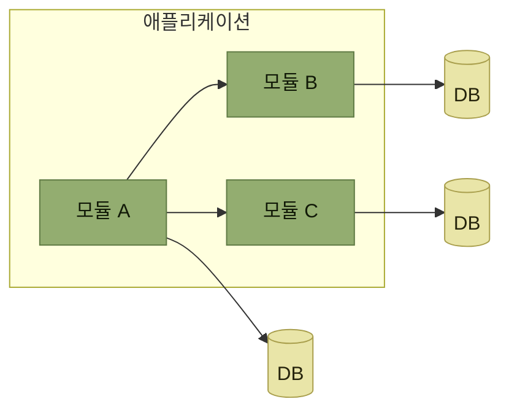
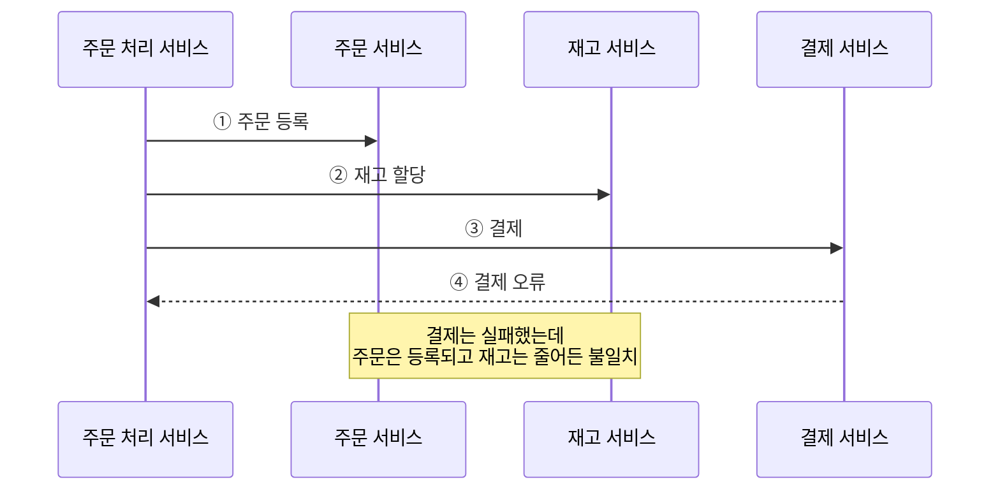
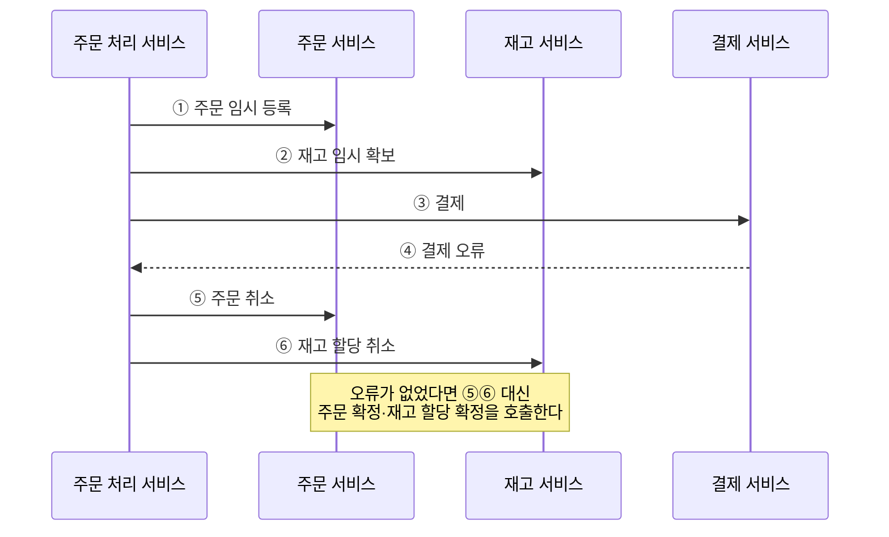
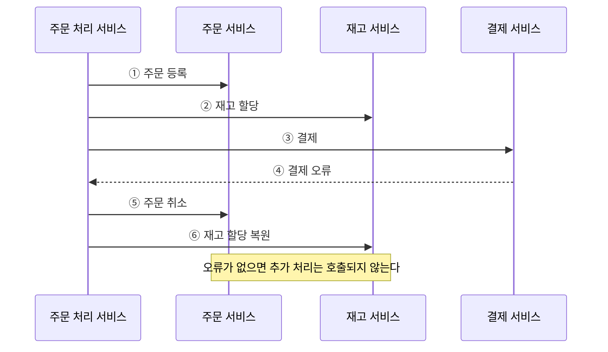
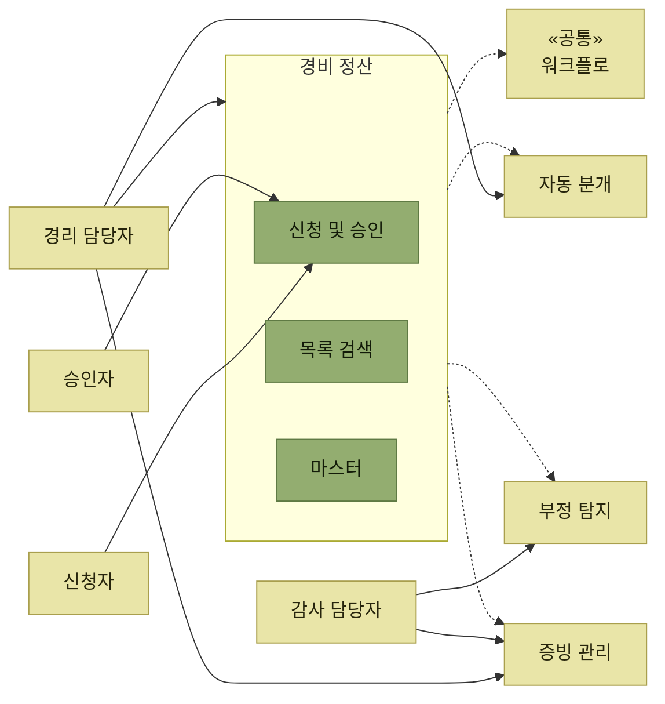
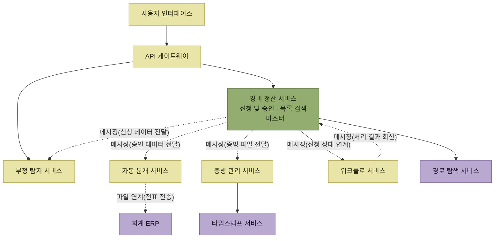
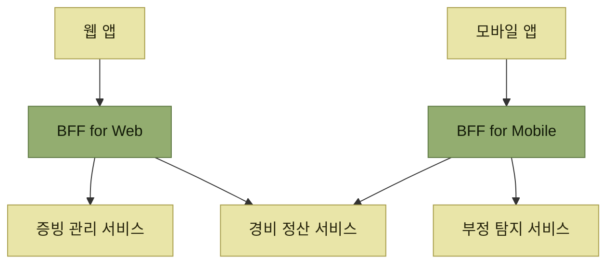

# 시스템 아키텍처 선정

> [아키텍처 설계](./README.md)

## 빠른 복습

- **모든 품질 속성에서 만점을 받는 아키텍처는 불가능에 가깝다.** 우선순위를 정하고, **평가 기준을 정의한 뒤 여러 대안을 비교**해 균형점을 찾는 **트레이드오프 과정**이다.
- **모놀리식**은 관리·테스트·트랜잭션이 쉽지만 **빌드·배포·확장·의존성**에서 대가를 치른다. **분산형**은 그 반대이고, 대부분의 단점은 **분할이 만들어낸 복잡성**에서 나온다.
- **모놀리식으로 충분하면 나눌 이유가 없다.** 모놀리식의 단점으로 인한 **실질적 피해가 허용할 수 없는 수준일 때** 분산형을 고려한다.
- 분산형의 대표는 **서비스 기반**(여러 서비스가 **단일 DB 공유**, 트랜잭션은 서비스 안에서 완결)과 **마이크로서비스**(**서비스마다 전용 DB**, 트랜잭션이 서비스를 넘나듦)다.
- **API 게이트웨이**는 라운드 트립을 줄이고 횡단 관심사를 모으며 UI를 개별 서비스에서 감춘다. **Facade 패턴을 아키텍처 레벨로 확장한 것**이다.
- **모듈형 모놀리스**는 배포 단위는 하나로 두고 내부 모듈을 느슨하게 결합하는 방식이다. **DB 분리는 필수 조건이 아니고, 목적은 모듈성 유지**다.
- **처음부터 전부 마이크로서비스로 만드는 것은 안티패턴**이다. 논리적 분할이 곧 물리적 분할은 아니다.
- **분산 트랜잭션은 가능하면 발생하지 않게 설계**하고, 불가피하면 범위를 최소화한다. **Saga 패턴**은 결과적 일관성을 얻는 대표적 방법이며 **임시 상태 방식**과 **보상 트랜잭션 방식**이 있다.

## 선정은 트레이드오프다

**모든 품질 속성에서 만점을 받는 아키텍처를 개발하는 것은 불가능에 가깝고**, 된다 하더라도 **비용과 시간이 많이 들어간다.** 그래서 순서가 이렇게 된다.

- **우선적으로 고려해야 할 품질 속성을 선정**하고, 이를 바탕으로 [아키텍처 드라이버 목록](./2-아키텍처-드라이버의-핵심-사항.md)을 정리한다.
- 각 아키텍처 드라이버를 **만족하는 방법은 여러 가지**가 있을 수 있고, **선택지마다 장단점이 존재**한다.
- 아키텍트는 **적절한 평가 기준을 정의한 후, 여러 대안을 비교 분석하여 종합적으로 가장 타당한 방안을 선택**해야 한다.

> 아키텍처 선정은 단순한 선택이 아니라, 각 품질 속성을 조정하며 **최적의 균형점을 신중히 찾아가는 트레이드오프 과정**이다.

## 아키텍처 패턴을 활용한다

아키텍트는 **개발 업계의 선배들이 축적해온 자산으로서 [패턴](../2-소프트웨어-설계/4-설계-패턴.md)을 적극적으로 활용**해야 한다. 다만 **아키텍처 스타일과 아키텍처 패턴은 개념의 범위나 관점이 서로 다를 수 있다.**

그래서 필요한 것이 **시점마다 주목하는 추상화 레벨과 관점에 따라 적절한 패턴을 선택하는 요령**이다.

- **추상화 레벨** — 시스템 전체 / 애플리케이션이나 서비스 레벨 / 모듈이나 컴포넌트 레벨
- **관점** — **구조 중심**인가 **상호작용 중심**인가

## 모놀리식과 분산형

시스템 아키텍처의 첫 갈림길이다.

### 모놀리식 — 하나로 만든다

**시스템에 필요한 모든 기능을 하나의 대규모 애플리케이션으로 구축하는 방법**(단일형)이다.

장점은 **하나이기 때문에** 생긴다.

- 소스 코드의 **관리, 빌드, 배포가 간편**하다.
- 시스템 **전체를 대상으로 테스트하기 쉽다**.
- **트랜잭션이 단일 애플리케이션 내에서 완료**되므로 **정합성 유지에 용이**하다.
- **기술 스택을 통일**할 수 있어 **IT 거버넌스**(시스템 전반의 통합 관리) 적용이 쉽다.

단점도 **하나이기 때문에** 생긴다.

- **빌드와 배포에 시간이 많이 걸린다.**
- 모듈과 컴포넌트 간 의존성이 복잡해져 [거대한 진흙 덩어리 패턴](../1-아키텍트가-하는-일/3-아키텍처의-중요성.md#나누는-순간-관계가-생긴다)에 빠지기 쉬우며, 이로 인해 **유지보수성이 저하**될 수 있다.
- **작은 변경에도 전체 애플리케이션의 빌드와 배포**가 필요하다.
- **일부 기능의 부하나 충돌로 시스템 전체에 위험**(성능 저하, 정지 등)이 발생할 수 있다.
- **스케일링이 어렵고, 단일 데이터베이스에서 병목**이 발생하기 쉽다.
- 각 모듈·컴포넌트가 쓰는 라이브러리 때문에 **DLL 지옥**(DLL hell, 버전 충돌 문제)이나 **종속성 오류**가 생기기 쉽다.
- **단일 기술 스택은 구현과 기술 도입 모두에 제약**이 될 수 있다.

### 분산형 — 나누어 만든다

**시스템의 기능을 여러 개로 분할하여 각각 독립적으로 배포할 수 있는 애플리케이션으로 구축하는 방식**이다. 분할된 애플리케이션은 **필요에 따라 상호 연계**되며, 분산형 아키텍처에서 개별 애플리케이션은 보통 **서비스**로 불린다.

장점은 **나뉘어 있기 때문에** 생긴다.

- **빌드 및 배포 시간이 짧다.**
- **서비스 단위로 독립적인 배포**가 가능하며 시스템의 [어질리티](../1-아키텍트가-하는-일/2-어질리티-변화에-대한-적응-능력.md)가 높아진다.
- 각 서비스의 **소스 코드가 적어 유지보수하기 쉽다.**
- **부하가 큰 서비스만 선별적으로 확장**할 수 있다.
- **서비스별로 적합한 기술 스택과 데이터베이스**를 사용할 수 있다.
- **서비스별로 최적의 애플리케이션 아키텍처**를 채택할 수 있다.
- **서비스 단위로 재사용**하기 쉽다.

단점도 **나뉘어 있기 때문에** 생긴다.

- **소스 코드와 버전 관리가 복잡**해진다.
- 여러 서비스를 운영하며 **상태를 모니터링하거나 장애 원인을 파악하기 어렵다.**
- 트랜잭션이 여러 서비스를 넘나드는 경우 **데이터 정합성을 보장하기 어렵다.**
- **서비스 간 통신이 오버헤드**(처리 시간·리소스 소모 증가)가 되어 응답 속도를 떨어뜨릴 수 있다.
- 여러 서비스가 **마스터 데이터**(공통 참조 정보)를 공유하는 과정에서 **동기화 등 관리 이슈**가 생기기 쉽다.
- **적절한 서비스 분할이 어렵고**, 아키텍처 설계에 **고도의 판단**이 요구된다.

| 무엇이 갈리는가 | 모놀리식 | 분산형 |
| --- | --- | --- |
| **배포 단위** | 하나 — 작은 변경에도 전체 배포 | 서비스별 독립 배포 |
| **트랜잭션** | 애플리케이션 안에서 완결, **정합성 유리** | 서비스를 넘나들면 **정합성 보장이 어려움** |
| **확장** | 전체를 함께 키워야 함, 단일 DB 병목 | **부하가 큰 서비스만** 확장 |
| **기술 스택** | 통일 — 거버넌스에 유리, 선택에 제약 | 서비스마다 선택 — 자유롭지만 관리 부담 |
| **유지보수성** | 의존이 얽히면 진흙 덩어리로 | 서비스가 작아 다루기 쉬움 |
| **운영** | 단순 | 모니터링·장애 추적이 어려움 |

표를 읽는 법. 각 행의 두 칸은 **같은 성질의 앞뒷면**이다. 하나로 묶어서 얻는 것이 곧 나누어서 잃는 것이고, 그 반대도 같다. 그래서 다음 판단이 따라온다.

> 분산형 아키텍처는 다양한 장점을 제공하지만, **서비스를 여러 개로 나누면 시스템에 새로운 복잡성이 발생한다.** 대부분의 단점이 이 복잡성에서 나온다.

- **모놀리식 아키텍처로 충분하다면 굳이 서비스를 분할할 이유는 없다.**
- **모놀리식의 단점으로 인한 실질적 피해가 허용할 수 없는 수준이라면** 분산형을 고려한다.

### 이미 우리는 나누고 있었다 — 온라인과 배치

기존 업무 시스템에서도 **온라인 처리**(실시간 처리)와 **배치 처리**(주기적 일괄 처리)가 분리된 경우가 많다.

*[그림 3.5] 기존 시스템에서 많이 사용된 기본 아키텍처 — 두 처리가 갈라져 있지만 데이터베이스는 하나다*

나눈 이유는 **리소스의 성질이 다르기 때문**이다.

- **배치 처리**는 **대량의 데이터를 한 번에 읽고 쓰므로 메모리나 I/O 리소스를 많이 소모**한다.
- **온라인 처리**는 개별 데이터 처리량은 적지만 **다수의 요청을 동시에 처리해야 해서 많은 스레드를 사용**한다.

그래서 **각 처리 방식에 적합한 컴퓨팅 리소스를 배치하여 처리량을 높이고, 배치 처리로 인한 온라인 성능 저하**(응답 속도 지연 등)**를 최소화**하려는 것이 분할의 주요 이유다. 여기에 더해, **온라인 처리에 쓰는 언어나 프레임워크에서는 배치 처리의 구현 비용이 높거나 성능 요구를 충족하기 어려워 기술 스택을 바꿔야 하는 상황**도 생긴다.

분산이라는 말이 낯설어도, **처리의 성질이 다르면 나눈다**는 기준 자체는 이미 오래 써온 것이다.

## 분산형의 대표적인 두 스타일

### 서비스 기반 아키텍처 — 나누되 데이터는 함께

*[그림 3.6] 서비스 기반 아키텍처 — 서비스는 여럿이지만 데이터베이스는 하나다*

- 시스템을 구성하는 **여러 서비스가 단일 데이터베이스를 공유**하는 것이 기본적인 방식이다.
- 각 서비스는 **비교적 큰 단위**로 구성되며, **트랜잭션은 단일 서비스 내에서 완료**된다. 트랜잭션 경계가 각 서비스 안에서 유지된다는 뜻이다.

### 마이크로서비스 아키텍처 — 데이터까지 나눈다

*[그림 3.7] 마이크로서비스 아키텍처 — 서비스마다 데이터 소유권을 분리하며, 클라이언트는 API 게이트웨이를 거친다. 데이터베이스 서버 같은 물리 인프라까지 반드시 하나씩 분리한다는 뜻은 아니다*

- 각 마이크로서비스는 **자신의 데이터를 소유**하고 다른 서비스가 저장소를 직접 수정하지 않도록 경계를 둔다. 물리 데이터베이스 인프라를 공유하더라도 스키마와 접근 권한으로 소유권을 분리할 수 있다.
- 서비스 기반 아키텍처와 비교하면 **개별 서비스 단위가 더 작다.**
- 하나의 요청을 처리하며 다른 마이크로서비스와 협력할 수 있고, 이때 로컬 트랜잭션만으로 원자성을 보장할 수 없어 서비스 간 일관성을 별도로 설계해야 한다. 서비스 경계를 정할 때는 불필요한 동기 호출과 분산 트랜잭션을 줄인다.

클라이언트의 UI에서 마이크로서비스를 직접 호출하지 않고 **API를 통합하는 레이어를 경유**하는 경우가 많다. **API 게이트웨이**다.

- 사용자 인터페이스에서 **다수의 작은 서비스 호출**(라운드 트립, 요청-응답의 왕복)이 발생하는 것을 방지한다.
- **인증과 승인 등 횡단 관심사**(공통 기능)를 한 곳에서 처리한다.
- 사용자 인터페이스가 **개별 서비스에 직접 의존하지 않도록 보호하고 감춘다.**
- 여러 개의 작은 서비스 호출을 **하나로 모아 집약**한다.

> API 게이트웨이는 [Facade 패턴](../2-소프트웨어-설계/4-설계-패턴.md#facade--모듈-뒤에-있는-것을-숨긴다)을 **아키텍처 수준으로 확장해 적용한 개념**으로 볼 수 있다.

2장에서 컨트롤러가 서비스 뒤를 보지 못했던 그 구조가, 여기서는 UI가 서비스들 뒤를 보지 못하는 구조로 반복된다. [프랙탈 구조](../2-소프트웨어-설계/3-소프트웨어-설계-원칙과-실천-방법.md#프랙탈-구조)가 말하던 것이 이것이다.

## 모듈형 모놀리스 — 나누지 않고 나눈다

분산형 아키텍처에는 **본질적 한계**(복잡성 증가, 분산 트랜잭션 문제, 기술적 난도)가 있어, 상황에 따라 **모놀리스를 선택**하는 경우도 있다.

여기서 짚을 것이 있다. **모놀리스의 단점 중 하나인 유지보수성 저하는, 반드시 마이크로서비스를 도입하지 않더라도 효과적인 설계를 통해 해결할 수 있다.** 모놀리스를 **하나의 기능 단위로 적절히 모듈화하여 모듈 간 결합도를 낮추는 것**이다. 이렇게 하면 **배포 단위는 하나로 유지하면서 내부적으로 독립된 모듈들이 느슨하게 결합된 애플리케이션**이 된다.

*[그림 3.8] 모듈형 모놀리스 — 배포 단위는 애플리케이션 하나지만, 모듈은 각자의 데이터를 가진다*

지켜야 할 규칙이 있다.

- **모듈 간 연계는 명확하게 정의된 큰 단위의 서비스 인터페이스를 통해** 이루어져야 한다.
- **다른 모듈의 데이터베이스에 직접 의존하지 않아야 한다.** 특정 모듈에서 데이터 액세스를 처리할 때 **다른 모듈이 관리하는 테이블을 직접 읽거나 수정해서는 안 된다.**

두 번째 규칙을 철저히 적용하면 **모듈별로 데이터베이스를 분리하는 것이 이상적**이라는 결론에 도달한다. 그러나 **데이터베이스를 완전히 분리하는 것은 현실적으로 쉽지 않으므로**, 테이블 구조를 논리적으로 구분하는 단위인 **데이터베이스 스키마**로 나누어 관리하는 방법을 고려할 수 있다.

> **데이터베이스를 분리하는 것은 모듈형 모놀리스의 필수 조건이 아니다.** 무엇보다 중요한 것은 **모듈성을 유지하여 유지보수성을 높이는 것**이다.

모듈형 모놀리스로 애플리케이션을 구축해두면 **향후 필요에 따라 마이크로서비스로 전환하기 쉽다**는 장점도 있다. 전환을 고려한다면 모듈 간 연계를 **내부 인터페이스가 아닌 외부 API나 비동기 메시징 방식**으로 구현할 수도 있다. 단, **초기부터 불필요한 복잡성을 도입할 수 있으므로 트레이드오프를 신중히 고려**해 판단하는 것이 좋다.

## 서비스 분할

서비스 기반 아키텍처와 마이크로서비스 아키텍처는 분산형의 대표적 유형이지만, **서비스 단위의 크기에 대해 엄격한 정의가 있는 것은 아니다.** 서비스 기반 아키텍처에서도 **API 게이트웨이를 배치**하거나 **단일 데이터베이스가 아닌 여러 데이터베이스로 나누어** 구성하는 경우도 있다.

> 두 아키텍처 중 하나를 반드시 선택하기보다는, 각 스타일이 **지향하는 개념과 목적을 충분히 이해한 후 필요에 따라 적절히 조합하고 조정**하여 우리 환경에 가장 적합한 아키텍처를 적용하는 것이 중요하다.

### 논리적으로 먼저, 물리적으로 나중에

1. **업무 기능의 관점에서 시스템을 논리적으로 서브시스템으로 분할**한다. 이때 **도메인 주도 설계의 분석 기법을 활용하여 경계 지어진 컨텍스트로 나누는 방법**도 효과적이다. 이러한 경계 설정 방식은 **서비스 단위로서 마이크로서비스와 높은 적합성**을 가진 경우가 많다고 알려져 있다.
2. 논리적 분할을 수행한 후 **물리적 분할을 검토**한다. 모놀리식과 분산형의 장단점을 고려하고, 서비스 기반이나 마이크로서비스 같은 **아키텍처 스타일의 특성을 바탕으로 아키텍처 드라이버를 구현하는 최적의 해법**을 찾아간다.

두 가지를 못박아 둔다.

- **논리적으로 분할된 서브시스템(또는 경계 지어진 컨텍스트)이 반드시 마이크로서비스가 되는 것은 아니다.**
- **처음부터 모든 시스템을 마이크로서비스로 구축하는 것은 안티패턴으로 간주될 수 있다.** 초기 구축 단계에서 **최적의 서비스 경계를 명확히 설정하기가 쉽지 않으며**, **과도한 분할로 복잡성이 증가하고 운영·유지보수 비용이 급증할 위험**이 있기 때문이다.

### 트랜잭션 경계 — 넘나들지 않게 나눈다

**여러 서비스를 넘나드는 분산 트랜잭션은 다루기가 매우 까다롭다.**

- 트랜잭션의 정합성을 확실히 보장하려면 **2단계 커밋**(two-phase commit)을 지원하는 **프로토콜이나 미들웨어를 사용하는 것이 필수적**이다.
- 마이크로서비스적 사고방식으로 **서비스 간 강한 결합을 피하면서 결과적 일관성**(eventual consistency)을 확보하는 방안을 검토해 볼 수도 있다. 이 경우 **Saga 패턴**을 고려할 수 있지만 **구현과 테스트의 난이도가 높아진다.**

> **가능하면 분산 트랜잭션이 발생하지 않도록 설계하고, 불가피하다면 그 범위를 최소화하는 방향으로 분할을 검토**하는 것이 더 바람직한 설계 기준이다.

## Saga 패턴

**마이크로서비스 아키텍처에서 여러 서비스에 걸친 분산 트랜잭션 중 일부가 실패했을 때, 결과적 일관성을 달성하기 위한 대표적 아키텍처 패턴**이다. 문제 상황부터 본다.

*[그림 3.10] 분할된 트랜잭션의 실패 — 원서의 구성도를 시간 순서로 옮겼다*

**결제 처리 성공 여부에 따라 후속 조치가 필요하다.** 방법은 두 가지다.

### 방식① — 임시 상태로 보류했다가 확정한다

**각 서비스에서 최초로 수행하는 처리를 준비 단계에서 보류**하는 방식이다.

- 데이터베이스에 등록·갱신되는 데이터를 **임시 상태로 유지**한다.
- **상태 열**(status column)로 관리하거나 **임시 상태용 별도 테이블**을 사용하여 저장한다.

*[그림 3.11] Saga 패턴① — 원서의 구성도를 시간 순서로 옮겼다*

- 주문 처리 서비스가 **결제 오류를 감지하면** 주문 서비스의 **주문 취소 처리**, 재고 서비스의 **재고 할당 취소 처리**를 호출하여 **임시 데이터를 취소**한다.
- **오류가 발생하지 않은 경우**에는 **주문 확정 처리나 재고 할당 확정 처리**를 호출하여 **임시 데이터를 확정**한다.

### 방식② — 완료된 것을 되돌린다

**오류가 발생한 경우에 한해 완료된 트랜잭션을 취소하는 별도의 트랜잭션을 실행**하는 방식이다. 결과적 일관성을 유지하기 위해 조정 작업을 수행하는 이 트랜잭션을 **보상 트랜잭션**(compensating transaction)이라고 한다.

*[그림 3.12] Saga 패턴② — 원서의 구성도를 시간 순서로 옮겼다*

- 오류를 감지한 주문 처리 서비스는 주문 서비스의 **주문 취소 처리**와 재고 서비스의 **재고 할당 복원 처리**를 호출한다.
- 주문 서비스는 **이미 등록된 주문을 취소하는 트랜잭션**을, 재고 서비스는 **확보된 재고를 취소하고 재고 수량을 복구하는 트랜잭션**을 실행한다.
- **오류가 발생하지 않은 경우에는 추가 처리가 호출되지 않는다.**

### 어느 쪽도 공짜가 아니다

| | 방식① 임시 상태 | 방식② 보상 트랜잭션 |
| --- | --- | --- |
| **얻는 것** | 보류 중인 임시 데이터와 확정된 데이터가 **명확히 구분**되어, 불일치 상태에서 **업무 프로세스가 진행되는 문제(출고 등)가 발생하지 않음** | 오류가 없으면 **추가 호출이 없음** |
| **치르는 대가** | 임시 데이터를 **참조 서비스에서 조회할 수 없음**(비동기 연동이면 확정까지 시간 지연) · **오류 여부와 관계없이 각 서비스를 여러 번 호출** | **확정된 데이터를 되돌리는 처리가 복잡** · **업무 프로세스가 이미 진행된 경우** 어떻게 처리할지 검토 필요 |

표를 읽는 법. 두 방식의 차이는 **불일치를 언제 허용하느냐**다. ①은 **확정을 미뤄서** 불일치를 애초에 만들지 않고, ②는 **일단 확정하고 나중에 되돌린다.** 되돌릴 수 없는 후속 업무(출고, 발송)가 뒤에 붙어 있다면 ②의 대가가 급격히 커진다.

각 방식에는 트레이드오프가 있으므로, **서비스를 분할할 때 가능하면 여러 서비스에 걸친 분산 트랜잭션이 발생하지 않도록 설계**해야 한다는 결론은 그대로다.

### 구현 방법 — 오케스트레이션과 코레오그래피

- **오케스트레이션**(orchestration) — 조정자가 **서비스 간 흐름을 조정**한다.
- **코레오그래피**(choreography) — 중앙에서 조정하는 역할 없이 **각 서비스가 자율적으로 상호 조정**한다.

서비스가 많고 흐름의 가시성과 중앙 통제가 중요하면 **오케스트레이션**이 유리할 수 있다. 반대로 서비스 자율성, 느슨한 결합과 이벤트 확장이 중요하면 **코레오그래피**가 더 적합할 수 있다. [처리 흐름의 역할을 명확히 분리](../2-소프트웨어-설계/3-소프트웨어-설계-원칙과-실천-방법.md#핵심-로직과-프로세스-로직)할 수 있다는 장점과, 조정자가 병목이나 단일 결합점이 될 수 있다는 대가를 함께 비교한다.

## 사례 연구 — 경비 정산 시스템을 나눈다

### 서브시스템 분할 — 사용자가 다르면 나눈다

*[그림 3.13] 서브시스템 분할 예시 — 실선은 액터와의 연관, 점선은 패키지 사이의 의존이다*

분할의 기준이 이 그림에 들어 있다. **서브시스템을 분할할 때는 업무 프로세스의 흐름뿐 아니라 그 과정에 참여하는 사용자(업무 주체)의 차이도 함께 고려해야 한다.**

- 경비 정산 업무의 흐름은 **현장 부서 담당자가 신청 → 상급자가 승인 → 최종적으로 경리 담당자가 확인**이다.
- 그런데 **최종 승인된 데이터를 받아 분개를 수행하고 회계 전표로 등록하는 업무는 현장 부서 담당자가 개입하지 않고 경리 담당자가 수행**한다. **사용자가 다르므로 경비 정산과 자동 분개는 별도의 서브시스템으로 분리**하는 것이 적절하다.
- 마찬가지로 **경비의 이상 사용 탐지**나 **법령 준수를 위한 증빙 관리** 업무는 **경리 담당자 및 감사 담당자의 관심사**가 되므로 각각을 독립된 서브시스템으로 분리했다.
- **경비 정산 신청 및 승인과 관련된 업무**는 [REQ-16](./1-아키텍처-설계의-주요-개념.md#기능-요구사항)이 **사내 다양한 업무에서 공통으로 사용되는 워크플로 엔진을 이용하도록 규정**하고 있어 **공통 서브시스템으로 분리**했다.

### 서비스 분할 — 처리의 성질이 다르면 나눈다

*[그림 3.14] 서비스 분할 예시 — 실선은 API 호출, 점선은 메시징과 파일 연계다. 보라색은 외부 서비스다*

각 서비스가 왜 갈라졌는지가 요점이다.

- **자동 분개**는 **최종 승인된 데이터의 변환 처리가 중심**이므로 **일반적인 온라인 처리 방식**(사용자 요청에 즉시 응답)**과 다르게 동작**한다. 그래서 별도 서비스로 분리했고, **경비 정산 승인 처리와 동일한 트랜잭션 안에서 분개 데이터를 생성할 필요가 없으므로 신청 데이터를 비동기 메시징으로 연동**하는 구조를 적용했다.
- **부정 탐지**도 **적용 기술과 처리 방식이 전혀 다르다.** **축적된 데이터를 기반으로 기계 학습을 수행하는 구조**여서 일반적인 처리 방식과 큰 차이가 있다. 또한 **탐지된 결과를 승인자에게 경고 메시지로 전달해야 하므로 역방향 비동기 메시징 구조도 함께 적용**되었다.
- **증빙 관리**는 **외부 타임스탬프 서비스를 이용해 디지털 서명이 추가된 파일을 법령에 따라 장기간 보관**해야 한다. 여기에 **검색, 조회, 타임스탬프의 일괄 검증** 등 고유한 요구가 있어 별도 서비스로 분리되었고, 역시 **비동기 메시징으로 데이터를 연동**한다.
- **워크플로**는 **공통의 워크플로 엔진을 활용하는 독립적인 서비스**로, 처리 과정에서 **본래 분산 트랜잭션을 고려해야 한다.** 경비 정산 신청·승인 데이터의 등록·갱신과 워크플로 진행 상태의 등록·갱신은 **하나의 트랜잭션으로 처리하는 것이 일반적**이기 때문이다.

마지막 항목이 앞의 트랜잭션 경계 이야기와 정확히 맞물린다. **2단계 커밋으로 엄격한 정합성을 유지할 것인지, 결과적 일관성으로 갈 것인지** 판단해야 하는데, 이 예제에서는 **공통 워크플로 서비스가 경비 정산뿐 아니라 다양한 업무 시스템에서 사용될 것을 고려한 확장성** 때문에 **결과적 일관성**을 택했다.

그 선택의 대가가 무엇인지도 그대로 적혀 있다.

- 경비 정산이 신청된 시점에서 경비 정산 서비스의 신청 데이터는 **'승인 대기'** 상태다.
- 비동기 메시징으로 워크플로 서비스에 데이터가 연동되고 워크플로 엔진이 처리를 진행할 때, **워크플로 마스터의 설정 미비로 승인자를 찾을 수 없는 업무 오류**가 발생했다고 하자.
- 이 경우 경비 정산 서비스는 여전히 **'승인 대기'** 이지만 워크플로 서비스는 **'신청 실패'** 가 되어 **정합성이 맞지 않는 상태**가 된다.
- 그래서 **워크플로 서비스에서 경비 정산 서비스로 처리 결과를 비동기 메시징으로 다시 전달**하여 신청 상태를 갱신하도록 했다. **일시적으로 불일치가 발생하더라도 일정 시간이 지나면 결과적으로 일관성이 확보되는 방식**이다.

이렇게 서비스를 분할한 후에는 **클라이언트의 사용자 인터페이스(웹 브라우저 또는 모바일 앱)에서 발생하는 API 요청이 API 게이트웨이를 통해 전달되도록** 구성했다. 유스케이스에 따라 클라이언트는 **경비 정산 서비스의 API뿐 아니라 증빙 관리 서비스나 부정 탐지 서비스의 API도 호출**할 수 있다. **API를 감추거나(API 보안 등의 목적) 여러 API 요청을 하나로 집약하는 레이어를 추가**하는 경우도 있다.

### BFF 패턴 — 클라이언트마다 게이트웨이를 둔다

비기능 요구사항 가운데 **멀티 디바이스 대응**과 관련된 항목이 있었다.

> **[REQ-24]** 신청과 승인은 스마트폰이나 태블릿 단말기에서도 가능하도록 한다.

최근 프런트엔드 기술은 더욱 다양해지고 있다. **React Native, Flutter처럼 멀티 디바이스 및 크로스 플랫폼에 대응하는 프레임워크가 존재**하지만, **클라이언트의 디바이스별로 최적의 기술을 맞춤형으로 선택하여 애플리케이션을 구축하는 경우도 많다.**

문제는 그다음이다. **API 게이트웨이가 여러 클라이언트 애플리케이션을 제공하려고 하면, 각 기술 요구사항에 적합한 다수의 전용 엔드포인트를 마련해야 하므로 점점 비대해진다.** 이를 해결하기 위해 **각 클라이언트 애플리케이션별로 전용 API 게이트웨이를 마련하는 방식**을 **BFF**(backends for frontends) **패턴**이라고 한다.

*[그림 3.15] BFF 패턴 — 클라이언트마다 전용 게이트웨이를 두고, 그 뒤의 서비스는 공유한다*

> BFF 패턴은 2장에서 설명한 SOLID 원칙 중 **인터페이스 분리 원칙(ISP)을 아키텍처 레벨로 확장하여 적용한 패턴**이라고 볼 수 있다. 이처럼 **설계 원칙의 본질을 이해하면 아키텍처를 비롯한 추상화 레벨이 높은 설계에서도 유용하게 활용**할 수 있다.

[ISP](../2-소프트웨어-설계/3-소프트웨어-설계-원칙과-실천-방법.md#isp--인터페이스-분리-원칙)가 "쓰지 않는 메서드에 대한 의존을 강요하지 않는다"였다면, BFF는 클라이언트별로 필요한 API만 제공한다는 점에서 비슷한 설계 동기를 가진다. API 게이트웨이와 Facade, BFF와 ISP의 관계는 **동일한 패턴이라는 뜻이 아니라 추상화 레벨을 넘나드는 비유**다.

## 핵심 정리

- 아키텍처 선정은 **평가 기준을 정의하고 대안을 비교해 균형점을 찾는 트레이드오프 과정**이다.
- 모놀리식과 분산형의 장단점은 **같은 성질의 앞뒷면**이다. 나눠서 얻는 것이 곧 나눠서 잃는 것이다.
- **모놀리식으로 충분하면 나누지 않는다.** 온라인/배치 분리처럼 **처리의 성질이 다를 때** 나누는 기준은 이미 오래 써왔다.
- **서비스 기반은 DB를 공유**하고 트랜잭션이 서비스 안에서 끝나며, **마이크로서비스는 DB까지 나누고** 트랜잭션이 서비스를 넘나든다.
- **API 게이트웨이는 Facade의, BFF는 ISP의 아키텍처 레벨 확장**이다. 설계 원칙은 레벨을 올려도 그대로 쓰인다.
- **모듈형 모놀리스**는 배포 단위 하나를 유지하면서 모듈성을 얻는 선택이며, **DB 분리는 필수가 아니다.**
- 분할은 **논리적 분할 → 물리적 분할** 순서로 하고, **논리적 서브시스템이 곧 마이크로서비스는 아니다.** 처음부터 전부 마이크로서비스는 안티패턴이다.
- **분산 트랜잭션은 만들지 않는 것이 최선**이고, Saga의 두 방식은 **불일치를 언제 허용하느냐**에서 갈린다.
- 사례에서 서비스를 가른 기준은 **사용자가 다른가**(서브시스템)와 **처리의 성질·기술이 다른가**(서비스)였다.

## 함께 읽기

- [앞 절 — 여기서 고른 드라이버가 이 절의 선택 기준이 된다](./2-아키텍처-드라이버의-핵심-사항.md)
- [아키텍처 스타일 목록 — 이 절이 그중 모놀리식·서비스 기반·마이크로서비스를 실제로 고른다](../2-소프트웨어-설계/4-설계-패턴.md#아키텍처-스타일과-아키텍처-패턴)
- [프랙탈 구조 — 같은 원칙이 클래스에서 아키텍처로 올라오는 이야기](../2-소프트웨어-설계/3-소프트웨어-설계-원칙과-실천-방법.md#프랙탈-구조)
