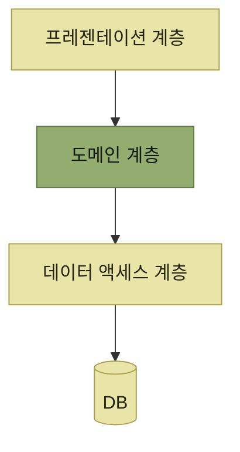
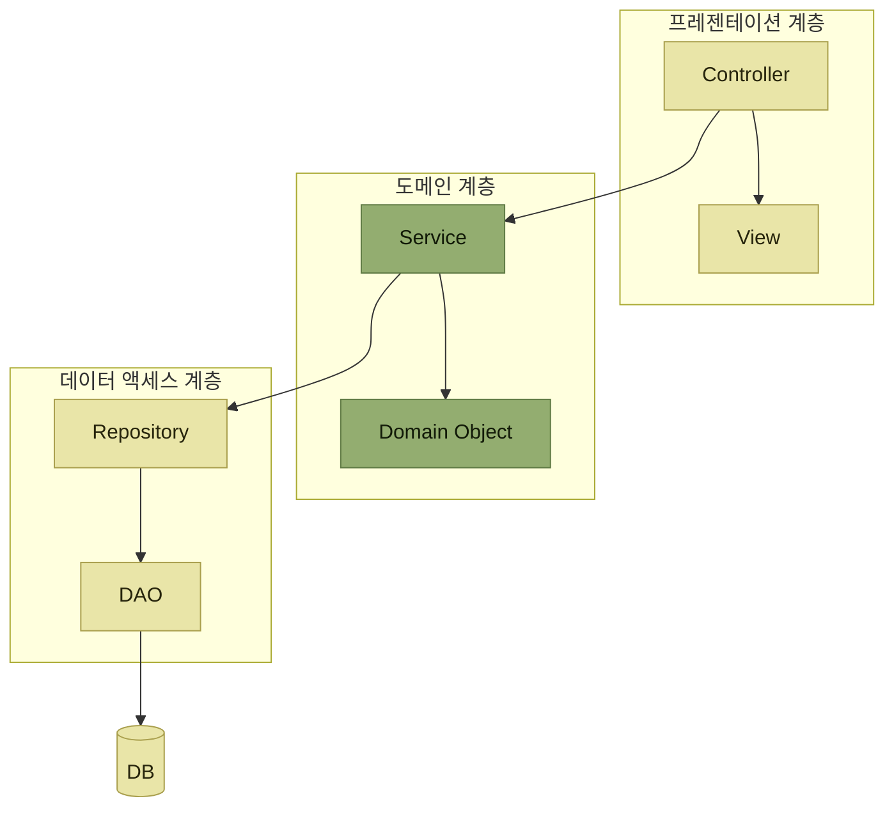
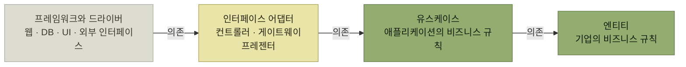
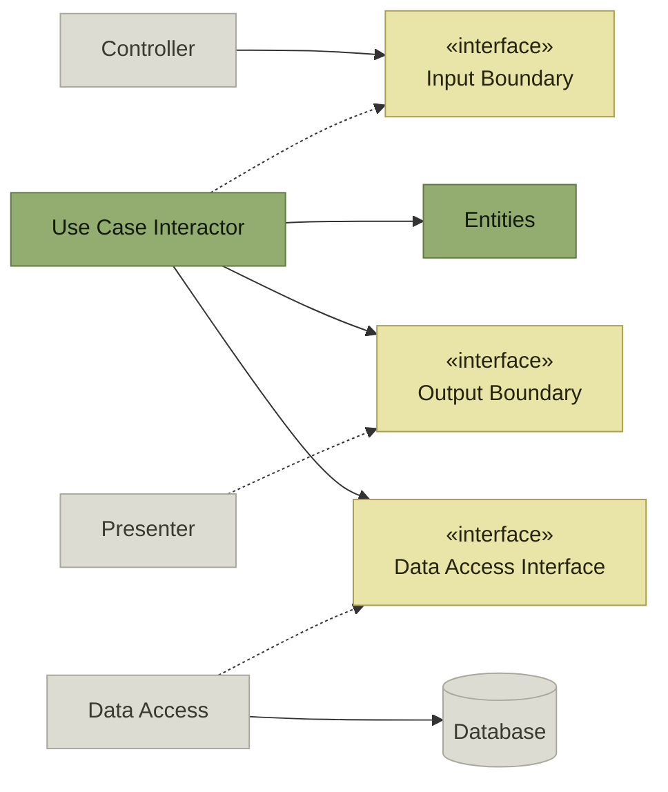
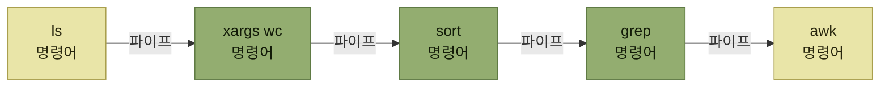
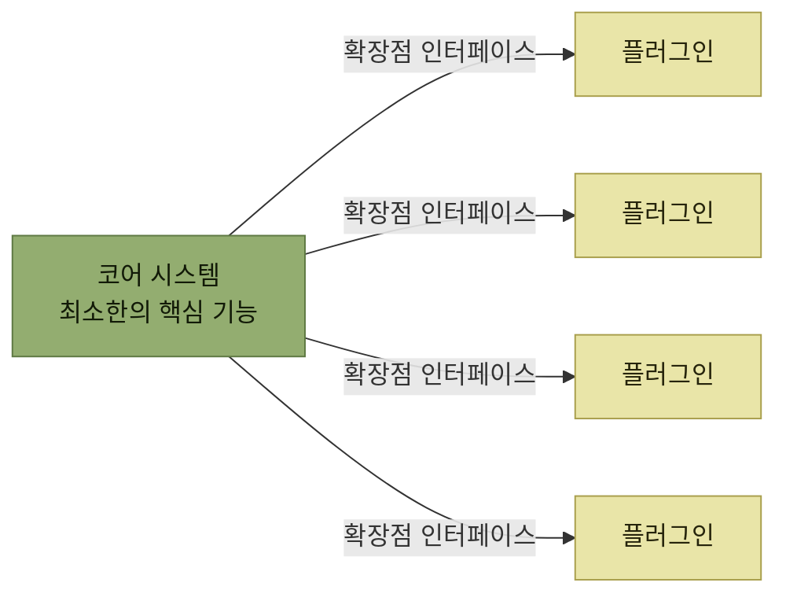

# 애플리케이션 아키텍처 선정

> [아키텍처 설계](./README.md)

## 빠른 복습

- 앞 절의 세 가지 질문(**분할 · 책임 할당 · 상호작용**)을 **서비스 하나하나에 대해 다시** 던지는 것이 애플리케이션 아키텍처 설계다.
- 애플리케이션 레벨의 아키텍처 스타일은 **레이어드 · 파이프라인 · 마이크로커널** 세 가지다.
- **레이어드**는 계층별로 책임을 갈라 **SRP를 애플리케이션 수준에 적용**한 구조이며, **유지보수성 관점에서 가장 기본**이 되는 아키텍처다.
- 레이어드의 약점은 **도메인 계층이 데이터 액세스 계층에 의존**한다는 것이다. **DIP를 적용해 이를 뒤집은 변형**이 어니언 · 헥사고날 · **클린 아키텍처**다.
- **클린 아키텍처**는 **의존이 바깥에서 안으로만** 흐르게 하고 도메인을 보호한다. 대가는 **인터페이스와 컴포넌트의 증가**이며, **비즈니스 규칙이 단순하면 오히려 손해**다.
- **파이프라인**은 **필터와 파이프**로 데이터를 한 방향으로 흘려보낸다. 유닉스 셸, MapReduce, ETL이 그 예다.
- **마이크로커널**은 **코어 시스템 + 플러그인** 구조로 **OCP를 아키텍처에 적용**해 확장성을 얻는다. 어려운 것은 **확장점을 미리 도출하는 일**이다.
- 하나만 고르는 것이 아니다. 사례에서는 **서비스마다 다른 스타일**을 채택했고, 경비 정산 서비스는 **클린 + 마이크로커널을 병행**한다.

## 같은 질문을 한 단계 아래에서 다시 던진다

[앞 절](./3-시스템-아키텍처-선정.md)에서는 시스템 전체를 특정한 책임 단위로 분할하고, 그 서비스들을 **어떤 방식으로 연동할 것인지** 결정했다. 이는 **시스템 전체의 관점**에서 이루어진 일이었다.

- **구성 요소로 분할하는 방법**
- **각 구성 요소에 대한 책임 할당**
- **구성 요소 간의 상호작용**(협력 방식)

애플리케이션 아키텍처를 검토할 때는 **더 세부적인 관점에서 동일한 접근 방식으로**, 시스템을 구성하는 **서비스(애플리케이션)를 하나씩** 검토한다. 애플리케이션은 **모듈과 컴포넌트로 구성**되고, 이를 검토할 때 중요한 기준은 **애플리케이션의 설계 원칙으로 선정한 아키텍처 스타일**이다.

| 스타일 | 무엇을 겨냥하는가 | 대응하는 설계 원칙 |
| --- | --- | --- |
| **레이어드** | 계층별 책임 분리로 **유지보수성** | **SRP** |
| **클린**(레이어드의 변형) | 도메인을 외부 세부 사항에서 **보호** | **DIP** |
| **파이프라인** | 데이터를 **한 방향으로 단계적 처리** | 필터 하나에 처리 하나 |
| **마이크로커널** | 코어를 건드리지 않는 **확장성** | **OCP** |

표를 읽는 법. 오른쪽 열이 이 절의 숨은 뼈대다. **애플리케이션 아키텍처 스타일은 2장의 설계 원칙을 애플리케이션 크기로 키운 것**이다. 원칙을 알면 스타일의 이유가 따라온다. 원본은 [2장의 SOLID 원칙](../2-소프트웨어-설계/3-소프트웨어-설계-원칙과-실천-방법.md#solid-원칙)에 있다.

## 레이어드 아키텍처

**애플리케이션을 여러 개의 레이어(층)로 나누고, 각 계층의 역할을 명확히 구분하여 해당 역할에 맞는 컴포넌트를 배치하는 아키텍처**다. **3계층 아키텍처가 일반적이지만 레이어의 개수는 설계에 따라 달라질 수 있다.**



*[그림 3.16] 레이어드 아키텍처 (3계층) — 위에서 아래로만 호출한다*

| 계층 | 다른 이름 | 하는 일 |
| --- | --- | --- |
| **프레젠테이션 계층** | | 사용자 인터페이스에서 받은 **요청을 해석하여 도메인 계층의 로직을 호출**하고, **결과를 화면으로 클라이언트에 반환** |
| **도메인 계층** | 비즈니스 로직 계층 | **업무 규칙에 따라 데이터 가공이나 계산 등 비즈니스 로직을 실행** |
| **데이터 액세스 계층** | 영속화 계층, 통합 계층 | **외부 리소스에 대해 데이터를 읽고 쓴다** |

표를 읽는 법. **계층별 책임이 명확히 구분되므로**, 레이어드 아키텍처는 **단일 책임 원칙(SRP)을 애플리케이션 아키텍처 수준에서 적용한 구조**라고 할 수 있다. 간단하고 이해하기 쉬워, **특히 유지보수성을 고려한 애플리케이션 구조 설계라는 관점에서 가장 기본이 되는 아키텍처**다.

### 계층만 나누면 부족하다

**3계층으로 나누는 것만으로는 분리 단위가 커지고 각 계층의 역할이 명확하게 구분되지 않아, 애플리케이션의 일관성을 유지하기 어려워질 수 있다.** 그래서 **각 계층에서의 컴포넌트 유형을 명확히 정의하여 구체화**해야 할 수도 있다.



*[그림 3.17] 3계층 아키텍처의 컴포넌트 유형 예시 — 도메인 계층에는 도메인 모델 패턴이 적용되어 있다*

도메인 모델 패턴은 [2.4에서 트랜잭션 스크립트와 대비해 본 그 패턴](../2-소프트웨어-설계/4-설계-패턴.md#아키텍처-패턴--방침을-코드의-구조로-옮긴다)이다.

이 그림은 **2장에서 설명한 아키텍처 패턴을 참고하여 각 계층에 어떤 컴포넌트 유형을 적용할 수 있는지**를 나타낸 것이다. 계층이라는 큰 칸만 그려두면 사람마다 다른 것을 넣는다. **칸 안에 들어갈 컴포넌트의 이름까지 정해야 일관성이 유지된다.**

### 약점 — 위가 아래에 기댄다

**레이어드 아키텍처의 단점 중 하나는 상위 계층인 도메인 계층이 하위 계층인 데이터 액세스 계층에 의존하게 된다는 점**이다. 문제는 두 계층의 성질이 반대라는 데 있다.

- **도메인 계층은 더 추상적이고 안정적인 구조**다.
- **데이터 액세스 계층은 구현에 가까워 더 자주 바뀔 수 있다.**

그 결과 **구현 세부 사항이 도메인 계층으로 유입되어 코드의 가독성이 떨어지고**, **데이터 액세스 계층에서 사용하는 라이브러리가 업그레이드되면 도메인 계층의 코드까지 수정해야 하는 문제**가 발생할 수 있다.

[DIP](../2-소프트웨어-설계/3-소프트웨어-설계-원칙과-실천-방법.md#dip--의존성-역전-원칙)가 정확히 이 상황을 위해 있었다. 그래서 **의존성 역전 원칙을 적용해 변형된 레이어드 아키텍처**가 고안되었다.

- **어니언 아키텍처**
- **헥사고날 아키텍처**
- **클린 아키텍처**

셋 모두 **애플리케이션에서 가장 중요한 도메인 계층을 중심으로 설계된다는 공통점**을 갖는다.

## 클린 아키텍처

**로버트 C. 마틴**이 제창한 구조다. 동심원으로 그려지지만, **애플리케이션 관점에서는 실질적으로 3계층**이다.



*[그림 3.18] 클린 아키텍처 — 원서의 동심원을 안쪽으로 향하는 의존 방향으로 폈다. 화살표의 반대 방향은 절대 허용되지 않는다*

| 원 | 무엇인가 | 3계층으로 보면 |
| --- | --- | --- |
| **엔티티** | **기업의 비즈니스 규칙** — 가장 중요한 비즈니스 규칙 | **도메인 계층** |
| **유스케이스** | **애플리케이션에 특화된 비즈니스 규칙** — 비즈니스 로직의 **실행 흐름**을 정의 | **도메인 계층** |
| **인터페이스 어댑터** | 컨트롤러 · 게이트웨이 · 프레젠터 | **프레젠테이션 계층 · 데이터 액세스 계층** |
| **프레임워크와 드라이버** | 데이터베이스, UI 등 **외부 세계와 상호작용하는 미들웨어나 프레임워크** | 애플리케이션 바깥 |

표를 읽는 법. 안쪽 두 원이 도메인 계층이고, 이 둘의 차이가 요점이다. **엔티티 계층의 컴포넌트는 핵심 비즈니스 로직을 담당하고, 유스케이스 계층의 컴포넌트는 비즈니스 로직의 실행 흐름을 정의한다.** [핵심 로직과 프로세스 로직](../2-소프트웨어-설계/3-소프트웨어-설계-원칙과-실천-방법.md#핵심-로직과-프로세스-로직)의 구분이 그대로 원 두 개가 된 셈이다.

바깥의 **인터페이스 어댑터**에는 **외부 세계의 구현 세부 사항과 외부로부터의 의존성을 최소화하고 도메인 계층을 보호하는 어댑터**가 배치된다. 이 어댑터들은 **핵심 영역(유스케이스 계층과 도메인 계층)을 '클린하게' 유지하는 역할**도 함께 수행한다.

> 클린 아키텍처에서는 **외부 계층에서 내부 계층으로 향하는 의존성만 허용**된다. **내부에서 외부로의 의존이 일어나는 일은 절대 없어야 한다.**

### 동심원은 개념이지 코드가 아니다

**클린 아키텍처의 동심원으로 표현되는 레이어 구조는 하나의 개념으로, 그대로 소스 코드에 적용할 수는 없다.** 로버트 C. 마틴은 저서에서 대표적인 컴포넌트 구성 예시를 소개했다. 그 요점만 추리면 이렇다.



*원서 [그림 3.19] 클린 아키텍처의 컴포넌트 구성 예에서 요점만 추렸다. 실선은 사용, 점선은 인터페이스 구현이다*

경계마다 **인터페이스가 하나씩 서 있고, 바깥쪽 컴포넌트가 그 인터페이스를 구현한다.** 이것이 의존을 뒤집는 실제 장치다. 다만 이 구성은 **'데이터베이스를 사용하는 웹 기반 Java 시스템'에 맞춰 구성된 시나리오일 뿐 모든 경우에 적용할 수 있는 규칙은 아니다.** 실제로 설계할 때는 **사용 환경과 기술 스택 등을 고려하여 아키텍트가 최적의 컴포넌트 구성을 정의**해야 한다.

### 공짜가 아니다

**클린 아키텍처를 구현하려면 높은 수준의 설계가 필요하고, 이에 따라 인터페이스와 컴포넌트의 수가 증가하여 복잡성이 커질 수 있다.**

> **비즈니스 규칙이 단순한 애플리케이션에서는** 클린 아키텍처를 적용했을 때 얻을 수 있는 **구조적 이점보다 개발 과정의 번거로움이 더 커져**, 오히려 **단순한 아키텍처를 유지하는 것이 효과적**일 수 있다.

[앞 절의 마이크로서비스](./3-시스템-아키텍처-선정.md#모놀리식과-분산형)와 같은 이야기다. **구조는 문제의 복잡도에 맞춰 고르는 것**이지, 좋다고 알려진 것을 항상 쓰는 것이 아니다.

## 파이프라인 아키텍처

**파이프와 필터**(pipes and filters)라고도 불린다.


*[그림 3.20] 파이프라인 아키텍처 — 데이터는 한 방향으로만 흐른다*

- **필터**는 **파이프에서 전달받은 입력 데이터를 순차적으로 처리한 후, 그 결과를 다음 파이프에 출력하는 컴포넌트**다. 주로 **데이터 가공이나 정보 추가** 등의 역할을 하며, 경우에 따라 **입력 데이터를 일부 제거하고 출력하지 않거나 새로운 데이터를 생성**하기도 한다.
- **파이프**는 **필터 사이에서 데이터를 전달하는 연결자**다. 스트림, 함수 호출, 파일, 메시지 채널 등으로 구현할 수 있으며, 버퍼링이나 FIFO 순서 보장은 아키텍처 스타일의 필수 조건이 아니라 **선택한 구현 방식의 특성**이다.

### 유닉스 셸이 곧 파이프라인이다

대표적인 예로 **유닉스 셸**을 들 수 있다.

```bash
$ ls *.java | xargs wc -l | sort -nr | grep -v total | awk '{print $2" ("$1" lines)"}'
WorkRecord.java (26 lines)
RegularGradeOvertimePayPolicy.java (15 lines)
OvertimePayPolicyFactory.java (15 lines)
ManagerGradeOvertimePayPolicy.java (15 lines)
OvertimePayCalculator.java (12 lines)
OvertimePayPolicy.java (7 lines)
```

**현재 디렉터리 하위에서 확장자가 `.java`인 파일을 찾아 파일 행 수를 계산한 후, 내림차순으로 정렬하여 출력하는 명령어**다. 처리 대상이 [2장에서 OCP를 적용해 만든 그 클래스들](../2-소프트웨어-설계/3-소프트웨어-설계-원칙과-실천-방법.md#ocp--개방-폐쇄-원칙)이라는 점이 반갑다.



*[그림 3.21] 파이프라인 (리눅스 명령어 예제) — 각 명령어가 필터, `|` 기호가 파이프다*

**각 명령어는 필터 역할을 하며, 첫 번째 명령어는 데이터 소스, 마지막 명령어는 데이터 싱크에 해당한다. 명령어 사이를 연결하는 `|` 기호가 파이프 역할**을 한다.

| 필터 | 처리 유형 | 처리 내용 |
| --- | --- | --- |
| `ls *.java` | **데이터 생성** | 확장자가 java인 파일을 열거하여 입력 데이터로 활용한다 |
| `xargs wc -l` | **데이터 가공** | 각 입력 데이터에 `wc` 명령을 적용하여 행 수 정보를 추가한다 |
| `sort -nr` | **데이터 정렬** | 행 수를 기준으로 내림차순 정렬한다 |
| `grep -v total` | **데이터 제거** | `wc` 명령은 전체 행 수(total)도 함께 출력하므로 이를 제외한다 |
| `awk '{print $2" ("$1" lines)"}'` | **데이터 출력** | 데이터 형식을 변환하여 출력한다 |

표를 읽는 법. 다섯 필터가 **각자 한 가지 처리만** 한다. 앞에서 정리한 필터의 역할(가공 · 추가 · 제거 · 생성)이 실제로 한 줄씩 대응된다. 이렇게 나뉘어 있으므로 **순서를 바꾸거나 중간에 필터를 하나 끼워 넣는 일이 쉽다.**

이 외에도 파이프라인 아키텍처는 **함수형 프로그래밍에서의 스트림 처리, Apache Hadoop의 MapReduce를 활용한 빅데이터 분산 처리, AWS Glue 같은 ETL 서비스** 등 다양한 분야에서 활용된다.

> **한 방향으로 데이터가 흘러가며 순차적으로 처리하는 시스템**에는 파이프라인 아키텍처가 적합하다.

## 마이크로커널 아키텍처

**애플리케이션의 확장성을 높이기 위한 아키텍처**로, **플러그인 아키텍처**라고도 불린다. **코어 시스템과 플러그인**으로 구성된다.



*[그림 3.22] 마이크로커널 아키텍처 — 코어는 인터페이스만 알고, 구현은 플러그인이 가진다*

- **코어 시스템**은 **시스템의 핵심이 되는 최소한의 기능을 제공하는 컴포넌트**다.
- 주된 목적은 **고객 맞춤형 기능이 추가될 때도 코어 시스템이 직접적인 영향을 받지 않도록 하는 것**이다.
- 이를 위해 **개방-폐쇄 원칙(OCP)을 적용하여 확장성을 보장**한다. 구체적으로는 **미리 확장 가능한 지점을 정의하고, 해당 지점에 삽입할 수 있는 컴포넌트의 인터페이스를 정의**하는 방식이다. **이 인터페이스를 준수하는 컴포넌트라면, 코어 시스템은 구체적인 구현 방식과 무관하게 이를 호출할 수 있다.**

이름 그대로 **커널(코어 시스템)을 작고 단순한 구조로 최소화(마이크로)하고 다수의 플러그인을 통해 다양한 기능을 추가하는 방식**이지만, **실제로는 패키지형 소프트웨어에서 코어 시스템 자체가 거대한 모놀리스로 존재하는 경우도 많다.** 그런 점에서는 **플러그인 아키텍처라는 명칭이 더 쉽게 와닿을 수도 있다.**

### 구현할 때 더 볼 것들

- **플러그인의 배포 및 설치 방식** — JAR 파일이나 DLL 파일을 **운용 담당자가 특정한 위치에 직접 배치**할 것인지, **관리 기능을 통해 설치**할 것인지 결정해야 한다. 이를 위해 **제품을 도입하는 주체나 운용 방식을 구체적으로 그려보며 고려**할 필요가 있다.
- **메타 정보의 관리 방법** — 대부분의 경우 **XML 또는 YAML 형식의 메타 정보가 플러그인 모듈에 포함**되며, **코어 시스템이 이를 읽어 들인 후 해석하여 활용**한다.

그리고 가장 어려운 것이 남는다. **주의해야 할 점은 필요한 확장점(extension point)을 도출하고 인터페이스를 정의하는 작업이 결코 쉽지 않다는 것**이다. **애플리케이션 사용 경험이 쌓일수록 새로운 확장점이 필요해지거나 기존 인터페이스를 수정해야 하는 상황이 잦아질 수 있다.** 이 과정에서는 **기존 플러그인과의 호환성을 유지하며 버전 관리에도 신중**해야 한다.

확장점을 미리 정한다는 것은 **미래에 무엇이 바뀔지를 미리 맞히는 일**이다. 그래서 마이크로커널은 **애플리케이션 확장성을 극대화할 수 있어 패키지형 소프트웨어나 프레임워크 등 다양한 고객이 활용하는 애플리케이션 환경에 적합**하다 — 그런 환경에서는 무엇이 바뀔지가 비교적 분명하기 때문이다.

### 패키지 제품의 확장성

**ERP 등 패키지 제품은 고객별 특화된 요구사항을 반영할 수 있도록 기능을 유연하게 확장할 수 있어야 한다.** 패키지 제품의 기본 동작을 변경하는 작업을 **커스터마이징**이라고 하며, 방법은 이렇게 분류된다.

| 커스터마이징 방식 | 설명 |
| --- | --- |
| **파라미터 설정** | 패키지 기능의 동작을 제어하는 **파라미터 값을 기본 설정에서 변경**한다. 일반적으로 설정 화면에서 수정하지만, 설정 파일이나 데이터베이스의 설정 테이블을 직접 수정하는 경우도 있다 |
| **애드온 개발** | **프로그램을 개발하여** 기존 표준 기능의 동작을 변경하거나 새로운 기능을 추가한다 |
| **모디피케이션** | 애드온 개발 방식 중 하나로, **제품 본체의 소스 코드를 직접 수정**하여 기능을 추가하거나 변경하는 방식이다 |
| **플러그인** | 애드온 개발 방식 중 하나로, **제품에 미리 정의된 확장 지점에 애드온으로 추가 개발된 프로그램을 삽입**하여 기능을 추가하거나 변경하는 방식이다 |

표를 읽는 법. 아래 두 줄이 **같은 애드온 개발의 두 갈래**이며, 이 둘의 차이가 이 절의 주제다. **모디피케이션은 남의 코드를 고치는 것**이고, **플러그인은 남이 열어둔 자리에 끼우는 것**이다.

**패키지 제품을 도입할 때는 애드온 개발 없이 패키지의 표준 기능에 맞추는 Fit to Standard 방식이 이상적**이다. 애드온이 불가피한 경우도 있지만, **기본 기능을 직접 수정하는 방식은 리스크가 커 신중하게 접근**해야 한다.

- 사실상 **원하는 모든 기능을 추가할 수 있을 정도로 확장성이 뛰어나지만**, 그만큼 **패키지 제품의 다른 부분에 예상치 못한 부작용을 초래할 위험**이 있다.
- **버전 업그레이드할 때 기존 수정 사항이 정상 동작하지 않을 가능성**이 있으며, **업그레이드 전 영향 범위 분석에도 막대한 공수**가 들 수 있다.

그래서 **애드온 개발이 필요한 경우에는 가급적 플러그인 방식을 우선적으로 고려할 것을 권장**한다. **패키지 제품을 개발한다면 마이크로커널 아키텍처를 도입하여 플러그인 방식으로 확장성을 유지하면서도 안전하게 설계**하는 것이 좋다.

실제 사례도 있다. **대표적인 ERP 제품인 SAP에서도 기본 기능을 직접 수정하는 방식의 애드온 개발이 버전 업그레이드를 어렵게 만드는 주요 원인으로 지적**되어 왔고, **퍼블릭 클라우드 환경에서는 애초에 이러한 방식이 불가능**하다. 이에 따라 **클라우드 버전 SAP S/4HANA 이후부터는 사전에 정의된 확장 개발 인터페이스를 활용하여 애드온을 개발하는 방식**이 도입되었다. **ERP의 핵심 부분을 깨끗하게 유지(Keep the Core Clean)하는 클린 코어 전략**이며, **이 개념은 마이크로커널 아키텍처의 본질을 그대로 반영한 것**이다.

## 사례 연구 — 서비스마다 다르게 고른다

| 서비스 분류 | 채택한 아키텍처 스타일 |
| --- | --- |
| **경비 정산 서비스** | 클린 아키텍처, **마이크로커널 아키텍처** |
| **워크플로 서비스** | 클린 아키텍처 |
| **증빙 관리 서비스** | 레이어드 아키텍처 |
| **자동 분개 서비스** | 파이프라인 아키텍처 |
| **부정 탐지 서비스** | 파이프라인 아키텍처 |

표를 읽는 법. **다섯 서비스가 모두 다른 조합**이라는 점이 핵심이다. 이유는 각 서비스가 무엇을 하는지에서 나온다.

- **경비 정산 서비스**는 **규정 검토, 수당 계산 등 복잡한 업무 규칙을 포함**하고 있어 **유지보수성을 보장하기 위해 클린 아키텍처**를 적용한다. 또한 **기업마다 상이한 규정을 유연하게 반영할 수 있도록 맞춤성이 요구되므로 마이크로커널 아키텍처를 병행**하여 확장성을 확보한다.
- **워크플로 서비스** 역시 **승인 프로세스와 관련된 복잡한 업무 규칙을 명확한 구조와 가독성 높은 코드로 구현**할 수 있도록 **클린 아키텍처**를 채택한다.
- **증빙 관리 서비스**는 **복잡한 업무 규칙이 많지 않아 단순한 구조의 레이어드 아키텍처**를 적용한다.
- **자동 분개 서비스와 부정 탐지 서비스**는 **수신한 데이터를 변환·처리하는 역할이 중심**이므로, **데이터 흐름을 단계적으로 처리하는 파이프라인 아키텍처**를 기반으로 구축한다.

[앞 절에서 서비스를 가른 기준](./3-시스템-아키텍처-선정.md#서비스-분할--처리의-성질이-다르면-나눈다)이 그대로 이어진다. **처리의 성질이 달라서 나눈 서비스라면, 그 안의 구조도 성질에 맞게 달라야 한다.**

## 핵심 정리

- 애플리케이션 아키텍처 설계는 시스템 레벨에서 하던 **분할 · 책임 · 상호작용**을 **서비스 하나하나에 반복**하는 일이다.
- 네 스타일은 2장의 원칙과 짝을 이룬다 — **레이어드는 SRP, 클린은 DIP, 마이크로커널은 OCP**.
- 레이어드는 **가장 기본**이며, 계층만 나누지 말고 **계층 안의 컴포넌트 유형까지 정의**해야 일관성이 유지된다.
- 레이어드의 약점은 **안정적인 도메인이 자주 바뀌는 데이터 액세스에 의존**하는 것이고, 클린 아키텍처는 **경계마다 인터페이스를 세워** 이를 뒤집는다.
- 클린 아키텍처의 대가는 **인터페이스와 컴포넌트의 증가**다. **규칙이 단순한 애플리케이션에는 과잉**이다.
- 파이프라인은 **한 방향 순차 처리**에 적합하고, 유닉스 셸이 그 교과서적인 예다.
- 마이크로커널의 어려움은 **확장점을 미리 도출하는 일**이며, 패키지 제품에서는 **모디피케이션 대신 플러그인**이 정답에 가깝다.
- 사례에서는 **하나의 스타일을 고르지 않았다.** 서비스의 성질에 따라 다르게 골랐고, 한 서비스에 **두 스타일을 병행**하기도 했다.

## 함께 읽기

- [앞 절 — 여기서 나눈 서비스 하나하나가 이 절의 대상이다](./3-시스템-아키텍처-선정.md)
- [SOLID 원칙 — 이 절의 스타일들이 확장해서 쓰는 원본](../2-소프트웨어-설계/3-소프트웨어-설계-원칙과-실천-방법.md#solid-원칙)
- [아키텍처 스타일 목록 — 모놀리식 쪽에 있던 세 스타일이 여기서 쓰인다](../2-소프트웨어-설계/4-설계-패턴.md#아키텍처-스타일--전체의-방침을-정한다)
