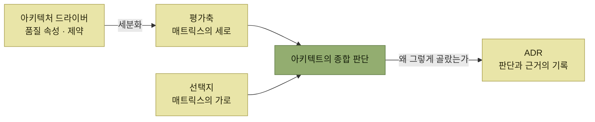

# 아키텍처의 비교 평가

> [아키텍처 설계](./README.md)

## 빠른 복습

- **모든 측면에서 만점을 받는 완벽한 선택지는 없다.** 아키텍처 선택은 **가장 좋은 것이 아니라 나은 것을 고르는 작업**이다.
- 평가의 기준은 [아키텍처 드라이버](./2-아키텍처-드라이버의-핵심-사항.md)다. **세로축에 평가축(품질 속성 + 제약), 가로축에 선택지**를 놓고 **비교 평가 매트릭스**를 만든다.
- **총점으로 기계적으로 결정하지 않는다.** 매트릭스는 **유력한 후보를 추려내는 도구**이고, **최종 선정은 아키텍트의 종합 판단**이다. 대신 **합리적이고 명확한 근거를 제시**할 수 있어야 한다.
- **판단을 보류하는 판단**도 판단이다. 지금은 나누지 않되 **나중에 쉽게 전환할 수 있도록 대비**하는 전략이 그것이다.
- 이론적 검토로 결론이 나지 않으면 **아키텍처 프로토타이핑**으로 실제 데이터를 얻는다. 일회성 검증용과 제품으로 발전시킬 프로토타입을 처음부터 구분한다.
- 설계 판단은 **투명하게 공유**되어야 하며, 그 도구가 **아키텍처 의사결정 기록(ADR)** 이다.

## 가장 좋은 것이 아니라 나은 것을 고른다

> 아키텍처를 선택하는 과정은 **트레이드오프의 연속**이다. **모든 측면에서 만점을 받는 완벽한 선택지는 없다.** 아키텍처 선정은 **가장 좋은 것보다 나은 것을 선택하는 작업**이다.

기준은 이미 정해져 있다. **아키텍처의 필수 조건은 아키텍처 드라이버를 달성하는 것**이었으므로, **아키텍처 드라이버와 이를 세분화한 요소들이 평가의 기준**이 된다.



*평가축은 드라이버에서 나오고, 판단의 결과는 기록으로 남는다*

## 비교 평가 매트릭스

**평가축을 세로로 놓고, 가로축에는 선택 가능한 선택지를 정리하여 비교 평가 매트릭스를 작성한다.**

사례에서 비교한 것은 [서비스 분할 방침](./3-시스템-아키텍처-선정.md#논리적으로-먼저-물리적으로-나중에)이었다. **경비 정산 서비스를 큰 단위의 단일 서비스로 유지할 것인지**, 아니면 **신청·승인, 목록 검색, 마스터 관리 같은 개별 업무 단위를 마이크로서비스로 독립시켜 세분화할 것인지**다. **평가 기준이 되는 세로축에는 품질 속성과 함께 제약 조건 등도 포함**된다.

| 평가 항목 | 단일 서비스 방식<br>(큰 단위로 묶은 서비스 분할) | 세분화된 서비스 방식<br>(작은 단위로 나눈 서비스 분할) |
| --- | --- | --- |
| **시간 반응성** | △ 현재 예상되는 트랜잭션량으로는 문제가 없지만, **향후 대폭 증가할 경우 서비스 전체의 스케일업 필요** | ○ 신청·승인과 목록 검색을 분할하면 **필요에 따라 개별적으로 스케일링 가능** |
| **분석성(로그)** | ○ 문제없음 | △ 서비스가 분할됨에 따라 **로그 추적이 어려워져 별도의 대응이 필요** |
| **분석성(성능)** | △ 응답 지연이나 처리량 저하 등 **문제 발생 시 원인 규명이 어려움** | ○ **성능 문제가 발생한 특정 서비스를 쉽게 파악 가능** |
| **개발팀의 기술력** | ○ 문제없음 | △ **마이크로서비스 경험이 적어 리스크가 있음** |
| **개발 공수** | ○ 문제없음 | △ **서비스 간 데이터 연계 등 개발 범위가 늘어나면서 예상 공수가 증가할 리스크** |

*원서 [표 3.10] 서비스 분할 비교 평가 매트릭스 예시*

표를 읽는 법. **선택지별로 장점과 단점이 공존한다**는 것이 이 표가 보여주는 전부다. 눈여겨볼 것은 두 가지다.

- **같은 "분석성"이 두 줄로 갈렸고, 그 두 줄의 승자가 서로 다르다.** 로그 추적은 단일 서비스가 낫고, 성능 원인 파악은 분할이 낫다. **품질 속성을 부속성 단위까지 쪼개야 이런 것이 보인다.**
- 아래 두 줄은 품질 속성이 아니라 **제약**(팀의 기술력, 개발 공수)이다. **기술적으로 나은 쪽이 프로젝트에서 나은 쪽이 아닐 수 있다.**

### 총점으로 결정하지 않는다

**평가 항목별로 가중치를 부여하고 점수를 산출하는 방식도 있지만**, 총점을 기준으로 기계적으로 결정하기보다는 **여러 선택지 중에서 가장 유력한 후보를 추려내는 식이 바람직**하다.

> 궁극적으로 **최종 선정은 아키텍트가 종합적인 판단을 통해 결정**해야 하며, 그 과정에서 **합리적이고 명확한 근거를 제시할 수 있어야 한다.**

매트릭스는 **답을 계산해주는 장치가 아니라 근거를 눈에 보이게 하는 장치**다. 그래서 다음 절의 ADR이 뒤따른다.

## 판단을 보류하는 판단

**설계 과정에서 일부러 '판단을 보류하는' 판단을 할 수도 있다.**

위 사례에서 **서비스 세분화 방식은 확장성 측면에서 유리하며, 특히 향후 사용자 수나 트랜잭션 규모가 증가할 경우 효과적**일 수 있다. 그러나 **개발 일정과 공수 부담이 크기 때문에**, **현재로서는 세분화하지 않되 향후 필요 시 쉽게 전환할 수 있도록 대비하는 전략**을 고려할 수 있다.

구체적으로는 [모듈형 모놀리스](./3-시스템-아키텍처-선정.md#모듈형-모놀리스--나누지-않고-나눈다) 또는 이에 가까운 **모듈 분할 방식을 채택하여, 이후 마이크로서비스로 확장할 수 있는 유연성을 확보**하는 방식이다.

보류는 **결정을 미루는 것이 아니라, "지금은 하지 않는다"를 결정하고 그 대신 전환 비용을 낮춰두는 것**이다. 그러려면 보류했다는 사실과 그 조건이 기록으로 남아야 한다.

## 아키텍처 프로토타이핑

아키텍처 설계 시 여러 선택지를 비교 평가할 때는 **기업 내·외부에서 수집한 다양한 정보를 활용**하지만, **이론적 검토만으로는 결론을 내리기 어려운 경우**가 있다.

- **기술적 리스크를 완전히 해소할 수 있다는 확신이 없는 경우**
- **성능에 대한 실제 데이터를 수집할 필요가 있는 경우**

이럴 때는 **실제로 코드를 작성해 보거나 툴을 활용해 실험하는 등 기술 검증을 수행**한다. **검증해야 할 항목이 많고 복잡하다면, 이를 확인할 수 있는 샘플 애플리케이션을 제작**하기도 한다.

> 빠른 검증을 위해 품질을 의도적으로 생략한 **일회성(throwaway) 프로토타입**은 제품 코드로 재사용하지 않는다. 제품으로 발전시킬 진화형 프로토타입이라면 처음부터 그에 맞는 품질 기준과 검증 범위를 적용해야 한다.

**실제 제품의 소스 코드로 재사용하려 하면** 두 가지 대가를 치른다.

- **평가 대상이 아닌 부분까지 과도하게 개발**하게 되어 **시간과 리소스를 낭비**할 수 있다.
- **해당 선택지를 고집하게 될 우려**가 있다.

두 번째가 특히 무섭다. **코드를 버리지 못하면 판단도 버리지 못한다.** 다만 **한 번 사용하고 폐기한다고 해도 검증 과정에서 얻은 결과는 사내 다른 프로젝트에서도 유용하게 활용될 수 있으므로**, **검증 결과와 함께 관련 소스 코드를 소스 관리 저장소에 보관해 두면** 사내 참고 자료로 쓰기 좋다.

## 아키텍처 의사결정 기록

**아키텍트는 크고 작은 설계 결정을 지속적으로 내린다.**

- 아키텍처에서 채택할 **패턴**
- 구체적인 **구현 방식**
- 사용할 **프레임워크와 라이브러리**
- 개발 프로세스를 지원하는 **도구**

**이러한 설계 판단은 아키텍트, 개발자, 기타 이해관계자 간에 투명하게 공유되어야 한다.** 이때 쓰는 것이 **아키텍처 의사결정 기록(ADR)** 이다. **작성하지 않으면 정보를 간과한 채 개발이 진행되어, 나중에 문제가 드러나 차질이 생길 수 있다.**

```markdown
# 제목
ADR-001 경비 정산 서브시스템의 서비스 분할 방침

# 배경
시스템의 논리적 분할 결과, 경비 정산 서브시스템이 하나의 서브시스템으로 통합되었다.
신청 및 승인, 목록 검색, 마스터 관리를 마이크로서비스로 독립시켜야 할지,
하나의 단일 서비스로 유지할지 결정이 필요하다.

# 결정 내용
경비 정산 서브시스템은 하나의 단일 서비스로 유지한다.
마이크로서비스로 만들면 확장성 측면에서 장점이 있지만, 개발팀의 기술 스택과
개발 공수를 고려했을 때 현재 납기 일정 내 구현하는 것이 어려울 수 있는 리스크가 크다.

# 상태
승인됨

# 비고
향후 마이크로서비스로 분리할 가능성을 고려하여, 이전이 용이한 애플리케이션 아키텍처
설계를 검토해 둔다.
ADR-002 경비 정산 서브시스템의 모듈 구조 참고
```

*[그림 3.23] 서비스 분할 방침에 관한 ADR 예시*

이 한 장에 앞의 이야기가 모두 들어 있다.

- **배경**에는 무엇을 놓고 고민했는지가, **결정 내용**에는 고른 것과 **버린 쪽의 장점까지** 적혀 있다. "확장성 측면에서 장점이 있지만"이라는 구절이 그것이다. **포기한 것을 적어두지 않으면 나중에 그 결정을 다시 열어볼 수 없다.**
- **상태**가 있어 이 결정이 제안인지 승인된 것인지 폐기된 것인지 구분된다.
- **비고**는 앞 절의 **판단 보류**를 그대로 옮긴 자리다. 지금은 나누지 않되 전환에 대비한다는 조건이 남았고, 관련 ADR로 링크까지 걸려 있다.

[1절에서 "기록의 이유는 나중에 바꾸기 위해서"](./1-아키텍처-설계의-주요-개념.md#아키텍처는-트레이드오프다)라고 했던 말이 이 문서에서 형태를 갖춘다.

## 핵심 정리

- 완벽한 선택지는 없으므로, 아키텍처 선정은 **나은 것을 고르는 일**이다.
- 평가축은 **아키텍처 드라이버에서 나오며, 품질 부속성 단위까지 쪼개야** 선택지의 차이가 보인다. 제약도 평가축에 들어간다.
- 매트릭스는 **점수를 계산하는 장치가 아니라 근거를 드러내는 장치**다. 최종 판단은 아키텍트가 하고, 근거를 제시할 수 있어야 한다.
- **판단 보류**는 "지금은 하지 않는다"를 결정하고 **전환 비용을 낮춰두는 것**이다. 모듈형 모놀리스가 그 수단이다.
- 일회성 아키텍처 프로토타입은 제품 코드로 재사용하지 않는다. 진화형 프로토타입은 처음부터 별도의 품질 기준을 적용하며, 어느 경우든 검증 결과는 자산으로 남긴다.
- **ADR**은 제목·배경·결정 내용·상태·비고로 이루어지며, **버린 선택지의 장점까지 적는 것**이 요점이다.

## 함께 읽기

- [드라이버 — 여기서 고른 것이 평가축이 된다](./2-아키텍처-드라이버의-핵심-사항.md)
- [시스템 아키텍처 선정 — 이 절이 평가하는 그 선택지들](./3-시스템-아키텍처-선정.md)
- [1절 — 아키텍처는 트레이드오프이며 기록으로 남는다는 이야기의 출발점](./1-아키텍처-설계의-주요-개념.md)
