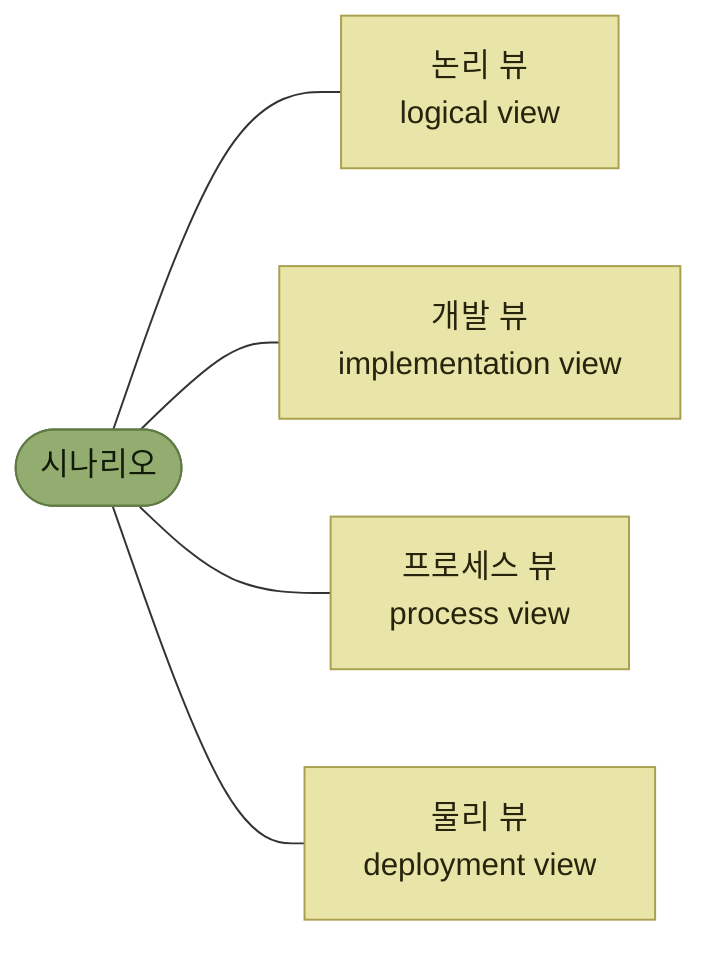
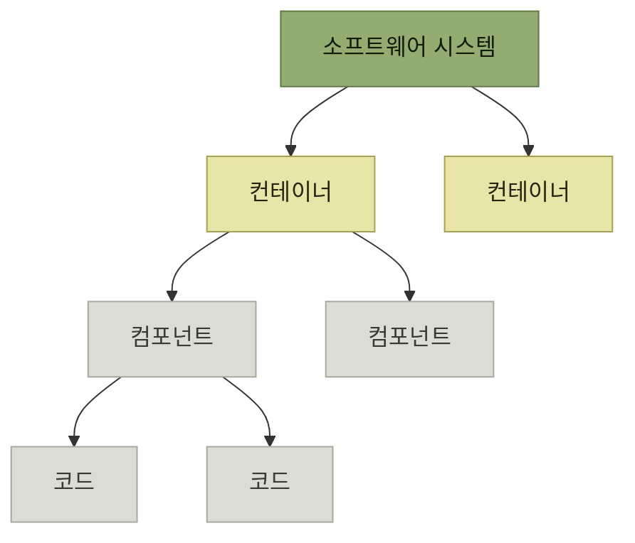
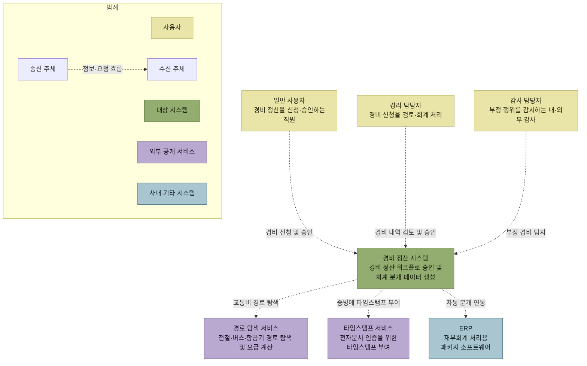

# 아키텍처 문서화

> [아키텍처 설계](./README.md)

## 빠른 복습

- **ADR은 개별 설계 판단을 기록하는 경량 문서**다. 그와 별도로 **아키텍처 전체를 설명하는 문서**가 필요하며, 이 책은 이를 **아키텍처 기술서**(SAD)라 부른다.
- 표준(**ISO/IEC/IEEE 42010:2011**)과 템플릿(**SEI의 Views and Beyond**)이 있지만 **형식적인 요소가 많다.** 특별한 사정이 없다면 **더 애자일하고 간결한 문서화**가 실용적이다.
- 기술서에는 **목적 · 아키텍처 드라이버 · 전체 시스템 구성 · 사용자와 이해관계자 · 아키텍처 모델**이 들어간다.
- 이해관계자마다 관심사가 다르다. **아키텍처를 파악하는 시각이 뷰포인트**, **그 시각으로 실제로 그린 도면이 뷰**다.
- 대표적인 뷰포인트 세트가 **4+1 뷰**(논리 · 개발 · 프로세스 · 물리 + 시나리오)와 **C4 모델**(컨텍스트 · 컨테이너 · 컴포넌트 · 코드)이다.
- **C4 모델은 표준 표기법을 정하지 않는다.** 표기가 자체 설명적이지 않다면 범례를 제공하는 등 팀 안에서 일관되게 표현해야 한다.

## 전체를 설명하는 문서가 따로 필요하다

[ADR](./5-아키텍처의-비교-평가.md#아키텍처-의사결정-기록)은 **개별 설계 판단을 기록하고 공유하기 위한 경량 문서**다. 그것만으로는 아키텍처 전체를 설명할 수 없으므로, 보통 **아키텍처 문서**나 **소프트웨어 아키텍처 기술서**(SAD, software architecture document)로 불리는 문서가 따로 필요하다. 이 책에서는 **아키텍처 기술서**로 부른다.

표준과 템플릿도 있다.

- **ISO/IEC/IEEE 42010:2011** — [1절에서 아키텍처를 정의했던 그 규격](./1-아키텍처-설계의-주요-개념.md#아키텍처는-발전의-원칙까지-포함한다)이며, 특정 문서 템플릿을 강제하기보다 **아키텍처 기술에 포함되어야 할 개념과 관계를 규정**한다.
- **SEI**(Software Engineering Institute)의 **Views and Beyond** — 아키텍처 기술서 템플릿이다.

다만 **형식적인 요소가 많아 그대로 사용하면 문서가 불필요하게 무거워진다.** **대규모 시스템을 구축해 고객에게 납품해야 하는 등의 특별한 사정이 없다면, 좀 더 애자일하고 간결한 문서화 방식이 더 실용적**이다.

## 아키텍처 기술서에 무엇을 담는가

| 항목 | 무엇을 적는가 |
| --- | --- |
| **목적** | **문서의 목적과 개요, 대상 독자, 아키텍처의 목표 및 지향점** |
| **아키텍처 드라이버** | 아키텍처 설계 시 고려해야 할 **핵심 요소의 목록** — 제약, 품질 속성, 영향을 미치는 기능 요구, 기타 영향을 미치는 요소 |
| **전체 시스템 구성** | **시스템 전체 구조를 한눈에 파악할 수 있는 그림**과 주요 서브시스템·서비스의 개요 |
| **사용자(업무 주체)와 이해관계자** | 시스템을 직접 사용하는 사용자와, **아키텍처에 영향을 주거나 영향을 받는 이해관계자** |
| **아키텍처 모델** | 아키텍처를 **다양한 관점에서 모델링**한 다이어그램과 설명 |

표를 읽는 법. 위 세 항목이 **왜 이렇게 만들었는가**(목적 · 드라이버)와 **무엇을 만들었는가**(구성)이고, 아래 두 항목이 **누구를 위한 것인가**(이해관계자)와 **어떻게 보여줄 것인가**(모델)다. 3장 전체가 만들어온 산출물이 그대로 목차가 된다.

- **전체 시스템 구성**에는 [3.3절의 시스템 구성 예시](./3-시스템-아키텍처-선정.md#서비스-분할--처리의-성질이-다르면-나눈다)처럼 전체 구조를 한눈에 파악할 수 있는 그림을 싣는다. 또한 **더 상위 관점에서 시스템 외부 엔티티와의 관계를 포함하여 업무 흐름을 정리한 시스템 컨텍스트 다이어그램을 추가하면 더 유용**하다.
- **사용자 및 이해관계자**에는 **사용자에게 어떤 품질 속성이 중요한지, 이해관계자가 아키텍처에 어떤 관심을 가지고 어떤 영향력을 미치는지**를 **아키텍처 설계의 배경으로서** 정리해 둔다. 이해관계자로는 **프로덕트 오너(PO), 아키텍트, 개발자, QA 엔지니어, 디자이너, 인프라 엔지니어, 보안 엔지니어, 운영팀, 고객 지원팀** 등이 있다.
- **아키텍처 모델**에는 **특정 측면을 시각적으로 표현한 다이어그램과 설명**이 해당하며, **아키텍처 스타일이나 아키텍처 패턴을 활용해 시스템 구성을 도식화한 다이어그램**도 포함될 수 있다.

## 뷰포인트와 뷰

**이해관계자들은 저마다 관심사가 달라, 아키텍처에서 알고 싶은 관점이 다르다.**

> 관심사와 관점에 따라 **아키텍처를 파악하는 방법 또는 시각**을 **뷰포인트**(viewpoint)라고 한다. 그리고 **각 뷰포인트에 따라 실제로 아키텍처를 모델로 표현한 개별 도면**을 **뷰**(view)라고 한다.

예를 들어 **시스템 운영 및 관리를 담당하는 운영팀은 시스템이 어떤 단위로 배포되며, 운영 상태를 어떻게 모니터링할 수 있는지에 관심**을 가진다. 이에 대응하는 것이 **배치 뷰포인트**이고, 이를 표현하는 방법으로 **UML의 배치도**를 활용할 수 있다. 이 경우 **UML 배치도를 통해 실제 배포 구성을 구체적으로 나타낸 도면이 뷰**에 해당한다.

**뷰포인트 세트**는 **여러 개의 뷰포인트를 체계적으로 정리하여 하나의 프레임워크 형태로 구성한 것**이다. 대표적인 것이 **4+1 뷰**와 **C4 모델**이다.

## 4+1 뷰

**필립 크뤼슈텐이 1995년에 발표한 논문에서 제시**한 것으로, 이후 **래셔널 통합 프로세스**(RUP, UML 기반 객체지향 개발 방법론)에도 채택되면서 유명해졌다.

*[그림 3.24] 4+1 뷰 — 가운데 시나리오가 '+1'이다. 원서 그림의 네 사분면 배치를 방향 없는 연결로 옮겼다*

**4+1 뷰를 활용한 아키텍처 모델링에서는 여러 뷰포인트를 통해 다양한 이해관계자의 관심사를 개별적으로 다룬다.** **뷰포인트**는 뷰를 구성하고 해석하는 관점과 규칙이고, **뷰**는 그 관점에 따라 실제로 작성한 아키텍처 표현이다. 4+1의 논리·개발·프로세스·물리 뷰는 산출물인 뷰를 뜻한다.

| 뷰 | 무엇을 보여주는가 | 무엇으로 그리는가 |
| --- | --- | --- |
| **논리 뷰** | 소프트웨어의 **논리적 구조** — 레이어 구조, 컴포넌트 구조, 클래스 구조 | UML **패키지 다이어그램**, **클래스 다이어그램** |
| **개발 뷰**(구현 뷰) | **구현 관점에서의 구조** — 네임스페이스·패키지로 계층화된 모듈 구조, JAR·DLL 등 어셈블리와의 대응 관계 | **디렉터리 구조도**, UML 패키지 다이어그램 |
| **프로세스 뷰** | 시스템 **실행 시의 프로세스 및 태스크의 병렬성과 동시성** | UML **시퀀스 다이어그램** |
| **물리 뷰**(배치 뷰) | 시스템의 각 모듈이 **배치되는 환경** | UML 배치도, **클라우드 아키텍처 다이어그램** |
| **시나리오 뷰**(유스케이스 뷰) | 핵심 **유스케이스 시나리오** — 네 뷰를 꿰어 이해를 돕는다 | 유스케이스 다이어그램 등 |

표를 읽는 법. 앞의 네 뷰는 **구조를 서로 다른 각도에서 자른 것**이고, 마지막 시나리오 뷰는 **그 네 개를 관통하며 "정말 이대로 동작하는가"를 확인하는 자리**다.

- **논리 뷰**는 [3.4절의 3계층 컴포넌트 유형 구성 예](./4-애플리케이션-아키텍처-선정.md#계층만-나누면-부족하다)처럼 **시스템의 기본 구조를 설명하거나 아키텍처에서 중요한 설계 요소를 강조**하는 데 적합하다.
- **프로세스 뷰**는 **멀티스레드 환경에서의 실행 구조**를 표현하는 데 적합하고, **마이크로서비스에서 여러 서비스가 협력하여 처리하는 방식**이나 [분산 트랜잭션이 실패했을 때의 보상 트랜잭션 흐름](./3-시스템-아키텍처-선정.md#방식②--완료된-것을-되돌린다)을 나타내는 데도 효과적이다.
- **물리 뷰**는 **과거에는 주로 물리적 하드웨어 구성**을 나타냈으나, **현재는 클라우드 환경, 가상 환경, 컨테이너 기반 환경 등을 반영**하는 것이 일반적이다. 예를 들어 **AWS 클라우드 환경에서는 독자적인 아이콘을 사용한 아키텍처 다이어그램으로 시스템 구성을 표현**하는 것이 널리 활용된다.
- **시나리오 뷰**는 **핵심 유스케이스로 표현된 아키텍처 시나리오를 포함**한다. 이를 통해 **아키텍처 설계의 타당성을 검토**하고, **아키텍처 구현 초기에 사용할 유스케이스 후보를 도출**할 수 있다.

## C4 모델

**사이먼 브라운이 고안한 모델**로, **시스템을 네 가지 서로 다른 추상화 레벨로 나누어 각 수준에 적합한 다이어그램을 사용해 아키텍처를 모델링**한다. 이로써 **관심사를 효과적으로 분리하고, 소프트웨어 개발 과정에서 원활한 커뮤니케이션을 돕는 것**을 목표로 한다.

네 레벨은 **컨텍스트 · 컨테이너 · 컴포넌트 · 코드**다. **설계자는 마치 지도 애플리케이션에서 관심 지역을 확대하거나 축소하듯, 필요에 따라 추상화 레벨을 조정하며 자신이 해결하고자 하는 특정 관심사에 가장 적합한 모델을 선택해 활용한다.**

*[그림 3.26] C4 모델의 소프트웨어 시스템 구조 — 하나의 시스템은 여러 컨테이너로, 각 컨테이너는 여러 컴포넌트로, 각 컴포넌트는 여러 코드 요소로 이루어진다*

| 레벨 | 무엇인가 | 무엇으로 그리는가 |
| --- | --- | --- |
| **컨텍스트** | **가장 추상적인 레벨**에서 소프트웨어 시스템과 **외부 엔티티(사용자 및 외부 시스템) 간의 상호작용**을 파악하여 구조화한 모델링 단위 | **시스템 컨텍스트 다이어그램** |
| **컨테이너** | 시스템을 구성하는 요소로, **독립적으로 배포 가능한 실행 단위** — 웹 애플리케이션, 마이크로서비스, 데이터 저장소 등 | 시스템 구성도 |
| **컴포넌트** | **컨테이너 내부의 개별 요소**로, **명확하게 정의된 인터페이스를 가지고 일관된 동작을 제공** | UML **클래스 다이어그램**, **시퀀스 다이어그램** |
| **코드** | 실제 구현 단계에서의 구성 단위 — 객체 지향 언어에서는 **클래스와 인터페이스** | UML 클래스·시퀀스 다이어그램 |

표를 읽는 법. 아래로 갈수록 확대된다. 다만 **코드 레벨은 너무 세부적인 내용까지 다루게 되므로 선택적으로 활용하는 것이 일반적**이며, **주로 중요한 컴포넌트나 복잡한 컴포넌트에 한해 필요할 때만 작성**된다. 컨테이너 레벨의 예로는 [3.3절의 서비스 분할 예시](./3-시스템-아키텍처-선정.md#서비스-분할--처리의-성질이-다르면-나눈다)를 참고할 수 있다.

### 이 책의 추상화 레벨과 견주면

| C4 모델의 추상화 레벨 | 이 책의 설계 추상화 레벨 |
| --- | --- |
| **컨텍스트** | 없음 |
| **컨테이너** | 아키텍처 설계 |
| **컴포넌트** | 모듈 설계 · 컴포넌트 설계 |
| **코드** | 클래스 설계 |

오른쪽 열은 [2장의 네 가지 설계 추상화 레벨](../2-소프트웨어-설계/2-소프트웨어-설계의-추상화-레벨.md#네-개의-레벨)이다.

표를 읽는 법. **컨텍스트에 대응하는 칸이 비어 있다**는 것이 요점이다. 이 책은 **컨텍스트를 비즈니스나 업무 전체를 파악하는 요구사항 정의 활동의 일부로 간주하고, 아키텍처 설계에서 다뤄야 할 추상화 레벨로는 보지 않기 때문**이다. C4의 컴포넌트와 이 책의 컴포넌트는 대략 대응하지만, 경계와 배포 가능성 같은 정확한 의미는 각 문맥의 정의를 확인해야 한다.

### 표기법은 정해져 있지 않다

**C4 모델에서는 표준 표기법을 명확히 정의하지 않았다.** 공식 사이트에 소개된 다이어그램의 대부분이 UML을 기반으로 하지만, **표준 UML 표기법만으로 표현하기 어려운 경우 독자적인 아이콘이나 요소를 추가하는 등 표현력을 극대화하는 데 중점**을 둔다.

> 다만 소프트웨어 개발팀에서 **공통된 커뮤니케이션 도구로 활용하려면 표기 방식의 일관성이 필요**하다. C4 모델은 요소의 이름·유형·설명과 관계의 방향·설명을 명확히 표시하도록 권장한다. 색상·도형·화살표만으로 의미를 구분해 표기가 자체 설명적이지 않다면 **범례를 함께 제공**한다.

### 시스템 컨텍스트 다이어그램의 예

*[그림 3.27] 시스템 컨텍스트 다이어그램 예시 — 초록은 대상 시스템, 노랑은 사용자, 보라는 외부 공개 서비스, 파랑은 사내 기타 시스템이며 점선 화살표는 정보·요청 흐름이다*

이 그림에는 **범례가 함께 그려져 있다.** 사용자 · 대상 시스템 · 외부 공개 서비스 · 사내 기타 시스템을 서로 다른 색으로 구분하고, 점선 화살표가 정보·요청 흐름임을 적어두었다. 앞에서 말한 **"표기가 자체 설명적이지 않을 때 범례를 제공하라"는 권장 사항이 실제로 어떤 모습인지**가 이 한 장에 들어 있다. 이 저장소에서 도식 표기 규칙을 책마다 명시하는 이유도 같다.

## 핵심 정리

- ADR이 개별 결정을 남긴다면, **아키텍처 기술서는 전체 그림을 설명**한다. 표준과 템플릿은 무거우므로 **간결한 쪽이 대개 실용적**이다.
- 기술서의 목차는 **목적 · 드라이버 · 전체 구성 · 이해관계자 · 아키텍처 모델**이며, 3장이 만들어온 산출물이 그대로 들어간다.
- **뷰포인트는 보는 시각, 뷰는 그 시각으로 그린 도면**이다. 이해관계자가 다르면 필요한 뷰도 다르다.
- **4+1 뷰**는 논리 · 개발 · 프로세스 · 물리 네 구조를 **시나리오가 관통**하는 구성이다.
- **C4 모델**은 컨텍스트 → 컨테이너 → 컴포넌트 → 코드로 **확대·축소하듯 레벨을 오간다.** 코드 레벨은 필요할 때만 그린다.
- 이 책은 **컨텍스트를 요구사항 정의의 몫으로 보고** 설계 추상화 레벨에 넣지 않는다.
- C4는 표기법을 강제하지 않으며, 표기가 자체 설명적이지 않을 때 범례를 제공한다. 도식은 그린 사람이 아니라 **읽는 사람이 해석할 수 있어야** 문서가 된다.

## 함께 읽기

- [앞 절 — ADR로 남기는 개별 판단](./5-아키텍처의-비교-평가.md)
- [추상화 레벨 — C4 모델과 견줘본 이 책의 네 레벨](../2-소프트웨어-설계/2-소프트웨어-설계의-추상화-레벨.md)
- [1절 — 문서와 규약이 아키텍처의 네 번째 갈래였던 이유](./1-아키텍처-설계의-주요-개념.md)
- AWS, [아키텍처 다이어그래밍이란?](https://aws.amazon.com/ko/what-is/architecture-diagramming/) — 물리 뷰에서 쓰는 클라우드 아키텍처 다이어그램의 안내
