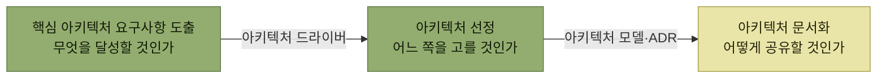

# 아키텍처 설계

## 아키텍처는 무엇을 정하는 일인가

2장이 **설계 일반**의 원칙과 패턴을 다뤘다면, 3장은 그 가운데 **가장 위 레벨의 설계**를 실제로 어떻게 진행하는지를 다룬다. 무엇을 목표로 삼고, 무엇을 근거로 고르고, 고른 것을 어떻게 남길 것인가.

*아키텍처 설계는 세 작업으로 이어진다. 화살표 위의 것이 앞 작업이 뒤 작업에 넘기는 산출물이다*

## 목차

1. [아키텍처 설계의 주요 개념](./1-아키텍처-설계의-주요-개념.md)
2. [아키텍처 드라이버의 핵심 사항](./2-아키텍처-드라이버의-핵심-사항.md)
3. [시스템 아키텍처 선정](./3-시스템-아키텍처-선정.md)
4. [애플리케이션 아키텍처 선정](./4-애플리케이션-아키텍처-선정.md)
5. [아키텍처의 비교 평가](./5-아키텍처의-비교-평가.md)
6. [아키텍처 문서화](./6-아키텍처-문서화.md)

## 함께 읽기

- [추상화 레벨 가운데 가장 위](../2-소프트웨어-설계/2-소프트웨어-설계의-추상화-레벨.md#아키텍처-설계)가 이 장의 대상이다.
- [아키텍처 스타일과 패턴](../2-소프트웨어-설계/4-설계-패턴.md#아키텍처-스타일과-아키텍처-패턴)을 "고르고 비교하는" 일이 이 장에서 벌어진다.
