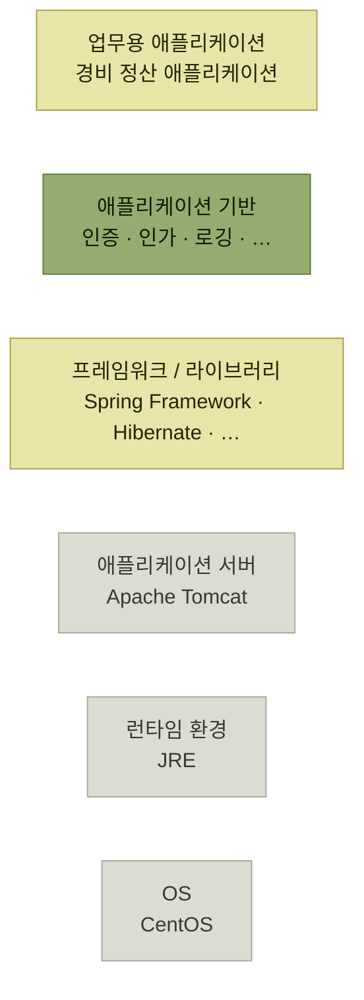
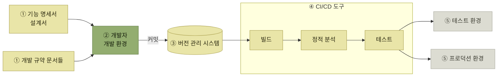

# 구현 단계에서 아키텍트의 역할

> [아키텍처 구현](./README.md)

## 빠른 복습

- 구현 단계에서 아키텍트가 가장 먼저 하는 일은 **애플리케이션의 기반을 구축하는 일**이다.
- 운영 환경에서 실행되는 애플리케이션은 **OS → 런타임 환경 → 애플리케이션 서버 → 프레임워크/라이브러리 → 애플리케이션 기반 → 업무용 애플리케이션**으로 쌓인다. **아래로 갈수록 범용, 위로 갈수록 특화**다.
- 각 계층에서 쓸 **언어·제품·프레임워크·라이브러리는 아키텍처 드라이버를 근거로 아키텍트가 결정**한다.
- **애플리케이션 기반**은 이 책이 부르는 중간 계층의 이름이다. **공통 기능을 제공하고, 프레임워크 내부를 감추고, 직접 의존을 막아 교체 가능성을 남긴다.**
- 공통 기능은 **아키텍트가 직접 설계하고 구현을 주도**하며, 대규모 프로젝트에서는 **공통 기반 전담 팀**을 두는 경우가 많다.
- **기능만 갖춰도 순조로운 개발은 보장되지 않는다.** 공통된 개발 규칙을 정의해 팀에 정착시키고, 환경과 도구를 준비해 **애플리케이션 개발 플로를 확립**해야 한다.

## 애플리케이션은 층으로 쌓인다

실제 운영 환경에 배포되어 실행되는 애플리케이션은 다음과 같은 구조를 따른다.

*[그림 4.1] 자바 웹 애플리케이션의 대표 구조 예시 — 실제로는 언어, 기술, 소프트웨어 조합마다 다르다. 초록이 이 절의 주인공인 애플리케이션 기반이다*

**각 계층에서 사용할 프로그래밍 언어, 소프트웨어 제품, 프레임워크, 라이브러리 등은 [아키텍처 드라이버](../3-아키텍처-설계/2-아키텍처-드라이버의-핵심-사항.md)를 기반으로 아키텍트가 결정한다.**

> 계층이 **아래로 갈수록 범용성이 높고, 위로 갈수록 특정 목적에 특화된 기능**을 제공한다.

이 축이 있어서 다음 이야기가 성립한다. **가장 아래는 남이 만든 것을 그대로 쓰고, 가장 위는 우리 업무만을 위해 만든다.** 그 사이에 **우리 팀을 위해 만드는 층**이 하나 더 있다는 것이 이 절의 주장이다.

## 애플리케이션 기반 — 가운데 한 층을 우리가 만든다

업무용 애플리케이션과 프레임워크/라이브러리 사이의 중간 계층을 이 책에서는 **애플리케이션 기반**이라 부른다. 하는 일은 셋이다.

| 역할 | 무엇을 위한 것인가 |
| --- | --- |
| **애플리케이션의 특성과 유스케이스에 적합한 공통 기능을 제공한다** | 같은 일을 화면마다 다시 짜지 않게 한다 — 인증, 인가, 로깅 등 |
| **프레임워크와 라이브러리의 내부를 숨기고 추상화한다** | 애플리케이션 개발자가 **더 쉽게 활용**할 수 있게 한다 |
| **프레임워크나 라이브러리에 직접 의존하지 않도록 설계한다** | **향후 교체 가능성을 열어둔다** |

표를 읽는 법. 세 줄이 각각 [비중복](../2-소프트웨어-설계/3-소프트웨어-설계-원칙과-실천-방법.md#클린-코드--다섯-가지-품질-기준) · [Facade](../2-소프트웨어-설계/4-설계-패턴.md#facade--모듈-뒤에-있는-것을-숨긴다) · [DIP](../2-소프트웨어-설계/3-소프트웨어-설계-원칙과-실천-방법.md#dip--의존성-역전-원칙)다. 2장에서 클래스와 컴포넌트 사이에 하던 일을, 여기서는 **우리 코드와 남의 프레임워크 사이에 한다.** 층이 하나 올라갔을 뿐 구조는 같다.

**애플리케이션 기반의 공통 기능은 아키텍트가 직접 설계하고 구현을 주도**하며, **대규모 프로젝트에서는 공통 기반 전담 팀을 구성하여 체계적으로 구축하는 경우가 많다.** 구현의 자세한 이야기는 4.4절에서 다룬다.

## 기능을 갖추는 것만으로는 부족하다

> 애플리케이션 기반에 필요한 공통 기능을 갖추는 것만으로는 순조롭게 개발된다고 보장할 수 없다. **어떤 절차로 진행할 것인지 공통된 개발 규칙을 정의하고 이를 팀 전체에 정착시키는 것**이 중요하다.

실제 개발에 필요한 **환경과 도구를 준비하는 작업**도 필요하며, 아키텍트는 이 과정을 주도하여 **애플리케이션 개발 플로**(flow)를 확립해야 한다.

*[그림 4.2] 애플리케이션 개발 플로 — 원서는 이 그림의 구간마다 개발 프로세스 · 개발 규약 · 구성 관리 · CI/CD라는 이름을 붙여두었다*

원서가 이 한 장에 네 개의 이름을 얹어둔 것이 요점이다. **그림의 왼쪽에서 오른쪽으로 가는 동안, 아키텍트가 준비해야 할 일이 네 묶음으로 갈린다.**

| 구간 | 아키텍트가 하는 일 |
| --- | --- |
| **개발 프로세스** | 요구된 동작을 기능으로 구현하려면 **기능 명세서, 설계서 같은 입력 정보를 담은 문서**가 필요하다. **작성 시기와 문서 종류, 리뷰 및 승인 방식**을 일련의 프로젝트 개발 프로세스로서 **표준화**한다 |
| **개발 규약** | 개발자가 원활하게 **환경을 설정하고 구현할 수 있도록 가이드라인을 마련**하고, 구현 시 **준수해야 할 개발 규약을 정비**한다 |
| **구성 관리** | 개발한 소스 코드와 관련 자료를 **버전 관리 시스템에서 체계적으로 관리**해야 하므로, **개발 산출물의 구성 요소를 관리하는 정책을 수립**한다 |
| **CI/CD** | 소스 코드 **빌드, 정적 분석**(코드 실행 없는 품질 검사)**과 테스트, 테스트·프로덕션 환경 배포**를 자동화하도록 **적절한 도구를 선정하고 실제 빌드 프로세스를 구축**한다 |

표를 읽는 법. 네 줄 모두 **기능을 만드는 일이 아니다.** 아키텍트가 구현 단계에서 맡는 것은 **개발자들이 같은 방식으로 일하게 만드는 판**이다. 문서 · 규약 · 저장소 · 파이프라인이 그 판의 네 다리다.

이 가운데 **개발 프로세스 표준화, 개발자용 문서 작성, 구성 관리 및 CI/CD 구축의 구체적인 내용은 4.6절에서 상세히 다룬다.**

## 핵심 정리

- 구현 단계에서 아키텍트가 먼저 하는 일은 **기능 구현이 아니라 기반 구축**이다.
- 애플리케이션은 **OS부터 업무용 애플리케이션까지 층으로 쌓이고**, 아래는 범용·위는 특화다. 각 층의 기술 선택 근거는 **아키텍처 드라이버**다.
- **애플리케이션 기반**은 공통 기능을 모으고, 프레임워크를 감추고, 직접 의존을 끊는 층이다. **Facade와 DIP를 프레임워크 경계에 적용한 것**이다.
- 그 층은 아키텍트가 설계를 주도하며, 규모가 크면 **전담 팀**을 둔다.
- **공통 기능만으로는 개발이 굴러가지 않는다.** 개발 플로 — **개발 프로세스 · 개발 규약 · 구성 관리 · CI/CD** — 를 세워야 한다.

## 함께 읽기

- [아키텍처 문서화 — 개발 규약과 가이드라인이 아키텍처 기술서와 함께 놓이는 이유](../3-아키텍처-설계/6-아키텍처-문서화.md)
- [소프트웨어 개발 프로세스 — 문서의 종류와 작성 시기를 정하는 이야기의 원본](../2-소프트웨어-설계/1-소프트웨어-개발-프로세스.md)
- [아키텍트 — 설계만이 아니라 구현 판까지 짜는 사람](../1-아키텍트가-하는-일/4-아키텍트.md)
