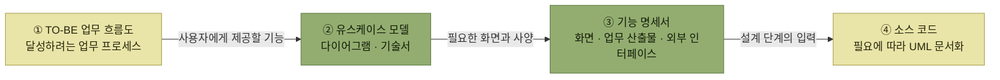
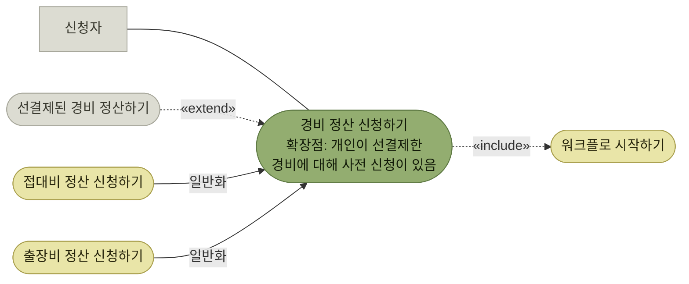

# 개발 프로세스 표준화

> [아키텍처 구현](./README.md)

## 빠른 복습

- 요구사항 분석은 **TO-BE 업무 흐름 → 유스케이스 모델 → 화면·산출물·외부 인터페이스 목록 → 기능 명세서**로 이어진다. 설계 단계는 그 두 문서를 입력으로 삼는다.
- **아키텍처 구현은 일반 기능 개발보다 먼저** 수행되므로, **기능 개발의 입력 문서도 사전에 표준화**해둘 필요가 있다.
- 문서 표준화는 엄밀히 아키텍트의 역할은 아니지만, 실제 현장에서는 **소프트웨어 엔지니어링에 정통한 아키텍트가 지원하거나 주도**하는 경우가 많다.
- **유스케이스 다이어그램은 최대한 단순하게** 그린다. **일반화 · 포함 · 확장** 세 관계가 있지만, 포함·확장은 오용이 많아 **사용을 제한하는 편이 바람직할 수도 있다**.
- **유스케이스 기술서**는 사용자 요청과 시스템 응답의 **상호작용을 시나리오 형식으로 정리한 문서**다. 가장 중요한 것은 **적절한 추상화 레벨** — 코오번의 **사용자 목표** 레벨이다.
- 기술서에는 **내부 상태 · UI 표현 · 개별 항목 나열 · 비즈니스 로직 세부**를 쓰지 않는다.
- **기능 명세서**는 화면과 서식을 정의하며, **How가 아니라 What**을 적는다. **QA 엔지니어가 읽고 테스트 케이스를 설계할 수 있는가**가 기준이다.
- **설계서는 무엇을 남길지가 프로젝트마다 다르다.** 예비 설계는 구현 후 폐기할 수 있고, 현재 구조는 **리버스 엔지니어링**으로 보조하되 설계 의도는 별도로 기록한다. **데이터베이스 설계 정보는 실행 가능한 스키마 변경과 함께 지속적으로 관리할 가치가 크다.**

## 문서 표준화

단계마다 나오는 문서가 다음 단계의 입력이 된다.



*요구사항 분석의 산출물이 설계와 구현의 입력이 된다. 이 절이 표준화하려는 것은 가운데 두 문서다*

- **요구사항 분석** — **TO-BE 업무 흐름도와 달성하고자 하는 업무 프로세스**를 정리하고, 이를 구현하기 위해 **소프트웨어가 사용자에게 제공해야 할 기능을 유스케이스 모델로 작성**한다. 그리고 유스케이스를 충족하기 위해 필요한 **화면과 각종 업무 산출물, 외부 인터페이스를 목록화**하고 **각 항목의 사양을 기능 명세서에 기술**한다.
- **설계 단계** — **유스케이스 모델과 기능 명세서를 기반으로 소스 코드에 반영**하며, 필요에 따라 **UML 다이어그램을 작성하여 문서화**한다.

여기서 순서 문제가 생긴다. **아키텍처 구현은 시스템 구축 초기에 수행되므로 일반적인 애플리케이션 기능 개발보다 먼저 수행된다.** 그래서 **애플리케이션 기능의 설계 및 구현을 위한 입력 문서도 사전에 표준화할 필요**가 있다. 방법은 두 가지다.

- **아키텍처 구현과 병행하여 문서를 표준화**한다.
- **아키텍처를 먼저 구현한 뒤**, 이를 기반으로 **표준화된 문서가 실제 개발에 적합한지 검증**한다.

> 아키텍처 설계의 관점에서 보면 **개발 프로세스나 문서 표준화가 직접적인 역할에 포함되지는 않는다.** 그러나 실제 개발 현장에서는 **소프트웨어 엔지니어링에 정통한 아키텍트가 표준화를 지원하거나, 경우에 따라 이를 주도**하기도 한다.

## 유스케이스 다이어그램은 단순하게 그린다

기능 명세서는 **요구사항 분석이 마무리될 무렵 작성**한다. 그에 앞서 **사용자(업무 주체)와 유스케이스 간의 관계를 시각적으로 한눈에 파악하기 위해 유스케이스 다이어그램**을 작성한다.

**UML로 기본 표기법은 표준화되어 있다.** 그런데도 정책이 필요하다. **작성자에 따라 다이어그램의 단위, 유스케이스의 세분화 수준, 표현 방식이 달라질 수 있기 때문**이다. 게다가 **UML에 대한 이해와 경험이 부족한 경우가 많으므로 최대한 단순하게 표현**하는 편이 좋다.

| 관계 | 무엇을 나타내는가 |
| --- | --- |
| **일반화 관계**(generalization) | 공통된 동작을 가진 여러 유스케이스를 묶어, **추상적인 부모(상위) 유스케이스와 구체적인 자식(하위) 유스케이스 간의 관계**로 표현한다 |
| **포함 관계**(include) | 여러 유스케이스에서 **반복되는 공통 기능을 하나의 유스케이스로 분리**하고, 상위 유스케이스가 이를 **호출**하는 관계다 |
| **확장 관계**(extend) | 기본 유스케이스에 **이름이 붙은 확장점**을 정의하고, 특정 조건이 만족될 때 확장 유스케이스의 **선택적 동작을 삽입**하는 관계다. 기본 흐름을 중단하는 인터럽트일 필요는 없다 |

표를 읽는 법. 세 관계는 각각 **묶기 · 떼어내기 · 끼어들기**다. 아래 두 줄이 다음 절에서 문제가 되는 쪽이다.



*[그림 4.3] 유스케이스 다이어그램 (일반화 관계, 포함 관계, 확장 관계)*

**포함과 확장 관계는 진입 장벽이 높은 편이고, 잘못 사용하는 경우가 많아 원칙적으로 사용을 제한하는 것이 바람직할 수도 있다.** 위 그림의 확장 관계는 **"개인이 선결제한 경비에 대해 사전 신청이 있다"는 조건이 만족되면 확장점에서 '선결제된 경비 정산하기'라는 선택적 동작이 추가됨**을 나타낸다.

> 하지만 **업무 담당자 입장에서는 이러한 흐름을 다이어그램으로 정확히 표현하기 어렵다는 점**에서, 보통은 **'경비 정산 신청하기' 유스케이스 설명 안에 해당 조건과 처리 과정을 함께 기술**하는 경우가 많다. **설명이 명확히 정리되어 있다면 굳이 해당 관계를 다이어그램으로 나타내지 않아도 충분하다.**

도식의 표현력보다 **읽는 사람이 같은 뜻으로 읽는 것**이 앞선다는 이야기다.

## 유스케이스 기술서

유스케이스 모델에서는 **각 유스케이스의 동작 요구사항을 구체적으로 정리한 유스케이스 기술서**(use case description)가 중요하다.

- 사용자는 시스템을 이용하여 **특정 목적을 달성하기 위해 유스케이스를 실행**한다.
- 유스케이스는 **사용자가 요청을 보내고 시스템이 응답하는 일련의 흐름**으로 구성되며, **이러한 상호작용이 핵심**이다.
- 유스케이스 기술서는 이 **시나리오를 일정한 형식에 따라 정리한 문서**다.

### 무엇을 적는 칸인가

| 항목 | 무엇을 적는가 |
| --- | --- |
| **사용자** | 유스케이스를 실행하고 시스템과의 상호작용을 시작하는 **주 사용자**(primary actor). 관련된 사용자가 있으면 **부 사용자**(supporting actor)로 적고, **다른 시스템이나 서비스와 연동하는 경우도 부 사용자에 포함**한다 |
| **요약** | 유스케이스의 **업무적 목적과 처리 개요**를 간결하게 |
| **사전 조건** | 유스케이스를 **시작하기 위해 충족해야 하는 조건** |
| **사후 조건** | 유스케이스가 **정상적으로 종료된 후 충족해야 하는 조건** |
| **주요 성공 시나리오** | 정상적으로 실행되어 사용자가 목표를 달성하는 대표 절차, 이른바 **해피패스**(happy path). `사용자는 ~한다` · `시스템은 ~한다`를 번갈아 적는다 |
| **예외 시나리오** | 각 단계에서 문제가 발생하여 **유스케이스가 중단되거나 종료되는 경우**의 상황과 동작. 주요 성공 시나리오 2단계에서 생기는 문제는 **2a, 2b**처럼 번호를 매긴다 |
| **대체 시나리오** | 특정 상황에서 **주요 성공 시나리오와 다른 상호작용**이 발생하는 경우 |
| **비즈니스 규칙** | 처리 절차에서 **참조되는 규칙**. 규칙이나 로직을 상세히 쓰지 않고 **별도 문서에 정의해두고 참조**하는 방식이 일반적이다 |

표를 읽는 법. 시나리오가 세 칸으로 갈린 것이 요점이다. **성공하는 길 하나, 실패하는 길들, 다른 길들**이다. 번호 규칙(`2a`)이 있어서 **예외가 어느 단계에서 갈라지는지**가 문서에서 보인다.

### 경비 정산 신청하기 — 기술서 예시

| 유스케이스명 | 경비 정산 신청하기 |
| --- | --- |
| **사용자** | 주(주 사용자): 신청자 · 부(부 사용자): 워크플로 서비스, 증빙 관리 서비스 |
| **요약** | 직원이 업무상 선결제한 경비를 회사에 청구하기 위해 신청한다 |
| **사전 조건** | 회계 기간이 열려 있다 |
| **사후 조건** | 워크플로가 시작되고 승인자가 지정되어 있다 · 신청자가 업로드한 증빙자료에 타임스탬프가 부여되어 등록된다 |
| **주요 성공 시나리오** | 1. 사용자는 자신이 선결제한 비용의 금액, 용도 등의 정보를 입력한다<br>2. 시스템은 입력 내용을 확인한다<br>3. 사용자는 증빙자료를 업로드한다<br>4. 시스템은 증빙자료가 유효한지 확인한다<br>5. 사용자는 경비 정산을 신청한다<br>6. 시스템은 신청번호를 부여하고, 워크플로 서비스를 호출하여 신청 처리를 진행한다. 또한 증빙 관리 서비스를 호출하여 증빙을 등록한다 |
| **예외 시나리오** | 2a. 입력 내용이 충분하지 않은 경우, 시스템은 오류 메시지를 표시하고 사용자에게 수정을 촉구한다<br>4a. 증빙자료가 전자문서 및 전자거래 기본법 요건을 충족하지 못하는 경우, 시스템은 오류 메시지를 표시하고 사용자에게 수정을 촉구한다 [BR-010]<br>6a. 워크플로 설정이 잘못되어 승인자를 찾을 수 없는 경우, 시스템은 오류 메시지를 표시하고 유스케이스를 종료한다 |
| **대체 시나리오** | 사전 신청이 있는 경우<br>1a. 사용자는 경비 정보 외에 사전 신청 항목을 선택한다<br>2b. 선택한 사전 신청 항목이 이미 개인 결제로 처리된 경우, 해당 금액은 정산할 비용에서 상계 처리한다 [BR-020] |
| **비즈니스 규칙** | [BR-010] 전자문서 및 전자거래 기본법의 보존 요건 점검<br>[BR-020] 개인이 선결제한 비용의 상계 처리 |

*원서 [표 4.1] 유스케이스 기술서 예시*

표를 읽는 법. **본문 어디에도 화면이나 버튼 이야기가 없다**는 점을 눈여겨본다. 대체 시나리오가 앞의 [그림 4.3]에서 확장 관계로 그렸던 그 조건이며, **다이어그램 대신 기술서의 한 칸으로 들어와 있다.** 비즈니스 규칙은 `[BR-010]`처럼 **번호로만 참조**되고 내용은 다른 문서에 있다.

여기서 제시한 형식은 **하나의 예시**다. **조직 내 표준 포맷이 있다면 이를 사용하거나 필요에 따라 커스터마이징**하는 것이 좋다.

### 가장 중요한 것은 추상화 레벨이다

유스케이스 기술서를 쓸 때 **가장 중요한 것은 적절한 추상화 레벨에서 기술하는 것**이다. 『앨리스터 코오번의 유스케이스』에서는 유스케이스에 **요약 · 사용자 목표 · 하위 기능**이라는 **세 가지 목표 레벨**이 있으며, 이 중 **사용자 목표가 가장 중요**하다고 말한다.

> **사용자 목표**는 **'주 사용자가 이 작업을 수행한 뒤 만족하고 떠날 수 있는가?'** 라는 질문에 대응하는 것이다. 예를 들어 사용자가 어떤 직원이라면, **'이 작업을 하루에 몇 건 수행했는지가 그 직원의 성과에 영향을 주는지'**, 혹은 **'작업을 마친 뒤 커피 한 잔 할 수 있을 만큼 적당한 분량의 작업인지'** 등이 판단 기준이 된다. 즉 대부분 **한 사람이 중단 없이 수행할 수 있는 작업(2분 ~ 20분)** 이 이에 해당한다.

레벨의 기준이 **문서의 상세함이 아니라 사람의 하루**라는 점이 재미있다. 너무 잘게 쪼개면 하위 기능이 되고, 너무 크게 잡으면 요약이 된다.

### 쓰지 말아야 할 것들

| 무엇을 피하는가 | 잘못된 예 | 올바른 예 |
| --- | --- | --- |
| **구현 내부 상태** — 사전·사후 조건은 테이블 같은 저장 방식이 아니라 **관찰하거나 검증할 수 있는 업무·시스템 상태**로 적는다 | 신청서 테이블에 데이터가 등록된다 | 신청서가 작성되고, 워크플로가 시작된다 |
| **사용자 인터페이스에 의존하는 표현** | 신청 버튼을 클릭한다 | 입력 내용에 오류가 없는지 확인 후 신청을 수행한다 |
| **개별 항목 나열** — 화면이나 장부의 항목을 늘어놓지 않고 **정보의 청크 형태로** 적는다 | 비용의 용도, 사용처, 금액, 세금, 사용일 등을 입력한다 | 먼저 지불한 경비 정보를 입력하고, 관련 증빙자료를 업로드한다 |
| **비즈니스 규칙·로직의 세부 사항** | (규칙 계산식을 그대로 적는다) | 규칙 번호로 참조하고 내용은 별도 문서에 둔다 |
| **사용자가 개입할 수 없는 시스템 예외** — 단 **사용자가 개입할 수 있는 예외는 포함**한다 | 데이터베이스 처리 중 예기치 않은 오류가 발생하면 시스템 오류 화면이 표시된다 | 입력 내용이 불완전한 경우, 시스템에서 오류를 표시한다 |

표를 읽는 법. 다섯 줄이 모두 **"How를 적지 말라"** 는 한 가지 이야기다. 유스케이스는 **사용자 역할과 시스템 간의 상호작용에 초점**을 맞추므로, 화면이 어떻게 생겼고 데이터가 어느 테이블에 들어가는지는 다른 문서의 몫이다.

## 기능 명세서

**실제 사용자 인터페이스로 구현될 화면이나 각종 출력 서식**(증빙 양식 등)**의 구성은 기능 명세서를 통해 정의된다.** 기능 명세서에는 다음 항목들을 기재한다.

- **화면 전환도**
- **화면 레이아웃 정의** (각종 문서 서식의 레이아웃 포함)
- **항목 정의**
- **화면 이벤트 정의**
- **로직 정의**

**조직 내 표준 형식이 있다면 그것을 기반으로 작성**하고, 실제로 쓸 때는 이것이 **시스템의 외부 요구사항을 기술하는 문서**라는 점을 염두에 두어야 한다.

> **로직을 정의할 때에는 개발자의 관점에서 내부 처리 절차를 작성하기 쉬우므로 주의가 필요하다.** 기능 명세서는 **어떻게 실현할지(How)를 작성하는 것이 아니라 무엇을 할지(What)를 설명**해야 한다.

판별하는 방법까지 제시되어 있다. **자신을 QA 엔지니어라고 가정하고, 해당 명세서를 읽고 내용을 이해할 수 있는지, 그리고 그 내용을 바탕으로 구체적인 테스트 케이스를 설계할 수 있는지 스스로 질문해 보는 것**이다. 테스트 케이스가 나오지 않는다면 그것은 **What이 아직 적히지 않았다는 신호**다.

각 항목은 **문장으로만 표현하기보다 다이어그램이나 표 등을 활용하면 더 효과적**이고, **구체적인 예시를 곁들이면 읽는 사람의 이해를 도울 수 있다.**

### 유저 스토리

**애자일 개발 프로세스를 채택한 프로젝트에서는 문서를 최소화하는 경향**이 있다. 이러한 환경에서는 요구사항을 정의할 때 **유스케이스 대신, 사용자 관점에서 기능을 간결하게 설명하는 유저 스토리**를 주로 사용한다.

유저 스토리는 보통 **한 장의 카드에 담을 수 있을 만큼 짧고 명확하게** 작성되며 다양한 형식이 있다. 저자가 선호하는 형식은 이렇다.

```text
〈비즈니스 가치 달성〉을 위해
〈사용자 유형〉으로서
〈시스템의 기능〉을 원한다
```

예를 들면 이렇게 된다.

```text
부정한 경비 사용으로 인한 회사 손실을 방지하기 위해
감사 담당자로서
부정이 의심되는 경비 정산 신청을 감지하는 기능을 원한다
```

**이처럼 단순한 형식만으로는 요구사항을 충분히 정의하기 어렵다.** 따라서 **유저 스토리를 바탕으로 고객 또는 고객을 대신할 수 있는 사람과 논의하며, 상세한 요구사항을 반영하고 시스템의 구체적인 동작을 명확히 정의**한다. 이후 그 **구체적인 동작을 기준으로 요구사항이 충족되는지 판단할 수 있도록 사용자 수용 테스트**(UAT)**를 정의하고 문서화**한다.

**사용자 수용 테스트**는 **실제 운영 조건과 사용 시나리오를 가정해 시스템이 사용자 요구를 만족하는지 점검하는 테스트**다. 반드시 프로덕션 환경에서 실행한다는 뜻은 아니며, 안전하게 통제된 수용 테스트 환경을 사용할 수 있다. 이 흐름의 자세한 이야기는 『BDD in Action: Behavior-Driven Development for the whole software lifecycle』에서 다룬다.

문서를 줄여도 사라지지 않는 것이 있다는 점이 요점이다. **유스케이스 기술서가 하던 "구체적인 동작을 합의해 적어두는 일"은 유저 스토리 다음의 대화와 UAT가 대신 맡는다.**

## 설계서 표준화

**설계 작업 중 어떤 설계를 문서로 남길지, 그 안에 어떤 내용을 포함할지는 프로젝트마다 다르다.**

문제는 유지다. **클래스 다이어그램이나 협업 다이어그램을 상세하게 미리 작성하더라도, 실제로 소스 코드로 구현하는 과정에서 그대로 반영되지 않는 경우가 많다.** 그래서 **설계서와 소스 코드가 항상 일치하도록 관리하는 것은 쉽지 않다.**

현실적인 선택지들은 이렇다.

- 많은 경우 **구현 전 예비 설계 문서를 작성해 활용하고, 구현이 끝나면 폐기**한다.
- 설계서를 문서화하지 않는다면 [CRC 카드](../2-소프트웨어-설계/1-소프트웨어-개발-프로세스.md#crc-카드)처럼 **직접 메모하며 개념을 정리하는 아날로그 방식**을 택하기도 한다.
- 고객에게 제공하기 위해 **UML 다이어그램을 공식 문서로 작성**하는 경우도 있다. 최종 소스 코드에서 리버스 엔지니어링으로 **현재 구조를 보여주는 다이어그램을 생성**하면 코드와의 불일치를 줄일 수 있지만, 설계 의도와 트레이드오프까지 복원할 수는 없으므로 ADR 같은 설명 문서를 함께 유지한다.
- 시스템 중에서도 **필요에 따라 복잡한 처리 등에 대해서만 설계서를 작성**하는 것도 합리적이다.

[아키텍처 프로토타입을 검증 후 폐기하라](../3-아키텍처-설계/5-아키텍처의-비교-평가.md#아키텍처-프로토타이핑)던 이야기와 같은 태도다. **문서의 수명을 미리 정해두는 것**이다.

### 데이터베이스 설계는 예외다

> 데이터베이스 관련 설계 정보는 많은 프로젝트에서 장기간 참조되므로 **지속적으로 관리할 가치가 큰 산출물**이다. 다만 문서 형식과 상세도는 시스템의 저장 기술과 협업 방식에 맞춰 정한다.

- **ER 다이어그램, 엔티티 관계도, 테이블 목록, 테이블 정의서** 등이 포함된다.
- 데이터베이스 설계를 위해서는 **정규화 정책, 키 설계 정책, DB 객체 명명 규약** 등도 표준화 대상이다.
- **데이터베이스 설계는 전문적인 기술이 요구되므로, 전담 데이터베이스 관리자(DBA)를 두어 표준화 및 설계를 맡기는 경우도 있다.**

이유는 스키마가 데이터와 직접 맞물린 **지속적인 계약**이기 때문이다. 여러 컴포넌트와 운영 도구가 의존할 수 있지만, 마이크로서비스에서는 서비스별 데이터 소유권을 지키고 다른 서비스가 스키마를 직접 공유하지 않도록 해야 한다. 실행 가능한 마이그레이션과 스키마 정의를 버전 관리하고, 이해관계자에게 필요한 ER 다이어그램과 설명을 그 변화에 맞춰 유지한다.

## 핵심 정리

- 요구사항 분석의 산출물(**유스케이스 모델 · 기능 명세서**)이 설계와 구현의 입력이며, 이 문서들을 **아키텍처 구현과 함께 표준화**해야 한다.
- 문서 표준화는 아키텍트의 공식 역할은 아니지만, 현장에서는 **아키텍트가 지원하거나 주도**한다.
- 유스케이스 다이어그램은 **단순하게** 그린다. 포함·확장 관계는 **기술서의 문장으로 대신하는 편**이 낫다.
- 유스케이스 기술서의 핵심은 **상호작용의 시나리오**이며, 성공·예외·대체 세 갈래로 적는다.
- 추상화 레벨은 **사용자 목표** — 한 사람이 중단 없이 끝낼 수 있는 2~20분의 작업이 기준이다.
- 기술서에는 **저장 구현 · UI 표현 · 항목 나열 · 로직 세부**를 쓰지 않는다. 사전·사후 조건은 구현 내부가 아니라 관찰·검증 가능한 업무 상태로 적는다.
- 기능 명세서는 **What을 적는 문서**이고, 판별 기준은 **QA 엔지니어가 테스트 케이스를 뽑을 수 있는가**다.
- 애자일에서는 **유저 스토리 + 대화 + UAT**가 그 자리를 대신한다.
- 설계서는 **수명을 정해두고** 쓴다. 예비 설계는 폐기할 수 있고, 현재 구조는 리버스 엔지니어링으로 보조하되 의도와 결정은 별도 문서로 남긴다. 데이터베이스 설계 정보는 실행 가능한 스키마 변경과 함께 지속적으로 관리할 가치가 크다.

## 함께 읽기

- [앞 절 — 개발 플로의 네 다리 중 '개발 프로세스'가 이 절이다](./1-구현-단계에서-아키텍트의-역할.md#기능을-갖추는-것만으로는-부족하다)
- [요구사항 분석 — TO-BE와 유스케이스가 어디서 나오는지](../2-소프트웨어-설계/1-소프트웨어-개발-프로세스.md#요구사항-분석)
- [경비 정산 시스템의 유스케이스 — 이 절의 기술서가 다루는 그 유스케이스](../3-아키텍처-설계/1-아키텍처-설계의-주요-개념.md#유스케이스)
- [『AI 시대의 엔지니어링 전략』 1장 프로덕트 사고의 기본](../../ai-시대의-엔지니어링-전략/01-프로덕트-사고의-기본/README.md) — 기술서보다 앞선 발견 단계에서 동기·페르소나·시뮬레이션으로 사용자 문제를 찾는 방법
