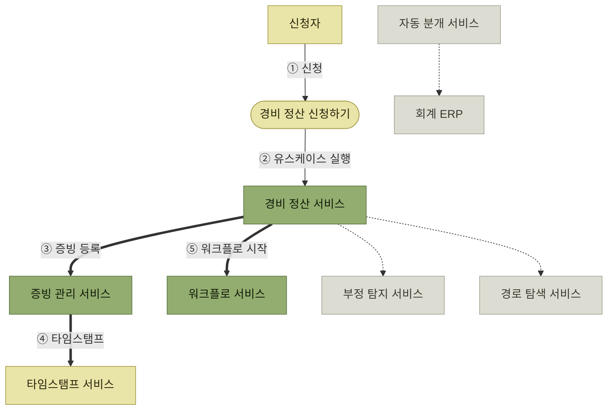
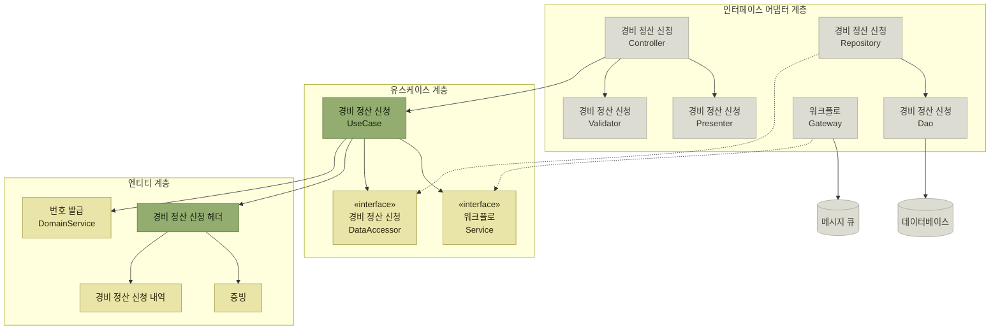
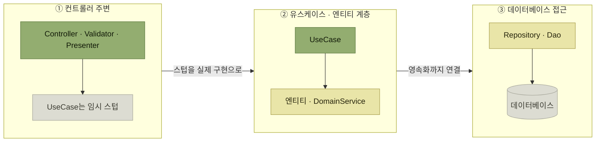

# 유스케이스 중심의 아키텍처 구현

> [아키텍처 구현](./README.md)

## 빠른 복습

- 공통 기능을 **따로 만들어 나중에 애플리케이션 기능과 통합**하면 대규모 수정이 발생한다. **특정 유스케이스를 먼저 구현하면서 필요한 공통 기능을 함께 구축**하는 것이 효과적이다.
- 그래서 **어떤 유스케이스를 먼저 구현할지 정하는 일**이 중요해진다. 후보는 **샘플 유스케이스**와 **실제 유스케이스**다.
- **샘플**은 요구사항 분석 없이 시작할 수 있고 난이도를 조절할 수 있지만, **공통 기능의 누락이나 결함이 뒤늦게 드러난다.**
- **실제 유스케이스**는 무작위로 고르지 않는다. **공통 기능을 포괄하고, 모든 계층을 경유하고, DB·외부 연동을 검증하고, 기술적 리스크를 검증**하는 것을 고른다. 보통 **여러 개**를 고른다.
- 저자는 **가능한 한 실제 유스케이스**를 권하며, **샘플로 기본 구조를 먼저 잡고 실제로 정교화하는 하이브리드**도 고려할 만하다고 한다.
- 이 단계의 목적은 **아키텍처 구현**이므로 **모든 시나리오를 빠짐없이 구현할 필요는 없다.** 주요 성공 시나리오와 대표 예외만, 업무 규칙은 **임시 구현**으로 대체해도 된다.
- 구현은 **UI 입력부터 DB 등록·갱신까지 하나의 경로(첫 번째 경로)를 먼저 관통**시키고, 다른 경로를 순차적으로 붙여 나간다.

## 공통 기능을 따로 만들지 않는다

[아키텍트가 주도하여 구현하는 애플리케이션 기반](./1-구현-단계에서-아키텍트의-역할.md#애플리케이션-기반-가운데-한-층을-우리가-만든다)에는 다양한 공통 기능이 포함된다. 그런데 순서를 잘못 잡으면 대가가 크다.

> 필요한 공통 기능을 파악해 **각각을 개별 구현하고 나중에 애플리케이션 기능과 통합하는 방식**은 **대규모 수정 작업이 발생**할 수 있다.

이를 방지하려면 **특정 유스케이스를 애플리케이션 기능으로 먼저 구현하면서, 동시에 필요한 공통 기능도 함께 구축해 나가는 것**이 효과적이다. 그래서 **어떤 유스케이스를 우선적으로 구현할지 정하는 것이 중요**해진다.

공통 기능이 무엇이어야 하는지는 **실제로 한 기능을 관통해 봐야 드러난다**는 것이 이 절의 전제다.

## 유스케이스를 선정하는 방법

| | 샘플 유스케이스 | 실제 유스케이스 |
| --- | --- | --- |
| **무엇인가** | **실제 업무 도메인과 무관해도 되는** 가상의 유스케이스 | **운영 중인 시스템에서 실제 사용자에게 제공되는** 유스케이스 |
| **얻는 것** | 가상의 소재로도 쓸 수 있어 **요구사항 분석 없이 시작 가능** · **도메인 지식 없이 아키텍트가 직접 작성하고 구조를 점검** 가능 · **복잡도와 난이도를 자유롭게 조절**해 기반 구현에 적합한 수준으로 맞출 수 있다 | **실무 유스케이스를 활용하므로 공통 기능의 정확성과 실효성이 높아진다** · **기술서부터 구현까지 모든 작업이 실제 개발에 활용되어 낭비가 없다** |
| **치르는 대가** | **실무와의 연관성이 낮아 공통 기능의 누락이나 결함이 뒤늦게 드러날 수 있다** · **샘플용 데이터베이스 설계 등 실제 개발에 불필요한 작업**이 추가될 수 있다 | **기술서 작성에 업무 지식이 필요해 업무 담당자의 협조가 필수적**이다 · 유스케이스가 **복잡하거나 개발 난이도가 과도하게 높을 수 있다** |

표를 읽는 법. 두 열의 차이는 **"지금 편한가"와 "나중에 맞는가"** 다. 샘플은 시작이 쉽고 검증이 늦으며, 실제는 시작이 무겁고 검증이 정확하다.

### 실제 유스케이스는 무작위로 고르지 않는다

**아키텍처 관점에서 중요한 유스케이스**를 고른다. 조건은 이렇다.

- 애플리케이션 기반에 필요한 **공통 기능을 포괄**한다.
- 애플리케이션의 **모든 계층과 컴포넌트 유형을 경유하는 흐름**을 포함한다.
- **데이터베이스 및 외부 서비스 연동** 등 주요 시스템과의 연결을 검증한다.
- **처음 사용하는 라이브러리 등 기술적 리스크가 있는 요소**를 검증한다.

**하나의 유스케이스로 위 조건을 모두 충족하기는 어려우므로 보통 여러 개를 선정한다.** 그리고 **업무적으로 핵심적인 유스케이스가 아키텍처 관점에서도 중요한 경우가 많다.**

*[그림 4.4] 유스케이스 선정 예시 — 굵은 화살표가 이 유스케이스가 실제로 관통하는 경로다. 회색은 이번에 지나가지 않는 연동이다*

**'경비 정산 신청하기'를 선택하면 굵은 화살표를 따라 처리가 진행된다.** 그 흐름을 따라 **각 계층의 컴포넌트 처리와 데이터베이스 접근을 직접 다뤄보며 구현하고 그 구조를 검증**할 수 있다. 또한 **증빙 관리 서비스나 워크플로 서비스와의 비동기 메시징 연동도 함께 구현하여 검증**할 수 있다. 이런 이유로 이 유스케이스는 **아키텍처적으로 중요한 유스케이스 중 하나로 선정할 가치가 있다.**

> **'로그인'과 같은 기본적인 유스케이스도 아키텍처적으로 중요한 기능을 검증하는 데 유용**하므로 함께 고려할 수 있다.

### 어디까지 구현할 것인가

복잡도와 난이도에 대해서는 **이 단계의 주 목적이 아키텍처 구현이라는 점**을 고려해야 한다.

- **모든 유스케이스의 시나리오와 변형을 빠짐없이 구현할 필요는 없다.** **주요 성공 시나리오와 대표적인 예외 시나리오만으로도 충분**하다.
- **업무 규칙은 임시 구현(프로토타이핑)으로 대체**할 수 있다.

저자는 **가능한 한 실제 유스케이스를 사용할 것을 권장**하면서, **하이브리드 방식**도 제시한다. **초기에는 샘플 유스케이스로 기본 구조를 먼저 구현하고, 이후 실제 유스케이스를 적용해 점진적으로 정교화**하는 접근이다.

## 유스케이스 구현

이 단계에서는 **애플리케이션 아키텍처와 적용할 아키텍처 스타일이 이미 결정된 상태**라고 가정한다. 다만 [3장에서 언급했듯이](../3-아키텍처-설계/4-애플리케이션-아키텍처-선정.md) 이 시점에서는 **추상도를 컴포넌트 레벨까지 낮추고, 각 구성 요소의 책임을 할당하며 상호작용을 구체화하는 작업**이 필요하다.

사례 연구에서는 [경비 정산 서비스에 클린 아키텍처를 적용](../3-아키텍처-설계/4-애플리케이션-아키텍처-선정.md#사례-연구-서비스마다-다르게-고른다)하기로 했으므로, **'경비 정산 신청하기' 유스케이스를 중심으로 각 컴포넌트의 배치와 상호작용을 검토**한다.

*[그림 4.5] 클린 아키텍처의 컴포넌트 배치 예시 — 점선은 인터페이스 구현이다. 인터페이스가 유스케이스 계층에 있어 의존이 안쪽으로만 흐른다*

원서의 이 그림에는 **설명 박스**가 함께 붙어 있다. **아키텍처 관점에서 고려해야 할 요소나 공통 기능 후보에 대한 메모**다.

| 붙은 자리 | 공통 기능 후보 |
| --- | --- |
| **Controller** | **인증 및 오류 처리** |
| **UseCase** | **트랜잭션 경계** |
| **Validator** | **검증 로직의 공통화** |
| **워크플로 Gateway** | **메시지 큐(MQ) 연동 검증** |

표를 읽는 법. 네 항목 모두 **한 기능만을 위한 것이 아니다.** 유스케이스 하나를 관통해 보는 동안, **모든 기능이 공통으로 쓸 것들이 어디에 필요한지가 드러난다.** 이것이 앞에서 "공통 기능을 따로 만들지 말라"고 한 이유다.

> 이 작업은 **구현에 앞서 진행하는 예비 설계 단계이므로 굳이 정제된 형태로 다이어그램을 작성하지 않아도 된다.** **노트나 화이트보드에 간단히 손으로 스케치하는 정도면 충분하다.**

[앞 절의 "예비 설계는 구현 후 폐기"](./2-개발-프로세스-표준화.md#설계서-표준화)와 같은 이야기다.

### 첫 번째 경로부터 관통시킨다

**한 번에 모든 기능을 구현하기보다는 점진적으로 완성해 나갈 것을 권한다.**

- 먼저 **사용자 인터페이스 입력부터 데이터베이스 등록·갱신까지 각 계층을 거치는 하나의 경로**를 구현한다.
- 이후 **다른 경로들도 순차적으로 추가하면서 유스케이스를 점차 구체화**해 나간다.

**이 경로 하나만으로도 작업량이 상당하므로, 각 계층을 단계적으로 나누어 구현하는 것이 효율적**이다. 어느 계층부터 공략할지는 개발자의 판단에 달려 있다.

*[그림 4.6] 첫 번째 경로 구현 — 원서가 ①②③으로 표시한 구현 순서를 단계별로 옮겼다*

순서에 대한 저자의 설명이 흥미롭다.

> **클린 아키텍처의 관점에서는 도메인(엔티티 계층과 유스케이스 계층)부터 구현을 시작하는 것이 논리적이다.** 하지만 **애플리케이션 기반 관점에서는 이 계층에서 준비해야 할 공통 기능이 많지 않기 때문에 우선순위를 높게 둘 필요는 없다.**

저자는 **초기 단계부터 화면에 표시되는 동작을 빠르게 확인하고 싶어 우선 컨트롤러 주변(①)부터 시작하기도 한다**고 말한다. **컨트롤러를 구현할 때 유스케이스 컴포넌트는 임시 스텁으로 대체해두고**, 이후 **유스케이스 계층과 엔티티 계층(②), 그리고 데이터베이스 접근(③) 순으로 확장해가며 전체 경로가 정상적으로 작동하도록** 만든다.

**같은 아키텍처에서도 목적이 다르면 구현 순서가 달라진다**는 뜻이다. 기능을 만드는 것이 목적이면 도메인부터, **기반을 만드는 것이 목적이면 공통 기능이 많은 쪽부터** 손대는 것이 이득이다.

## 핵심 정리

- 공통 기능을 따로 만들어 나중에 합치면 대규모 수정이 온다. **유스케이스 하나를 관통시키며 공통 기능을 같이 만든다.**
- **샘플 유스케이스**는 시작이 쉽고 검증이 늦다. **실제 유스케이스**는 시작이 무겁고 검증이 정확하다. 저자는 실제 쪽을 권하고, **하이브리드**도 제시한다.
- 실제 유스케이스는 **공통 기능 포괄 · 전 계층 경유 · DB와 외부 연동 · 기술 리스크** 네 조건으로 고르고, 보통 **여러 개**를 고른다.
- 목적은 아키텍처 구현이므로 **주요 성공 시나리오와 대표 예외만** 구현하고 업무 규칙은 **임시 구현**으로 둔다.
- 예비 설계 도식은 **화이트보드 스케치 수준으로 충분**하다. 중요한 것은 그 위에 붙는 **공통 기능 후보 메모**다.
- **첫 번째 경로를 UI에서 DB까지 관통**시키고 나머지를 붙인다. 순서는 **공통 기능이 많은 계층부터**가 실용적이다.

## 함께 읽기

- [앞 절 — 애플리케이션 기반이 무엇이고 왜 아키텍트의 일인지](./1-구현-단계에서-아키텍트의-역할.md)
- [클린 아키텍처 — 이 절이 컴포넌트 레벨로 낮춰 구현하는 그 구조](../3-아키텍처-설계/4-애플리케이션-아키텍처-선정.md#클린-아키텍처)
- [유스케이스 기술서 — 여기서 구현하는 '경비 정산 신청하기'의 시나리오](./2-개발-프로세스-표준화.md#유스케이스-기술서)
