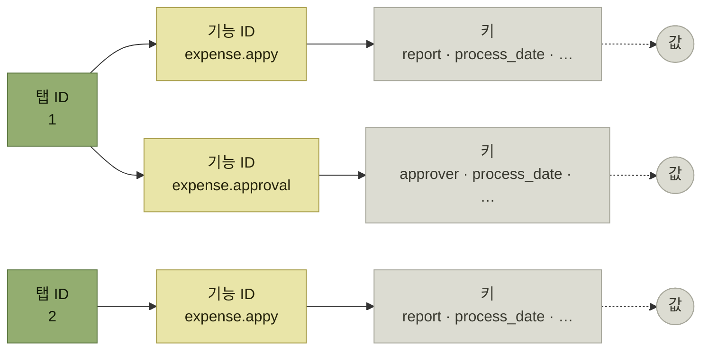
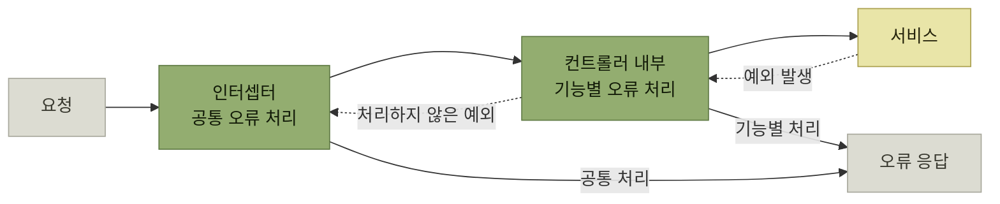
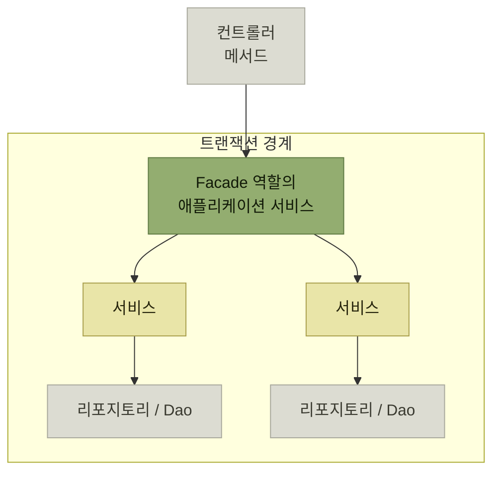
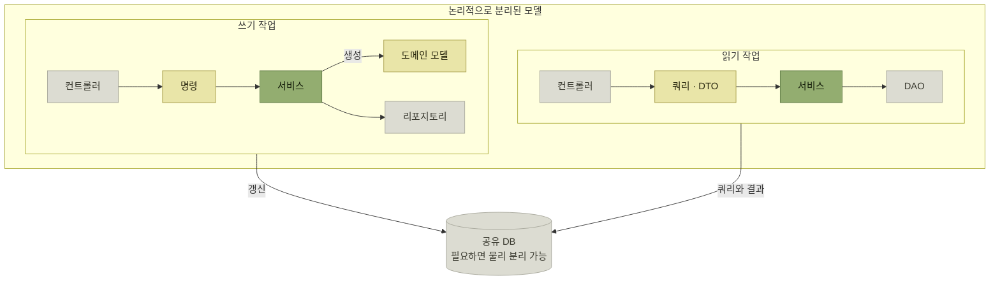

# 애플리케이션 기반 구현

> [아키텍처 구현](./README.md)

## 빠른 복습

- 애플리케이션 기반의 공통 기능 후보는 **인증 · 인가 · 세션 관리 · 오류 처리 · 로깅 · 보안 · 트랜잭션 제어 · DB 접근 · 국제화 · 문서 출력 · 캐시 관리 · 비동기 처리**다.
- **보안 관련 기능은 직접 구현하기보다 표준 방식이나 모범 사례를 따르는 것이 훨씬 안전하다.** 인증뿐 아니라 전반에 해당하는 원칙이다.
- 인증은 **로컬 인증에서 IdP 활용**으로 옮겨왔다. 통합 관리 · 보안 강화 · **MFA** · **SSO**가 그 이유다.
- 인가는 **RBAC**가 대표적인 출발점이고, 제어 대상은 **기능·화면 / 기능 실행 수준 / 화면 항목 / 데이터** 네 층위다.
- 세션 객체는 **키가 뒤섞이면 충돌·비대화·탭 간 간섭**이 생긴다. **논리적으로 구획한 계층 구조**로 관리하고 그 접근을 공통 기능으로 감싼다.
- 오류는 **보통 · 중요 · 심각 · 치명적** 네 수준으로 갈리고, 수준마다 **누구에게 어떻게 알릴지**가 다르다. 처리 위치는 **컨트롤러 내부**와 **인터셉터** 두 후보이며 **병행**이 현실적이다.
- 로그는 **접속 · 인증 · 작업 · 오류 · 디버그 · 성능** 여섯 종류다. **누가 얼마나 자주 보는지**로 출력 대상과 형식을 정하고, **AOP로 자동 출력**할 수 있는 것을 먼저 가른다.
- 트랜잭션 경계는 보통 **유스케이스·애플리케이션 서비스 단위**로 잡는다. 요청 하나가 여러 도메인 서비스를 조정한다면 **Facade 역할의 애플리케이션 서비스**를 경계로 삼을 수 있다.
- DB 접근은 **도메인 계층의 패턴과 궁합**으로 고른다. 객체 중심 쓰기 모델로 복잡한 조회를 표현하기 어렵다면 **CQRS를 선택지로 검토**할 수 있다.

## 공통 기능 후보군

| 공통 기능 | 기능 개요 |
| --- | --- |
| **인증** | 사용자를 식별하고 **시스템을 정상적으로 이용할 수 있는 사용자인지 확인**한다 |
| **인가**(authorization) | 인증된 주체가 **시스템 리소스에 수행할 수 있는 작업인지 검사**한다 |
| **세션 관리** | **사용자별 상태**를 관리한다 |
| **오류 처리** | 시스템에서 발생한 오류를 적절히 제어하고 **사용자에게 알림**을 제공한다 |
| **로깅** | 사용자의 조작과 시스템 처리 상황 등을 **로그로 남긴다** |
| **보안** | **XSS, CSRF** 등의 보안 조치를 취한다 |
| **트랜잭션 제어** | 주로 데이터베이스와 같은 시스템 자원의 **무결성과 일관성**을 유지한다 |
| **데이터베이스 접근** | 데이터베이스에 대한 **접근 수단**을 제공한다 |
| **국제화** | 사용자의 **로케일**(locale)에 따라 언어와 데이터 형식을 전환한다 |
| **문서 출력** | **PDF 등의 형식**으로 정형화된 문서를 출력한다 |
| **캐시 관리** | 취득한 데이터를 **메모리에 저장하여 캐시로 관리**한다 |
| **비동기 처리** | 시간이 많이 걸리는 처리를 **백그라운드에서 실행**하여 사용자가 기다리지 않도록 한다 |

표를 읽는 법. 열두 항목 모두 **어느 한 기능의 것이 아니다.** [앞 절에서 유스케이스 하나를 관통시키며 드러난 후보들](./3-유스케이스-중심의-아키텍처-구현.md#유스케이스-구현)이 이 목록의 일부였다는 것을 떠올리면 좋다.

## 인증

**접속한 사용자가 시스템을 정상적으로 이용할 수 있는 사용자임을 확인하는 과정**이다.

- **과거에는** 개별 시스템의 데이터베이스에 사용자 ID와 비밀번호를 관리하여 시스템 내에서 인증하는 **로컬 인증**이 주류였다.
- **최근에는 ID 공급자**(IdP, Identity Provider)**를 활용해 외부에서 인증을 수행**한다.

IdP를 쓰는 이유는 넷이다.

- 사용자 인증 정보를 **중앙의 한곳에서 통합 관리**할 수 있어 **운영 관리자의 유지보수 부담이 줄어든다.**
- 개별 시스템에서 사용자 비밀번호를 관리하는 것보다 **보안이 더욱 강화된다.**
- 비밀번호 외 추가 인증을 적용하는 **다단계 인증**(MFA)을 쉽게 구현할 수 있다.
- **싱글 사인 온**(SSO)을 통해 한 번의 로그인으로 다중 서비스를 이용할 수 있어 **사용자 편의성이 향상**된다.

> **보안 관련 기능은 직접 구현하기보다 표준 방식이나 모범 사례를 따르는 것이 훨씬 더 안전하며, 이는 인증뿐 아니라 그 외에도 해당되는 원칙**이다.

또한 **다양한 인증 수단을 지원하는 프레임워크나 라이브러리가 존재하므로 사전에 충분한 조사와 검증이 중요**하다. 예를 들어 Java에서 Spring Framework를 사용한다면 **Spring Security**를 활용해 **SAML, OpenID Connect** 등의 프로토콜을 이용한 IdP 인증에도 유연하게 대응할 수 있다.

| 공통 기능 | 기능 개요 |
| --- | --- |
| **로그인 화면** | 사용자가 인증 정보를 입력하여 로그인하는 화면 |
| **인증** | 데이터베이스에 저장된 비밀번호 정보를 이용한 인증, IdP와 연계한 인증 등 사용자 인증 처리. **인증 성공 시 세션 정보에 인증 상태를 저장하여 유지**한다 |
| **인증 상태 확인** | 사용자가 인증된 상태에서 특정 엔드포인트에 접근할 때 **세션의 인증 상태를 확인**하는 처리. **미인증 상태일 경우 로그인 화면으로 리다이렉트**한다 |
| **로그아웃** | 사용자의 **인증 상태와 세션 정보를 함께 삭제**한다 |
| **인증 방식 전환** | 설정에 따라 여러 인증 방식을 유연하게 전환할 수 있도록 설계된 구조. **프로덕션에서는 IdP 기반 SSO를 쓰더라도 개발 및 테스트 시에는 다른 인증 방식도 사용할 수 있도록 미리 준비해 두는 것이 좋다** |

*원서 [표 4.3] 인증 관련 공통 기능 후보군*

표를 읽는 법. 마지막 줄이 실무의 냄새가 난다. **프로덕션의 인증 방식을 개발 환경에서 그대로 쓸 수 없다는 사실**을 기반 설계 단계에서 미리 반영해두라는 것이다.

**로컬 인증을 기본 인증 방식으로 사용할 경우**에는 위 기능들 외에도 **로그인 시도 제한 및 계정 잠금**, 안전한 **비밀번호 재설정** 등의 기능이 추가로 필요하다. 비밀번호 힌트나 원문을 이메일로 보내는 방식은 비밀번호 정보를 노출할 수 있으므로 사용하지 않는다.

## 인가

**인증된 사용자가 시스템 내 리소스에 요청한 작업을 수행할 권한이 있는지 검사하는 과정**이다. **역할 기반 접근 제어**(RBAC)는 대표적인 모델이지만, 리소스 소유권이나 속성·정책을 함께 판단해야 할 때는 ABAC 같은 다른 모델이나 별도 정책 검사가 필요할 수 있다.

| 리소스 | 설명 |
| --- | --- |
| **기능, 화면** | 특정 기능과 화면에 대한 접근을 제어한다 |
| **기능 실행 수준** | 역할에 따라 기능에서 **수행할 수 있는 작업을 조정**한다. 예: ADMIN 역할은 마스터 데이터 등록과 업데이트가 가능하지만, 다른 역할은 조회만 가능하다 |
| **화면 항목** | 특정 역할만 볼 수 있도록 **화면의 일부 항목**을 제어한다 |
| **데이터** | 역할에 따라 **데이터 열람 가능 범위**를 조정한다 |

표를 읽는 법. 위에서 아래로 갈수록 **제어의 알갱이가 작아진다.** 화면 자체를 막는 것과, 화면은 보여주되 한 줄을 감추는 것과, 같은 화면에서 남의 데이터만 안 보이게 하는 것은 구현 난이도가 전혀 다르다. [REQ-22와 REQ-23이 따로 적혀 있던 이유](../3-아키텍처-설계/1-아키텍처-설계의-주요-개념.md#비기능-요구사항)가 여기서 드러난다.

**접근 제어를 구현하는 방식은 사용하는 웹 애플리케이션 프레임워크나 라이브러리에 따라 다르다.** 일반적으로 표준 기능이 제공되지만 **그것만으로는 요구사항을 충족하지 못하는 경우도 있다.** 그럴 때는 **애플리케이션 기반에서 구현 구조를 검토하고 공통 기능을 추가로 제공**해야 한다.

- **URL 기반 접근 제어**
- **엔드포인트 단위 접근 제어**
- **인가용 템플릿 기능 활용**
- **독자적인 공통 기능 구현**

### URL 기반 접근 제어

애플리케이션 루트에서 **상대 경로가 `/admin`인 URL에는 ADMIN 역할을 가진 인증된 사용자만 접근**할 수 있도록 정의한다. **그렇지 않은 사용자가 접근할 경우 오류 화면이 표시된다.**

```java
// src/main/java/sample/chap04/SecurityConfig.java
@Configuration
@EnableMethodSecurity
public class SecurityConfig {
    @Bean
    public SecurityFilterChain securityFilterChain(HttpSecurity http) throws Exception {
        http.authorizeHttpRequests(it -> it
                        .requestMatchers("/admin").hasRole("ADMIN")
                        .anyRequest().permitAll()
                ).formLogin(Customizer.withDefaults())
                .exceptionHandling(it -> it.accessDeniedPage("/access-denied"));
        return http.build();
    }
}
```

### 엔드포인트 단위 접근 제어

Spring Security가 제공하는 **`@PreAuthorize` 어노테이션**을 컨트롤러의 메서드에 붙여, **상대 경로가 `/hello`인 URL에 대해서는 ADMIN 역할 또는 EMPLOYEE 역할을 가진 인증된 사용자만 접근**할 수 있도록 정의한다. `@PreAuthorize`가 실제로 적용되려면 위 설정처럼 **`@EnableMethodSecurity`로 메서드 보안을 활성화**해야 한다. 그렇지 않으면 `/hello`는 앞 설정의 `anyRequest().permitAll()`만 적용되어 미인증 사용자에게도 열릴 수 있다.

```java
// src/main/java/sample/chap04/SampleController.java
@PreAuthorize("hasAnyRole('ADMIN', 'EMPLOYEE')")
@GetMapping("/hello")
public String hello(Model model) {
    model.addAttribute("greeting", "Hello");
    return "hello";
}
```

### 인가용 템플릿 기능 활용

**`sec:authorize` 속성을 가진 `div` 요소는 ADMIN 역할을 가진 사용자에게만 표시되고, 그 외 역할의 사용자에게는 숨겨진다.**

```html
<!-- src/main/resources/templates/hello.html -->
<body>
  <h1 th:text="${greeting}">Hi</h1>
  <div sec:authorize="hasRole('ADMIN')">
    <p>이 메시지는 관리자만 볼 수 있습니다.</p>
  </div>
</body>
```

화면 요소를 숨기는 것은 사용자 경험을 위한 보조 수단일 뿐 **보안 경계가 아니다.** 사용자는 화면을 거치지 않고도 요청을 보낼 수 있으므로, 실제 접근 권한은 URL·엔드포인트 또는 서비스 계층에서 반드시 다시 검사해야 한다.

세 예제가 각각 앞 표의 **기능·화면 / 기능 실행 수준 / 화면 항목**에 대응한다는 점을 눈여겨본다. 남은 **데이터** 층위는 표준 기능으로 잘 덮이지 않아, 보통 **독자적인 공통 기능 구현**이 필요해지는 자리다.

## 세션 관리

**세션**은 **사용자와 애플리케이션 간의 일련의 상호작용을 식별하는 논리적 문맥**이다. HTTP 자체는 무상태이므로, 상태 저장형 웹 애플리케이션은 처리 중 필요한 일부 상태를 서버 세션에 보관할 수 있다. 다만 토큰 기반의 무상태 구조처럼 서버 세션을 사용하지 않는 설계도 있으며, 업무 데이터를 무분별하게 세션에 쌓아서는 안 된다.

- 서버 세션을 사용하는 경우 클라이언트는 보통 쿠키로 **세션 ID를 유지**하고, **실제 세션 정보는 서버 측에서 관리**한다.
- **세션의 생성, 종료, 조회는 웹 애플리케이션 프레임워크에서 표준적으로 제공하는 메커니즘**을 활용한다.
- 사용자 인증 후 **인증 상태 확인과 인가 검사를 위해 사용자 ID, 역할 등의 정보가 세션에 저장**될 수 있다.
- **사용자 속성 정보**(이름, 이메일 등)와 **소속 정보**(부서 속성 등)는 애플리케이션 기능에서 자주 참조되므로 **인증 시점에 미리 가져와 세션에 보관**하는 것이 일반적이다.

애플리케이션 기능에서 이 정보를 쓸 때는 **세션 키를 지정해 직접 참조할 수도 있지만, 공통 정보에 접근할 수 있는 전용 API를 미리 준비해두면 더 편리**하다. 사용자 정보를 다룬다면 **`UserContext` 같은 클래스**를 만들어 애플리케이션 기능이 그것을 쓰게 한다.

### 세션 객체는 뒤섞인다

세션은 사용자 계정 자체가 아니라 **브라우저의 세션 쿠키 같은 클라이언트 문맥을 기준으로 식별**된다. 브라우저 앱이나 프로필이 다르면 대개 별도 세션이 만들어지고, 같은 프로필의 여러 탭은 보통 하나의 세션을 공유한다. 세션 객체 내부에 다양한 상태를 구분 없이 저장하면 다음 문제가 생긴다.

- 여러 기능에서 **세션 키가 중복되면 예기치 않은 동작**이 발생할 수 있다.
- 세션 객체는 **명시적 로그아웃이나 타임아웃에만 삭제**되므로, **기능이 늘어날수록 세션 객체의 크기가 커져 메모리 부담**이 커진다.
- **브라우저에서 여러 탭을 열어 기능을 실행하면 세션 정보 충돌**로 예기치 않은 동작이 발생할 수 있다.

이를 방지하려면 **세션 객체를 논리적으로 구획하여 관리**해야 한다. **단순한 키-값 방식이 아니라 계층적 구조로 데이터를 관리**하는 것이다.



*[그림 4.7] 세션 객체 분리 — 탭 ID → 기능 ID → 키 → 값의 네 단으로 구획한다. 같은 기능을 두 탭에서 열어도 서로 다른 칸에 담긴다*

이 구조를 도입하면 개발자가 계층을 직접 다뤄야 하는 부담이 생긴다. 그래서 **애플리케이션 기능에서 세션 정보를 다룰 때 계층 구조를 직접 처리하지 않고도 각 구획의 정보를 쉽게 조회할 수 있도록 공통 기능을 제공**해야 한다. 구조를 만들었으면 **그 구조를 감추는 것까지가 기반의 일**이다.

## 오류 처리

애플리케이션 사용 중 오류가 발생하면 **사용자나 관리자에게 해당 내용을 알리고 적절하게 복구할 수 있도록 유도**해야 한다. **가능하다면 자동 복구도 시도**해야 한다.

| 오류 수준 | 설명 | 구체적 예시 |
| --- | --- | --- |
| **보통** | 사용자의 정상적인 사용 중 발생할 수 있는 오류 · **사용자가 직접 복구 가능** | 주문 확정 시 재고 부족 · 신용 카드 신용 한도 초과 |
| **중요** | 자주 발생하지 않지만 시스템 이용에 있어 **예상 가능한** 오류 · **서비스 운영 담당자의 복구 조치 필요** | 특정 지점의 캘린더 등록 누락 · 워크플로 경로 설정 오류로 승인자 결정 불가 |
| **심각** | **애플리케이션 버그, 미들웨어 또는 인프라 장애**로 인해 발생 · **시스템 운영자의 복구 조치 필요** | 디스크 공간 부족으로 파일 쓰기 실패 · 연결된 시스템이 다운됨 |
| **치명적** | **시스템 전체가 중단되는 장애** · 시스템 운영자의 복구 조치 필요 | 메모리 부족으로 애플리케이션 서버가 정지됨 |

| 오류 수준 | 조작한 사용자에게 알림 | 기타 사용자 알림 |
| --- | --- | --- |
| **보통** | 해당 기능 화면에 오류 메시지를 표시 | 없음 |
| **중요** | 해당 기능 화면에 오류 메시지를 표시 | **오류 코드에 해당하는 담당자가 설정된 경우 이메일로 알림 발송** |
| **심각** | **시스템 오류 안내 화면**을 표시 | **운영 담당자에게 이메일 알림 발송** |
| **치명적** | — | **애플리케이션에서 대응할 수 없으므로 별도의 운영 모니터링 실시** |

표를 읽는 법. 두 표를 나란히 놓으면 수준을 가르는 기준이 보인다. **누가 복구할 수 있는가**다. 사용자가 고칠 수 있으면 보통, 운영 담당자가 고쳐야 하면 중요, 시스템 운영자가 나서야 하면 심각이고, **애플리케이션이 손쓸 수 없으면 치명적**이다. 그래서 치명적 수준에는 애플리케이션의 처리가 아니라 **모니터링**이 답으로 적혀 있다.

### 어디에서 처리할 것인가

**대부분의 오류는 도메인 계층 또는 그 하위 계층에서 발생하며, 예외는 도메인 계층에서 프레젠테이션 계층의 컨트롤러로 전달**된다. 최종적으로 **클라이언트에 오류 응답을 반환해야 하므로 오류 처리는 클라이언트를 중심으로 수행하는 것이 합리적**이다.



*[그림 4.8] 예외 처리 — 처리 위치의 두 후보다. ①은 컨트롤러 안, ②는 컨트롤러에 닿기 전이다*

| 방식 | 무엇으로 구현하는가 |
| --- | --- |
| **① 컨트롤러 내부에서 처리** | 컨트롤러 코드에서 도메인 계층의 컴포넌트를 호출할 때 발생하는 예외를 **바로 보완 처리**한다. 많은 프로그래밍 언어의 **`catch` 블록**을 활용하는 방식이다 |
| **② 인터셉터 이용** | **컨트롤러에 도달하기 전의 요청 흐름을 가로채** 오류를 처리한다. 언어 자체의 기능보다는 **애플리케이션 서버나 웹 애플리케이션 프레임워크가 제공하는 기능**으로 구현한다 |

표를 읽는 법. **②가 일반적으로 더 유용하다.** 오류 처리를 공통 로직으로 정리할 수 있기 때문이다. 그런데 걸림돌이 있다.

> **보통과 중요 수준에서는 사용자가 작업하던 화면에 오류 메시지를 표시해야 하는 요구가 있는데**, 이를 반영하려면 **모든 기능에 일괄 적용되는 글로벌 인터셉터만으로는 대응이 어려울 수 있다.**

그래서 **상황에 따라 오류 수준별로 컨트롤러 내부 처리와 인터셉터 기반 처리 방식을 병행하는 전략**도 고려해야 한다. 공통화가 언제나 답은 아니라는 이야기다.

## 로깅

**로깅 라이브러리를 활용하면 로그 출력 대상, 출력 형식, 로그 레벨 전환 등의 동작을 설정 파일을 통해 유연하게 정의**할 수 있다. 일부 언어는 표준 로깅 라이브러리를 제공하고, 그렇지 않더라도 **널리 보급된 오픈소스 로깅 라이브러리**가 많다.

문제는 거기서 멈추는 경우다.

> **로깅 라이브러리를 선정하고 출력 포맷을 정한 표준 설정 파일을 제공하는 것으로 로깅 설정을 끝낸 경우**가 있으나, 이것만으로는 **유용한 정보가 부족**하거나, 로그에 기록되는 내용이 **예외 발생 지점과 호출 경로를 보여주는 스택 추적 정도에 그친다.**

| 로그 | 목적 및 용도 | 개요 |
| --- | --- | --- |
| **접속 로그** | 감사, 장애 조사 | 사용자의 시스템 접속을 기록한다 |
| **인증 로그** | 감사 | 사용자 인증의 **성공과 실패 내역**을 기록한다 |
| **작업 로그** | 감사, 장애 조사 | 사용자가 시스템의 기능을 이용하여 **수행한 작업**을 기록한다 |
| **오류 로그** | 모니터링, 장애 조사 | 시스템에서 오류가 발생했을 때 **상세 정보**를 기록한다 |
| **디버그 로그** | 개발 시 디버깅 | **변수 값 및 처리 진행 상황** 등의 상세 정보를 기록한다 |
| **성능 로그** | 성능 분석 | **배치 처리 시간, SQL 쿼리 응답 시간** 등을 기록한다 |

표를 읽는 법. 가운데 열이 실제 설계 기준이다. **감사용 로그와 장애 조사용 로그, 개발용 로그는 독자가 다르다.** 그래서 다음 순서를 따른다.

1. **로그 유형별로 누가 얼마나 자주 참조해야 하는지를 정리**하고, **출력 대상과 형식에 대한 요구사항을 수립**한다. 예를 들어 **감사 담당자가 애플리케이션 기능을 통해 인증 로그나 작업 로그를 참조해야 한다면, 파일보다는 데이터베이스에 로그를 남기는 것이 적절**할 수 있다.
2. 요구사항이 정리되면 **애플리케이션 기반에서 자동으로 출력할 수 있는 로그가 있는지 검토**한다. **표준 오류 처리 기능을 통해 오류 로그는 자동 출력**할 수 있고, 공통 기능을 분리해 모듈화하는 **관점 지향 프로그래밍**(AOP) 기능이 있는 프레임워크나 라이브러리를 활용하면 **작업 로그 등도 자동 출력**할 수 있다.
3. **자동으로 출력할 수 없는 로그는 애플리케이션 개발자가 직접 구현**해야 하므로, **로그 출력 정책을 문서화하여 공유**해야 한다.
4. **성능 로그**는 처리 시간 측정 등 특정 기능이 필요하므로 **이를 지원하는 유틸리티를 공통 기능으로 제공**하면 더 효율적으로 구현할 수 있다.

## 보안

**시스템이 관리하는 데이터와 시스템 자체를 악의적인 공격이나 사용자의 실수로부터 보호하는 것**을 목적으로 하며, **네트워크, 운영체제, 미들웨어 등 각 계층에서 적절한 조치**를 취해야 한다.

애플리케이션 기반이 맡을 몫은 분명하다. **애플리케이션 개발자가 매번 신경 쓰지 않더라도 자동으로 적용되도록 설계해야 한다.** 예를 들어 Spring Security와 연동된 템플릿·폼 기능은 **CSRF 토큰을 요청에 포함하도록 지원**한다.

| 위협(공격 기법) | 정의 | 주요 대책 |
| --- | --- | --- |
| **크로스 사이트 스크립팅**(XSS) | 공격자가 **입력값에 삽입한 악성 스크립트가 사용자 브라우저에서 실행**되도록 하는 공격 | 사용자 입력값 검증 · 사용자 입력 데이터를 화면에 출력할 때 **HTML 이스케이프 처리** |
| **크로스 사이트 요청 위조**(CSRF) | 공격자가 **사용자의 세션(계정)을 이용해 악의적인 요청을 서버에 전송**하도록 유도하는 공격 | 서버가 **임시 CSRF 토큰을 발행**하고, 요청에 포함된 **토큰의 유효성 확인** |
| **SQL 인젝션**(SQLi) | 공격자가 **입력값에 악성 SQL을 삽입해 데이터베이스에서 임의의 쿼리를 실행**하는 공격 | 사용자 입력값 검증 · 데이터베이스 쿼리에 **프리페어드 스테이트먼트** 사용 |

표를 읽는 법. 오른쪽 열의 대책이 모두 **개발자가 매번 기억해야 하는 종류의 일**이다. 그래서 이 항목들은 **기억에 맡기지 않고 기반에서 자동화**해야 하는 대표적인 후보가 된다.

## 트랜잭션 제어

**애플리케이션 기능의 일련의 처리에서 발생하는 데이터베이스 작업을 하나의 논리적 트랜잭션 단위로 묶어 데이터의 정합성을 보장하는 구조**다. **전체 처리가 성공하면 커밋하고, 처리 도중 오류가 발생하면 롤백**한다.

**애플리케이션 기반에서 직접 구현하는 경우는 드물고 대부분 프로그래밍 언어의 표준 라이브러리나 프레임워크에서 제공**한다. 구현 방법은 둘이다.

- **명시적 트랜잭션** — 프로그램 처리 내에서 **트랜잭션 제어를 직접 코드로 명시**한다. 예: .NET Framework의 `TransactionScope`
- **선언적 트랜잭션** — 코드에 직접 명시하지 않고 **설정 파일이나 어노테이션으로 트랜잭션의 범위와 동작을 제어**한다.

### 경계를 어디에 그을 것인가

**애플리케이션 기반이 반드시 제공해야 할 공통 기능은 거의 없고, 있더라도 유틸리티 정도면 충분**하다. 대신 필요한 것이 **트랜잭션 경계 정책** — **애플리케이션 처리 중 트랜잭션이 시작되어 종료되기까지의 범위** — 이다.

- **HTTP는 무상태 프로토콜**이므로 웹 애플리케이션에서는 일반적으로 **트랜잭션이 여러 요청에 걸쳐 발생하지 않는다.**
- 하나의 요청에서도 독립 커밋, 재시도, 외부 시스템 연동 같은 요구가 있으면 여러 트랜잭션이 필요할 수 있으므로 경계는 유스케이스의 원자성 요구에 맞춰 정한다.

> 흔한 기본값은 컨트롤러가 호출하는 **유스케이스·애플리케이션 서비스의 진입점**에서 트랜잭션을 시작하고, 데이터 접근이 끝날 때 종료하는 방식이다. 프레젠테이션 계층 자체에 트랜잭션 책임을 두기보다 애플리케이션 계층이 유스케이스 단위의 원자성을 조정한다.



*[그림 4.9] 트랜잭션 경계 설정 — 경계는 컨트롤러가 호출하는 애플리케이션 서비스에서 시작해 데이터 액세스 계층까지 감싼다*

- **명시적 트랜잭션 제어**를 사용하면 보통 **유스케이스·애플리케이션 서비스 내부에서 트랜잭션 제어 코드**를 작성한다.
- **선언적 트랜잭션 제어**를 사용하면 **컨트롤러가 호출하는 애플리케이션 서비스에 어노테이션을 부여**하거나 설정 파일에 경계를 정의한다.
- **하나의 요청에서 여러 도메인 서비스 호출이 필요한 경우, [Facade](../2-소프트웨어-설계/4-설계-패턴.md#facade--모듈-뒤에-있는-것을-숨긴다) 역할을 하는 애플리케이션 서비스를 배치하고 그 위치를 트랜잭션 경계로 삼을 수 있다.**

예외도 있다. **감사 로그 기록이나 오류 알림 전송처럼, 메인 트랜잭션이 롤백되더라도 해당 데이터는 별도의 트랜잭션으로 커밋해야 하는 경우**가 있다. 이럴 때는 **트랜잭션 경계를 부분적으로 분리해 별도로 처리**해야 한다. 앞에서 본 **감사용 로그를 데이터베이스에 남긴다면 바로 이 문제를 만난다.**

## 데이터베이스 접근

**NoSQL 기반의 비관계형 데이터베이스가 많이 활용되고 있으나, 관계형 데이터베이스는 여전히 테이블 기반의 명확한 스키마 구조 덕분에 메인 데이터 저장소로 많이 사용**된다. 아키텍트는 **애플리케이션의 처리 특성과 개발 용이성 등 여러 관점에서 평가하고 적합한 기술을 선택**한다.

여기서 한 가지 기준이 더 있다. **도메인 계층의 아키텍처 패턴과 잘 맞는 데이터베이스 접근 기술**이 있으므로 이를 함께 고려하는 것이 좋다.

| 도메인 계층의 패턴 | 어울리는 접근 기술 |
| --- | --- |
| **트랜잭션 스크립트** | **단순한 SQL 작성을 지원하는 라이브러리** |
| **도메인 모델** | **객체 관계 매핑**(ORM) |

두 패턴은 [2.4에서 대비해 본 도메인 계층의 아키텍처 패턴](../2-소프트웨어-설계/4-설계-패턴.md#아키텍처-패턴--방침을-코드의-구조로-옮긴다)이다.

**ORM**은 **객체 지향 프로그래밍 언어에서 메모리에 구성된 객체 모델과 관계형 데이터베이스의 테이블 구조 간 매핑을 지원하는 기술이나 도구**를 뜻한다.

| 프로그래밍 언어 | 대표적인 데이터 접근 기술 |
| --- | --- |
| **Java** | Spring Data JDBC, Hibernate, MyBatis, Doma, jOOQ |
| **.NET Framework** | Entity Framework |
| **Ruby** | Active Record |

표를 읽는 법. 같은 칸에 있어도 성격이 다르다. **SQL을 자동으로 생성하는 ORM은 복잡한 쿼리가 필요한 업무 요구사항을 구현하기 쉽지 않고 성능 저하의 우려도 생긴다.** 그래서 **개발자가 직접 SQL을 작성하고 실행 결과를 객체에 매핑하는 방식의 ORM**도 등장했다. **어떤 유형을 채택할지는 애플리케이션의 특성과 개발팀의 경험 및 기술 수준에 따라 달라진다.**

엄밀히 말하면 이 표의 모든 도구가 ORM인 것은 아니다. Hibernate와 Entity Framework는 대표적인 ORM이지만, MyBatis·Doma는 SQL 매퍼, jOOQ는 타입 안전 SQL DSL에 가깝고 Spring Data JDBC도 전통적인 ORM과 다른 단순한 매핑 모델을 사용한다.

### 좁은 의미의 ORM과 그 한계

**좁은 의미의 ORM**을 적용하면 **개발자가 SQL을 작성하지 않아도 객체 모델을 통해 데이터베이스의 데이터를 조회하거나 수정**할 수 있다.

- **얻는 것** — **비즈니스 규칙이나 로직을 객체 중심으로 구현하는 데 집중**할 수 있다.
- **치르는 대가** — **복잡한 쿼리를 구현하기 어렵고 성능 문제도 발생**할 수 있다.

그리고 **복잡한 쿼리는 목록 조회와 같이 읽기 중심의 처리에서 자주 발생**하며, **업무용 애플리케이션에서 그 구현이 까다롭다.** 원인은 애플리케이션 안에 **성격이 다른 두 처리가 섞여 있다는 것**이다.

| | 쓰기 중심 처리 | 읽기 중심 처리 |
| --- | --- | --- |
| **무엇이 어려운가** | **복잡한 비즈니스 규칙의 적용**이 필요한 경우가 많다 | **데이터베이스 쿼리가 복잡**할 수 있다 |
| **애플리케이션 로직** | 표현력이 풍부한 **도메인 모델 패턴**이 적합하다 | 결과를 **DTO로 정리해 반환**하는 등 비교적 단순하다 |

표를 읽는 법. **어려움의 위치가 반대**다. 쓰기는 애플리케이션 쪽이 복잡하고, 읽기는 데이터베이스 쪽이 복잡하다. **하나의 모델로 둘을 다 잘하려는 것이 애초에 무리**라는 결론이 여기서 나온다.

### CQRS — 명령과 쿼리를 나눈다

**CQRS는 쓰기는 명령, 읽기는 쿼리로 구분하여 각기 다른 책임을 명확히 분리한다.**



*[그림 4.10] CQRS — 쓰기 경로는 도메인 모델을 거쳐 리포지토리로 가고, 읽기 경로는 DTO로 곧장 흐른다*

**명령과 쿼리의 특성에 따라 모델을 구분하면, 각 처리 방식에 적합한 데이터 접근 기술을 병용할 수 있다.** CQRS가 읽기·쓰기 데이터베이스의 물리적 분리나 이벤트 소싱을 요구하는 것은 아니다. 같은 데이터베이스를 공유하는 논리적 분리부터 시작할 수 있으며, 복잡성 비용보다 이점이 클 때만 물리 분리를 검토한다. 그리고 이 분리는 위로 번질 수 있다.

- **모델을 분리하면 모듈의 분리로 이어지고**, [모듈형 모놀리스](../3-아키텍처-설계/3-시스템-아키텍처-선정.md#모듈형-모놀리스--나누지-않고-나눈다) 구조처럼 **기능별로 나누는 방식**으로 구성할 수 있다.
- **성능이나 처리 특성의 차이를 고려해야 하는 경우에는 서비스를 물리적으로 분리하고 각각을 별도의 노드에 배포하는 방식**도 검토할 수 있다.

3장에서 "처리의 성질이 다르면 나눈다"고 했던 기준이, 여기서는 **한 서비스 안의 읽기와 쓰기 사이에서 다시 적용**된다.

### 데이터베이스 접근 공통 기능

애플리케이션에서 데이터베이스 접근을 위해 갖추어야 할 공통 기능은 **사용하는 기술과 도구에 맞춰 준비**해야 한다. **특정 ORM 도구를 사용할 때를 대비해 컴포넌트들이 상속할 공통 부모 클래스나, 반복적인 처리를 도와주는 유틸리티 기능을 미리 구성**해 둘 수 있다. **기술 특성과 사용 환경에 맞춰 필요한 공통 기능을 사전에 준비해 제공하는 것이 중요**하다.

## 핵심 정리

- 공통 기능 후보는 열두 가지이고, **보안 관련은 직접 만들지 말고 표준과 모범 사례를 따른다.**
- 인증은 **IdP로 옮겨왔고**, 그 이유는 통합 관리 · 보안 · MFA · SSO다. **개발 환경용 인증 방식 전환까지 미리 준비**한다.
- 인가는 **RBAC를 대표적인 출발점으로 삼으며** 제어 대상이 **화면 → 기능 실행 → 화면 항목 → 데이터**로 세분된다. 화면 숨김만으로는 보안 경계가 되지 않으므로 서버에서 다시 검사한다.
- 세션은 **뒤섞이면 충돌한다.** 계층으로 구획하고, **그 계층을 감추는 API까지 함께 제공**해야 한다.
- 오류 수준은 **누가 복구할 수 있는가**로 갈린다. 처리 위치는 인터셉터가 유리하지만 **화면에 메시지를 띄워야 하는 요구 때문에 병행**이 현실적이다.
- 로그는 **독자가 다르다.** 누가 얼마나 자주 보는지로 출력 대상을 정하고, **AOP로 자동화할 것과 개발자가 쓸 것을 가른 뒤 정책을 문서화**한다.
- 트랜잭션 경계는 보통 **유스케이스·애플리케이션 서비스의 진입점**에 두고, 여러 도메인 서비스를 부를 때는 **Facade 역할의 서비스**가 조정한다. 감사 로그처럼 메인 처리와 운명을 달리해야 하는 작업은 별도 트랜잭션을 검토한다.
- DB 접근 기술은 **도메인 계층의 패턴과 궁합**으로 고른다. 읽기와 쓰기의 어려움이 다르면 **CQRS와 모델 분리를 선택지로 검토**하되, 같은 DB를 공유하는 논리적 분리부터 시작할 수 있다.

## 함께 읽기

- [앞 절 — 이 공통 기능들이 어떻게 발견되는지](./3-유스케이스-중심의-아키텍처-구현.md)
- [애플리케이션 아키텍처 — 이 기능들이 놓이는 계층 구조](../3-아키텍처-설계/4-애플리케이션-아키텍처-선정.md)
- [보안성 — 인증·인가·보안이 왜 드라이버였는지](../3-아키텍처-설계/2-아키텍처-드라이버의-핵심-사항.md#보안성--지켜야-할-것을-지키는가)
