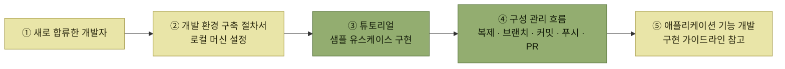

# 애플리케이션 개발 준비

> [아키텍처 구현](./README.md)

## 빠른 복습

- 애플리케이션 기반이 갖춰지면 **본격적으로 기능 개발을 전개하는 단계**로 넘어간다. 이때 **개발팀 규모가 확대되고 새로운 멤버가 합류**한다.
- 목표는 하나다. 기능을 담당하는 개발자가 **아키텍처의 원칙을 이해하고 공통 기능을 활용한 구현 방법을 빠르게 익혀, 합류 초반부터 자기 기량을 발휘**하게 하는 것.
- 준비할 문서는 세 유형 — **개발 규약 · 절차서 · 구현 참고 자료**다.
- **코딩 규약은 처음부터 직접 쓰지 않는다.** 조직이나 업계 표준을 따르면 **정적 분석 도구와 포매터 정의 파일까지 얻을 수 있다.**
- **명명 규약**에는 카멜 표기법 같은 **구문론**뿐 아니라 **어떤 의미의 단어를 쓸지에 대한 의미론**도 포함된다.
- **구현 가이드라인**은 상속할 부모 클래스, 추상 메서드 구현법, 공통 기능·유틸리티·외부 라이브러리 사용법, **테스트 코드 작성법**까지 다룬다.
- **튜토리얼**은 **반나절에서 하루** 분량으로, **샘플 유스케이스로 충분**하며 **구성 관리 흐름까지 함께 익히게** 하면 더 효과적이다.

## 이제 인원이 늘어난다

[아키텍처 측면에서 중요한 유스케이스를 활용해 애플리케이션 기반을 구현](./3-유스케이스-중심의-아키텍처-구현.md)하고 [필요한 공통 기능](./4-애플리케이션-기반-구현.md)을 갖추었다면, **본격적으로 애플리케이션 기능 개발을 전개하는 단계**다. 이 시점에 상황이 바뀐다.

> **개발팀 규모가 확대되고, 새로운 멤버가 팀에 합류하기도 한다.**

그래서 준비가 필요하다. **애플리케이션 기능을 담당하는 개발자가 아키텍처의 원칙을 이해하고, 애플리케이션 기반이 제공하는 공통 기능을 활용한 구현 방법을 빠르게 익혀, 합류 초반부터 자기 기량을 발휘할 수 있도록** 하는 것이 이 절의 목적이다.

아키텍트의 일이 여기서 한 번 더 성격을 바꾼다. [구현 단계의 역할](./1-구현-단계에서-아키텍트의-역할.md)이 "판을 짜는 일"이었다면, 이 절은 **그 판을 남에게 전달하는 일**이다.

| 문서 유형 | 설명 | 문서 예시 |
| --- | --- | --- |
| **개발 규약** | 개발자가 구현을 진행할 때 **준수해야 할 규칙**을 정리한 문서 | 코딩 규약, 명명 규약, 구성 관리 규약 |
| **절차서** | **개발 환경 설정 절차 및 구현 도구 사용법** 등을 정리한 절차 문서 | 개발 환경 구축 절차서, 도구 이용 절차서 |
| **구현 참고 자료** | 실제 구현 시 **참고할 수 있는 구체적인 자료들** | 구현 가이드라인, 튜토리얼 |

표를 읽는 법. 세 유형은 각각 **"무엇을 지켜야 하는가 · 어떻게 시작하는가 · 어떻게 만드는가"** 에 답한다. 규약만 있고 절차서가 없으면 환경 구축에서 막히고, 절차서만 있고 참고 자료가 없으면 **공통 기능을 쓰지 않고 제 방식대로 짜는 코드**가 늘어난다.

## 개발 규약

### 코딩 규약

**들여쓰기 폭, 괄호 배치 위치 등 소스 코드의 스타일을 정한다.**

- **처음부터 직접 작성하는 것은 많은 노력이 필요하므로, 조직이나 업계 표준에서 마련한 것이 있다면 그것을 따르는 것이 좋다.**
- 보통 **프로그래밍 언어나 기술 영역**(백엔드, 프런트엔드)**별로 정리**한다.
- 표준을 따르면 **정적 분석 도구나 포매터의 정의 파일을 쉽게 구할 수 있다**는 이점도 있다.

마지막 항목이 실질적인 이유다. 규약을 문서로만 두면 지켜지지 않지만, **정의 파일이 함께 오면 도구가 대신 지켜준다.** [개발 플로에 CI/CD의 정적 분석이 들어 있던 이유](./1-구현-단계에서-아키텍트의-역할.md#기능을-갖추는-것만으로는-부족하다)와 같다.

### 명명 규약

**소스 코드의 파일명, 네임스페이스명, 클래스명, 메서드명, 변수명 등의 이름을 정할 때 일관성을 부여하기 위한 규칙**이다. 두 층이 있다.

| 층 | 무엇을 정하는가 |
| --- | --- |
| **구문론** | 형식적 규칙 — 카멜 표기법 등 |
| **의미론** | **어떤 의미의 단어를 사용할 것인지** |

표를 읽는 법. 아래 줄이 어렵고 중요한 쪽이다. 형식은 도구가 검사할 수 있지만, **같은 개념을 팀원마다 다른 단어로 부르는 문제**는 규약으로 합의해두지 않으면 잡히지 않는다.

### 그 외의 규약

- **소스 코드 구성 관리**는 일반적으로 **구성 관리 규약**으로 정리한다.
- **테이블, 뷰 같은 데이터베이스 객체의 명명 규약, 공통 열 정의, 대리키/복합키 사용 방침** 등은 **데이터베이스 설계 규약**으로 정리한다.

[데이터베이스 설계 정보를 지속적으로 관리할 가치가 크다](./2-개발-프로세스-표준화.md#데이터베이스-설계는-예외다)고 했던 이야기가 규약의 형태로 다시 나온다.

## 절차서

**구현 과정에서 반복적으로 발생하는 작업 절차를 문서로 정리하여 공유함으로써, 개발자와 팀의 업무 효율을 높이는 것**이 목적이다.

- **개발 환경 구축 절차서**가 필요하다. **런타임, 통합 개발 환경, 데이터베이스 서버 등 다양한 미들웨어를 설치하고 이에 맞는 환경 설정**을 해야 하기 때문이다.
- 개발 과정에서 **사용하는 별도 도구가 있다면 필요에 따라 도구 사용 절차서**를 작성하는 것이 좋다. **자체 개발 도구도 포함**된다.

자체 개발 도구가 언급된 것을 눈여겨본다. **만든 사람에게만 사용법이 있는 도구는 팀의 자산이 아니다.**

## 구현 참고 자료

개발 규약과 절차서 외에도, **개발자가 빠르게 적응하고 안정적으로 구현 작업을 수행할 수 있도록 돕는 문서를 정비**해두면 **팀 전체의 개발 생산성을 높일 수 있다.**

### 구현 가이드라인

**개발자를 대상으로 소스 코드의 구체적인 구현 방법을 안내하는 문서**다. 담을 내용은 이렇다.

- **상속할 부모 클래스 및 구현해야 할 인터페이스 정보**
- **부모 클래스나 인터페이스의 추상 메서드 구현 방법**
- **애플리케이션 기반의 공통 기능 활용 방법**
- **유틸리티 사용 방법**
- **외부 라이브러리 사용 방법**
- **테스트 코드 작성 방법**

여섯 항목 중 앞의 넷이 [앞 절에서 만든 애플리케이션 기반](./4-애플리케이션-기반-구현.md)을 쓰는 방법이다. **기반을 만드는 일과 그 기반의 사용법을 적는 일은 별개의 작업**이며, 후자가 빠지면 기반은 쓰이지 않는다.

### 튜토리얼

**튜토리얼 실습을 통해 이해가 더 깊어질 수 있다.** 개별 개발 프로젝트에서도 효과적으로 활용할 수 있다.

*새로 합류한 개발자가 문서를 거쳐 기능 개발에 도달하는 경로. 튜토리얼이 환경 구축과 실제 개발 사이의 다리다*

- **새롭게 합류한 개발자는 개발 환경 구축 절차서에 따라 로컬 머신의 환경을 설정한 뒤 튜토리얼을 진행**한다.
- **반나절에서 하루 정도면 끝낼 수 있는, 간단하고 따라 하기 쉬운 수준의 과제**를 선택한다.
- **애플리케이션 기반을 구축할 때는 현실적인 유스케이스를 사용하는 것이 적합하지만, 튜토리얼용이라면 [샘플 유스케이스](./3-유스케이스-중심의-아키텍처-구현.md#유스케이스를-선정하는-방법)로 충분하다.**
- **구성 관리 흐름까지 함께 익힐 수 있도록 하면 더 효과적**이다. 깃을 사용한다면 **깃허브에서 로컬로 프로젝트를 복제하고 연습용 브랜치를 생성한 뒤, 각 단계를 완료할 때마다 커밋하고 푸시하며 풀 리퀘스트를 생성**해 보게 한다.

앞 절에서 **샘플 유스케이스의 단점**이 "실무와 연관성이 낮아 공통 기능의 결함이 늦게 드러난다"였다. 튜토리얼에서는 그 단점이 문제가 되지 않는다. **여기서 검증하려는 것은 기반이 아니라 사람의 이해**이기 때문이다. **같은 재료의 값이 목적에 따라 달라진다.**

## 핵심 정리

- 기반이 완성되면 **팀이 커진다.** 이 절의 준비는 모두 **새 멤버가 초반부터 제 몫을 하게 만드는 일**이다.
- 문서는 **개발 규약(무엇을 지키는가) · 절차서(어떻게 시작하는가) · 구현 참고 자료(어떻게 만드는가)** 세 유형이다.
- 코딩 규약은 **표준을 가져다 쓴다.** 정적 분석 도구와 포매터 정의 파일이 함께 오는 것이 실질적 이득이다.
- 명명 규약에는 **구문론과 의미론**이 있고, 어려운 쪽은 **같은 개념을 같은 단어로 부르게 하는 의미론**이다.
- 구현 가이드라인의 절반 이상은 **애플리케이션 기반의 사용법**이다. 기반을 만들었다면 사용법까지 적어야 쓰인다.
- 튜토리얼은 **하루 이하 · 샘플 유스케이스 · 구성 관리 흐름 포함**이 기준이다.

## 함께 읽기

- [앞 절 — 구현 가이드라인이 설명해야 하는 그 공통 기능들](./4-애플리케이션-기반-구현.md)
- [개발 프로세스 표준화 — 문서를 언제 쓰고 누가 승인하는지](./2-개발-프로세스-표준화.md)
- [아키텍처 문서화 — 개발 규약과 가이드라인이 아키텍처 기술서와 나란히 놓이는 자리](../3-아키텍처-설계/6-아키텍처-문서화.md)
