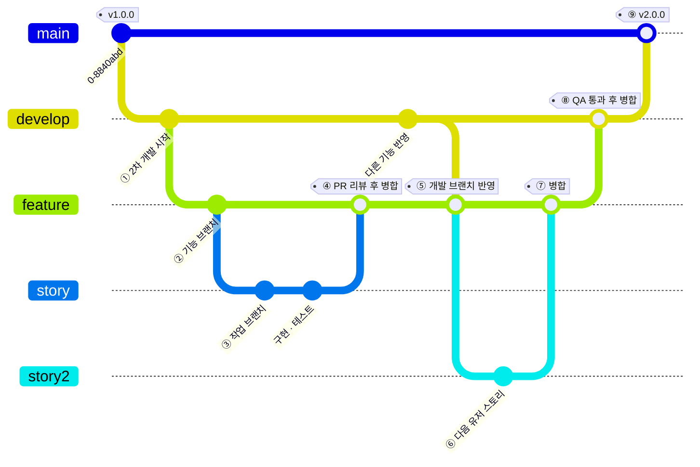

# 구성 관리 및 CI/CD

> [아키텍처 구현](./README.md)

## 빠른 복습

- **구성 관리**는 **산출물을 관리 대상으로 식별하고, 그 변경 사항을 추적하는 일련의 프로세스**다. 대상은 **요구사항 문서부터 인프라 환경까지** 광범위하다.
- **모듈 빌드와 배포에 필요한 자료는 모두 구성 관리의 대상**이다 — 소스 코드, 테스트 코드·데이터, 설정 파일, 빌드 스크립트, DDL·DML.
- 문서는 보통 별도 리포지토리나 문서 관리 시스템에 두지만, **마크다운처럼 텍스트 기반이라면 소스 코드와 같은 리포지토리에 두어 변경을 함께 동기화**할 수 있다.
- **브랜치 모델**은 **git-flow**와 **GitHub Flow**가 대표적이다. 릴리스 주기뿐 아니라 배포 방식, 규제·승인 절차, 병렬 버전 유지 여부와 팀의 통합 역량을 함께 보고 선택한다.
- **CI**는 **빌드와 테스트 과정을 자동화**하는 개발 방식이며, **CI에 너무 많은 작업을 넣으면 대기 시간이 길어져** 오히려 효율이 떨어진다. **무엇을 언제 실행할지에 대한 전략**이 필요하다.
- **CD**는 **릴리스 프로세스를 자동화**하는 실천 방법으로, **언제든지 배포할 수 있는 상태를 유지**하는 것이 기본 개념이다. 프로덕션 릴리스에 **사람의 승인 단계가 있는지**로 지속적 전달과 지속적 배포를 구분한다.
- CI/CD 시스템은 **가능한 한 개발 초기부터 갖추는 것이 좋다.**

## 구성 관리

> **구성 관리**(configuration management)란 소프트웨어 개발 프로젝트에서 생성되는 **다양한 산출물을 관리 대상으로 식별하고, 해당 산출물에 대한 변경 사항을 추적하는 일련의 프로세스**를 의미한다.

**구성 관리의 대상은 요구사항 문서(사양서)나 설계서를 포함한 각종 문서부터 소프트웨어 배포를 위한 인프라 환경에 이르기까지 매우 광범위**하다. 이 절은 그중 **구현 과정에서 생성되는 소스 코드와 관련 자료**를 중점적으로 다룬다.

### 무엇을 관리 대상으로 두는가

다음 자료들은 일반적으로 **Git이나 Subversion 같은 버전 관리 시스템을 통해 관리**한다.

- **소스 코드**
- **테스트 코드**
- **테스트 데이터**
- **설정 파일**
- **빌드 스크립트**
- **데이터베이스 자료** — DDL(데이터 정의 언어), DML(데이터 조작 언어)

기준은 한 줄로 요약된다. **모듈 빌드와 배포에 필요한 자료는 모두 구성 관리의 대상**이다.

문서는 사정이 조금 다르다. **사양서나 설계서 등의 문서는 대개 소스 코드와는 별도의 리포지토리, 파일 서버, 또는 문서 관리 시스템을 통해 관리**한다. 다만 **마크다운처럼 텍스트 기반으로 작성된 문서라면 소스 코드와 같은 리포지토리에 함께 저장하는 것도 하나의 방법**이다. 그러면 **문서와 코드 간 변경을 보다 쉽게 동기화할 수 있다는 장점**이 있다.

[앞 절의 개발 규약과 절차서](./5-애플리케이션-개발-준비.md)가 왜 리포지토리 안에 들어가는 경우가 많은지가 여기서 설명된다. **코드가 바뀌면 그 사용법도 같은 변경으로 바뀌어야 하기 때문**이다.

### 브랜치 관리 방법

**버전 관리 시스템을 활용해 구성 관리를 수행할 때에는 브랜치를 어떻게 생성하고 운영할 것인지가 핵심**이다. **브랜치 모델**은 **브랜치 관리 방식과 작업 흐름을 정의한 개념**으로, Git에서는 **git-flow**와 **GitHub Flow**가 대표적이다.

| 브랜치 모델 | 구성 | 어디에 적합한가 |
| --- | --- | --- |
| **git-flow** | **master, feature, develop, release, hotfix** 등 **여러 종류의 브랜치를 구분해** 사용 | **대규모 업무 시스템이나 패키지 제품**처럼 **릴리스 주기가 길고 엄격한 프로세스를 요구**하는 프로젝트 |
| **GitHub Flow** | **메인 브랜치와 짧게 유지하는 작업용 브랜치**를 중심으로 한 간단한 방식 | 메인 브랜치를 항상 배포 가능한 상태로 유지하며 **자주 통합·배포하는 프로젝트**. 팀 규모만으로 결정되지는 않는다 |

표를 읽는 법. 고르는 기준이 **팀의 취향이 아니라 릴리스 주기와 프로세스의 엄격함**이다. **이러한 브랜치 모델을 참고해 프로젝트에 가장 적합한 브랜치 관리 방법을 선택**한다.

아래는 **git-flow를 기반으로 한 브랜치 관리 방법의 예**로, **v1.0.0 릴리스 이후 2차 개발이 시작된 상황**을 가정한다.

*[그림 4.11] git-flow 기반 브랜치 관리 방법 예 — 마지막 main 병합이 ⑨에 해당한다*

이 그림은 원래 git-flow를 그대로 재현한 것이 아니라 프로젝트 상황에 맞게 **유저 스토리 브랜치를 한 단계 더 둔 변형 예시**다. 표준 git-flow에서는 보통 feature 브랜치를 develop에서 직접 분기하고, 필요하면 별도의 release·hotfix 브랜치를 운영한다. 여기서는 학습 흐름을 단순화하기 위해 release 브랜치를 생략하고 기본 브랜치 이름을 main으로 표현했다.

1. **v1.0.0의 태그에서 파생된 2차 개발용 개발 브랜치를 생성**한다.
2. **기능 브랜치**(feature branch)는 **개발할 기능 단위로 생성**하며, **개발 브랜치의 특정 커밋에서 분기**하여 만든다.
3. 이 프로젝트에서는 **기능을 [유저 스토리](./2-개발-프로세스-표준화.md#유저-스토리) 단위로 나누어 개발**한다고 가정한다. **유저 스토리 단위의 작업 브랜치를 기능 브랜치에서 분기**하여 생성한다. **유저 스토리 단위보다 더 세분화된 작업 단위로 작업 브랜치를 만들어도 무방**하다.
4. **구현 및 테스트 작업이 완료되어 유저 스토리의 달성 기준을 충족하면, 풀 리퀘스트(PR)를 작성해 브랜치 리뷰어에게 제출**한다. **리뷰가 완료되면 기능 브랜치에 병합**한다.
5. **기능 개발은 병렬로 진행되므로 개발 브랜치는 여러 개발자에 의해 매일 업데이트된다.** 따라서 **기능 브랜치에 개발 브랜치의 변경사항을 주기적으로 반영**해야 한다.
6. ~ 7. **개발자는 유저 스토리 단위로 앞의 과정을 반복**한다.
8. **모든 유저 스토리를 구현하고 기능이 완성되면, QA 엔지니어가 기능 단위 테스트를 수행**한다. **테스트 기준을 만족하면 기능 브랜치를 개발 브랜치에 병합**한다.
9. **릴리스 대상 기능이 모두 구현된 후에는 시스템 테스트, 사용자 수용 테스트(UAT) 등을 수행**하고, **릴리스 승인이 나면 개발 브랜치를 메인 브랜치에 병합하면서 v2.0.0 태그를 붙인다.** 이후 **메인 브랜치는 새로운 버전으로 전환**된다.

⑤가 이 목록의 숨은 요점이다. **브랜치를 오래 들고 있으면 개발 브랜치와 멀어진다.** 그래서 병합은 마지막에 한 번이 아니라, **개발 중에도 주기적으로 거꾸로 끌어와야** 한다.

## CI/CD

**구성 관리를 통해 소스 코드와 관련 자료를 버전 관리 시스템에 저장한 뒤에는, 이를 바탕으로 모듈을 빌드하고 실제 환경에 릴리스하거나 배포**한다. **이 과정을 자동화한 시스템을 CI/CD**라고 한다.

> 이러한 시스템은 **가능한 한 개발 초기부터 갖추는 것이 좋다.**

### CI — 빌드와 테스트를 자동화한다

**CI**(continuous integration, 지속적 통합)는 **주로 빌드와 테스트 과정을 자동화하는 개발 방식**이다. **개발 작업이 완료되어 브랜치를 병합할 때는 변경된 소스 코드의 품질에 문제가 없는지, 빌드가 정상적으로 수행되는지, 기존 프로그램과 통합해도 오류 없이 동작하는지 등을 자동으로 점검**한다.

| 분류 | 설명 |
| --- | --- |
| **컴파일** | 리포지토리에서 소스 코드와 관련 자료를 가져와 컴파일을 수행한다 |
| **정적 분석** | 정적 분석 도구를 사용해 **코딩 표준 준수 여부, 버그, 보안 취약점** 등을 점검한다 |
| **단위 테스트** | **프로그램 단위 수준**의 동작을 검증한다 |
| **통합 테스트** | **여러 컴포넌트를 통합하여 기능 단위** 동작을 검증한다 |
| **E2E 테스트** | **사용자 조작을 시뮬레이션**해 애플리케이션 전체 흐름을 처음부터 끝까지 검증한다 |
| **빌드** | **배포 가능한 모듈**을 생성한다 |
| **문서 생성** | 소스 코드 내 정보를 기반으로 **API 문서를 자동 생성**한다 |

*원서 [표 4.11] CI에서 수행되는 작업 예시*

표를 읽는 법. 위에서 아래로 갈수록 **한 번 돌리는 데 걸리는 시간이 길어진다.** 정적 분석에서 [코딩 규약](./5-애플리케이션-개발-준비.md#코딩-규약)이 실제로 검사되고, 문서 생성에서 [리버스 엔지니어링으로 문서를 만든다](./2-개발-프로세스-표준화.md#설계서-표준화)던 이야기가 자동화된다.

**CI를 구현하려면 Jenkins, CircleCI와 같은 전용 도구나 서비스를 사용할 수 있다.** **GitHub Actions처럼 소스 코드 호스팅 서비스에서 제공하는 기능을 활용하면, 풀 리퀘스트 생성이나 병합 등의 액션을 트리거 삼아 CI 자동화를 보다 손쉽게 구현**할 수 있어 적극적으로 활용해볼 만하다.

여기에 함정이 하나 있다.

> **CI에 너무 많은 작업을 포함하면 처리 시간이 늘어나 대기 시간이 길어지고, 결과적으로 개발 효율이 저하될 수 있다.** 따라서 **어떤 작업을 언제 실행할지에 대한 기준과 전략이 필요**하다.

예를 들어 **실행 시간이 긴 E2E 테스트는 개발 브랜치나 릴리스 브랜치 병합 시점에만 실행하거나 야간에 스케줄링하는 방식으로 빌드 전략을 수립**할 수 있다. 앞의 표와 [그림 4.11]의 브랜치 모델을 겹쳐 놓으면, **어느 병합에서 어느 검사를 돌릴지**가 이 전략의 실체임을 알 수 있다.

### CD — 릴리스를 자동화한다

**Continuous Delivery**(지속적 전달) 또는 **Continuous Deployment**(지속적 배포)를 의미하는 **CD는 릴리스 프로세스를 자동화하는 실천 방법**이다. **언제든지 환경에 배포할 수 있는 상태를 유지하는 것이 기본 개념**이다.

| | 무엇이 다른가 |
| --- | --- |
| **지속적 전달** | 변경을 언제든 프로덕션에 릴리스할 수 있도록 파이프라인을 자동화하되, **프로덕션 릴리스에는 사람의 승인·수동 트리거를 둔다** |
| **지속적 배포** | 검증을 통과한 변경을 **사람의 승인 없이 프로덕션까지 자동 배포**한다 |

표를 읽는 법. 둘 다 빌드·검증·배포 절차를 폭넓게 자동화할 수 있다. 핵심 차이는 **검증된 변경을 프로덕션에 릴리스할 때 사람의 승인을 거치는가**다.

CD를 구현하려면 **컨테이너화 기술**이 중요하다.

- **Docker, Kubernetes** — **테스트를 마친 컨테이너 이미지를 레지스트리에 등록해 두면 컨테이너 환경으로 빠르게 배포**할 수 있다.
- **Terraform, Ansible** 같은 **IaC**(Infrastructure as Code) 기술도 **배포 자동화를 위한 핵심 도구**로 사용된다. 이러한 기술을 활용하면 **배포 대상 인프라 환경의 구축 과정 전체를 자동화**할 수 있다.

인프라까지 코드가 되면, **[구성 관리의 대상](./6-구성-관리-및-CI-CD.md#무엇을-관리-대상으로-두는가)이 다시 넓어진다.** 이 절의 첫 문단에서 "구성 관리의 대상은 인프라 환경에까지 이른다"고 했던 말이 IaC로 실현되는 셈이다.

## 핵심 정리

- 구성 관리는 **산출물을 식별하고 변경을 추적하는 프로세스**이며, 기준은 **빌드와 배포에 필요한 모든 자료**다.
- 텍스트 기반 문서는 **코드와 같은 리포지토리**에 두면 변경이 함께 움직인다.
- 브랜치 모델은 **릴리스 주기·배포 방식·규제 절차·병렬 버전·통합 역량**을 함께 보고 고른다. GitHub Flow는 팀 규모와 무관하게 잦은 통합과 배포에 어울린다.
- git-flow 흐름에서 잊기 쉬운 것은 **개발 브랜치의 변경을 기능 브랜치로 주기적으로 되끌어오는 일**(⑤)이다.
- CI는 **컴파일 → 정적 분석 → 테스트 → 빌드 → 문서 생성**을 자동화하되, **무엇을 언제 돌릴지 전략**이 있어야 한다. 긴 E2E는 병합 시점이나 야간으로 미룬다.
- CD는 **언제든 배포 가능한 상태를 유지**하는 것이고, **지속적 전달과 지속적 배포는 프로덕션 릴리스에 사람의 승인 단계가 있는지**로 갈린다.
- 컨테이너와 **IaC**를 쓰면 **인프라 구축까지 자동화**되어 구성 관리의 대상이 코드 밖으로 넓어진다.

## 함께 읽기

- [개발 플로 — 구성 관리와 CI/CD가 그 네 다리 가운데 둘이었다](./1-구현-단계에서-아키텍트의-역할.md#기능을-갖추는-것만으로는-부족하다)
- [애플리케이션 개발 준비 — 구성 관리 규약과 튜토리얼의 구성 관리 실습](./5-애플리케이션-개발-준비.md)
- [이식성 — 하루에 여러 번 배포하려면 설치성이 높아야 한다는 이야기](../3-아키텍처-설계/2-아키텍처-드라이버의-핵심-사항.md#이식성-옮겨-심을-수-있는가)
