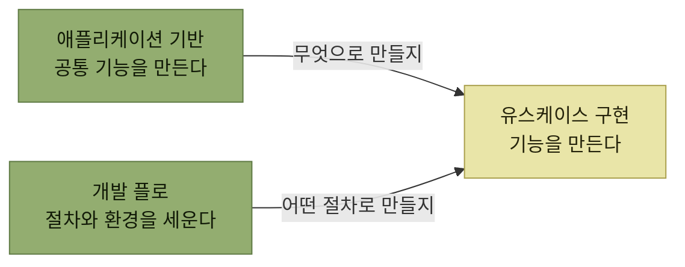

# 아키텍처 구현

> [아키텍트 첫걸음](../README.md)

## 고른 아키텍처를 어떻게 코드로 만들 것인가

3장이 **무엇을 고르고 왜 고랐는지를 정하는 장**이었다면, 4장은 그 방침이 **여러 개발자의 손을 거쳐 실제 코드가 되게 만드는 장**이다. [시스템 구성도는 소스 코드로 변환되어야 비로소 동작한다](../3-아키텍처-설계/1-아키텍처-설계의-주요-개념.md#구성도는-코드가-되어야-비로소-동작한다)고 했던 그 다음 이야기다.

*아키텍트가 구현 단계에서 손대는 것은 기능 자체가 아니라, 기능을 만드는 토대와 절차다*

## 목차

1. [구현 단계에서 아키텍트의 역할](./1-구현-단계에서-아키텍트의-역할.md)
2. [개발 프로세스 표준화](./2-개발-프로세스-표준화.md)
3. [유스케이스 중심의 아키텍처 구현](./3-유스케이스-중심의-아키텍처-구현.md)
4. [애플리케이션 기반 구현](./4-애플리케이션-기반-구현.md)
5. [애플리케이션 개발 준비](./5-애플리케이션-개발-준비.md)
6. [구성 관리 및 CI/CD](./6-구성-관리-및-CI-CD.md)

## 함께 읽기

- [3장 아키텍처 설계](../3-아키텍처-설계/README.md) — 이 장이 구현하는 그 방침을 정한 장이다.
- [소프트웨어 개발 프로세스](../2-소프트웨어-설계/1-소프트웨어-개발-프로세스.md) — 구현과 테스트가 프로세스 안에서 어느 자리인지.
