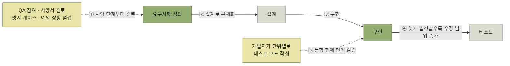

# 아키텍트와 품질 보증을 위한 작업

> [품질 보증과 테스트](./README.md)

## 빠른 복습

- 품질 보증과 테스트는 **품질 보증 부서나 QA 엔지니어만의 업무가 아니다.** 아키텍트도 깊이 관여하고 **때로는 주도적인 역할**을 맡는다.
- **품질 보증**은 **기대되는 품질 기준을 충족시켜 고객과 사용자의 요구를 만족시키기 위한 일련의 활동**이고, **테스트**는 그중 **요구사항대로 동작하는지 검증하는 행위**다. 품질 보증은 **테스트 수행만을 의미하지 않는다.**
- **결함은 발견 시점이 늦어질수록 수정 범위와 비용이 커지는 경향**이 있다. 원서는 요구사항 오류를 테스트 단계에서 발견할 때 정의 단계보다 몇십 배의 비용이 들 수 있다는 사례를 들지만, 배수 자체는 조직과 시스템에 따라 달라진다.
- **시프트 레프트**는 **품질 보증 활동을 개발 초기부터 함께 수행**하자는 접근이다. **QA 엔지니어가 사양서 검토에 참여해 엣지 케이스와 예외 상황을 초기에 점검**하는 것까지 포함한다.
- **테스트 유형은 품질 속성에 대응**하며, 모두 같은 비중으로 하는 것이 아니라 **아키텍처 드라이버로 고른 품질 속성에 대응하는 유형의 중요도가 더 높다.**
- **테스트 레벨**은 테스트를 단계로 나눈 개념이다. **같은 용어라도 사람마다 해석이 다르므로 목적과 범위를 사전에 명확히 정의**해야 한다.
- **V 모델의 상단 레벨일수록 테스트 환경과 데이터가 복잡**해진다. 실데이터를 쓸 때는 **데이터 마스킹** 같은 보호 조치가 필요하다.
- **리그레션 테스트**는 수작업으로 반복하면 공수가 크므로 **자동화**한다. 어떤 레벨에서 어떤 유형을 자동화할지 **정책을 세우는 것이 아키텍트의 일**이다.

## 품질 보증은 테스트보다 넓다

| 용어 | 무엇인가 |
| --- | --- |
| **품질 보증**(quality assurance) | 시스템이 **기대되는 품질 기준을 충족시켜 고객과 사용자의 요구를 만족시키기 위해 수행하는 일련의 활동** |
| **테스트** | 개발한 소프트웨어가 **정의된 요구사항에 따라 제대로 동작하는지를 검증하는 행위** |

표를 읽는 법. 두 줄은 크기가 다르다. **품질 보증은 단순히 테스트 수행만을 의미하지 않는다.**

- 적절한 **코드 리뷰**
- 코드 품질 점검을 위한 **정적 분석 도구 도입**
- **개발 프로세스와 문서의 표준화**

이처럼 **소프트웨어의 품질을 유지하고 개선시키는 데 필요한 다양한 접근 방식을 모두 포괄**한다. 그래서 [4장의 프로세스 표준화](../4-아키텍처-구현/2-개발-프로세스-표준화.md)와 [CI의 정적 분석](../4-아키텍처-구현/6-구성-관리-및-CI-CD.md#ci--빌드와-테스트를-자동화한다)이 이미 품질 보증 활동이었던 셈이다.

> 품질 보증과 테스트는 품질 보증 부서나 QA 엔지니어의 업무일 뿐 아니라, **아키텍트도 품질 보증 활동에 깊이 관여하고 때로는 주도적인 역할을 맡기도 한다.**

## 시프트 레프트

출발점은 비용이다.

> **소프트웨어의 결함은 발견 시점이 늦어질수록 더 많은 산출물과 코드에 영향을 주어 수정 비용이 커지는 경향**이 있다. 원서의 몇십 배라는 수치는 이러한 방향을 설명하는 사례이며, 고정된 보편 법칙은 아니다.

이유는 분명하다. **개발 후반으로 갈수록 사양서·설계서 같은 문서를 비롯해 소스 코드와 테스트 케이스까지 수정과 재실행이 필요한 작업이 늘어나기 때문**이다.

반대로 **미리 발견하면 비용을 아낄 수 있다.** 그리고 **아낀 비용은 더 정밀한 테스트나 기능 고도화 등에 활용**할 수 있어, **결과적으로 소프트웨어 품질을 높이고 고객과 사용자 만족도 향상으로 이어진다.** 이러한 접근을 **시프트 레프트**라 한다.

*시프트 레프트는 품질 보증 활동을 왼쪽(개발 초기)으로 당기는 것이다. 점선은 원래 오른쪽에 있던 활동이 옮겨온 자리다*

### 무엇을 왼쪽으로 당기는가

**기존의 워터폴 방식은 테스트 단계에 들어선 후 QA팀에 전체 문서를 전달하고, 그제서야 품질 보증 작업이 시작**되었다. 시프트 레프트는 **이러한 방식에 문제를 제기하고, QA 엔지니어가 더 이른 단계부터 프로젝트에 참여해야 함을 강조**한다.

- **단순히 테스트를 앞당겨 시작하는 것만이 아니다.** **사양서 검토에 참여**하여, **극단적인 조건에서의 동작을 확인하는 엣지 케이스나 예외 상황처럼 빠뜨리기 쉬운 요소들을 초기에 점검**할 수 있다.
- **다양한 품질 보증 활동을 개발 초기부터 함께 수행**하자는 접근이다.
- **설계나 구현 중간부터 테스트를 함께 수행**하는 것을 의미한다. **각 컴포넌트나 모듈이 구현을 마친 뒤, 화면이나 API를 통해 하나의 기능으로 통합되기 전에 단위별로 테스트 코드를 작성해 개발자가 직접 검증**한다.

마지막 항목이 실질적인 대목이다. **통합된 뒤에 QA가 확인하는 것과, 통합되기 전에 개발자가 검증하는 것은 결함이 드러나는 시점이 한 단계 다르다.** [유스케이스 기술서에 예외 시나리오를 적어두는 일](../4-아키텍처-구현/2-개발-프로세스-표준화.md#유스케이스-기술서)도 같은 방향의 활동이다.

## 테스트 유형

**테스트 유형이란 테스트의 구체적인 목적과 검증 관점을 기준으로 테스트를 분류하는 개념**이다. 크게는 **기능 테스트와 비기능 테스트**로 나뉘며, 더 세분화하면 **품질 속성별로 다양한 유형**으로 나눌 수 있다.

| 품질 속성 | 테스트 유형 |
| --- | --- |
| **기능 적합성** | 기능 테스트 |
| **수행 효율성** | 성능 테스트 |
| **호환성** | 상호운용성·호환성 테스트 |
| **사용성** | 사용성 테스트 |
| **신뢰도** | 복구·장애 전환·장기 실행 테스트 |
| **보안성** | 보안 테스트 |
| **유지 가능성** | **정적 분석, 아키텍처 규칙 테스트** |
| **이식성** | 설치 테스트, 버전 업그레이드 테스트 등 |

*원서 [표 5.1]의 취지를 보완한 품질 속성과 검증 유형 예시*

표를 읽는 법. 왼쪽 열이 [3장의 KS X 25010 품질 속성](../3-아키텍처-설계/2-아키텍처-드라이버의-핵심-사항.md#품질-모델--측정-가능한-속성으로-정의한다) 그대로다. 품질 속성과 검증 방법은 일대일 대응이 아니다. 예를 들어 유지 가능성은 정적 분석과 의존성 규칙 테스트로 일부 확인할 수 있지만, 실제 변경 리드타임과 결함률 같은 운영 지표까지 함께 봐야 한다.

> 물론 이러한 테스트 유형을 **모두 동일한 방식으로 적용해야 한다는 의미는 아니다.** 개발 대상 소프트웨어의 특성에 따라 **중점적으로 수행해야 할 테스트 유형은 달라진다.** 특히 **3장에서 아키텍처 드라이버로서 정리한 품질 속성에 대응하는 테스트 유형은 중요도가 더 높아진다.**

**테스트 전략을 수립할 때는 테스트 유형별로 어떤 레벨에서 어떤 방식으로 테스트를 수행할지 정의**한다.

## 테스트 전략

**소프트웨어를 고객과 사용자 요구에 부합하는 품질 수준으로 완성하기 위해, 어떤 테스트를 언제 어떻게 수행할 것인지, 그리고 프로젝트 자원을 어떻게 배분할지 등을 정하는 전반적인 정책을 수립**하는 일이다.

### 테스트 레벨

**테스트 대상이 되는 소프트웨어 구성 요소의 세분화 정도나 범위, 또는 개발 작업과 프로세스의 관점에서 테스트를 단계별로 나누는 개념**이다.

- **단위 테스트 · 통합 테스트 · 시스템 테스트 · 인수 테스트** — [V 모델](../2-소프트웨어-설계/1-소프트웨어-개발-프로세스.md#v-모델)에서 개발·설계 활동과 대응하는 검증 단계들이다.
- **조직 내 표준 개발 프로세스에 테스트 레벨이 정의되어 있다면 그 기준을 따르는 것을 권장**한다.

> 같은 테스트 레벨 용어더라도 **사람마다 해석이 다를 수 있기 때문에, 각 테스트 레벨의 목적과 범위는 사전에 명확하게 정의하는 것이 중요**하다.

이 경고가 이 절에서 가장 실용적인 문장일 수 있다. "통합 테스트"라는 말 하나로 팀이 서로 다른 것을 떠올리면, **테스트 전략은 문서상으로만 존재하게 된다.**

### 테스트 환경과 테스트 데이터

**테스트를 수행하려면 적절한 환경과 데이터가 필요**하다. 이러한 **테스트 자원을 준비하는 데는 비용, 시간, 인력 등 다양한 리소스가 발생하므로, 한정된 프로젝트 예산 내에서 테스트 효과를 극대화하는 정책을 수립**해야 한다.

- 일반적으로 **V 모델에서 상단에 위치한 테스트 레벨일수록 테스트 환경과 데이터는 더 복잡**하다. 예를 들어 **시스템 테스트나 사용자 수용 테스트(UAT) 단계에서는 프로덕션 환경이나 스테이징 환경에서 실제 운영 시 사용하는 것과 유사한 데이터를 활용**하는 경우가 많다.
- 이때 테스트 데이터로는 **이전 시스템에서 이관한 데이터나 이를 기반으로 확장 생성한 데이터를 활용**하기도 한다. 단, 운영 데이터 사용은 목적에 필요한 최소 범위로 제한하고 가능하면 합성 데이터를 우선한다. 불가피한 경우에는 **비식별화·마스킹뿐 아니라 접근 통제, 보관 기간, 폐기 절차**까지 함께 적용해야 한다.
- **테스트 데이터를 생성하거나 마스킹할 때 어떤 툴을 쓸지, 이를 외부에서 도입할지 자체 개발할지는 상황에 따라 달라진다.** 이와 같은 판단에는 **아키텍트가 관여**한다.

### 테스트 자동화 정책

> **기존 기능이 사양 변경이나 결함 수정 이후에도 퇴행(regression) 없이 정상적으로 동작하는지 검증하는 테스트**를 **리그레션 테스트**라고 한다.

**이러한 테스트를 수작업으로 반복하면 상당한 공수가 발생하므로, 테스트 코드나 스크립트를 미리 준비해 가능한 한 자동으로 실행할 수 있도록** 해야 한다.

> 아키텍트는 **각 테스트 레벨에서 어떤 테스트 유형을 자동화할지 정책을 수립**하고, **그 실행 방안을 검토하며 적합한 제품이나 툴을 선정**하는 등 **자동화 과정 전반을 주도**한다.

**어떤 레벨에서 · 어떤 유형을 · 자동으로 돌릴 것인가.** 이 세 가지가 [CI에 무엇을 넣을지 정하는 전략](../4-아키텍처-구현/6-구성-관리-및-CI-CD.md#ci--빌드와-테스트를-자동화한다)과 정확히 같은 질문이다. 다음 절부터 그 구체적인 방법을 본다.

## 핵심 정리

- **품질 보증 ⊃ 테스트**다. 코드 리뷰, 정적 분석, 프로세스·문서 표준화가 모두 품질 보증 활동이다.
- 결함은 **늦게 찾을수록 수정 범위와 비용이 커지는 경향**이 있다. 그래서 품질 보증 활동을 왼쪽으로 당기는 **시프트 레프트**가 필요하다.
- 시프트 레프트는 테스트를 앞당기는 것에 그치지 않고 **QA가 사양서 검토에 참여**하고 **개발자가 통합 전에 단위 테스트 코드를 쓰는 것**까지 포함한다.
- 테스트 유형은 **품질 속성에 대응**하고, **드라이버로 고른 속성의 유형이 더 중요**하다. 유지 가능성은 실행이 아니라 **정적 분석**으로 본다.
- 테스트 레벨은 **목적과 범위를 먼저 합의**해야 한다. 같은 단어로 다른 것을 뜻하면 전략이 무의미해진다.
- **상위 레벨일수록 환경과 데이터가 복잡**하고, 실데이터를 쓰면 **마스킹**이 필요하다. 툴 선정에도 아키텍트가 관여한다.
- **리그레션 테스트는 자동화**하고, **어느 레벨에서 어떤 유형을 자동화할지 정하는 것**이 아키텍트의 몫이다.

## 함께 읽기

- [아키텍처 드라이버 — 어떤 테스트 유형이 중요해지는지를 결정한 자리](../3-아키텍처-설계/2-아키텍처-드라이버의-핵심-사항.md)
- [V 모델 — 테스트 레벨의 원본](../2-소프트웨어-설계/1-소프트웨어-개발-프로세스.md#v-모델)
- [구성 관리 및 CI/CD — 자동화된 테스트가 실제로 돌아가는 파이프라인](../4-아키텍처-구현/6-구성-관리-및-CI-CD.md)
