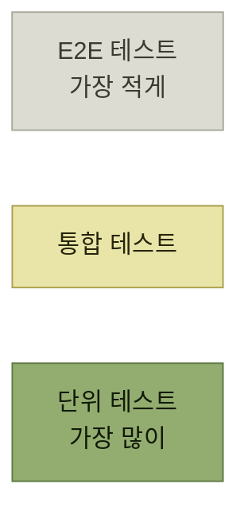
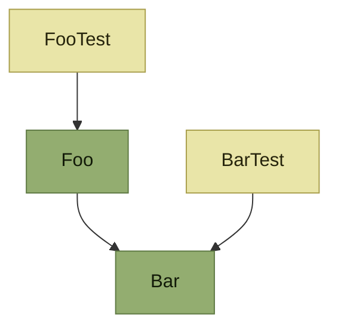
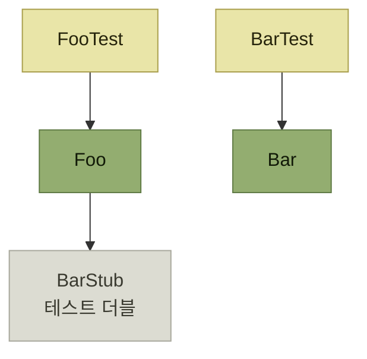
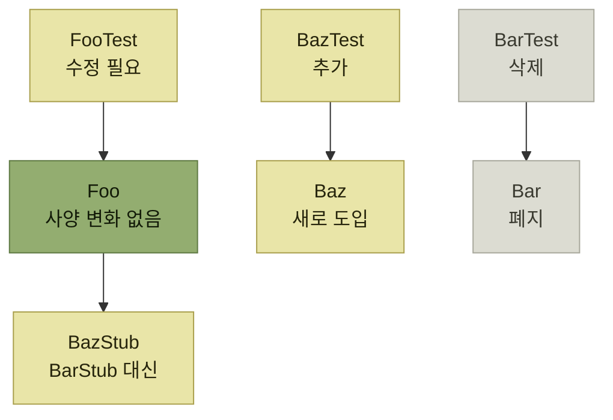
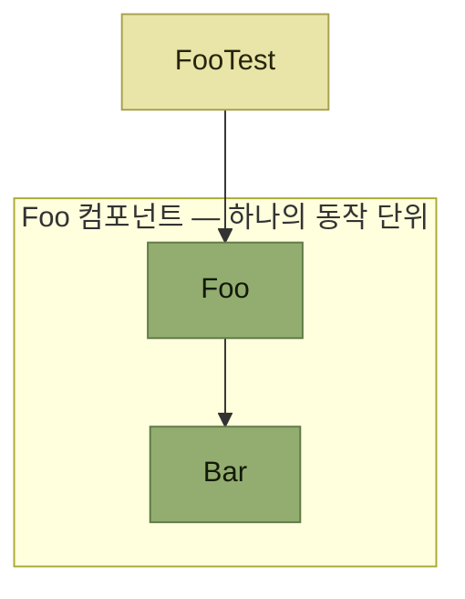
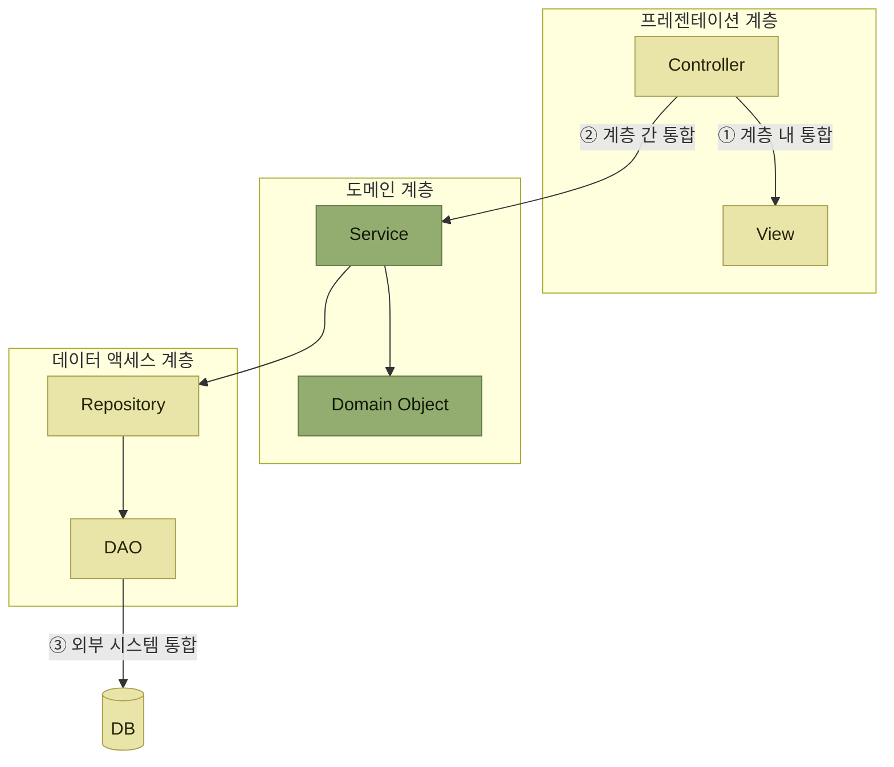
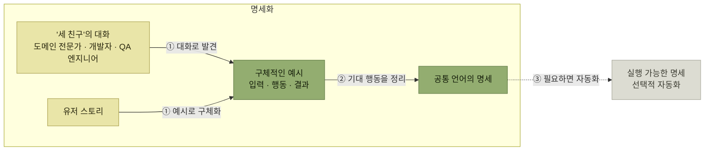
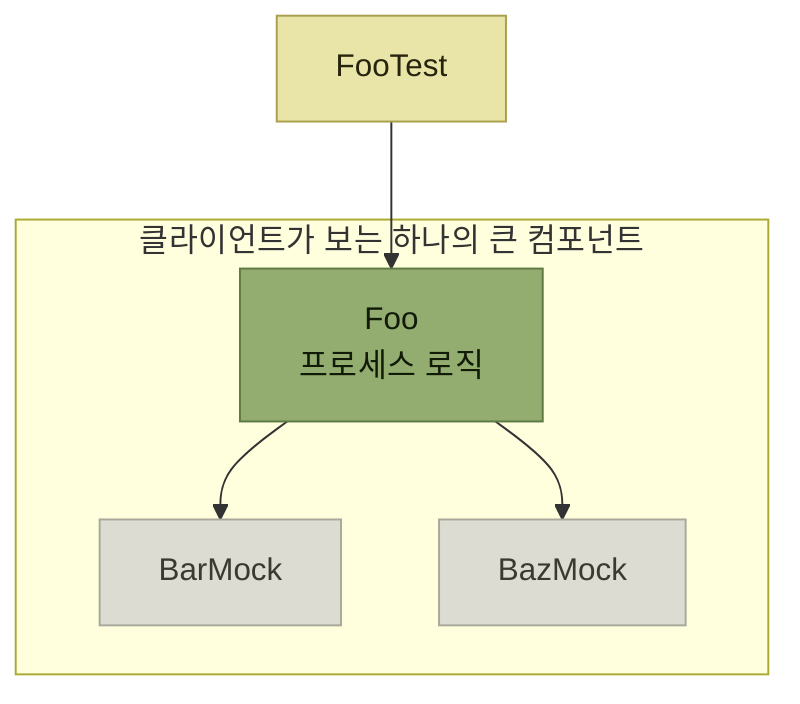
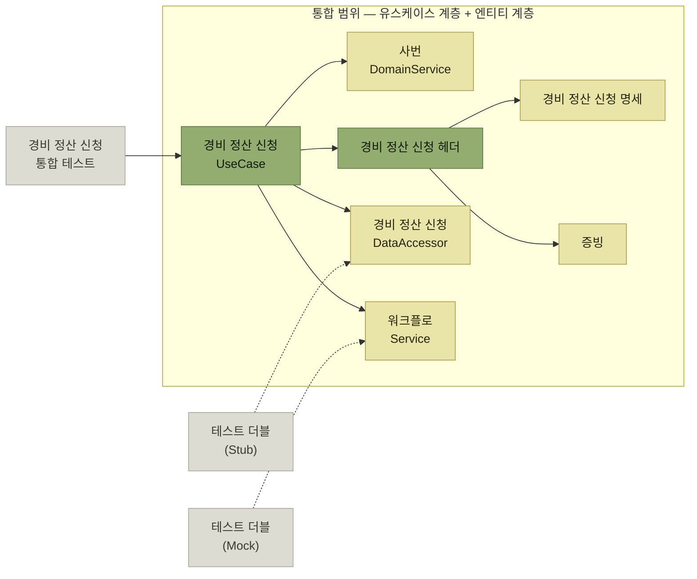
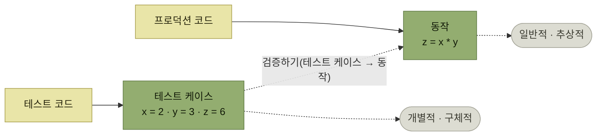

# 기능 테스트 자동화

> [품질 보증과 테스트](./README.md)

## 빠른 복습

- 기능 테스트는 **기능 적합성**에 대응하는 유형이며 **아키텍처 자체를 검증하는 테스트가 아니다.** 아키텍트가 다루는 이유는 내용이 아니라 **자동화 체계의 설계와 구현**(툴 선정 · 테스트 코드 구조 · 유지보수 전략) 때문이다.
- **테스트 피라미드**는 단위 → 통합 → E2E로 갈수록 **양을 줄인다.** 위로 갈수록 **비용이 크고 실행이 느리기** 때문이다. 단 **황금비율은 없다.**
- 단위 테스트의 '단위'는 **프로그램의 최소 단위**(클래스)로 볼 수도, **동작 단위**(컴포넌트)로 볼 수도 있다. 저자는 **동작 단위**를 권한다. 클래스 기준은 **내부 설계가 바뀔 때 테스트가 함께 무너진다.**
- **통합 테스트**는 단위와 E2E 사이의 범주 전체를 포괄하며, 통합 범위는 **계층 내 · 계층 간 · 외부 시스템** 세 유형으로 갈린다.
- **E2E 테스트**는 사용자 기준으로 시스템 전체를 검증한다. 코드형(Selenium, Cypress)과 **노코드 RnR형**(Autify, MagicPod)이 있고, **불안정한 테스트**(flaky test)가 자주 발생한다.
- **커버리지 100%는 목표가 아니다.** 원서가 인용한 60%·75%·90% 기준은 참고치이며, 프로젝트 위험에 맞는 기준과 테스트의 검증 품질을 함께 본다.
- 저자는 **프로세스 로직을 상위 테스트에 맡기고 핵심 로직에 단위 테스트를 집중**하라고 권한다. 다만 분기·오류 처리처럼 독립 검증할 가치가 있는 프로세스 동작은 단위 테스트할 수 있다.
- **E2E는 핵심 사용자 여정과 리그레션에 집중**한다. 모든 화면 액션을 망라하기보다 사용 빈도·장애 영향·과거 결함으로 우선순위를 정한다.
- 테스트 코드도 자산이다. 관리 원칙은 **SOS — Structured · Organized · Self-documenting**.

## 아키텍트가 기능 테스트를 다루는 이유

기능 테스트는 ['기능 적합성'이라는 품질 속성](./1-아키텍트와-품질-보증을-위한-작업.md#테스트-유형)에 대응하는 테스트 유형이다. **애플리케이션의 각 기능이 사양서대로 동작하는지를 검증하는 것이 주목적이며, 아키텍처 자체를 검증하는 테스트는 아니다.**

> 그렇다면 아키텍트가 기능 테스트를 다루는 이유는 무엇일까? 그것은 기능 테스트의 **'내용'을 검증하기보다 테스트 자동화 체계의 설계와 구현**, 즉 **테스트 툴 선정, 테스트 코드 구조 설계, 유지보수 전략 수립** 등의 과정에서 **아키텍트의 기술적 지식과 경험이 필수적**이기 때문이다.

## 테스트 피라미드



*[그림 5.1] 테스트 피라미드 — 원서는 삼각형으로 그렸다. 아래가 넓다는 것이 "양을 많이"라는 뜻이다*

**단위 테스트, 통합 테스트, E2E 테스트 순으로 구성되며, 이때 테스트 양을 점차 줄여간다는 원칙을 시각화한 모델**이다. 왜 이런 비율이 적절한가.

| 이유 | 무엇이 늘어나는가 |
| --- | --- |
| **상위 테스트일수록 비용이 더 많이 든다** | **테스트 코드 및 스크립트 작성과 테스트 데이터 준비**에 더 많은 리소스가 필요하다. 또한 **데이터베이스 서버를 비롯해 연동할 미들웨어나 서비스도 구축**해야 하므로 **테스트 실행 시 환경 구성 비용**도 늘어난다 |
| **상위 테스트일수록 실행 속도가 느려진다** | 하나의 테스트 케이스에 **통합되는 컴포넌트 수가 증가**하고, **데이터베이스 접근 등 프로세스 간 통신과 서버 간 통신**이 발생한다 |

표를 읽는 법. 두 줄 모두 **"위로 갈수록 무거워진다"** 는 같은 이야기다. 이러한 이유로 **단위 테스트 비중을 최대한 늘리는 것이 합리적**이다. **다만 단위 테스트만으로는 컴포넌트 통합 후 전체가 제대로 작동한다는 것을 보장할 수 없으므로 통합 테스트와 E2E 테스트도 병행**해야 한다.

> 하지만 이 피라미드는 **참조 모델일 뿐, 각 층의 면적 비율이 실제 테스트의 양을 그대로 나타내는 것은 아니다.** 테스트 양에 대해 정해진 **'황금비율'은 없다.**

그래서 **테스트 피라미드를 기본 가이드로 삼되, 프로젝트 특성에 맞춰 각 자동화 테스트의 유형별 정책과 기준을 수립하는 것이 테스트 전략의 핵심**이다.

## 단위 테스트

**단위 테스트**는 **소프트웨어 구성 요소의 최소 단위가 올바르게 동작하는지 검증하는 테스트**다. 여기서 **'단위'가 무엇을 의미하는지는 두 가지 관점에서 정의**할 수 있다.

### 관점 ① 프로그램의 최소 단위로 보기

**객체 지향 언어에서는 클래스가 이에 해당하며, 클래스마다 하나의 전용 테스트 클래스를 생성**한다.



*[그림 5.2] 클래스별 단위 테스트 구성 예시 — 클래스 하나에 테스트 클래스 하나가 붙는다*

단위 테스트는 다른 테스트의 실행 순서나 공유 상태에 기대지 않고 빠르고 결정적으로 실행되어야 한다. 동작 단위 안의 협력 객체는 실제 구현을 함께 사용할 수 있고, 네트워크·시간·외부 저장소처럼 단위 밖 경계는 테스트 더블로 대체할 수 있다. 모든 의존성을 무조건 목으로 바꾸면 내부 구현과 테스트가 강하게 결합될 수 있다.



*[그림 5.3] 테스트 더블 적용 예시 — `BarStub` 클래스가 `Bar` 클래스를 대체하는 테스트 더블 역할을 한다*

**장점**은 이렇다.

- **클래스마다 하나의 테스트 클래스를 만들면 되기 때문에 규칙이 단순하고 이해하기 쉽다.**
- **의존 관계 없이 독립적인 테스트가 가능하다.** 예를 들어 **`Bar` 클래스가 아직 구현되지 않았더라도 `Foo` 클래스를 먼저 작성해 테스트할 수 있다.**

**단점**은 **테스트가 구조적으로 취약해지기 쉽다**는 것이다.

- `Foo`와 `Bar`가 독립적인 경우에는 문제가 없지만, **`Bar`가 `Foo`의 기능을 보조하는 헬퍼 클래스라면 이야기가 달라진다.**
- 이 경우 **`Bar`의 메서드 구성이나 호출 방식은 `Foo`의 내부 설계의 일부**에 해당한다. 따라서 **`Bar`에 사양 변경이나 리팩터링이 생기면 이러한 설계가 쉽게 틀어질 수 있다.**



*[그림 5.4] 내부 설계의 변경 — 회색이 원서에서 ✕로 표시해 폐기한 것들이다*

**리팩터링 과정에서 `Bar` 클래스를 폐지하고 `Baz` 클래스를 새로 도입하게 되면, `BarTest` 클래스는 삭제되고 `BazTest` 클래스가 추가되며 `FooTest` 클래스도 수정이 필요해진다.** 이때 **테스트 더블도 바뀌어 `BarStub` 대신 `BazStub`을 사용해야 한다.**

> 이렇듯 **`Foo` 클래스의 사양 자체에는 변화가 없더라도 테스트 코드 전반에 수정이 불가피해지는 것**이다.

### 관점 ② 동작 단위로 보기

**컴포넌트를 단위 테스트의 최소 단위로 간주하는 관점**이다. 『Beyond Legacy Code』는 '단위'를 이렇게 정의한다.

> **단위란 동작의 단위, 다시 말해 독립적이고 검증 가능한 동작을 의미한다.** 이것은 명확한 차별점을 가져야 하며, **시스템의 다른 동작과 밀접하게 연관되어서는 안 된다.**

이 정의는 [이 책에서 설명한 컴포넌트의 개념](../2-소프트웨어-설계/2-소프트웨어-설계의-추상화-레벨.md#컴포넌트-설계), 즉 **'특정 동작을 제공할 책임이 있고 명확한 인터페이스로 정의된 소프트웨어 구성 요소'와 일치**한다.



*[그림 5.5] 동작 단위별 단위 테스트 — `Foo`와 `Bar`로 구성된 컴포넌트 전체가 하나의 단위이므로 테스트 클래스는 하나다*

- **장점** — **컴포넌트가 제공하는 공개 동작에 초점을 맞춰 테스트 코드를 작성하므로, 사양 변경이나 리팩터링 등 내부 설계가 변경되더라도 테스트 코드의 수정이 최소화**된다.
- **단점** — 프로그램의 최소 단위를 기준으로 하는 방식에 비해 **단위의 정의가 모호해질 수 있고, 개발자마다 그 범위를 다르게 판단할 여지가 있다.**

그럼에도 **컴포넌트를 적절한 단위로 분할하는 일은 좋은 설계의 출발점이 되며, 테스트 코드 작성과 리팩터링을 반복하면서 최적의 '동작 단위'를 찾아가는 과정 자체가 중요**하다. 두 방식은 **트레이드오프 관계**이며, **저자는 동작 단위별로 단위 테스트를 작성하는 방식을 권장**한다.

### 단위 테스트의 특징

어느 관점이든 **단위 테스트는 통합 테스트에 비해 실행 대상의 범위가 좁고, 다른 테스트와 독립적으로 수행할 수 있다.**

- **테스트 입력값과 의존 객체 준비가 용이함**
- **다양한 테스트 케이스를 간편하게 구성 가능**
- **테스트 실행 시간이 짧음**
- **테스트 실패 시 원인 파악이 빠름**

### 테스트 더블

**SUT**(system under test)는 **테스트 대상이 되는 단위**를, **DOC**(depended-on component)는 **SUT가 의존하는 구성 요소**를 의미한다. **테스트 더블은 단위 테스트에서 실제 DOC를 대신해 사용된다.**

| 분류 | 특징 |
| --- | --- |
| **스텁**(Test Stub) | 실제 DOC 대신 **사전에 정의된 응답을 반환**. 호출된 메서드에 대해 정해진 결과만 제공한다 |
| **스파이**(Test Spy) | 스텁 기능에 더해, **메서드 호출 내역**(호출 횟수, 인자 값 등)**을 기록**하여 이후 검증에 활용한다 |
| **목**(Mock Object) | **SUT와 DOC 간 상호작용에 대한 기대 조건**(호출 횟수, 인자 조건 등)**을 미리 정의**해 두고, 테스트 중 실제 동작이 그 기대에 부합하는지 검증한다 |
| **페이크**(Fake Object) | 실제 DOC와 **유사한 동작을 수행하지만 더 단순하고 가벼운 방식으로 구현**된 테스트용 구성 요소다. 예: 실제 데이터베이스 대신 메모리를 사용하는 임시 저장소 |
| **더미**(Dummy Object) | **실제로 사용되지 않지만, 메서드 인자나 객체 구성을 완성하기 위해 전달**하는 테스트 더블이다. 동작을 제공하거나 검증하지 않는다 |

*원서 [표 5.2] 테스트 더블의 다양한 유형 (『xUnit 테스트 패턴』, 에이콘출판, 2010)*

표를 읽는 법. 위에서 아래로 **"무엇을 대신하는가"가 아니라 "무엇까지 하는가"** 로 갈린다. 스텁은 **답만 주고**, 스파이는 **기록하고**, 목은 **기대와 비교해 검증까지** 한다. 이 차이가 뒤에서 "구현 세부 사항을 검증하지 말라"는 이야기와 이어진다.

**테스트 더블은 직접 구현할 수도 있지만, 테스트 더블 라이브러리**(Java의 Mockito, JavaScript의 Sinon.js, Python의 `unittest.mock` 등)**를 활용하면 API를 통해 손쉽게 생성하고 설정**할 수 있다. Selenium은 브라우저 자동화 도구이므로 테스트 더블을 만드는 역할과는 구분해야 한다. E2E 테스트에서 외부 연동을 대체해야 한다면 별도의 스텁 서버나 네트워크 가상화 도구를 조합한다.

## 통합 테스트

**여러 단위나 컴포넌트를 결합했을 때, 이들이 집합체로서 정상적으로 동작하는지 검증하는 과정**으로, **단위 테스트와 E2E 테스트 사이의 범주 전체를 포괄**한다.

- 단위 테스트에서 '단위'를 **프로그램의 최소 단위**로 본다면, **두 개 이상의 프로그램을 통합해 테스트하는 것**이 통합 테스트다.
- '단위'를 **동작**으로 본다면, **두 개 이상의 컴포넌트를 통합하는 것**이 통합 테스트다.



*[그림 5.6] 통합 테스트의 범위 — 번호는 계층 내부, 계층 사이, 외부 시스템까지 넓어지는 검증 범위를 나타낸다*

| 범위 | 무엇을 통합하는가 |
| --- | --- |
| **① 계층 내 통합** | **같은 계층 안에서 컴포넌트를 통합**한다 |
| **② 계층 간 통합** | **프레젠테이션 – 도메인 – 데이터 계층을 가로질러** 통합한다 |
| **③ 외부 시스템 통합** | **실제 데이터베이스, 메시지 브로커, 외부 API 등 인프라·외부 연동 어댑터까지** 테스트에 포함한다 |

표를 읽는 법. 세 범위는 **선택지이자 단계**다. **①을 먼저 테스트하고 ③을 추가로 테스트하는 등 여러 유형을 병행**하는 경우도 있다. **단위 테스트나 E2E 테스트와의 범위 중복도 고려하여 통합 테스트의 적용 범위를 결정**한다.

통합 테스트의 특징은 이렇다.

- **컴포넌트 간 상호작용 검증이 가능함**
- **유스케이스 또는 그 일부 단계 등 주요 흐름 테스트에 적합함**
- **테스트 준비 비용이 큼** (컴포넌트 생성·설정, 테스트 데이터 준비 등)
- **세밀한 테스트 케이스 검증에는 적합하지 않음**
- **테스트 실행 시간이 길어지는 경향** (특히 데이터베이스 및 파일 등 I/O 작업 포함 시)
- **테스트 실패 시 원인 파악이 어려움**

## E2E 테스트

**사용자 기준으로 시스템의 한 업무 흐름을 시작점부터 관찰 가능한 결과까지 검증하는 과정**이다. **'End-to-End'는 선택한 사용자 여정의 '끝에서 끝까지'를 확인한다는 의미**다. 보통 사용자 인터페이스, 애플리케이션, 데이터 저장 경로를 함께 거치지만 통제할 수 없는 외부 서비스는 계약 테스트나 안정적인 대역으로 분리할 수도 있다.

- 기능 측면에서는 관리자와 일반 사용자 등 서로 다른 역할의 **핵심 유스케이스가 실제 배포 환경에서 이어지는지** 확인한다.
- 사용자 경험 측면에서는 **사용자가 '처음부터 끝까지' 유스케이스를 수행해 목적을 달성하는 전 과정을 시스템이 문제없이 지원하는지 확인하는 방식**이기도 하다.

### 툴은 두 갈래다

웹 애플리케이션에서는 **사용자의 브라우저 동작을 시뮬레이션하여 테스트 시나리오를 자동 실행할 수 있는 E2E 테스트 툴**이 널리 활용된다.

| 방식 | 대표 툴 | 누가 쓰기에 좋은가 |
| --- | --- | --- |
| **코드로 테스트 스크립트를 작성** | **Selenium, Cypress** 등 오픈소스 | **개발자가 직접 작성**할 경우 **세밀한 제어에 유리** |
| **레코드 앤 리플레이**(RnR) **방식의 노코드** | **Autify, MagicPod** 등 유료 제품 | **QA 엔지니어가 작성**할 경우 도입이 **효율적** |

표를 읽는 법. **RnR은 테스트 설계자가 실제로 수행한 브라우저 동작을 툴이 기록한 후, 저장된 스크립트를 재생하여 테스트를 실행하는 방식**이다. 노코드형 유료 제품은 **기능이 풍부하고 사용자 평가도 높다.** 고르는 기준은 툴의 우열이 아니라 **누가 테스트를 쓰는가**다.

### E2E 테스트의 특징

- **시스템 전체를 검증할 수 있음**
- **테스트 준비**(애플리케이션 빌드 및 환경 배포 등)**에 시간이 많이 소요됨**
- **사용자 이용을 위한 사전 준비**(각종 설정, 마스터 데이터 준비 등)**에 많은 리소스 필요**
- **세밀한 테스트 케이스 검증에는 적합하지 않음**
- **테스트 실행 시간이 매우 김**
- **테스트 실패 시 원인 파악이 어려움**

또한 **실행 결과가 일관되지 않는 '불안정한 테스트'**(flaky test)**가 자주 발생**할 수 있다. 대표적인 원인은 둘이다.

- **테스트 간 간섭** — 하나의 시나리오에서 수행한 **데이터베이스 갱신이 다른 시나리오에 영향**을 줘서 **실행 순서에 따라 실패**가 발생할 수 있음
- **응답 대기 실패** — Ajax와 같은 **비동기 처리를 기다리는 대기 시간이 짧을 경우**, 서버 처리 시간이 더 길어 **타임아웃**이 발생할 수 있음

### 행동 주도 개발(BDD)

단위 테스트에는 프로덕션 코드보다 테스트를 먼저 작성하는 테스트 퍼스트 방식을 적용할 수 있고, 통합·E2E 테스트는 구현 뒤에 추가하는 경우도 많다. **행동 주도 개발**(BDD)은 테스트 작성 순서만을 뜻하지 않는다. 도메인 전문가·개발자·QA가 구체적인 예시로 기대 행동을 발견하고, 이를 공통 언어의 실행 가능한 명세로 표현해 개발과 검증을 연결하는 협업 방식이다. 명세를 자동화하면 통합 또는 E2E 테스트로 활용할 수 있다.



*[그림 5.7a] 행동 주도 개발(BDD)의 발견·명세 흐름 — 자동화는 유용한 선택이지만 BDD의 필수 시작점은 아니다*

**BDD에서는 [유저 스토리](../4-아키텍처-구현/2-개발-프로세스-표준화.md#유저-스토리)로 정의된 기능을 구현하기 전에, 해당 기능의 동작(행동)을 요구 조건의 형태로 명확하게 정의**한다.

- 유저 스토리는 간단한 형식으로 개략적으로 기술한 것이라 **사양이 부족하다.** 그래서 **도메인 전문가(또는 해당 업무를 상세히 파악하고 있는 담당자), 개발자, QA 엔지니어가 함께 대화를 통해 사양을 구체화**해 나간다.
- **개발자는 도메인 전문가에게 질문을 던지며**, 사용자가 목적을 달성하기 위해 시스템이 어떻게 동작해야 하는지를 **입력·행동·관찰 가능한 결과가 드러나는 구체적 예시 수준으로 정리**한다. 내부 구현 방식은 요구 조건에 섞지 않는다. **QA 엔지니어는 테스트 전문가의 관점에서 예외적인 상황이나 엣지 케이스에 대한 질문을 던지며 참여**한다.
- 이렇게 **서로 다른 세 역할이 모여 협업하는 방식을 BDD에서는 '세 친구'**(Three Amigos)**라고 부른다.**
- 대화를 통해 명확해진 사양은 **요구 조건으로 정리되어 자연어로 기술**된다. **누구라도 같은 의미로 정확하게 이해할 수 있도록, 대화 중에 정리된 도메인 지식을 유비쿼터스 언어로 통일**하여 기술한다.

**요구 조건은 구체적인 예시를 바탕으로 명확히 정의되기 때문에 테스트 케이스의 근거로 활용**할 수 있다. 팀이 자동화를 선택했다면 요구 조건을 검증하는 테스트를 먼저 작성하고, 그 테스트가 성공하도록 대상 컴포넌트와 관련 컴포넌트를 차례로 구현할 수 있다. 다만 BDD의 핵심은 자동화 도구 자체가 아니라 대화와 예시로 행동을 명확히 하는 데 있다.

> 사용자 관점의 바깥 경계에서 실패하는 인수 테스트를 시작점으로 삼고, 이를 통과시키기 위해 안쪽 컴포넌트를 차례로 구현하는 방식은 **아웃사이드-인**(Outside-In) **TDD 접근법**이다. BDD와 함께 사용할 수 있지만 두 용어가 같은 뜻은 아니다.


*[그림 5.7b] 아웃사이드-인 TDD의 테스트 퍼스트 흐름 — BDD의 발견·명세 활동과 구분해서 본다*

이때 **요구 조건을 검증하는 테스트 코드가 프레젠테이션 계층의 컨트롤러나 도메인 계층의 서비스 등을 대상으로 할 경우 통합 테스트에 해당하고, 사용자 인터페이스 전체를 대상으로 할 경우에는 E2E 테스트로 분류**된다.

## 테스트 전략 검토 시 고려사항

**테스트 전략의 기본은 테스트 피라미드를 따르면서 단위 테스트의 비중을 높이는 것**이다. **각 테스트가 지닌 특성을 고려할 때, 단위 테스트가 소프트웨어 구성 요소의 품질을 보다 확실하게 보장할 수 있기 때문**이다. **그 다음에 시스템 전체의 동작을 검증하기 위한 통합 테스트나 E2E 테스트를 어떻게 활용할지 고민**해야 한다.

### 단위 테스트의 핵심 원칙

**모든 프로그램이나 컴포넌트에 대해 단위 테스트를 작성하고 테스트 커버리지를 100% 달성하는 것이 목표가 되어야 할까?**

> 저자의 대답은 **'아니오'** 다. 물론 커버리지는 높을수록 좋지만, **이 수준에 도달하려면 상당한 비용이 들고 이를 계속 유지하는 것도 쉬운 일이 아니다.** 이것이 부담으로 작용해 **개발 속도가 느려질 위험**도 있다. 테스트 자동화는 정당한 투자이지만, **ROI를 극대화하려는 사업적 목적도 고려해야만 한다.**

무엇을 단위 테스트할 것인가에 대해서는 [핵심 로직과 프로세스 로직의 구분](../2-소프트웨어-설계/3-소프트웨어-설계-원칙과-실천-방법.md#핵심-로직과-프로세스-로직)이 기준이 된다. **핵심 로직은 비즈니스 규칙처럼 일관된 동작을 나타내는 반면, 프로세스 로직은 다른 컴포넌트 간의 조정을 담당**한다.



*[그림 5.8] 프로세스 로직의 단위 테스트 예시 — 의존 컴포넌트를 목으로 대체하고 `Foo`만 독립적으로 테스트한다*

`FooTest`가 검증하는 테스트 조건은 이렇게 된다.

- **특정 입력값과 의존 객체의 상태에서 `Foo` 클래스의 `x` 메서드를 호출하면 성공 결과가 반환됨**
- 이 과정에서 **`BarMock` 클래스의 `y` 메서드가 한 번 호출됨**
- 이 과정에서 **`BazMock` 클래스의 `z` 메서드는 호출되지 않음**

문제는 아래 두 줄이다. `Foo`를 사용하는 클라이언트의 관점에서는 **그 뒤에서 작동하는 다른 컴포넌트들까지 포함된 하나의 큰 컴포넌트처럼 보인다.** 이 시점에서 **`Foo`가 `BarMock`의 메서드를 호출하는 행위는 동작을 구현한 세부 사항**에 해당한다.

> 이러한 **구현 세부 사항을 검증하는 테스트는 리팩터링 등 변경에 취약해 자주 실패할 수 있어 피하는 것이 좋고, 검증의 초점은 구현이 아니라 어디까지나 관찰 가능한 동작에 맞춰야 한다.**

그리고 `Foo`와 관련 컴포넌트들이 제공하는 **전체 동작을 검증하려면 테스트 더블이 아닌 실제 클래스를 사용해야 하므로, 이 경우는 단위 테스트가 아닌 통합 테스트에 해당**한다. 결론은 이렇다.

> 저자가 권하는 전략은 **프로세스 로직의 정확성을 상위 테스트(통합 테스트나 E2E 테스트)에 맡기고, 핵심 로직에 단위 테스트를 집중**하는 것이다. 다만 프로세스 로직에 분기·오류 처리·재시도처럼 독립적으로 검증할 가치가 있는 동작이 있다면 단위 테스트를 배제할 이유는 없다. 테스트 범위는 변경 위험과 피드백 속도를 함께 보고 정한다.

| 커버리지 기준 | 평가 |
| --- | --- |
| **90%** | **모범적** |
| **75%** | 칭찬할 만한 수준 |
| **60%** | 허용 범위 |

*원서 [표 5.3] 구글의 테스트 커버리지 평가 기준*

표를 읽는 법. 이 수치는 원서가 인용한 하나의 참고 기준이지 모든 프로젝트에 적용되는 합격선은 아니다. **커버리지는 높을수록 좋지만 100%를 절대적인 목표로 삼으면 본래의 단위 테스트 취지에서 벗어나 수치만 높이는 테스트를 작성할 수 있다.** 프로젝트마다 변경 위험과 결함 비용을 고려해 기준을 정하고, 커버리지 수치와 함께 테스트의 검증 품질도 살펴야 한다. 저자는 테스트 주도 개발이나 테스트 퍼스트를 적용하면 90% 이상에 도달한 경험을 근거로 90%를 실질적인 참고치로 제시한다.

### 통합 테스트의 핵심 원칙

**통합 범위를 설정할 때는 애플리케이션 아키텍처의 특성을 고려해 정책을 수립**해야 한다.



*[그림 5.9] 통합 테스트 범위 설정 예시 (클린 아키텍처 기준) — 점선은 인터페이스를 테스트 더블이 대신 구현한다는 뜻이다*

- **비즈니스 규칙이나 도메인 로직의 복잡성을 해결하기 위해 [클린 아키텍처](../3-아키텍처-설계/4-애플리케이션-아키텍처-선정.md#클린-아키텍처)를 채택했다면, 유스케이스 계층과 엔티티 계층에 위치한 컴포넌트를 통합 범위로 설정하는 것이 기본적인 접근**이다.
- 이 경우 **유스케이스를 실제로 호출하는 컨트롤러 대신 통합 테스트 클래스가 유스케이스를 직접 호출**하게 된다. 또한 **유스케이스에서 호출하는 `DataAccessor`나 `Service` 구현 클래스는 실제 컴포넌트 대신 테스트 더블로 대체**한다.
- **유스케이스 계층이나 엔티티 계층의 컴포넌트는 외부 인터페이스 어댑터 계층의 구현 세부 사항을 몰라도 동작하므로, 이러한 컴포넌트들만을 통합한 유스케이스 단위 테스트를 구성하기 쉽다는 점은 클린 아키텍처의 큰 장점 중 하나**다.
- 다만 **애플리케이션에 따라서는 인터페이스 어댑터 계층의 `Repository`나 `DAO`가 생성하는 SQL이 복잡한 경우 이들도 통합 범위에 포함하는 것이 좋을 수도 있다.** **아키텍처 구조뿐 아니라 실제의 구현 복잡도를 함께 고려해 상황에 맞는 범위를 결정**해야 한다.

**통합 테스트는 구성과 유지 관리에 상대적으로 비용이 많이 든다.** 만약 **이 비용이 기대 효과에 비해 과도하다고 판단된다면, 통합 테스트를 최소화하고 E2E 테스트로 커버하는 전략**도 검토할 수 있다.

### E2E 테스트의 핵심 원칙

**E2E 테스트는 작성과 실행에 상당한 비용이 들기 때문에, 품질 보증을 이유로 테스트 수를 무분별하게 늘릴 경우 오히려 개발 생산성과 다른 품질 특성을 저하시킬 수 있다.** 따라서 **E2E 테스트의 목적과 범위를 명확히 정의해 두는 것이 중요**하다.

| 테스트 | 어떤 역할을 겸하는가 |
| --- | --- |
| **단위 테스트 · 통합 테스트** | **새로 개발한 프로그램이 제대로 동작하는지 검증** + **기존 프로그램이 퇴행 없이 계속 정상 동작하는지 검증**(리그레션 테스트) |
| **E2E 테스트** | 비용을 고려해 **핵심 사용자 여정과 리그레션 검증에 집중**. 인수 조건을 실행 가능한 명세로 사용하는 BDD에서는 새 기능 검증에도 활용할 수 있음 |

표를 읽는 법. E2E를 언제 작성할지는 팀의 개발 방식에 따라 달라진다. 기능 구현 후 회귀 방지용으로 추가할 수도 있고, 인수 조건을 먼저 자동화하는 BDD 방식으로 개발을 이끌 수도 있다.

> 다시 말해 **E2E 테스트의 주된 목적은 시스템 기능이 변경이나 오류로 인해 제대로 동작하지 않게 된 경우 이를 감지하는 데 있다.** 비즈니스 규칙이나 로직의 세부 동작은 단위 테스트나 통합 테스트에서 검증하고, **E2E 테스트는 이보다 상위 수준에서 사용자가 유스케이스를 실행해 목적을 달성할 수 있는지를 확인하는 데 집중**해야 한다.

검토하는 항목은 둘이다.

- **주요 성공 시나리오의 실행 가능 여부**
- **대표적 예외 시나리오 및 대체 시나리오의 실행 가능 여부**

[유스케이스 기술서의 세 갈래 시나리오](../4-아키텍처-구현/2-개발-프로세스-표준화.md#유스케이스-기술서)가 그대로 E2E의 검토 항목이 된다는 점을 눈여겨본다.

또한 **비즈니스 규칙의 세부 조합은 빠른 단위·통합 테스트에 맡기고, E2E에서는 핵심 사용자 여정과 위험도가 높은 화면 조작을 선별**하는 편이 좋다. 가능한 모든 액션을 E2E로 확인하려 하면 실행 시간과 불안정성이 빠르게 증가하므로, 사용 빈도·장애 영향·과거 결함을 기준으로 우선순위를 정한다.

## 테스트 코드에 대한 투자

**테스트 코드는 프로덕션 코드와 마찬가지로 소프트웨어의 중요한 자산으로 여겨야 한다.** 내부 품질을 높이고 유지하는 데 필수적인 요소이기 때문이다.

> 그러나 **많은 개발자가 테스트 코드의 가독성, 유지보수성 등의 내부 품질을 간과하고 프로덕션 코드에 비해 품질 기준을 낮게 잡는 경향**이 있다. 테스트 코드 역시 중요한 자산임을 고려한다면, **프로덕션 코드와 동일한 수준까지는 아니더라도 적절한 투자를 통해 품질을 확보하려는 노력이 필요**하다.



*[그림 5.10] 프로덕션 코드와 테스트 코드 — 추상도가 다르다는 것이 분량 차이의 원인이다*

**프로덕션 코드는 비즈니스 로직을 일반화한 코드 형태로 작성되어 추상도가 높지만, 테스트 코드는 이를 검증하기 위한 구체적인 값들을 사용해 테스트 케이스의 집합으로 구성되므로 상대적으로 추상도가 낮다.**

이러한 특성상 **테스트 코드의 분량은 프로덕션 코드보다 많아지는데, 경우에 따라서는 몇 배에 이르기도 한다.** 즉 **테스트 코드는 그 구조가 쉽게 비대해지고, 이를 방치하면 정돈되지 않은 상태로 흐트러지기 마련**이다. 제대로 관리되지 않은 테스트 코드는 이런 문제를 초래한다.

- **특정 테스트 케이스의 위치를 파악하기 어려움**
- **테스트 범위의 누락 여부를 확인하기 어려움**
- **테스트 코드만으로 테스트의 목적이나 의도를 파악하기 어려움**

**정리되지 않은 테스트 코드는 기술적 부채로 이어져, 결국 프로덕션 코드의 품질 저하와 개발 속도 감소 같은 문제를 야기**할 수 있다. **이러한 부채화를 막기 위해서라도 테스트 코드에 대한 투자와 관리는 필수적**이다.

### 테스트 코드의 SOS

코드의 가독성과 유지보수성을 높이기 위해 기억해야 할 **세 가지 원칙**이다. 저자는 머릿글자를 따서 **'테스트 코드의 SOS'** 라 부른다.

| 원칙 | 무엇인가 |
| --- | --- |
| **S**tructured (**구조화**) | **테스트 관점에 따라 테스트 케이스를 분류하고, 그 기준이 코드 구조에 반영된 상태**. 분류 기준은 다양할 수 있으며, **테스트 대상 클래스나 컴포넌트가 수행하는 동작**, 또는 **정상 흐름과 예외 상황 같은 실행 시나리오 유형**이 기준이 될 수 있다 |
| **O**rganized (**체계적 정리**) | **테스트 케이스의 커버리지와 적절성을 쉽게 확인하고 검증할 수 있는 상태**. 구조화한 뒤 **테스트 케이스의 배치 순서와 주석 작성 방식 등을 정리**하면 **테스트 항목이 누락없이 구성되었는지, 검증이 충분한지**를 쉽게 파악할 수 있다 |
| **S**elf-documenting (**자체 문서화**) | **별도의 문서나 설명 없이, 테스트 코드만으로 테스트의 목적과 조건을 명확히 파악할 수 있는 상태** |

표를 읽는 법. 세 원칙은 순서다. **구조화가 정리를 가능하게 하고, 정리된 코드가 문서 없이 읽힌다.** 구조화를 코드에 구현하는 방식은 **언어나 테스트 프레임워크에 따라 다르며, 테스트 클래스를 분할하는 것도 하나의 방법**이다. 이때 **테스트 대상 클래스와 테스트 클래스가 반드시 1:1로 대응될 필요는 없다. 테스트 관점에 따라 1:N 구조로 구성해도 좋다.**

### 자체 문서화된 테스트 코드의 예

아래는 [2장에서 SOLID 원칙을 설명할 때 사용한 샘플 코드](../2-소프트웨어-설계/3-소프트웨어-설계-원칙과-실천-방법.md#srp--단일-책임-원칙)의 테스트 케이스다. **Spock**이라는 테스트 프레임워크로 작성되었으며, **'초과근무수당이 정확하게 계산된다'는 테스트 메서드명을 통해 테스트 목적이 분명하게 드러난다.** 또한 **`given` – `when` – `then` 구조로 각 블록의 역할도 명확하게 구분**되어 있다.

- **`given` 블록**에서는 테스트의 **사전 조건**을 준비한다.
- **`when` 블록**에서는 테스트 대상(SUT)의 **동작을 호출**한다.
- **`then` 블록**에서는 테스트의 **기대 결과를 검증**한다.

```groovy
// src/test/groovy/sample/chap02/solid/before/WorkRecordSpec.groovy
def "초과근무수당이 정확하게 계산된다"() {
    given: "근무 시작과 종료 시간"
    def clockIn = LocalDateTime.of(2023, 12, 1, 9, 00)
    def clockOut = LocalDateTime.of(2023, 12, 1, 20, 00)

    and: "테스트 대상 객체"
    def sut = new WorkRecord(LocalDate.now(), false, clockIn, clockOut, Grade.Regular)

    when: "초과근무수당 계산 메서드 호출"
    def pay = sut.calcOvertimePay()

    then: "예상 초과근무수당과 일치"
    pay == 4000
}
```

테스트 메서드명이 문장이라는 점이 요점이다. **테스트가 실패했을 때 실패 목록만 읽어도 무엇이 깨졌는지 알 수 있다면, 그 테스트 코드는 문서 역할까지 하고 있는 것이다.**

## 핵심 정리

- 아키텍트가 기능 테스트를 다루는 것은 내용 때문이 아니라 **자동화 체계의 설계** 때문이다.
- 피라미드의 근거는 **비용과 실행 속도**이며, **황금비율은 없다.** 프로젝트마다 유형별 정책을 세우는 것이 전략의 핵심이다.
- 단위의 정의는 **클래스냐 동작이냐**로 갈린다. 클래스 기준은 규칙이 단순하지만 **내부 설계 변경에 테스트가 함께 무너진다.** 저자는 **동작 단위**를 권한다.
- 테스트 더블은 **스텁 → 스파이 → 목** 순으로 하는 일이 많아진다. 목으로 호출 여부를 검증하면 **구현 세부 사항을 검증하게 되기 쉽다.**
- 통합 범위는 **계층 내 · 계층 간 · 외부 시스템** 세 유형이고, 클린 아키텍처라면 **유스케이스 + 엔티티 계층**이 기본 범위다.
- E2E는 **툴을 누가 쓰는지**로 코드형과 노코드형을 고르고, **flaky test**는 테스트 간 간섭과 대기 시간 부족에서 온다.
- **커버리지 100%는 목표가 아니다.** 90%도 참고치일 뿐이며, 위험과 결함 비용에 맞는 기준을 세운다. 프로세스 로직은 상위 테스트를 중심으로 하되 독립적으로 가치 있는 동작은 단위 테스트한다.
- **E2E는 핵심 사용자 여정과 리그레션 감지**에 집중하고, 화면 조작은 위험 기반으로 선별한다.
- 테스트 코드는 **프로덕션 코드보다 분량이 많고 추상도가 낮다.** 방치하면 부채가 되므로 **SOS**로 관리한다.

## 함께 읽기

- [앞 절 — 테스트 레벨과 자동화 정책의 전체 그림](./1-아키텍트와-품질-보증을-위한-작업.md)
- [클린 아키텍처 — 통합 테스트 범위를 정하기 쉬운 구조](../3-아키텍처-설계/4-애플리케이션-아키텍처-선정.md#클린-아키텍처)
- [핵심 로직과 프로세스 로직 — 무엇에 단위 테스트를 집중할지 가르는 기준](../2-소프트웨어-설계/3-소프트웨어-설계-원칙과-실천-방법.md#핵심-로직과-프로세스-로직)
- [유스케이스 기술서 — E2E가 검증하는 세 갈래 시나리오의 원본](../4-아키텍처-구현/2-개발-프로세스-표준화.md#유스케이스-기술서)
