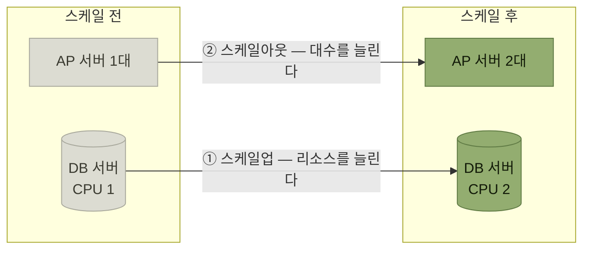

# 성능 테스트

> [품질 보증과 테스트](./README.md)

## 빠른 복습

- 성능 테스트는 **수행 효율성**을 검증하며, **단일 기능 성능 테스트 · 부하 테스트 · 장기 실행 테스트 · 확장성 테스트** 네 유형으로 나뉜다.
- **수행 효율성은 아키텍처와 그 위의 기능 전체 조합으로 달성**되므로, **아키텍트가 계획 수립부터 환경 구성·실행·해결까지 전반을 주도**하는 것이 효과적이다.
- **단일 기능 성능 테스트**는 대상을 **업무상 중요도 · 사용 빈도 · 처리 복잡도 · 데이터 처리량**으로 점수화해 고른다. 데이터 중심 업무 시스템에서는 데이터베이스 접근이 흔한 병목이지만, CPU·네트워크·외부 서비스·잠금도 함께 살핀다.
- **부하 테스트**는 **업무 피크를 재현**한다. 같은 부하 시나리오에 포함되는 핵심 기능은 먼저 단일 기능 성능과 명백한 병목을 확인해 두는 편이 진단에 유리하다.
- 부하 테스트의 목표치는 **응답 시간**과 **처리량**이며, 응답 시간은 평균만 보지 않고 **중앙값과 p95·p99 같은 백분위수**를 함께 본다. 처리량은 **업무 관점에서 명확히 측정 가능한 트랜잭션 수**로 잡는다.
- 부하 테스트의 튜닝은 **AP·DB 서버의 CPU 사용률 조합으로 병목을 좁히는 '가설 검증형' 접근**이다. **둘 다 낮은 경우가 오히려 위험하다.**
- **장기 실행 테스트**는 평상시 트래픽으로 오래 돌린다. **GC 로그와 힙 사용 추이**가 핵심 측정 항목이다.
- **확장성 테스트**는 부하를 점차 올리며 확장 동작을 본다. 클라우드라면 **오토스케일링이 예상대로 동작하는지**가 중요한 검증 포인트다.
- **대량 데이터 생성**은 수량뿐 아니라 **값의 분포**까지 실제와 유사해야 하고, **소량으로 먼저 검증**한 뒤 늘린다.

## 성능 테스트의 네 유형

성능 테스트는 시스템이 [품질 속성 중 하나인 수행 효율성](../3-아키텍처-설계/2-아키텍처-드라이버의-핵심-사항.md#수행-효율성--몰리는-시간에도-버티는가)을 만족하는지 검증하는 테스트다. 검증 관점에 따라 여러 유형으로 구분된다.

| 테스트 유형 | 설명 |
| --- | --- |
| **단일 기능 성능 테스트** | 개별 온라인 기능이나 배치 기능을 **단독으로 실행했을 때, 정해진 시간 내에 처리가 완료되는지** 검증 |
| **부하 테스트** | **예상되는 최대 부하 조건**에서 시스템의 **처리량, 응답 시간, 리소스 사용 효율** 등을 검증 |
| **장기 실행 테스트** | **장시간 연속으로 시스템 운영 시 성능이 안정적으로 유지되는지** 검증 |
| **확장성 테스트** | **부하 증가에 따라 리소스 확장이나 구성 변경이 가능한지**, 시스템이 유연하게 대응하는지 검증 |

*원서 [표 5.4] 성능 테스트 유형*

표를 읽는 법. 네 유형은 **시간축과 부하축으로 갈린다.** 위 둘은 **한 시점의 부하**를 보고, 아래 둘은 **시간이 흐르거나 부하가 늘어날 때**를 본다.

> **수행 효율성은 아키텍처와 그 위에 구현된 애플리케이션 기능의 전체 조합을 통해 시스템 전체에서 달성되는 특성**을 말한다. 따라서 **아키텍트와 애플리케이션 개발자가 협력해 테스트를 설계하고 구현**해야 한다.

저자의 경험상 **성능 테스트는 보통 아키텍트가 전반을 주도**한다. **테스트 계획 수립부터 환경 구성, 실행, 문제 발생 시 해결 방안 모색까지 모든 단계에서 광범위한 기술적 지식이 요구되기 때문**이다.

## 단일 기능 성능 테스트

**개별 기능이 성능 요건을 충족하지 못하면 시스템 전체의 성능도 충족하기 어렵다.** 단일 기능 성능 테스트는 **독립적으로 동작하는 개별 기능의 성능 적합성을 검증**한다.

### 테스트 대상 기능 선정

**실제 운영 환경을 가정한 대량의 데이터를 준비해야 하며, 테스트 측정에도 상당한 시간이 소요**된다. 그래서 **모든 기능을 테스트하는 것은 현실적으로 어려우므로 사전에 정한 기준에 따라 대상을 선별**한다.

- **업무상 중요도** — 해당 기능이 비즈니스에 얼마나 핵심적인지
- **사용 빈도** — 기능이 실제 얼마나 자주 호출되는지
- **처리 복잡도** — 알고리즘의 복잡성이나 처리 로직의 난이도
- **데이터 처리량** — 한 번에 처리하는 데이터의 크기

**이 평가 항목을 기반으로 점수를 산정하고, 기준치를 넘은 기능들을 1차 후보로 선정**한다. 이후 **아키텍트와 도메인 전문가의 최종 판단을 더해 성능 테스트 대상 기능을 확정**한다.

### 성능 목표치 설정

선정한 기능별로 목표치를 설정한다. **온라인 처리의 경우 일반적인 처리 패턴에 따라 기준값을 설정하고, 각 기능의 특성을 반영하여 조정하는 방식**이 좋다.

- 예를 들어 **등록·갱신 처리는 1초, 목록 조회 처리는 3초**를 목표로 설정하는 식이다.
- **배치 처리는 처리 건수, 로직의 복잡도 등을 기준으로 기능별 목표치를 개별적으로 설정**한다.

### 측정

**사전에 측정 방식과 절차를 정해두어야 한다.** 예를 들어 **처리 시간을 애플리케이션 로그에서 수집할지, 성능 측정 툴을 통해 측정할지**를 결정한다.

또한 **성능 목표치를 달성하지 못했을 경우를 대비해, 튜닝의 단서가 될 수 있는 정보를 얻을 수 있도록 미리 준비**한다. **로그를 상세 수준으로 출력하여 컴포넌트별 처리 시간을 기록하거나, SQL 실행 횟수 및 실행 시간을 함께 수집할 수 있도록 설정**하는 것이다.

- **SQL 실행 정보**는 **ORM에서 제공하는 로깅 기능**을 활용하거나 **데이터베이스 제품 자체의 성능 분석 툴**을 통해 확인할 수 있다.
- **클라우드 매니지드 데이터베이스**를 이용한다면 **Amazon RDS Performance Insights** 같은 성능 분석 서비스를 이용할 수도 있다.

[4장에서 성능 로그를 위한 유틸리티를 공통 기능으로 준비하라](../4-아키텍처-구현/4-애플리케이션-기반-구현.md#로깅)고 했던 이야기가 여기서 회수된다. **측정 준비는 테스트 시점이 아니라 기반 구현 시점의 일**이다.

### 튜닝

**원서가 다루는 데이터 중심 업무 시스템에서는 데이터베이스 접근이 흔한 병목**이며, 특히 두 패턴이 자주 나타난다. 다만 프로파일링과 분산 추적 없이 DB가 원인이라고 단정하지 말고 CPU 연산, 네트워크, 외부 서비스, 잠금 대기도 함께 확인한다.

| 패턴 | 어떻게 개선하는가 |
| --- | --- |
| **SQL 자체의 성능 저하** | **인덱스 추가나 SQL문 자체의 튜닝**을 통해 개선 |
| **하나의 처리에서 과도하게 많은 SQL이 호출됨** | **애플리케이션 로직을 재검토하여 호출 횟수를 줄이는 방식**으로 개선 |

표를 읽는 법. 위는 **한 번의 쿼리가 느린 것**이고, 아래는 **쿼리가 너무 많은 것**이다. 원인이 다르므로 손대는 곳도 다르다 — 아래 줄은 **SQL이 아니라 애플리케이션 코드**를 고쳐야 한다.

**SQL 분석과 개선은 일반적으로 DBA 팀의 역할이지만, 전담 DBA가 없거나 인력이 부족한 경우에는 애플리케이션 개발자가 직접 수행해야 할 수도 있다.** 이를 위해 **SQL 실행 계획을 획득하고 해석하는 절차를 시각화한 문서와 인덱스 생성 기준, SQL 작성 가이드 등 내부 규약을 사전에 정비해 두는 것이 좋다.**

### 대량 데이터 생성

**성능 테스트에 사용할 대량의 데이터를 생성하는 작업은 실제로 상당히 어렵고, 데이터의 품질이 테스트의 성패를 좌우하기도 한다.** 중요한 포인트는 셋이다.

1. **생성하는 데이터의 수량뿐만 아니라 값의 분포도 고려**해야 한다. **테이블의 특정 열이 취할 수 있는 값의 종류와 실제 값의 분포 상태가 실제 운영 데이터와 유사하지 않으면 테스트의 신뢰도가 떨어진다.** 특히 **검색 키가 될 수 있는 날짜, 금액, 처리자, 상태 등의 열은 주의**가 필요하다.
2. **대량 데이터 입력에는 상당한 시간이 소요되므로 처리 방식을 미리 검토**해야 한다. **일일이 `INSERT` 문을 실행하는 것보다 데이터베이스 기능을 활용해 CSV 파일에서 일괄 로드하거나, 저장 프로시저를 이용해 데이터베이스 프로세스 측에서 데이터를 생성하는 등의 방법을 사전에 검증**해 둔다.
3. **갑자기 많은 양의 데이터를 생성하여 사용하기보다는 먼저 소량의 데이터를 생성해 문제가 없는지 검증을 거치는 것이 좋다.** 대량 데이터를 입력한 후 성능 테스트 단계에서 문제가 발견되면 **데이터를 일괄 수정하거나 재입력하는 데 시간이 많이 소요되어 테스트 일정에 영향**을 미칠 수 있다.

> **테스트 데이터라고 해도 [시프트 레프트](./1-아키텍트와-품질-보증을-위한-작업.md#시프트-레프트) 방식으로 초기 단계부터 점검하는 것이 중요하다.**

## 부하 테스트

**업무 피크(최대 부하) 시점에 시스템 전체가 정해진 성능 목표를 달성할 수 있는지 검증**한다. 전제 조건이 있다.

> 따라서 **최소한 테스트 시나리오에 포함된 기능들은 튜닝을 포함한 단일 기능 성능 테스트가 이미 완료된 상태여야 하며, 이에 대한 테스트를 마쳤어야 한다.**

### 테스트 시나리오 선정

**피크 시점의 시스템 부하를 재현할 수 있는 시나리오를 구성**해야 한다. **실제 운영 상황을 완벽하게 재현하는 것은 어려우므로 최대한 유사한 부하 환경을 조성하는 것을 목표**로 삼는다.

3장의 경비 정산 사례연구에서는 **월말·월초에 신청과 승인이 집중되는 업무 특성**을 반영하여 시나리오를 구성한다.

| 시나리오 분류 | 사용자 | 시나리오 개요 |
| --- | --- | --- |
| **경비 정산 신청** | 신청자 | 1. 경비 정산 내용을 입력하고 증빙 자료 첨부 2. 내용을 확인한 뒤 신청 실행 |
| **상사 승인** | 상사 | 1. 승인 대상이 되는 경비 정산 신청서의 전체 목록 확인 2. 특정 신청서 조회 및 승인 |
| **회계 담당자 승인** | 회계 담당자 | 1. 승인 대상이 되는 경비 정산 신청서의 전체 목록 확인 2. 특정 신청서 조회 및 승인 |

*원서 [표 5.5] 부하 테스트의 시나리오 예시*

표를 읽는 법. 세 시나리오 모두 **사용자 역할이 다르다.** [유스케이스의 액터](../3-아키텍처-설계/1-아키텍처-설계의-주요-개념.md#유스케이스)가 그대로 부하의 축이 된다.

**실제 피크 시점에는 이외의 기능도 함께 사용될 수 있지만, 이들이 시스템에 미치는 부하는 상대적으로 미미하다고 간주해 부하 테스트 대상에서는 제외**한다. 다만 **부하 상태에서 주요 기능의 응답 속도가 허용 범위 내에 있는지 확인하기 위해, 일부 기능을 선택해 수동 조작으로 응답 시간을 측정하는 경우도 있다.**

### 성능 목표치 설정

주로 두 가지 지표를 사용한다.

| 지표 | 무엇인가 |
| --- | --- |
| **응답 시간**(response time) | **클라이언트가 시스템에 요청을 보낸 시점부터 시스템이 처리 후 응답을 반환할 때까지 걸리는 시간**. 시스템이 사용자 요청에 얼마나 신속하게 반응하는지를 보여준다 |
| **처리량**(throughput) | **단위 시간당 시스템이 처리할 수 있는 요청이나 트랜잭션의 수**. 시스템의 전반적인 처리 능력을 평가할 수 있다 |

표를 읽는 법. **응답 시간의 시작점과 끝점은 도구와 요구사항에 따라 다를 수 있으므로 측정 경계를 먼저 정의**해야 한다. 여기서는 부하 생성기가 HTTP 요청을 보내고 응답을 모두 받을 때까지를 응답 시간으로 본다. 화면 렌더링까지 포함한 사용자 체감 시간은 브라우저 기반 측정이나 RUM(Real User Monitoring) 등으로 별도 확인한다. 일부 문헌은 더 넓은 전체 완료 시간을 턴어라운드 타임이라 부르지만, 용어만으로 범위를 가정해서는 안 된다.

목표치는 이렇게 잡는다.

- **응답 시간은 단일 기능 성능 테스트에서 설정한 기능별 성능 목표치를 기준**으로 삼는다. 다만 **업무 피크 시에는 어느 정도의 성능 저하가 발생할 수 있으므로 비기능 요구사항을 반영해 조정**하는 것이 좋다.
- 평균만 보면 일부 매우 느린 요청의 영향으로 전형적인 경험을 파악하기 어렵고, 중앙값만 보면 꼬리 지연을 놓칠 수 있다. 그래서 **중앙값과 p95·p99 같은 백분위수**(percentile)**를 함께 사용**한다. **p95가 3초라면 전체 요청 중 95%가 3초 이내에 처리되었음**을 뜻한다. 다만 p95는 가장 느린 5%를 보여주지 않으므로 최대값·오류율과 함께 확인해야 한다.

처리량의 목표는 정의가 흔들리기 쉽다. **비기능 요구사항 문서에 '피크 시 최대 동시접속자 수 100'과 같은 조건이 명시된 경우도 있지만, 여기서 말하는 동시접속자 수가 로그인 사용자 수인지, 실제 처리 중인 사용자 수인지, 혹은 단위 시간당 요청 수나 트랜잭션 수를 말하는 것인지 정의가 모호하거나 근거가 불분명한 경우가 많다.**

> 이러한 상황에서는 **업무 관점에서 명확히 측정 가능한 트랜잭션 수를 기준으로 목표를 삼는 것이 효과적**이다. 경비 정산 시스템의 사례에서는 **'피크 시 시간당 약 1,000건의 신청 및 승인 처리'** 와 같이 **구체적이고 오해의 여지가 없는 수치를 기준으로 삼을 수 있다.**

이 경우 [표 5.5]의 시나리오에 따라 **시나리오별로 처리 완료(신청 완료, 승인 완료 등)의 건수를 정확히 측정하여 처리량을 평가**하게 된다. [품질 속성 시나리오에서 "결과 측정을 정량적으로 적어라"](../3-아키텍처-설계/2-아키텍처-드라이버의-핵심-사항.md#품질-속성-시나리오--어느-수준까지인지를-적는다)고 했던 그 요구가 여기서 실제 숫자가 된다.

### 부하 생성

**부하 테스트 시나리오에 따라 실제 부하는 Gatling과 같은 부하 테스트 툴을 이용해 생성**한다.

- **일부 툴은 브라우저와 서버 사이의 HTTP 트래픽을 기록해 요청 스크립트의 초안을 생성**한다. 이는 브라우저 렌더링이나 사용자 조작 자체를 재현하는 E2E 녹화와는 다르다. 생성된 스크립트는 동적 토큰·세션 상관관계를 처리하고 원하는 부하 패턴을 재현하도록 조정한다.
- **Gatling의 경우 Java, Kotlin, Scala 등 다양한 언어로 스크립트를 작성할 수 있다는 장점**이 있다.

### 측정

**부하 테스트 중 수집되는 응답 시간, 처리량, 오류 발생률 등의 주요 성능 지표는 테스트 툴이 제공하는 보고서 기능을 통해 확인**할 수 있다. Gatling 보고서에는 요청별 **Executions**(Total · OK · KO · %KO)와 **Response Time**(Min · 50th · 75th · 95th · 99th pct · Max · Mean · Std Dev)이 표로 나온다. **앞에서 말한 백분위수가 실제 보고서의 열로 등장한다.**

그러나 **테스트 결과를 제대로 분석하고 평가하려면 서버 측 리소스 상태도 함께 파악해야 한다.**

- **일부 유료 툴은 서버의 리소스 상태를 자동 수집하고 메트릭(성능 지표)을 통합하는 기능을 제공**하지만, 그렇지 않은 경우에는 **메트릭을 수집할 수 있도록 별도의 측정 환경을 준비**해 두어야 한다.
- **Linux에서는 `top`, `vmstat` 등의 명령어를, Windows에서는 성능 모니터를 통해 CPU 사용률, 메모리 사용량, I/O 사용량 등을 OS 또는 프로세스 단위로 수집**할 수 있다.
- **애플리케이션 서버나 데이터베이스 서버 등 미들웨어 계층에서도 메트릭을 수집**해야 한다. **활성 스레드 수, 연결 수** 등의 지표가 이에 해당한다.

### 튜닝 — 가설 검증형 접근

**응답 시간이나 처리량이 성능 목표치에 미치지 못할 경우 튜닝이 필요**하다. **서버나 미들웨어의 설정을 변경하여 해결되는 경우도 있지만, SQL이나 프로그램 로직을 수정해야 하는 등 애플리케이션의 개선이 필요한 경우도 있다.**

> **단일 기능 성능 테스트와는 달리, 부하 테스트에서는 일반적인 방법으로 문제 지점을 파악하기 어렵다.** 이에 **각 서버와 미들웨어에서 수집한 메트릭을 나란히 비교하면서, 가설을 세우고 이를 검증하는 과정을 반복하는 '가설 검증형' 접근이 필요**하다.

기본적인 접근은 **먼저 서버 단위의 CPU 사용률을 확인해 큰 틀에서 문제 영역을 구분하는 것**이다.

| AP 서버의 CPU 사용률 | DB 서버의 CPU 사용률 | 병목 예시 |
| --- | --- | --- |
| **낮음** | **높음** | 특정 SQL문이 매우 느려 DB 서버에 과부하 발생 · 개별로는 성능 문제가 없는 SQL이 다수 호출되어 DB 서버에 과부하 발생 |
| **높음** | **낮음** | 다중 루프 구조로 인해 불필요한 연산이 반복되어 CPU 사용률 급증 |
| **낮음** | **낮음** | 스레드 풀의 최대치가 낮아 스레드 대기로 인한 처리 지연 발생 · 연결 풀의 제한으로 인해 커넥션 대기 발생 · 애플리케이션의 배타적 처리로 인해 잠금(lock) 대기 발생 |

*원서 [표 5.6] 부하 테스트의 병목 사례*

표를 읽는 법. 마지막 줄이 이 표의 요점이다. **AP 서버와 DB 서버 모두 리소스 사용량이 낮아 여유로운 경우에도 방심하지 말고 자세히 살펴봐야 한다.** 이는 **어딘가에서 병목이 발생해 리소스를 제대로 활용하지 못하는 상황일 수 있기 때문**이다.

- **DB 서버가 병목인 경우** — 단일 기능 성능 테스트와 마찬가지로 **SQL 실행 정보를 수집해 분석**한다.
- **AP 서버가 병목인 경우** — 특히 **응답이 느린 요청에 대해 소스 코드 수준에서 구현 방식에 문제가 없는지 확인**해야 한다. 이때 **프로파일링 툴을 활용하면 원인을 파악하는 데 효과적**이다.
- **둘 다 낮은 경우** — **클라이언트 입장에서 각 미들웨어의 상한값 설정**(예: 웹 서버의 프로세스 수, 웹 애플리케이션 서버의 스레드 수 및 연결 수 등)**을 앞단부터 순차적으로 확인**해 보는 것이 좋다. 만약 이들에 문제가 없다면 **애플리케이션 단에서의 잠금 대기와 같은 병목 가능성을 염두에 두고 프로파일링 툴로 상세 분석**을 진행한다.

## 장기 실행 테스트

**시스템이 장시간 연속으로 가동되는 상황에서도 성능을 안정적으로 유지할 수 있는지 검증**한다.

- **테스트 시나리오 선정** — **실제 서비스 환경에서 사용자 수가 많거나 사용 빈도가 높은 유스케이스를 중심으로 시나리오를 선정**하는 것이 바람직하다. **업무 피크 시점과 일반적인 트래픽 추이가 크게 다르지 않다면, 기존의 부하 테스트 시나리오를 기반으로 부하량과 실행 시간만 조정하여 활용**할 수 있다.
- **부하 생성** — 부하 테스트에 사용한 툴을 활용해 스크립트를 준비한다. **이때 부하량은 업무 피크 시점이 아닌 평상시 평균 트래픽 수준으로 설정**한다. 실행 시간은 캐시·커넥션·메모리 누수처럼 확인하려는 위험과 실제 연속 가동 주기를 기준으로 정한다. 원서는 정기 재부팅 시스템에는 약 24시간, 무중단 시스템에는 3일 이상을 예로 들지만, 이는 보편적인 합격 기준이 아니라 시스템 특성에 맞춰 조정할 시작점이다.

### 측정과 튜닝 — 메모리를 본다

측정 항목은 부하 테스트와 유사하게 응답 시간, 처리량 등을 포함하지만, 장기 실행 테스트에서는 다음이 특히 중요하다.

- **GC**(garbage collection) **기반 시스템**(JVM 등)의 경우 **GC 관련 로그 수집이 누락되지 않아야** 한다.
- 장기 실행 중에는 **메모리 누수뿐 아니라 커넥션·스레드·파일 디스크립터 고갈, 로그·디스크 증가 같은 누적 자원 문제**도 확인해야 한다. GC 기반 시스템에서는 특히 **힙 사용 추이, GC 시간 증가, OutOfMemoryError 발생** 등을 관찰한다.

**GC 로그 분석 결과 메모리 누수가 의심될 경우, 메모리가 해제되지 않는 원인을 파악**해야 한다. **힙 덤프와 메모리 프로파일러로 객체의 보유 경로와 비정상적인 증가를 추적**하고, 불필요한 캐싱이나 참조 유지 로직을 점검한다. 스레드 덤프는 잠금·대기·스레드 누적을 분석하는 자료이며 힙 객체 추적을 대신하지 않는다. 힙 크기 조정은 정상적인 작업 집합이 부족한 경우에는 도움이 되지만, 누수 자체의 해결책은 아니므로 원인 제거와 구분한다.

## 확장성 테스트

**시스템에 부하가 증가했을 때, 시스템을 확장함으로써 이에 잘 적응할 수 있는지를 검증**한다.

- **테스트 시나리오 선정과 부하 생성** — **부하 테스트와 동일한 시나리오를 사용하며, 부하량을 점차 증가시키면서 시스템이 어떻게 동작하는지 확인**한다.
- **클라우드 환경에서는 부하 상황에 따라 자동으로 시스템을 확장하는 오토스케일링 구성을 사용하는 경우가 많다.** 그런 경우에는 **오토스케일링이 부하 변동에 맞춰 예상대로 적절하게 동작하는지도 중요한 검증 포인트**가 된다.

### 측정과 튜닝

**측정은 부하 테스트와 같은 방식으로 진행**한다. 다만 기대를 조정해야 한다.

> **스케일업이나 스케일아웃을 통해 시스템을 확장하더라도, 처리량은 오버헤드로 인해 선형적으로 증가하지는 않는다.** 만약 **예상보다 빨리 한계 성능에 도달한다면, 시스템 내부 어딘가에 병목 현상이 발생했을 가능성**이 있다.

**일반적으로는 데이터베이스 서버 등의 공유 리소스에서 병목 현상이 가장 먼저 나타난다.** 이런 경우 **DB 서버의 파라미터 값을 조정하는 튜닝이나 SQL 쿼리 개선** 등을 통해 문제를 해결할 수 있다.

### 스케일업과 스케일아웃

**시스템의 구성을 확장하여 처리 능력을 높이는 것을 시스템 스케일링**이라고 한다. 방법은 크게 둘이다.

*[그림 5.12] 스케일업과 스케일아웃 — 원서 그림에서 ①이 DB 서버의 리소스 확장, ②가 AP 서버의 대수 증가다*

| 방식 | 무엇을 늘리는가 | 특징 |
| --- | --- | --- |
| **스케일업**(①) | **서버의 리소스**(CPU, 메모리, 디스크 용량 등)**를 추가**해 시스템을 확장 | **수직 스케일링**이라고도 한다. **단일 서버의 성능을 높이는 데 유용**하지만, **서버의 물리적 한계나 운영체제의 제약으로 확장 가능한 리소스의 크기에는 한계**가 있다 |
| **스케일아웃**(②) | **서버 대수를 늘려 부하를 분산** | **수평 스케일링**이라고도 한다. 여러 대에 트래픽을 분산할 수 있으며, 상태 공유·헬스 체크·장애 전환까지 올바르게 설계하면 가용성 향상도 기대할 수 있다 |

표를 읽는 법. **스케일아웃은 대수를 늘릴 수 있지만, 상태 공유와 일관성·운영 복잡성이라는 비용이 따른다.** RDBMS도 리드 복제본, 샤딩, 분산 SQL 같은 방식으로 수평 확장할 수 있으나 읽기·쓰기 경로와 일관성 요구에 따라 제약이 다르다. 따라서 스케일업과 스케일아웃 중 하나를 관행처럼 고르지 말고, 병목 지점과 데이터 일관성·장애 복구 요구를 기준으로 결정한다.

[3장에서 "모놀리식은 단일 데이터베이스에서 병목이 발생하기 쉽다"](../3-아키텍처-설계/3-시스템-아키텍처-선정.md#모놀리식과-분산형)고 했던 이야기와, [CQRS로 읽기와 쓰기를 나누는 이야기](../4-아키텍처-구현/4-애플리케이션-기반-구현.md#cqrs--명령과-쿼리를-나눈다)가 이 문단에서 만난다. **읽기를 떼어낼 수 있으면 DB도 옆으로 늘릴 수 있다.**

## 핵심 정리

- 네 성능 테스트 유형은 고정된 직렬 단계가 아니다. **단일 기능·피크 부하·장기 안정성·확장성 중 시스템 위험에 필요한 유형을 선택하거나 병행**한다. 다만 부하 시나리오의 핵심 기능처럼 원인 분리를 위해 선행 검증이 필요한 경우에는 그 의존성을 계획에 명시한다.
- 대상 기능은 **중요도 · 빈도 · 복잡도 · 처리량**으로 점수화해 고르고, 최종 판단에 **도메인 전문가**가 함께 참여한다.
- 데이터 중심 업무 시스템에서는 **DB 접근이 흔한 병목**이며, **느린 SQL**과 **너무 많은 SQL**은 고치는 곳이 다르다. CPU·네트워크·외부 서비스·잠금도 측정으로 배제한다.
- 부하 테스트의 목표치는 **응답 시간(중앙값·p95·p99)** 과 **처리량(업무 트랜잭션 수)** 이다. "동시접속자 수" 같은 모호한 정의를 그대로 쓰지 않는다.
- 부하 테스트의 튜닝은 **CPU 사용률 조합으로 병목을 좁히는 가설 검증**이며, **둘 다 낮은 경우가 가장 조심할 상황**이다.
- 장기 실행 테스트는 **평상시 트래픽과 실제 연속 가동 주기**를 반영하고, **GC·힙뿐 아니라 스레드·커넥션·파일 디스크립터 같은 누적 자원**을 본다.
- 확장성 테스트에서 **처리량은 선형으로 늘지 않는다.** 예상보다 빨리 한계가 오면 **공유 리소스, 특히 DB**를 본다.
- **스케일업에는 물리적 한계가 있고 스케일아웃에는 상태 공유와 일관성 비용**이 있다. RDBMS도 읽기 복제·샤딩·분산 SQL로 확장할 수 있으므로 요구에 맞는 방식을 고른다.
- 대량 데이터는 **분포까지 실제와 닮아야** 하고, **소량으로 먼저 검증**한 뒤 늘린다.

## 함께 읽기

- [수행 효율성 — 이 절이 검증하는 품질 속성](../3-아키텍처-설계/2-아키텍처-드라이버의-핵심-사항.md#수행-효율성--몰리는-시간에도-버티는가)
- [기능 테스트 자동화 — 기능이 맞는지 보는 쪽의 이야기](./2-기능-테스트-자동화.md)
- [로깅 — 성능 측정의 준비가 기반 구현 단계의 일이었던 이유](../4-아키텍처-구현/4-애플리케이션-기반-구현.md#로깅)
