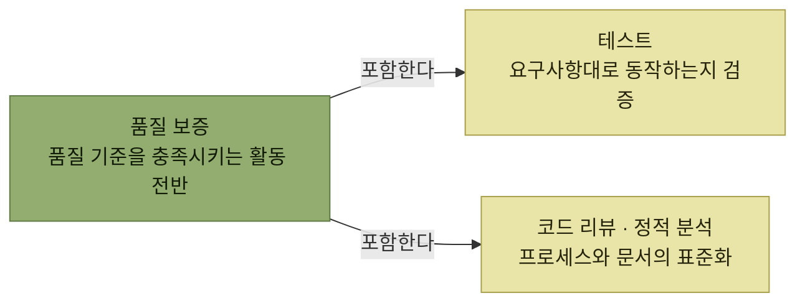

# 품질 보증과 테스트

> [아키텍트 첫걸음](../README.md)

## 만든 것이 요구를 만족하는지 어떻게 보증하는가

4장이 **아키텍처를 코드로 만드는 장**이었다면, 5장은 그 결과물이 **기대한 품질을 충족하는지 확인하고 보증하는 장**이다. 확인의 기준은 3장에서 골라둔 것이다 — [아키텍처 드라이버로 정리한 품질 속성](../3-아키텍처-설계/2-아키텍처-드라이버의-핵심-사항.md#품질-속성)이 곧 테스트의 목록이 된다.

*품질 보증은 테스트보다 넓다. 테스트는 그 안의 한 갈래다*

## 목차

1. [아키텍트와 품질 보증을 위한 작업](./1-아키텍트와-품질-보증을-위한-작업.md)
2. [기능 테스트 자동화](./2-기능-테스트-자동화.md)
3. [성능 테스트](./3-성능-테스트.md)

## 함께 읽기

- [V 모델](../2-소프트웨어-설계/1-소프트웨어-개발-프로세스.md#v-모델) — 설계 단계와 테스트 레벨이 마주 보는 구조가 이 장의 전제다.
- [CI](../4-아키텍처-구현/6-구성-관리-및-CI-CD.md#ci--빌드와-테스트를-자동화한다) — 이 장의 테스트가 실제로 자동 실행되는 자리.
