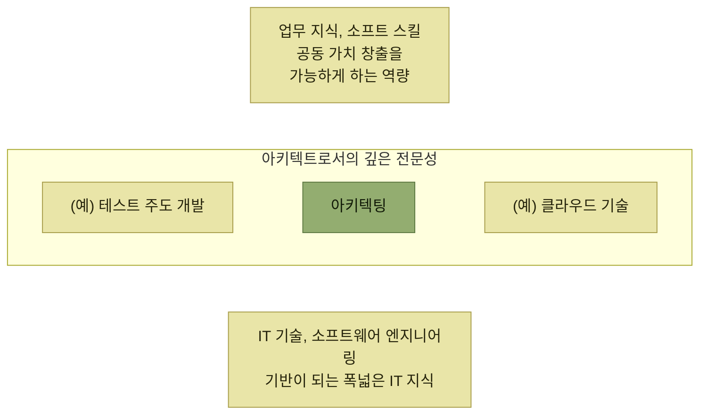

# 아키텍트로 성장하려면

> [아키텍트의 학습과 성장](./README.md)

## 빠른 복습

- 아키텍처를 정의하고 구축해 나가는 활동, 곧 **'아키텍팅'이 아키텍트의 핵심 미션**이다.
- 아키텍트는 **아키텍처를 전문으로 다루는 스페셜리스트이면서, 소프트웨어 엔지니어링 전반의 지식과 경험을 갖춘 제너럴리스트**여야 한다.
- 깊은 전문성 하나 + 폭넓은 지식이 **T형 인재**, 전문 분야 둘 이상 + 폭넓은 지식이 **π형 인재**다.
- 이 노트는 인재상을 **파르테논 신전에 빗댄 그림**으로 정리한다. 아래에 **폭넓은 IT 기반 지식**, 기둥으로 **깊은 전문성**, 위에 **업무 지식과 소프트 스킬**이 놓인다. 이는 공인된 인재 유형 명칭이 아니라 내용을 이해하기 위한 시각적 비유다.
- 기반 기술을 넓힌 뒤 아키텍팅 전문성을 깊게 만들되, **업무 지식과 소프트 스킬은 초기부터 병행**한다.
- 원서는 **기술 기여 역량 = 기술력 × 소프트 스킬**이라는 곱셈 비유를 사용한다. 두 역량 중 하나가 부족하면 기술을 가치로 연결하기 어렵다는 뜻이지 실제 역량을 계산하는 공식은 아니다.
- 원서가 강조하는 소프트 스킬의 중심은 **직책과 무관하게 역할과 책임을 이해하고 주도적으로 행동하는 리더십**이다. 리더십에는 의지뿐 아니라 소통·조율·의사결정 행동도 포함된다.
- 원하지 않은 업무에서도 배울 점을 찾되, **기회비용과 과도한 부담을 무시하지 않고** 커리어 방향을 관리자와 1:1로 지속적으로 조율한다.

## 아키텍트의 인재상

지금까지 살펴본 것처럼 **아키텍처를 정의하고 구축해 나가는 일련의 활동, 즉 '아키텍팅'은 아키텍트의 핵심 미션**이다. 나아가 실제 프로젝트에서는 [개발 프로세스 표준화](../4-아키텍처-구현/2-개발-프로세스-표준화.md)나 [품질 보증](../5-품질-보증과-테스트/1-아키텍트와-품질-보증을-위한-작업.md) 등 다양한 분야에서도 **아키텍트가 중심적인 역할을 수행**하게 된다.

> 이처럼 아키텍트는 **아키텍처를 전문적으로 다루는 스페셜리스트인 동시에, 소프트웨어 엔지니어링 전반에 대한 지식과 경험을 갖춘 제너럴리스트**여야 한다.

| 인재상 | 무엇을 갖춘 사람인가 |
| --- | --- |
| **T형 인재** | **하나의 전문 분야(깊이) × 다양한 분야에 대한 폭넓은 식견(넓이)**. 자신의 강점인 특정 전문 기술을 바탕으로 실무 능력까지 갖추었으며, 다양한 분야에 대해 폭넓은 식견을 지닌 인재 |
| **π형 인재** | **두 가지 이상의 전문 분야 × 폭넓은 식견**. 두 가지 이상의 전문 기술을 보유하고, **이들을 유기적으로 연결해 시너지를 창출**할 수 있는 폭넓은 식견을 지닌 인재 |

*원서 [그림 6.1] T형 인재와 π형 인재를 표로 옮겼다*

표를 읽는 법. 알파벳 모양이 그대로 구조다. **T의 가로줄이 폭넓은 식견, 세로줄이 전문 분야**이고, **π는 세로줄이 둘**이다. 아키텍트가 되는 경로는 이 모양을 만들어가는 순서로 설명된다.

1. **아키텍팅을 전문 분야로 삼으려면, 먼저 IT 기술과 소프트웨어 엔지니어링 전반에 대한 폭넓은 기반 지식과 실무 경험**을 갖추어야 한다.
2. 다음으로 **아키텍팅 관련 방법론을 학습하고 실제 업무 경험을 통해 해당 역량을 강화**해 나간다.
3. 또한 다양한 기술 영역에서 지식과 기술을 넓혀가며 **자신만의 전문 분야를 하나 더 갖추는 것**도 중요하다. 그러면 **아키텍처 설계 역량이 더 견고해질 뿐 아니라, 서로 다른 지식들이 유기적으로 연결되면서 더 많이 응용할 수 있게 되고 시너지 효과도 기대**할 수 있다.

여기에 하나가 더 붙는다. **아키텍트가 비즈니스에 실질적으로 기여하려면 기술적 전문성뿐 아니라 비즈니스 전반에 대한 이해가 필요**하다. **다양한 이해관계자들과 협력해 공동의 가치를 창출하는 과정에서 중요한 역할을 하기 때문**이다. 그래서 **도메인 지식뿐 아니라 커뮤니케이션과 리더십 같은 소프트 스킬, 즉 협업과 가치 전달에 필요한 비기술 역량을 함께 함양**해야 한다.

*[그림 6.2] 아키텍트의 인재상을 신전 구조에 빗댄 이 노트의 시각적 비유 — '파르테논 신전형'은 일반적으로 통용되는 인재 유형 명칭이 아니다*

기둥이 여럿이라는 점이 π형 인재와 이어지고, **위와 아래의 두 판이 그 기둥을 받치는 폭넓은 기반과 그것을 가치로 바꾸는 역량**이다.

## 성장의 길

> 아키텍트로서 폭넓은 지식을 쌓고 전문성을 깊이 다지는 일은 결코 하루아침에 이루어지지 않는다. **매일 꾸준한 학습과 성실한 자세로 한 걸음씩 나아가는 과정**이 필요하다.

### 기본 기술 습득

**아키텍트라는 직무에 관심을 두고 아키텍팅 업무를 맡고 싶다고 하더라도, IT 기술과 소프트웨어 엔지니어링의 기초 역량이 부족하다면 이 역할이 주어지기는 쉽지 않다.** 결국 **모든 일은 기본이 가장 중요**하다.

| 기술 분야 | 목표 수준 |
| --- | --- |
| **프로그래밍 언어** | 최소 한 가지 언어에 능통하여 **타인을 지도할 수 있는 정도**의 이해 · 여러 언어를 실무에서 활용 가능한 수준 |
| **웹 애플리케이션 설계 및 개발** | 웹 기술의 기본 원리와 **웹 애플리케이션 서버 구조** 이해 · 특정 웹 프레임워크의 특징을 파악하고 **표준 기능을 활용하거나 확장하여 공통 기능 개발 가능** |
| **보안** | 웹 애플리케이션 개발에 필요한 **기본적인 보안 지식** 보유 · 관련 보안 대책을 적용 가능 |
| **데이터베이스** | **RDBMS의 구조 이해를 바탕으로 효율적인 SQL문 작성 및 튜닝 가능** · NoSQL 등 비관계형 데이터베이스에 대한 기초 지식 보유 |
| **객체지향 설계** | 객체지향 설계의 **핵심 원칙과 실무 적용 방법**에 대한 이해 · 상황에 따라 적절한 **디자인 패턴 적용 가능** |
| **프런트엔드** | JavaScript, Dart 등의 언어로 프런트엔드 개발 가능 · 모던 프레임워크 활용 역량 · **SPA 개발 경험** |
| **개발 프로세스** | **워터폴과 애자일**의 개요 및 차이점 이해 · **스크럼** 등 애자일 방법론 실무 경험 |
| **인프라** | 네트워크 및 운영체제(OS)에 대한 기본 지식 · **PowerShell, bash** 등을 이용한 셸 스크립트 작성 가능 |
| **클라우드** | **3대 클라우드 서비스**(AWS, Azure, GCP) 중 하나 이상의 환경에서 개발 경험 · 주요 서비스에 대한 구조 및 활용 이해 |

*원서 [표 6.1] 주요 기술 분야와 목표 수준*

표를 읽는 법. 목표 수준의 표현을 눈여겨본다. "안다"가 아니라 **"타인을 지도할 수 있는", "튜닝 가능한", "확장하여 공통 기능을 개발 가능한"** 이다. [4장에서 아키텍트가 실제로 하던 일](../4-아키텍처-구현/4-애플리케이션-기반-구현.md)이 그대로 기준으로 적혀 있는 셈이다.

> 물론 **이 모든 항목에서 완벽한 수준에 도달해야만 아키텍트가 될 수 있다는 말은 아니다.** 어떤 아키텍트든 강점과 약점이 있기 마련이며, **자신에게 부족한 부분은 아키텍트로서 성장하는 과정에서 꾸준히 채워나가는 자세가 가장 중요**하다.

### 아키텍팅 습득

**숙련자로서 기초를 다지고 프로젝트에서 성과를 내기 시작하면, 점차 아키텍팅과 관련된 기술 업무를 맡게 될 것**이다. **선배 아키텍트의 지시와 조언을 받으며 과제를 수행해 나가면서 실무를 통해 경험을 하나씩 쌓아갈 수 있다.**

> **이 책이나 추천 도서를 통해 학습하는 것도 분명 도움이 되지만, 현장에서 얻는 실전 경험이야말로 아키텍트를 가장 크게 성장시키는 요소**다.

이렇게 실무 경험이 차곡차곡 쌓이다 보면 **단순한 기술 수행을 넘어 상황에 맞는 설계 판단을 내리는 감각**이 생기기 시작한다. **다양한 이해관계자와 요구사항 속에서 균형 잡힌 의사결정을 내려야 하는 순간들도 점차 늘어난다.** 이러한 축적된 경험은 **아키텍트로서의 직관과 인사이트를 기르는 데 큰 밑거름**이 된다.

### 업무 지식과 소프트 스킬 습득

[그림 6.2]에서는 업무 지식과 소프트 스킬이 상단에 있었지만, **이 능력들은 아키텍처 역량을 모두 습득한 후에 배우는 것이 아니다.** **기본 기술 습득과 마찬가지로 초기부터 꾸준히 개발해야 할 필수 역량**이다.

- **업무 지식**은 기술자 입장에서 소홀하기 쉽지만, **자신이 개발하는 시스템이나 프로덕트가 다루는 업무와 비즈니스에 대한 이해는 반드시 갖추어야 할 요소**다. 이를 위해 **시간을 들여 학습하고, 관련 스터디나 사용자 업무 견학 기회가 있다면 적극적으로 참여**하는 것이 좋다.
- **소프트 스킬** 역시 매우 중요하다. **아무리 뛰어난 기술력을 갖추었더라도 그것이 시스템이나 프로덕트의 가치로 이어지지 않는다면 의미를 갖기 어렵다.**

| 기술력 | × 소프트 스킬 | = 기술 기여 역량 |
| --- | --- | --- |
| 기술 지식 · 스킬 · 경험 · 노하우 | 리더십 · 커뮤니케이션 능력 · 팀 빌딩 · 문제 해결력 · 제안 능력 | 공동 가치 창출 · 매력적인 소프트웨어 · 고객 가치 제공 · 비즈니스 기여 |

*원서 [그림 6.3] 기술 기여 역량*

표를 읽는 법. 가운데의 **곱셈은 두 역량의 상호작용을 강조하는 비유**다. **기술력을 사용자와 고객의 실질적인 가치로 연결하고 비즈니스에 기여하는 역량**을 이 책은 **'기술 기여 역량'** 이라 부른다. 수치 계산식이나 어느 한쪽이 실제로 0이 된다는 뜻으로 해석하지 않는다.

> 원서가 강조하는 소프트 스킬의 중심은 **리더십**이다. 여기서는 **자신에게 주어진 역할과 책임을 이해하고 올바른 목표를 설정해 주도적으로 행동하는 태도와 실천**을 뜻한다. 공식 직책이 없어도 발휘할 수 있다.

리더십을 갖춘 사람은 **목표 달성을 위해 동료들과 효과적으로 소통하고, 혼자서는 해결하기 어려운 문제도 팀의 힘으로 풀어낼 수 있다.** 우선은 **일상 업무 속에서 리더십을 실천하는 것이 중요**하고, 그 과정에서 커뮤니케이션 능력이나 문제 해결력 등 부족한 부분이 있다면 관련 서적이나 교육을 통해 보완하면 된다. 특히 **논리적 사고와 논리적 글쓰기는 체계적으로 공부해 두면 앞으로도 큰 도움**이 된다.

## 일을 대하는 방식

**아키텍트로서의 커리어 성장과 현재 맡고 있는 업무의 내용이 잘 맞아떨어지는 것이 가장 이상적이지만, 현실은 그렇지 않을 때도 많다.** 관리자 입장에서는 **개인의 커리어 목표와 조직의 목표 사이에서 균형을 맞추며 최적의 인력 배치를 시도**하겠지만, 때로는 **본인이 희망하지 않았던 업무를 맡게 되는 경우도 생긴다.**

> 이런 경우에도 새로운 분야에서 배울 점을 찾는 자세는 도움이 된다. 아키텍트는 **스페셜리스트이자 제너럴리스트이기 때문에 다양한 지식과 경험을 연결해 활용**할 수 있다. 다만 모든 업무가 자동으로 유익해지는 것은 아니므로 성장 목표, 기회비용, 업무 강도를 함께 점검한다.

**새로운 분야를 배울 수 있는 기회로 삼아, 그 업무를 통해 어떤 인사이트를 얻고 어떤 역량을 기를 수 있을지 고민해 보는 것이 생산적인 접근**이다. 저자의 경험이 예시로 붙는다.

- 어느 프로젝트에 **아키텍트로 참여할 예정이었으나, 여러 사정으로 프로젝트 중반부터 시스템 엔지니어(SE) 역할을 맡게** 되었다.
- **처음에는 동기 부여가 쉽지 않았고 익숙하지 않은 분야였기에 많은 시행착오**를 겪었다.
- 하지만 **책에서 배운 이론이 아닌 현장에서만 배울 수 있는 생생한 지식을 직접 체득**할 수 있는 기회가 되었다. 특히 **애플리케이션 관점에서 아키텍처와 시스템 기반이 어떻게 설계되어야 하는지를 다시금 깊게 고민**해 보는 계기가 되었고, **지금 돌이켜보면 이 시기의 경험은 아키텍트로서의 시야와 인사이트를 넓혀준 소중한 자산**이 되었다.

물론 조건이 붙는다. **궁극적으로 추구하는 커리어에서 너무 벗어나지 않도록 관리자와 정기적인 1:1 미팅 등을 통해 지속적으로 소통할 필요가 있다.**

## 핵심 정리

- 아키텍트는 **스페셜리스트이면서 제너럴리스트**다. 깊이와 넓이를 **T형 · π형**으로 설명하고, 이 노트는 전체 인재상을 **신전 구조에 빗대어 시각화**했다.
- 기본이 먼저다. [표 6.1]의 목표 수준은 "안다"가 아니라 **"가르칠 수 있다 · 튜닝할 수 있다 · 확장할 수 있다"** 로 적혀 있다.
- 아키텍팅은 **선배의 조언 아래 실무로 익힌다.** 책보다 **현장 경험이 가장 크게 성장시킨다.**
- **업무 지식과 소프트 스킬은 나중이 아니라 초기부터** 기른다.
- **기술 기여 역량 = 기술력 × 소프트 스킬**은 상호작용을 강조하는 비유다. 두 역량을 함께 길러야 기술을 가치로 연결하기 쉽다.
- 리더십은 **직책이 없어도 발휘할 수 있는 태도와 실천**이다.
- 원하지 않은 업무에서도 배울 점을 찾되 **기회비용과 부담을 점검**하고, 커리어 방향은 **1:1로 계속 조율**한다.

## 함께 읽기

- [아키텍트의 자질 — 1장이 나열한 자질을 이 절은 기르는 순서로 다시 말한다](../1-아키텍트가-하는-일/6-아키텍트의-자질.md)
- [아키텍트 — 역할과 유형의 정의](../1-아키텍트가-하는-일/4-아키텍트.md)
- [다음 절 — 그 역량을 실제로 어떻게 학습하는지](./2-효과적인-학습-방법.md)
