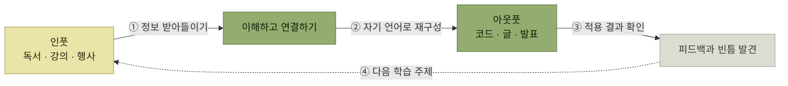

# 효과적인 학습 방법

> [아키텍트의 학습과 성장](./README.md)

## 빠른 복습

- 원서는 학습을 **인풋과 아웃풋의 순환**으로 설명한다. 인풋은 **독서나 강의처럼 외부 정보를 받아들이는 활동**, 아웃풋은 **샘플 코드 작성 등 배운 내용을 실제로 활용하는 활동**이다.
- 인풋 수단은 **도서 · 교육과 세미나 · 자격증 · 기술 컨퍼런스 · SNS**다. 각 방식의 특성을 이해하고 **목적에 따라 조합**한다.
- 책은 저자가 중요하게 여기는 정보원이며, 최신성은 웹에 밀릴 수 있지만 **자신의 속도에 맞춰 체계적으로 학습**할 수 있다. 목적에 맞는 책을 골라 필요할 때 반복해서 읽는다.
- 좋은 책을 찾는 가장 쉬운 방법은 **선배나 동료의 추천**, 그리고 **좋은 책의 참고 문헌을 따라가는 것**이다.
- **자격증**의 이점은 **시험 일정에 맞춰 학습 계획을 세울 수 있다는 점**과 **'합격'이라는 명확한 결과물이 동기 부여로 이어진다는 점**이다.
- 아웃풋 수단은 **독서 맵 · 샘플 코드 작성 · 기술 글 작성과 공유 · 발표**다.
- **기술 글쓰기**는 지식 공유를 넘어 **자신의 이해도를 검증하고 심화하는 학습 방식**이다. 공개가 동기가 될 수도 있지만, 비공개 초안과 동료 피드백도 같은 학습 목적에 활용할 수 있다.
- **발표**는 진입 장벽이 높지만 성장이 크다. **사내 5분 라이트닝 토크부터** 시작해 단계적으로 올린다.

## 인풋

> 원서는 학습을 **인풋과 아웃풋의 균형**으로 설명한다. 핵심은 정해진 비율을 맞추는 것이 아니라, 받아들인 정보를 실제 문제에 적용하고 그 결과에서 드러난 빈틈을 다음 학습으로 돌려보내는 것이다.

이 절에서 **독서나 강의처럼 외부 정보를 받아들이는 학습 활동을 '인풋'**, **샘플 코드 작성 등 배운 내용을 실제로 활용하는 활동을 '아웃풋'** 으로 구분한다.

*인풋과 아웃풋은 한 번씩 수행하고 끝나는 두 목록이 아니라, 적용 결과를 다음 학습으로 돌려보내는 순환이다*

### 도서

원서는 **책을 풍부한 정보원**으로 평가한다. **출간까지 시간이 걸리는 만큼 웹 매체에 비해 최신 정보 반영은 느릴 수 있지만, 독자 자신의 속도에 맞춰 체계적으로 학습할 수 있다는 점은 큰 장점**이다. 빠르게 변하는 기술은 공식 문서와 릴리스 노트로 최신성을 보완한다.

> 다양한 분야를 폭넓게 접하는 다독도 의미가 있지만, **실제로 활용 가능한 지식을 쌓으려면 좋은 책을 선택해 반복해서 읽는 것이 중요**하다. 독서법의 고전인 『생각을 넓혀주는 독서법』에서는 **좋은 책은 한 번 읽어서는 온전히 이해하기 어렵기 때문에 분석적으로 여러 번 읽어야 한다**고 강조한다.

> **'분석하며 읽기'란 읽은 내용이 온전히 자기의 피와 살이 될 때까지 철저히 읽어내는 것이다.**

**좋은 책을 찾는 가장 쉬운 방법은 선배나 동료에게 추천을 받는 것**이다. 또한 **좋은 책이 참고한 서적 역시 좋은 책일 가능성이 높으니, 훌륭한 책의 참고 문헌을 따라가는 방식도 유용**하다.

### 교육 및 세미나

**짧은 시간 안에 지식과 기술을 집중적으로 습득하고 싶다면 교육이나 세미나를 활용하는 것이 효과적**이다. 최근에는 **인프런, 패스트캠퍼스, 엘리스, 생활코딩** 등 국내 개발자들을 위한 온라인 플랫폼도 다양해졌으며, **여유 시간을 활용해 자기 주도적으로 학습하기에 적합한 환경**이 조성되고 있다.

- **강의를 듣는 것에 그치지 않고, 수강 후에는 수강자 나름대로 주요 개념을 요약해 두고 복습해 보는 습관**을 들이면 기억에 오래 남는다.
- **강사에게 적극적으로 질문하는 태도**도 중요하다. 예를 들어 **'오늘은 질문을 최소 몇 개는 하겠다'는 식으로 질문 할당량을 스스로 정해 두면 더 집중**할 수 있다.

질문 할당량이라는 표현이 재미있다. **인풋을 아웃풋으로 바꾸는 장치를 강의 안에 미리 심어두는 것**이다.

### 자격증 취득

**IT 자격증은 지식을 체계적으로 습득하고 학습 성취도를 확인할 수 있는 효과적인 인풋 방식**이다.

- 원서는 기반 지식을 체계화하는 선택지로 **정보처리기사**를 제안하고, 전문 분야에 따라 **데이터아키텍처 전문가(DAP), 정보보안기사** 등을 예로 든다. 자격증은 필수 경로나 실무 역량의 대체물이 아니므로 현재 역할과 학습 목표에 맞을 때 선택한다.
- **AWS, Microsoft Azure, Google Cloud 등 클라우드 공급업체의 자격증**은 각 플랫폼의 서비스 구조와 운영 개념을 체계적으로 훑는 수단이 될 수 있다. 시험 학습만으로 설계·운영 경험이 생기는 것은 아니므로 샘플 구축, 장애 대응 연습, 비용·보안 검토를 병행한다.

> 자격증 학습의 이점은 **시험 일정에 맞춰 학습 계획을 세울 수 있다는 점**, 그리고 **'합격'이라는 명확한 결과물이 동기 부여로 이어진다는 점**이다. **목표와 기한이 뚜렷하면 학습의 집중도를 높이기가 더욱 쉬워진다.**

### 기술 컨퍼런스와 개발자 행사

**업계, 업종, 기업의 경계를 넘어 다양한 사람들의 이야기를 들을 수 있는 소중한 기회**다. **실무 최전선에서 활약하는 아키텍트가 최신 기술을 소개하는 세션은 물론, 비슷한 연차의 개발자가 실무 경험을 공유하는 발표에서도 유용한 정보를 얻을 수 있다.** 무엇보다 **기술자로서의 성장 의지를 북돋는 새로운 자극**이 될 수 있다.

- **AWS re:Invent** — AWS의 연례 최대 행사로, **신규 서비스 발표와 함께 다양한 실전 아키텍처 및 운영 사례**가 공유된다.
- **Microsoft Ignite** — Azure, Microsoft 365 기반 기술 전반을 다루는 행사로, **IT 관리자부터 개발자, 데이터 분석가까지 폭넓은 타깃**을 대상으로 한다.
- **Google Cloud Next** — GCP를 중심으로 한 **데이터, AI, DevOps 기술**을 조명하는 행사다.

**조직 내부의 기술 커뮤니티에서 열리는 스터디에 참여하는 것도 도움**이 된다. **외부에 공개되지 않는 실무 기술 정보를 접할 수 있는 경우도 있고, 개발자 간 수평적 유대 관계를 형성하는 기회**가 되기도 한다.

### SNS

**시의성 높은 정보를 빠르게 얻을 수 있는 강력한 도구**다. **오픈소스의 새 버전 출시, 신규 기능 소개, IT 컨퍼런스 개최 소식, 신간 기술서 정보** 등 실용적인 정보가 매일 타임라인에 공유된다. **개발자 커뮤니티나 기술 전문가 계정을 팔로우하면 최신 동향을 효과적으로 파악**할 수 있다.

**과도한 사용과 확인되지 않은 정보의 확산에 주의**해야 한다. 정보 수집 목적을 분명히 하고, 중요한 기술 판단은 공식 문서·원문·재현 가능한 실험으로 다시 확인하면 기술 변화에 대한 감각과 네트워크를 넓히는 보조 수단이 된다.

## 아웃풋

> 인풋으로 얻은 정보를 오래 기억하고 실제로 활용하려면 **회상·설명·실습 같은 아웃풋이 도움이 된다.** SNS 공개가 필수는 아니며, 개인 노트·동료와의 대화·샘플 코드처럼 목적과 상황에 맞는 방식을 고른다.

### 독서 맵

**읽은 책의 내용을 자신만의 방식으로 정리하고 핵심 포인트를 요약하면, 이해도와 기억력을 함께 높일 수 있다.** **마인드맵도 유용하지만, 여기에 간단한 일러스트를 더해 그림으로 표현하면 나중에 다시 볼 때 내용을 더 선명하게 떠올릴 수 있어 추천**하는 방법이다.

저자는 이렇게 손으로 그린 그림을 **'책을 탐험하기 위한 나만의 지도'** 라는 의미를 담아 **'독서 맵'** 이라 부른다. 원서 [그림 6.4]는 저자가 『Beyond Legacy Code』를 읽고 작성해 본 독서 맵이며, **지면에는 흑백으로 인쇄되지만 실제로는 검정·빨강·파랑·초록 4색 볼펜을 사용해 그렸다.**

- **손이 많이 가는 작업이기 때문에 모든 책을 이렇게 작성하지는 않는다.** **스스로 감명 받은 좋은 책에 한해** 만든다.
- **완성한 독서 맵은 책 표지 안쪽 빈 공간에 붙여두기도 한다.** **바로 이런 점이 종이책만의 매력**이기도 하다.

이 저장소의 학습 노트도 같은 일을 다른 매체로 수행한다. **읽은 내용을 자기 구조로 다시 배치하고 설명하는 과정에서 이해의 빈틈이 드러난다.**

### 샘플 코드 작성

**프로그래밍 언어나 프레임워크 관련 기술 서적을 학습할 때 가장 효과적인 방법은 직접 샘플 코드를 구현해 보는 것**이다. 최근에는 **인프런, 엘리스, 패스트캠퍼스, 코드잇** 등 국내 IT 교육 플랫폼에서도 **실습 중심의 강의**가 활발히 제공되고 있으며, **브라우저 기반의 실시간 코드 실습 환경을 지원하는 곳도 늘고 있다.**

> **많은 프로그래밍 서적에서 장마다 연습 문제를 제공하는데, 이는 저자가 독자에게 제공하는 소중한 학습의 기회이니 꼭 실습해 보길 권한다.**

**짧은 코드 몇 줄을 작성하는 것만으로도 학습 효과는 충분하지만, 작은 애플리케이션 하나를 직접 만들어보면 그 효과는 배가 된다.**

### 기술 글 작성 및 공유

**기술 학습의 효과를 극대화하는 또 다른 방법은 학습한 내용을 정리해 기술 글로 작성하여 공유하는 것**이다. **개인 기술 블로그나 회사 기술 블로그, Velog, Tistory, Brunch, 깃허브 블로그(GitHub Pages), 그리고 OKKY 같은 국내 개발자 커뮤니티 플랫폼에 글을 게시하는 것**도 매우 효과적인 아웃풋 방식이다.

- **다른 사람이 이해할 수 있는 수준의 글을 쓰려면 해당 주제에 대한 깊은 이해가 필요**하다.
- **글을 공개한다는 긴장감이 동기가 될 수 있지만 개인차가 있다.** 공개 전에는 사실관계, 회사·고객의 비공개 정보, 재현 절차를 점검한다.
- **기술 글쓰기는 단순한 지식 공유를 넘어, 자신의 이해도를 검증하고 더욱 심화하는 효과적인 학습 방식**이다.
- 이와 더불어 **글쓰기를 반복하는 과정에서 문장력이 자연스럽게 향상되며, 그 결과 업무 문서 작성이나 발표 등 다양한 실무 활동에도 실질적인 도움**이 된다.

[앞 절에서 "논리적 사고와 논리적 글쓰기를 체계적으로 공부해 두라"](./1-아키텍트로-성장하려면.md#업무-지식과-소프트-스킬-습득)고 했던 이야기와 이어진다. **기술 글쓰기는 그 훈련을 학습과 동시에 하는 방법**이다.

### 발표

**기술 컨퍼런스 등에서 발표하는 것은 매우 효과적인 아웃풋 방법 중 하나**다. **발표 자료를 준비하는 데 많은 시간이 들고, 많은 사람 앞에서 말해야 한다는 점에서 진입 장벽이 높은 방식**이기도 하다. **하지만 발표 경험이 주는 성장은 그 이상의 가치**를 지닌다.

- 먼저 **사내 스터디에서 약 5분 정도로 간단하게 발표하는 라이트닝 토크부터 시작**해 보는 것을 추천한다.
- **처음에는 긴장될 수 있지만, 여러 번 경험하다 보면 점차 말하는 것이 즐거워질 것**이다. **익숙해지면 발표 시간을 늘리거나 외부 라이트닝 토크 행사에 참가하는 등 단계적으로 수준을 높여갈 수 있다.**
- **주변에 발표 경험이 풍부한 사람이 있다면, 발표 자료를 미리 검토받거나 예행 연습을 함께 해 보는 것도 큰 도움**이 된다.

## 핵심 정리

- 학습은 **인풋 → 재구성 → 아웃풋 → 피드백의 순환**이다. 아웃풋은 이해와 적용의 빈틈을 드러낸다.
- 인풋은 **도서 · 교육과 세미나 · 자격증 · 컨퍼런스 · SNS**를 목적에 따라 조합한다.
- 책은 **좋은 책을 골라 반복해 읽는 것**이 핵심이고, 좋은 책은 **추천과 참고 문헌**으로 찾는다.
- 자격증은 **일정과 결과물이 주는 학습 리듬**에 도움이 될 수 있지만, 실습과 실무 경험을 대체하지 않는다.
- **독서 맵 · 샘플 코드 · 기술 글 · 발표**는 비용과 피드백 방식이 서로 다른 아웃풋 수단이다.
- **기술 글쓰기는 이해도를 검증하는 장치**이며 공개·비공개 여부보다 설명의 정확성과 피드백이 중요하다.
- 발표는 **사내 5분 라이트닝 토크**에서 시작해 단계적으로 올리면 진입 장벽이 낮아진다.

## 함께 읽기

- [앞 절 — 무엇을 학습해야 하는지의 목록](./1-아키텍트로-성장하려면.md)
- [다음 절 — 저자가 추천하는 책 목록](./3-좋은-책에서-배운다.md)
- [기술 트렌드를 좇는 일 — 그것이 아키텍처 드라이버였던 이유](../3-아키텍처-설계/2-아키텍처-드라이버의-핵심-사항.md#그-외-영향을-미치는-요소)
