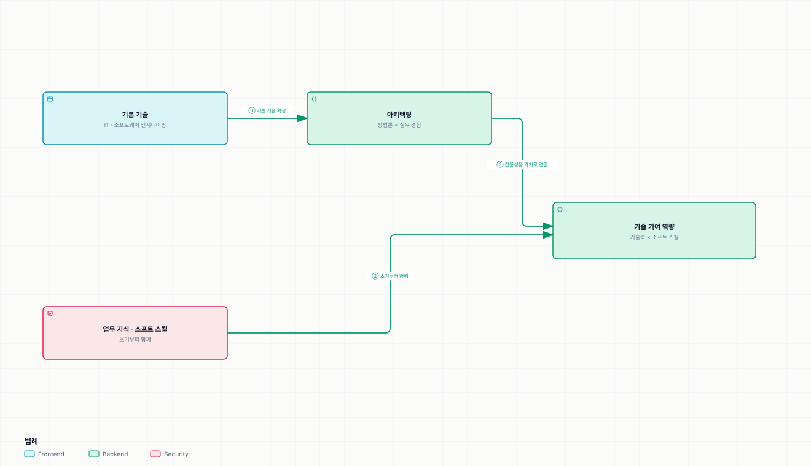

# 아키텍트의 학습과 성장

> [아키텍트 첫걸음](../README.md)

## 그래서 어떻게 아키텍트가 되는가

1장부터 5장까지가 **아키텍트가 무엇을 하는 사람인지**를 다뤘다면, 6장은 **그 사람이 되기까지의 경로**를 다룬다. 인재상, 학습 방법, 그리고 읽을 책이다.

*기본을 쌓고 아키텍팅을 익히는 길과, 업무 지식·소프트 스킬을 기르는 길은 나란히 간다*

## 목차

1. [아키텍트로 성장하려면](./1-아키텍트로-성장하려면.md)
2. [효과적인 학습 방법](./2-효과적인-학습-방법.md)
3. [좋은 책에서 배운다](./3-좋은-책에서-배운다.md)

## 함께 읽기

- [아키텍트의 자질](../1-아키텍트가-하는-일/6-아키텍트의-자질.md) — 1장이 자질로 꼽은 것들을 이 장은 **기르는 방법**으로 다시 말한다.
