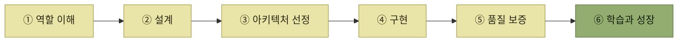

# 아키텍트 첫걸음

> [물류·백엔드 학습 노트](../README.md)

## 목차

1. [아키텍트가 하는 일](./1-아키텍트가-하는-일/README.md) — 역할과 중요성, 변화에 적응하는 능력, 필요한 자질
2. [소프트웨어 설계](./2-소프트웨어-설계/README.md) — 개발 프로세스, 추상화 레벨, 설계 원칙과 패턴
3. [아키텍처 설계](./3-아키텍처-설계/README.md) — 드라이버, 시스템·애플리케이션 구조 선정, 비교 평가와 문서화
4. [아키텍처 구현](./4-아키텍처-구현/README.md) — 개발 표준화, 유스케이스 구현, 애플리케이션 기반과 CI/CD
5. [품질 보증과 테스트](./5-품질-보증과-테스트/README.md) — 품질 보증, 기능 테스트 자동화, 성능 테스트
6. [아키텍트의 학습과 성장](./6-아키텍트의-학습과-성장/README.md) — 성장 경로와 학습 방법, 추천 도서
7. [특별 부록 — 국내 아키텍트의 이야기](./특별-부록-국내-아키텍트의-이야기/README.md) — 네 명의 국내 아키텍트가 전하는 역할과 성장 이야기

## 설계에서 성장까지

*각 장은 역할을 이해하고 설계·구현·검증한 뒤 다시 성장하는 흐름으로 이어진다.*

## WMS 사례로 함께 읽기

- [시스템 컨텍스트 다이어그램](./3-아키텍처-설계/6-아키텍처-문서화.md#시스템-컨텍스트-다이어그램의-예)은 [ERP·WMS·OMS·TMS 연계](../wms-원리와-이해/01-wms-개요/README.md)가 시스템 경계와 정보 흐름을 어떻게 드러내는지 보여주는 사례와 연결된다.
- [품질 속성 시나리오](./3-아키텍처-설계/2-아키텍처-드라이버의-핵심-사항.md#품질-속성-시나리오--어느-수준까지인지를-적는다)는 [입고·출고·재고관리 KPI](../wms-원리와-이해/06-재고관리/8-재고관리-체크리스트와-KPI.md#입고출고-kpi와-무엇이-다른가)처럼 측정 기준으로 구체화해야 한다.
- [아키텍처는 트레이드오프](./3-아키텍처-설계/1-아키텍처-설계의-주요-개념.md#아키텍처는-트레이드오프다)라는 원칙은 [크로스도킹과 재고보관 비교](../wms-원리와-이해/07-크로스도킹/README.md#크로스도킹과-재고보관-비교)에서 비용·대응력·회전율을 함께 판단하는 방식으로 확인할 수 있다.
