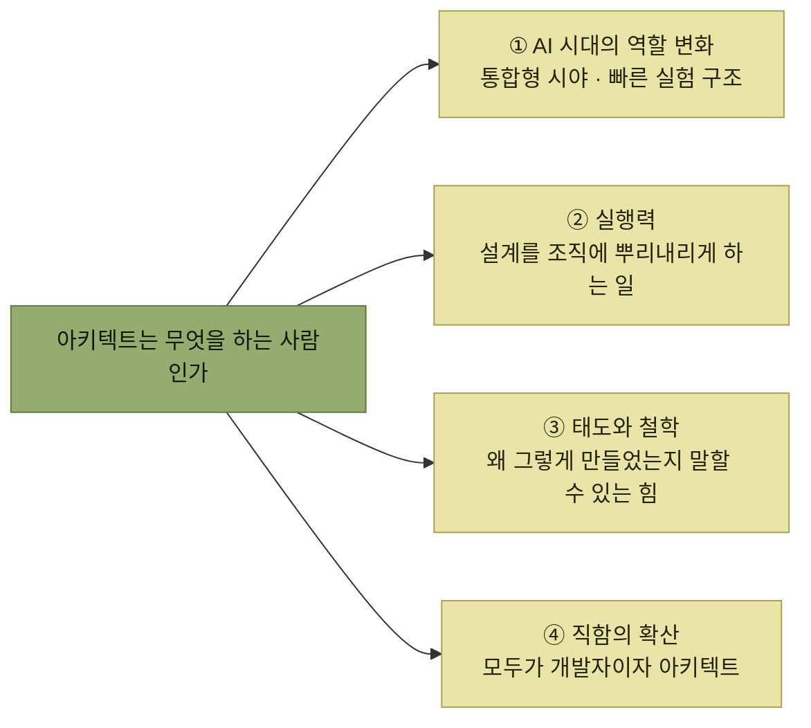

# 특별 부록 — 국내 아키텍트의 이야기

> [아키텍트 첫걸음](../README.md)

## 같은 질문에 대한 네 개의 대답

본문이 **일본 저자의 정리된 방법론**이라면, 이 부록은 **국내 현장에서 일하는 네 사람의 경험담**이다. 네 글이 서로 다른 자리에서 같은 질문에 답한다 — **아키텍트는 무엇을 하는 사람이고, 어떻게 그 사람이 되는가.**

*네 편의 글이 강조하는 지점. 기술 자체를 말하는 글은 하나도 없다*

## 목차

1. [AI 시대, 아키텍트에게 요구되는 역할 변화와 필요한 역량](./1-AI-시대-아키텍트에게-요구되는-역할-변화와-필요한-역량.md) — 서준호, Toss Lab CTO
2. [실행력 있는 아키텍트가 되기까지](./2-실행력-있는-아키텍트가-되기까지.md) — 김영재, LINE 기술 임원
3. [나의 아키텍트에 대한 고찰](./3-나의-아키텍트에-대한-고찰.md) — 정성권, LG유플러스 CIO
4. [요즘도 아키텍트가 필요한가요?](./4-요즘도-아키텍트가-필요한가요.md) — 이동욱, 인프랩 CTO

## 함께 읽기

- [아키텍트로 성장하려면](../6-아키텍트의-학습과-성장/1-아키텍트로-성장하려면.md) — 본문이 제시한 성장 경로. 부록의 네 사람은 그 경로를 각자의 방식으로 지나왔다.
- [아키텍트](../1-아키텍트가-하는-일/4-아키텍트.md) — 역할의 정의. 부록은 그 정의가 현장에서 어떻게 흔들리고 확장되는지를 보여준다.
