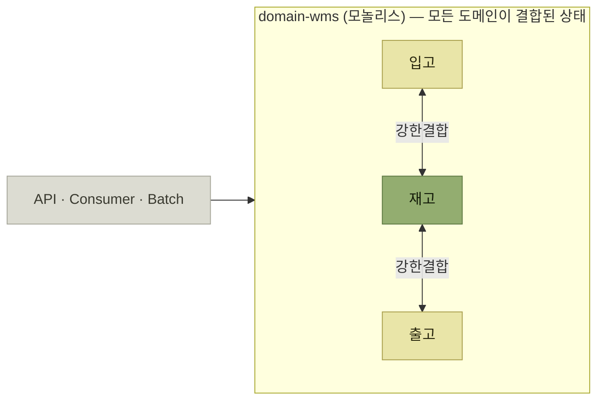

# 왜 도메인을 분리했나

> [전체 서비스를 관통하는 도메인 모듈 안전하게 분리하기](./README.md)

## 빠른 복습
- WMS 플랫폼 팀은 **B마트 서비스의 물류 플랫폼 중 WMS**를 담당한다. 도메인은 **입고 · 재고 · 출고** 셋이다.
- **재고는 다른 모든 도메인(입고·출고·반품 등)과의 상호작용이 가장 많은 핵심 도메인**이다.
- 기존에는 **세 도메인을 `domain-wms` 라는 하나의 도메인으로 관리**했다. **패키지 분할조차 없었다.**
- 여기서 **재고 정확도 향상을 위한 고도화 과제**가 생겼다. 그런데 **재고가 다른 도메인과 강하게 연결되어 단순한 수정만으로도 수정 범위가 넓어지고 사이드 이펙트 가능성이 매우 높았다.**
- **영향 범위 분석과 QA에 필요한 리소스도 무시할 수 없었다.**
- 결론 — **재고 고도화를 안전하게 하려면 도메인 분리가 먼저**다. 그래서 **재고 도메인을 분리하고 헥사고날 아키텍처를 적용**했다.

## 세 도메인

| 도메인 | 무엇을 관리하는가 |
| --- | --- |
| **입고** | **외부에서 창고로 물류가 유입되는 전 과정.** **창고 내 재고가 새롭게 생성되는 과정**을 담당한다. 일반적으로 **발주를 기반으로 공급업체로부터 물품이 입고**되며 **입고 검수와 적치까지 포함**한다 |
| **재고** | **창고 내에 현재 보관 중인 물품의 상태와 수량.** **상품별 수량, 위치, 유효 기간, 상태(정상/불량/보류 등)** 등의 속성 정보를 관리한다. **다른 모든 도메인과의 상호작용이 가장 많은 핵심 도메인** |
| **출고** | **창고에서 외부로 물류가 이탈하는 전 과정.** **재고를 감소시키는 트리거** 역할이다. **고객 주문, 다른 센터 이동, 반품 출고** 등 다양한 형태를 가지며 **피킹, 패킹, 출하** 등 물리적 이동의 준비 과정까지 포함한다 |

표를 읽는 법. 세 줄이 **재고를 가운데 두고 대칭**이다. 입고는 **재고를 만들고**, 출고는 **재고를 줄인다.** 그래서 재고는 **양쪽과 모두 붙어 있는 도메인**이 되고, 이 구조가 곧 이 장의 문제다.

이 정의는 [『WMS 원리와 이해』 4장](../../wms-원리와-이해/04-입고-프로세스/README.md)이 말한 **"입고는 적치가 끝나야 끝난다"**, [5장](../../wms-원리와-이해/05-출고-프로세스/README.md)의 피킹·패킹·출하, [6장](../../wms-원리와-이해/06-재고관리/README.md)의 재고 속성 관리와 정확히 같은 내용이다. **업무 자체가 그렇게 얽혀 있으니 코드도 얽혔다**는 점을 먼저 봐야 한다.

## 시작 상태 — 패키지 분할조차 없었다

> 기존에는 위 **3개 도메인을 `domain-wms` 라는 하나의 도메인(패키지 분할도 없음)으로 관리**했다.

*[그림] 분리 전 구조 — API·Consumer·Batch가 모두 하나의 도메인 모듈에 의존한다*

**세 애플리케이션이 모두 같은 모듈에 의존한다**는 점이 난이도를 결정한다. 도메인 모듈 하나를 건드리면 **API·컨슈머·배치가 동시에 영향**을 받는다. 게다가 **서비스들은 멈출 수 없고 새 기능도 계속 추가해야 하는 상황**이었다.

## 방아쇠가 된 과제

> 이 과정에서 **재고 정확도 향상을 위한 고도화 과제**가 생겼다. **재고 도메인이 다른 도메인들과 서로 강하게 연결되어 있어 단순한 수정만으로도 연관된 코드들의 수정 범위가 넓어지고 사이드 이펙트 발생 가능성이 매우 높아졌다.** **변경 사항으로 인한 영향 범위 분석, QA에 필요한 리소스들도 무시할 수 없었다.**

> 그래서 **재고 도메인의 고도화를 안전하게 수행하려면 도메인 분리가 우선되어야 한다는 결론**을 냈다. **재고 도메인을 분리하고 헥사고날 아키텍처를 적용**했다.

**순서가 뒤집힌 것**이 이 장의 출발점이다. 원래 하려던 일은 **재고 고도화**였는데, 그것을 안전하게 하기 위해 **먼저 구조를 바꾸기로** 했다. [『좋은 코드의 기준』 1장](../../내-코드가-불안한-개발자를-위한-좋은-코드의-기준/01-왜-좋은-코드를-작성해야-할까/2-유지보수성은-왜-희생되는가.md)이 말한 **"그 나중은 쉽게 오지 않는다"** 의 예외 사례이며, 그 나중을 **새 과제의 전제 조건으로 만들어** 확보한 셈이다.

## 함께 읽기
- [다음 절 — 결합을 끊는 네 단계](./2-Step-1-도메인-간-결합-끊기.md)
- [『WMS 원리와 이해』 6장 재고관리](../../wms-원리와-이해/06-재고관리/README.md) — 재고가 왜 핵심 도메인인지
