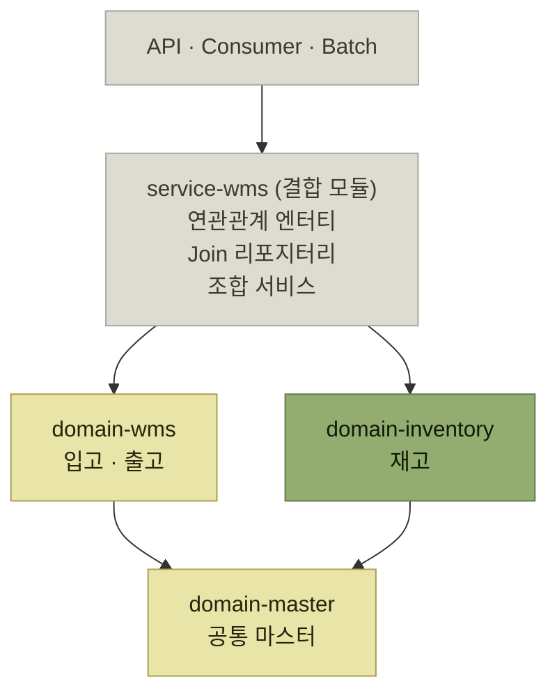
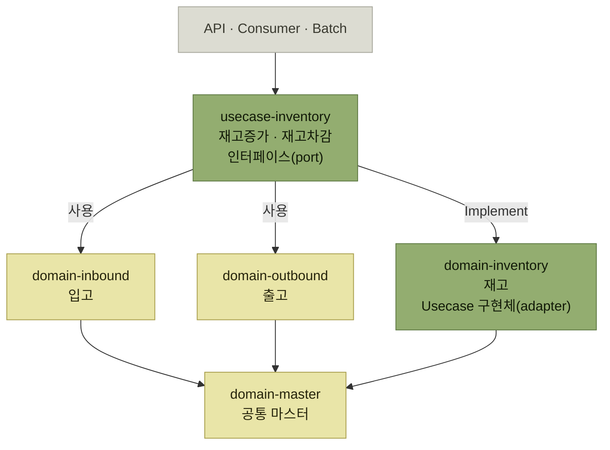

# Step 1 — 도메인 간 결합 끊기

> [전체 서비스를 관통하는 도메인 모듈 안전하게 분리하기](./README.md)

## 빠른 복습
- **① 신규 모듈 `domain-inventory` 를 만들어 재고 도메인 클래스를 취합**했다. 이때 **다른 도메인과의 결합은 최대한 제거**했다.
- **② 결합을 끊어야 하는 대상을 특정**했다. 방법은 거칠지만 확실했다 — **기존 모듈에서 신규 재고 모듈의 의존성을 제거하고, 빌드가 실패하는 파일들을 별도 모듈(`service-wms`, '결합 모듈')로 옮긴다.**
- **③ 엔티티·리포지터리의 결합을 제거**했다. **연관 관계를 없애고, JOIN 절을 제거해 서비스 레이어에서 조합**했다.
- **④ 남은 것은 오케스트레이션**이었다. 결합 모듈에 그냥 모아둘 수도 있었지만 **모든 도메인에 접근할 수 있는 모듈은 금세 비대해져 다시 거대한 모놀리스가 될 수 있다**고 판단해, **결합 모듈의 완전한 제거를 목표로 헥사고날을 도입**했다.
- 공통으로 쓰는 마스터 정보는 **`domain-master`** 모듈로 모았다.

## ① 신규 모듈 만들기

> 먼저 **신규 모듈(`domain-inventory`)을 생성하여 재고 도메인에 해당되는 클래스들을 모았다.** 이 과정에서 **다른 도메인과의 결합은 최대한 제거**했다.

- 먼저 **무엇이 재고 도메인에 해당하는 것인지부터 정의**했다.
- **재고 정보를 넘어서 재고 이력, 재고 실사 등 재고와 관련된 도메인들을 포함**했다.
- **엔티티 정의, 기본 리포지터리와 서비스들을 신규 재고 모듈 하위로 이동**했다.
- 이 시점에는 **기존 모듈(`domain-wms`)이 신규 재고 모듈(`domain-inventory`)을 의존하는 상태**다.

**"무엇이 재고인가"를 먼저 정의한 것**이 실제 첫 작업이다. [『좋은 코드의 기준』 2장](../../내-코드가-불안한-개발자를-위한-좋은-코드의-기준/02-움직이는-코드에서-뜻을-전하는-코드로/4-코드로-도메인-지식-표현하기.md)이 말한 **유비쿼터스 언어를 고르는 일**이 여기서는 **모듈 경계를 고르는 일**이 된다. 재고 실사가 재고 쪽인지 별도인지는 코드가 답해주지 않는다.

## ② 결합을 끊어야 하는 대상 특정하기

> **기존 모듈과 신규 재고 모듈의 결합된 입출고 도메인의 로직을 파악**해야 했다. **가장 빠른 방법으로, 기존 모듈에서 신규 재고 모듈의 의존성을 제거하고 빌드가 실패하는 파일들을 별도 모듈(`service-wms`, '결합 모듈')로 옮겼다.**

**컴파일러를 탐지기로 쓴 것**이 이 단계의 방법이다. 어떤 파일이 두 도메인에 걸쳐 있는지 사람이 목록화하는 대신, **의존성을 끊고 깨지는 것을 모았다.**

결합 모듈로 옮긴 것은 네 종류다.

| 옮긴 것 | 무엇이 문제인가 |
| --- | --- |
| **입/출고 도메인과 재고 도메인 사이에 연관 관계를 선언한 엔티티** | JPA 연관 관계가 두 도메인을 묶고 있다 |
| **입/출고 도메인과 재고 도메인을 직접 JOIN 한 QueryDSL 리포지터리** | 쿼리 한 줄이 두 도메인의 테이블을 함께 안다 |
| **위의 엔티티 혹은 리포지터리를 사용한 서비스** | 위 둘에 딸려 온다 |
| **입/출고 도메인과 재고 도메인의 서비스를 조합하여 사용하는 서비스** | **오케스트레이션.** 가장 어려운 것이며 ④에서 다룬다 |

그리고 **도메인에서 공통적으로 사용하는 마스터 정보를 모아두는 모듈(`domain-master`)** 을 추가했다.

*[그림] 결합 모듈을 둔 중간 상태 — 걷어내야 할 것이 한곳에 모여 눈에 보인다*

**중간 상태를 일부러 만들었다**는 점이 요점이다. 결합 모듈은 **목적지가 아니라 작업 테이블**이다. 옮겨야 할 것을 한곳에 모아두면 **남은 일의 양이 보인다.**

## ③ 엔티티·리포지터리의 결합 제거

> 목표는 **결합 모듈의 도메인 간 결합 로직을 모두 수정하여 재고 도메인은 신규 재고 모듈로, 입/출고 도메인의 로직은 기존 모듈로 보내는 것**이었다.

**서비스 조합(오케스트레이션)을 제외한** 엔티티·리포지터리에 대해 다음을 수행해 **의존이 필요한 최소한의 서비스만 남겼다.**

| 대상 | 어떻게 했나 |
| --- | --- |
| **두 도메인 사이에 연관 관계를 선언한 엔티티** | **연관 관계 제거** |
| **두 도메인을 직접 JOIN 한 QueryDSL 리포지터리** | **JOIN 절을 제거하고 서비스 레이어에서 조합** |
| **위의 엔티티나 리포지터리를 사용한 서비스** | 이동 가능한 서비스는 **각 도메인에 맞게 이동**. **타 도메인의 서비스와 결합된 메서드를 제외하고는 별도 파일로 분리하여 이동** |

표를 읽는 법. 세 줄 모두 **"DB 레벨의 편의를 포기하고 애플리케이션 레벨에서 조합한다"** 는 같은 선택이다. JOIN 한 번이면 끝나던 조회를 두 번 조회 + 조합으로 바꾸는 것이므로 **코드는 늘고 편의는 줄어든다.** 그 대가로 얻는 것이 **모듈 경계**다.

## ④ 오케스트레이션 — 결합 모듈을 없애기로 결정하다

> 그런데 **입/출고 도메인과 재고 도메인의 서비스를 조합하여 사용하는 서비스의 결합은 쉽게 분리할 수 없었다.**

예가 명확하다.

> **입고 작업이 완료되면 입고 작업의 상태를 변경하고 동시에 재고를 생성하거나 늘려야 한다.** 즉 **입고 도메인 서비스와 재고 도메인 서비스를 함께 조합하는 오케스트레이션 서비스가 필요**했다.

여기서 갈림길이 있었다.

| 선택지 | 판단 |
| --- | --- |
| **오케스트레이션 로직을 결합 모듈 한곳에 모아둔다** | **모든 도메인에 접근할 수 있는 모듈은 금세 비대해지고 결국 다시 하나의 거대한 모놀리스가 될 수 있다**는 우려. **과거에도 비슷한 경험이 있어 같은 실수를 반복하지 않기로** 했다 |
| **결합 모듈의 완전한 제거를 목표로 삼는다** | 이쪽을 택했다. **모듈 간 통신 방식으로 헥사고날을 도입** |

표를 읽는 법. **"편한 자리를 하나 남겨두면 결국 거기로 다 모인다"** 는 것이 이 판단의 근거다. 결합 모듈은 **모든 도메인을 볼 수 있는 유일한 자리**이므로, 애매한 로직이 계속 그곳으로 흘러든다. [『아키텍트 첫걸음』 3.3의 모듈형 모놀리스](../../아키텍트-첫걸음/3-아키텍처-설계/3-시스템-아키텍처-선정.md#모듈형-모놀리스--나누지-않고-나눈다)가 못박은 규칙 — **모듈 간 연계는 명확히 정의된 인터페이스로만** — 이 그래서 필요하다.

**adapter 패턴을 적용해 모듈 간에는 접근 가능한 인터페이스(port)만 정의하고, 실제 구현(adapter)은 각 도메인 내부에 두는 방식**으로 구성했다.

*[그림] 헥사고날을 적용한 최종 구조 — `usecase-inventory` 는 인터페이스만 갖고, 구현은 `domain-inventory` 안에 있다*

**인터페이스가 도메인 바깥(`usecase-inventory`)에, 구현이 도메인 안(`domain-inventory`)에** 있다는 배치가 [『아키텍트 첫걸음』 3.4](../../아키텍트-첫걸음/3-아키텍처-설계/4-애플리케이션-아키텍처-선정.md#클린-아키텍처)가 설명한 **DIP의 적용 방식**과 같다. 그 책은 **"경계마다 인터페이스가 하나씩 서 있고, 바깥쪽 컴포넌트가 그 인터페이스를 구현한다"** 고 했는데, 여기서는 **모듈 경계**에 그것을 세웠다.

## 함께 읽기
- [다음 절 — 떼어낸 다음에 안을 정돈한다](./3-Step-2-모듈-내부-응집도-높이기.md)
- [『아키텍트 첫걸음』 3.3 서비스 분할](../../아키텍트-첫걸음/3-아키텍처-설계/3-시스템-아키텍처-선정.md#서비스-분할) — 논리적 분할이 곧 물리적 분할은 아니라는 이야기
